## &nbsp; {.dark .mid background-color="#1C242B"}

:::: {.vcenter}
::: {.statement}
An equation of state is not a fit.
:::

::: {.statement-hi}
It is a statement about which physics a fluid is allowed to have.
:::
::::

::: {.notes}
Open by stating the thesis of the module out loud before showing any equation:
every equation of state here exists because its predecessor omitted physics that
turned out to matter. Ask students to write that sentence down.
:::

## The argument of this course

::: {.kicker .c-amber}
Introduction
:::

::: {.lede}
State the organising thesis and the six questions applied to every model.
:::

:::::: {.columns}
::::: {.column width="46%"}
:::: {.cards}
::: {.card}

[Six questions asked of every model]{.card-h}

- What problem existed?
- Why did the previous equation of state fail?
- What new physics was introduced?
- How was the mathematics modified?
- What limitations remain?
- Why was another equation of state developed?

:::
::::
:::::

::::: {.column width="54%"}
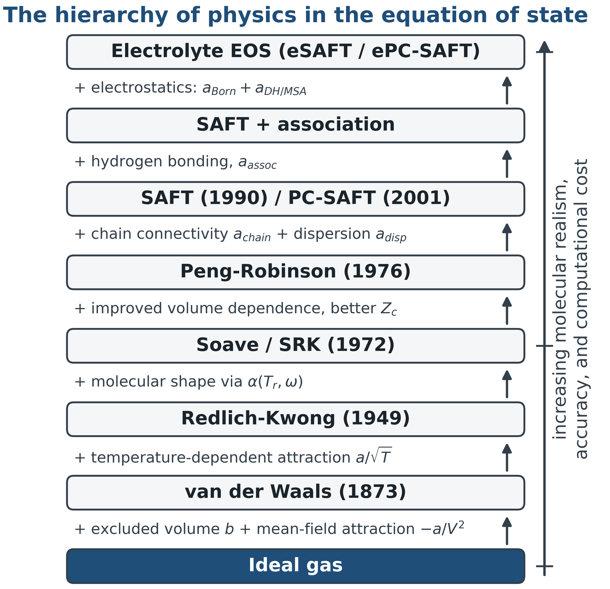{.fig-col}

::: {.source}
The hierarchy of physics contained in an equation of state.
:::
:::::
::::::

::: {.notes}
**TEACHING TIP**
Walk up the ladder on the right from the bottom, naming only the physics added at each rung, not the equations. Students should see that the vertical axis is physical content, not calendar time.

**COMMON MISCONCEPTION**
That the ladder is a ranking of accuracy. It is not. A cubic equation outperforms SAFT for a light hydrocarbon flash in both speed and reliability. The ladder ranks physical content, and content is only worth its cost when your problem contains that physics.

**ASK THE CLASS**
If your system is a dry natural gas at 60 bar, which rung do you need, and why would climbing higher waste your time?
:::

## One hundred and fifty years in one line

::: {.kicker .c-amber}
Introduction
:::

::: {.lede}
Place every model of the course on a common historical and conceptual axis.
:::

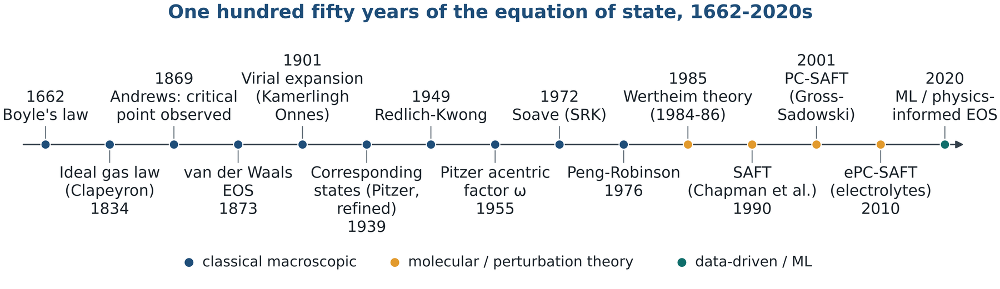{.fig-lg width="66%"}

:::: {.cards}
::: {.card}

[Physical meaning]{.card-h .c-amber}

Classical models (navy) add mean-field physics. Molecular models (amber) add structure: chains, hydrogen bonds, charges. Data-driven models (teal) learn the residual free energy directly.

:::

::: {.card}

[Engineering implication]{.card-h .c-teal}

The models in industrial use today span a century of physics. A simulator flowsheet routinely mixes a 1976 cubic for the hydrocarbons with a 2001 molecular model for the solvent.

:::
::::

::: {.notes}
**TEACHING TIP**
Point out the two clusters. Between 1873 and 1949 almost nothing usable appeared: the physics was understood but the computation was not available. Between 1949 and 1976 three models appeared in rapid succession, driven by the petroleum industry and by the arrival of the digital computer.

**COMMON MISCONCEPTION**
Students read the gap between van der Waals and Redlich-Kwong as a lack of interest. It was a lack of computing power and of accurate PVT data, not of ideas.

**ASK THE CLASS**
Why do you think the cubic equations appeared in the same three decades as commercial process simulators?
:::

## Foundations {.dark .divider .c-teal background-color="#1C242B"}

::: {.kicker .c-amber}
PART I
:::

::: {.lede}
Chapter 1   Why do we need an equation of state? Chapter 2   The ideal gas law and the physics it omits
:::

::: {.notes}
**TEACHING TIP**
Use this pause to reset attention. State what Part I will establish: that the EOS is the closure of process thermodynamics, and that the ideal gas law fails in two distinct and predictable ways.

**COMMON MISCONCEPTION**
Students treat Part I as revision and disengage. Emphasise that the departure-function chain in Chapter 1 is the reason the whole course exists.

**ASK THE CLASS**
Before we start: what property does a simulator actually need from an EOS in order to size a flash drum?
:::

## What an equation of state is for

::: {.kicker .c-amber}
Chapter 1 · Why do we need an equation of state?
:::

::: {.lede}
Identify the EOS as the closure relation that converts measurable P, T and composition into every other thermodynamic property.
:::

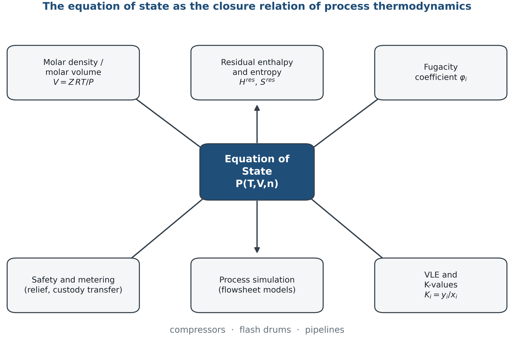{.fig-lg width="66%"}

:::: {.cards}
::: {.card}

[Physical meaning]{.card-h .c-amber}

The EOS supplies the missing relation among P, V, T and composition. Everything else follows from classical thermodynamics without further assumption.

:::

::: {.card}

[Engineering implication]{.card-h .c-teal}

In a process simulator the EOS is evaluated more often than any other model. Its error propagates into compressor duty, vessel volume, relief sizing and custody metering.

:::
::::

::: {.notes}
**TEACHING TIP**
Trace the arrows outward one at a time. Stress that only P, T and composition are directly measured in a plant; everything else on the diagram is inferred through the EOS.

**COMMON MISCONCEPTION**
That the EOS is 'just' a PVT relation used to get density. In practice its dominant use is the fugacity coefficient, and therefore phase equilibrium. Density is the easy part.

**ASK THE CLASS**
In a flowsheet with a distillation column, a compressor and a relief valve, where does the EOS enter each calculation?
:::

## From PVT data to phase equilibrium

::: {.kicker .c-amber}
Chapter 1 · Why do we need an equation of state?
:::

::: {.lede}
Follow the chain from the compressibility factor to the equilibrium ratio, and see that every link needs Z over a pressure range.
:::

:::: {.cards .quad}
::: {.card}

[1.  Define the deviation]{.card-h}

$$
Z \equiv \frac{PV}{RT}
$$

:::

::: {.card}

[2.  Fugacity coefficient]{.card-h}

$$
\ln\varphi = \int_0^P (Z-1)\,\frac{\mathrm{d}P}{P}
$$

:::

::: {.card}

[3.  Residual enthalpy]{.card-h}

::: {.eq-long}
$$
H-H^{\mathrm{ig}} = -RT^{2}\int_0^P\left(\frac{\partial Z}{\partial T}\right)_{\!P}\frac{\mathrm{d}P}{P}
$$
:::

:::

::: {.card}

[4.  Equilibrium ratio]{.card-h}

::: {.eq-long}
$$
\hat f_i^{\,V} = \hat f_i^{\,L} \quad\Longrightarrow\quad K_i \equiv \frac{y_i}{x_i} = \frac{\hat\varphi_i^{\,L}}{\hat\varphi_i^{\,V}}
$$
:::

:::

::: {.card}

[Why this matters]{.card-h .c-amber}

Each expression is exact given Z(T, P). None of them is an approximation. The entire modelling uncertainty of a process simulation therefore sits in the single function Z, which is what an equation of state supplies. Improving an EOS is not a cosmetic refinement; it is the only way to reduce that uncertainty.

:::
::::

::: {.notes}
**TEACHING TIP**
Emphasise the integral limits. The fugacity coefficient at 50 bar depends on Z at every pressure from zero to 50 bar, so an EOS that is accurate at one state point but wrong elsewhere still gives the wrong fugacity.

**COMMON MISCONCEPTION**
Students believe fugacity is an empirical correction factor. It is a rigorous consequence of the second law plus the EOS; there is no additional modelling assumption in these three lines.

**ASK THE CLASS**
If your EOS has a 2 percent error in Z at low pressure only, does the fugacity at high pressure remain accurate? Why not?
:::

## Where the error reaches the plant

::: {.kicker .c-amber}
Chapter 1 · Why do we need an equation of state?
:::

::: {.lede}
Quantify what a modelling error in Z costs in inventory, duty and equipment size.
:::

:::: {.cards .g3}
::: {.card}

[16.6]{.big .c-rust}

[per cent]{.eyebrow}

[Inventory error]{.card-h}

Methane at 300 K and 100 bar. Using PV = RT instead of Peng-Robinson underestimates the mass held in a 50 cubic metre vessel by 16.6 per cent. This is a safety-case quantity.

:::

::: {.card}

[19.9]{.big .c-amber}

[per cent]{.eyebrow}

[Volume error]{.card-h}

The same state point sized on the ideal gas law gives a molar volume of 249.4 instead of 208.0 cubic centimetres per mole, an oversizing of 19.9 per cent.

:::

::: {.card}

[2.8]{.big .c-teal}

[per cent]{.eyebrow}

[Compressor duty error]{.card-h}

Isentropic compression of 100 kilomoles per hour of carbon dioxide from 10 to 80 bar: 202.1 kilowatts with residual properties against 208.0 kilowatts on ideal-gas heat capacities alone.

:::
::::

::: {.notes}
**TEACHING TIP**
These numbers come from the worked examples distributed with the notes and were computed with Peng-Robinson, not read from a chart. Put the second figure in context: a 2.8 percent duty error on a 200 kW machine is small, but on a 20 MW export compressor it is a real capital and energy decision.

**COMMON MISCONCEPTION**
That a 17 percent density error is 'only' 17 percent. It is a 17 percent error in the mass of hydrocarbon in a vessel, which is simultaneously a safety-case error and a custody-transfer error.

**ASK THE CLASS**
Which of these three errors would you notice first in commissioning, and which would you never notice until an audit?
:::

## The ideal gas law and its three assumptions

::: {.kicker .c-amber}
Chapter 2 · The ideal gas law
:::

::: {.lede}
State the molecular assumptions behind PV = RT and identify exactly which one each later model repairs.
:::

$$
PV = RT \qquad\Longleftrightarrow\qquad Z = 1
$$

::: {.eq-long}
$$
P = \frac{1}{3}\,\frac{N}{V}\,m\langle v^{2}\rangle \quad\Longrightarrow\quad PV = Nk_{\mathrm{B}}T
$$
:::

::: {.source}
Kinetic theory gives the same result from the momentum flux at the wall, with the same three assumptions built in.
:::

:::: {.cards .g3}
::: {.card}

[1.  Point particles]{.card-h}

Molecules occupy no volume, so the entire container volume is available to every molecule. Repaired by the co-volume b in 1873.

:::

::: {.card}

[2.  No interaction energy]{.card-h}

The average potential energy between molecules is zero. Repaired by the mean-field term a/V squared in 1873, then refined for fifty years.

:::

::: {.card}

[3.  Structureless molecules]{.card-h}

No shape, no orientation, no directional bonding, no charge. Not repaired until SAFT in 1990 and electrolyte models thereafter.

:::
::::

::: {.notes}
**TEACHING TIP**
Write the three assumptions on the board and leave them there for the rest of the lecture. Chapter 3 repairs assumptions one and two simultaneously. Chapters 8 to 10 refine the second. Chapter 11 repairs the third by adding directional bonding.

**COMMON MISCONCEPTION**
Students say the ideal gas law assumes 'no forces'. More precisely, it assumes the molecules have no volume and that the average potential energy is zero. Elastic collisions are a separate statement about the collision dynamics.

**ASK THE CLASS**
Which of these three assumptions fails first as you compress a gas at constant temperature, and how would you know from the sign of Z minus one?
:::

## Where the ideal gas law is good enough

::: {.kicker .c-amber}
Chapter 2 · The ideal gas law
:::

::: {.lede}
Delimit the region of the reduced state plane in which PV = RT is accurate to one and to five per cent.
:::

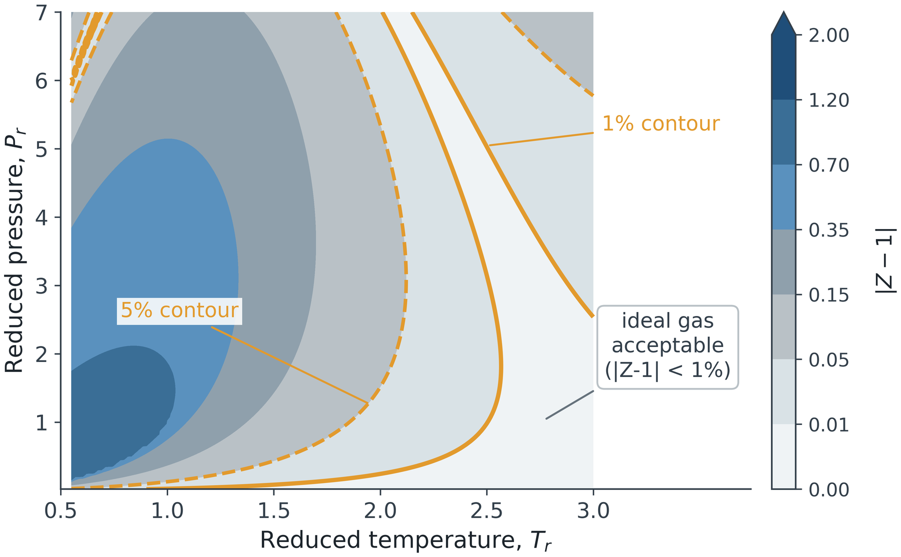{.fig-lg width="66%"}

:::: {.cards}
::: {.card}

[Physical meaning]{.card-h .c-amber}

Ideality is a low-density statement. The gas behaves ideally when the mean separation is large compared with the molecular diameter and the thermal energy is large compared with the well depth.

:::

::: {.card}

[Engineering implication]{.card-h .c-teal}

For light gases above about twice the critical temperature and below a few bar, PV = RT is adequate for line sizing and vent calculations. Outside that window it is not defensible.

:::
::::

::: {.notes}
**TEACHING TIP**
Have students locate three real streams on this map: ambient air, a natural gas pipeline at 70 bar, and the vapour leaving a propane refrigeration condenser. Only the first sits comfortably in the white region.

**COMMON MISCONCEPTION**
That 'high pressure' is the criterion. It is not: the criterion is reduced pressure at a given reduced temperature. Ammonia at 10 bar is further from ideal than nitrogen at 60 bar.

**ASK THE CLASS**
Air at ambient conditions has a reduced temperature near 2.3. Read the one per cent contour: up to what pressure may you use PV = RT for ventilation calculations?
:::

## Two distinct failure modes

::: {.kicker .c-amber}
Chapter 2 · The ideal gas law
:::

::: {.lede}
Distinguish failure by density from failure by proximity to saturation, and read both from the Z curve.
:::

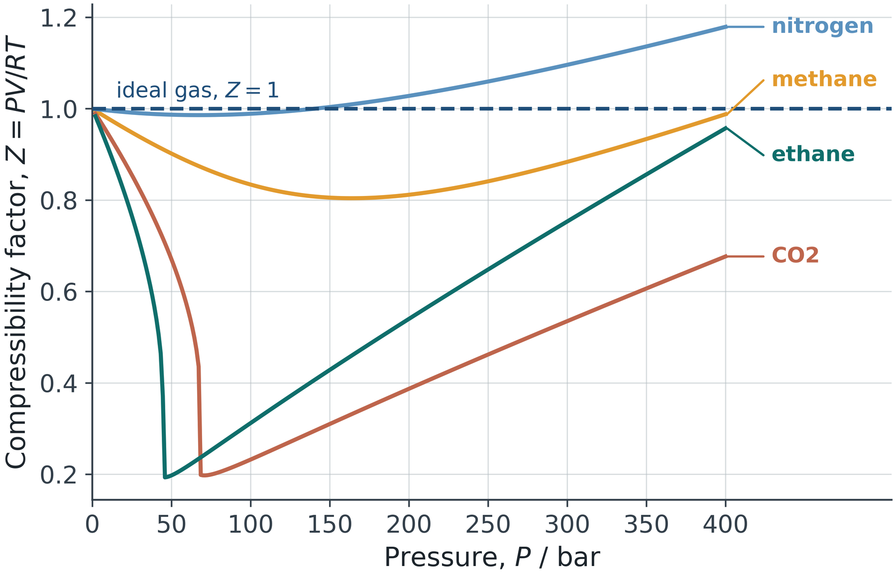{.fig-lg width="66%"}

:::: {.cards}
::: {.card}

[Physical meaning]{.card-h .c-amber}

The initial fall below unity is attraction. The eventual rise above unity is the finite size of the molecules. Both are absent from PV = RT by construction.

:::

::: {.card}

[Engineering implication]{.card-h .c-teal}

Near saturation the error is not a smooth few per cent: it is a discontinuity, because a real fluid condenses and the ideal gas law does not know that phases exist.

:::
::::

::: {.notes}
**TEACHING TIP**
Compare nitrogen with carbon dioxide at the same temperature. Nitrogen is far above its critical temperature and stays near Z equal to one; carbon dioxide is close to saturation at 300 K and collapses. The difference is not molecular size, it is reduced temperature.

**COMMON MISCONCEPTION**
That the curves fall because the gas is 'compressed'. They fall because attraction pulls the molecules together faster than pressure alone would; the rise at high pressure is the repulsive core reasserting itself.

**ASK THE CLASS**
Two of these four curves reach Z above one within the plotted range. Which two, and what do they have in common?
:::

## What physics is missing?

::: {.kicker .c-amber}
Chapter 2 · The ideal gas law
:::

::: {.lede}
Name the two omissions that the next model must repair, and predict the sign of each correction.
:::

:::: {.cards .g3}
::: {.card}

[Omission 1   Molecules occupy volume]{.card-h .c-teal}

The volume available for molecular motion is smaller than the container volume. Replacing V by V minus b raises the predicted pressure at fixed T and V.

Expected sign:  Z increases.

:::

::: {.card}

[Omission 2   Molecules attract one another]{.card-h .c-rust}

A molecule approaching the wall is pulled back by its neighbours, so it delivers less momentum. The correction scales as the square of density.

Expected sign:  Z decreases.

:::

::: {.card}

[The consequence]{.card-h}

Two corrections of opposite sign, with different density dependence, produce a compressibility factor that first falls, passes through a minimum, and then rises. No single-term correction can reproduce that shape. This is the structural reason every subsequent equation of state contains a repulsive term and an attractive term.

:::
::::

::: {.notes}
**TEACHING TIP**
Do not move on until the class has predicted the signs. Excluded volume reduces the space available, so it raises pressure. Attraction reduces the momentum delivered to the wall, so it lowers pressure. Any student who can predict these two signs can reconstruct the van der Waals equation without memorising it.

**COMMON MISCONCEPTION**
Students expect both corrections to reduce the pressure because 'real gases are less ideal'. The two corrections have opposite signs, which is precisely why Z has a minimum.

**ASK THE CLASS**
Write down the simplest possible functional form for each correction. What must each one do as the volume becomes very large?
:::

## The first real fluid {.dark .divider .c-teal background-color="#1C242B"}

::: {.kicker .c-amber}
PART II
:::

::: {.lede}
Chapter 3   The van der Waals equation of state Chapter 4   The compressibility factor Chapter 5   The virial equation and its statistical basis
:::

::: {.notes}
**TEACHING TIP**
State the ambition of Part II: one equation, two molecular mechanisms, and the first theory in history that predicts a liquid, a vapour and a critical point from a single expression.

**COMMON MISCONCEPTION**
Students treat van der Waals as obsolete. It is quantitatively obsolete and conceptually indispensable: every cubic equation still in industrial use in 2026 has exactly the structure introduced in 1873.

**ASK THE CLASS**
Can an equation that is wrong by 30 per cent in the critical compressibility still be a scientific breakthrough? On what grounds?
:::

## van der Waals 1873: the molecular picture

::: {.kicker .c-amber}
Chapter 3 · The van der Waals equation of state
:::

::: {.lede}
Derive the two corrections from a molecular argument rather than accept them as empirical terms.
:::

:::::: {.columns}
::::: {.column width="54%"}
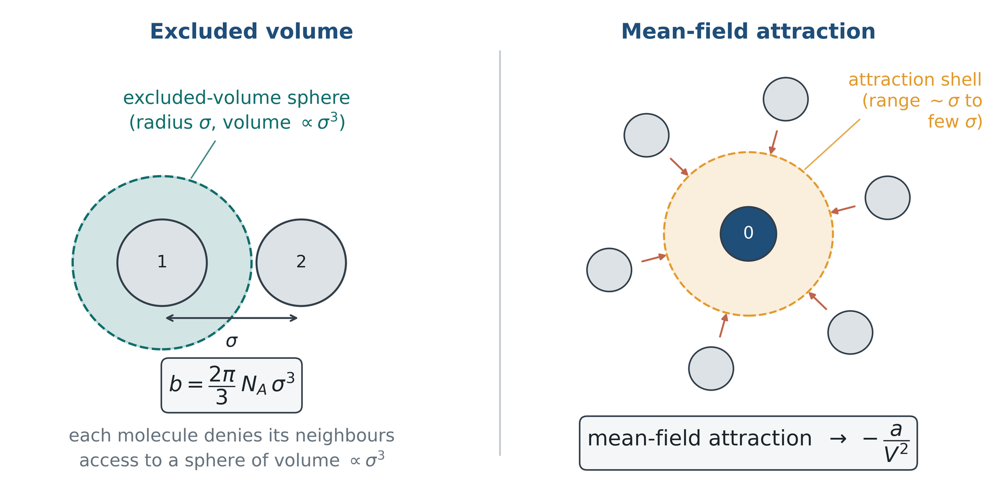{.fig-col}
:::::

::::: {.column width="46%"}
:::: {.cards}
::: {.card}

[Excluded volume]{.card-h .c-teal}

Two hard spheres of diameter sigma cannot approach closer than sigma. The excluded volume per molecule is b = 2 pi N sigma cubed over 3, four times the hard-sphere volume.

:::
::::

:::: {.cards}
::: {.card}

[Mean-field attraction]{.card-h .c-rust}

Each molecule feels an average attractive field proportional to the local density. The energy density therefore scales as density squared, giving a pressure reduction of a over V squared.

:::
::::
:::::
::::::

::: {.notes}
**TEACHING TIP**
The factor of two in the co-volume is worth two minutes. The excluded sphere around a molecule has radius sigma, not sigma over two, so the excluded volume per pair is four times the molecular volume; per molecule it is twice. Students who miss this always misremember b.

**COMMON MISCONCEPTION**
That b is the volume of the molecules. It is half the excluded volume per pair, which is four times the hard-sphere volume per molecule. The distinction matters when b is used to estimate a molecular diameter.

**ASK THE CLASS**
Andrews measured continuity between liquid and vapour in 1869. Why did that experiment make a two-term correction seem plausible rather than arbitrary?
:::

## Assembling the equation

::: {.kicker .c-amber}
Chapter 3 · The van der Waals equation of state
:::

::: {.lede}
Assemble the two corrections into a single cubic in volume and interpret each term.
:::

$$
b = \frac{2\pi}{3}N_{\mathrm{A}}\sigma^{3}
$$

$$
P = \frac{RT}{V-b} \;-\; \frac{a}{V^{2}}
$$

:::: {.cards .g3}
::: {.card}

[Repulsive term:  RT / (V - b)]{.card-h .c-teal}

Diverges as V approaches b, so the fluid cannot be compressed below the co-volume. This single change already produces Z greater than one at high density.

:::

::: {.card}

[Attractive term:  minus a / V squared]{.card-h .c-rust}

Reduces the pressure in proportion to density squared, because the number of interacting pairs per unit volume scales that way. Produces Z less than one at moderate density.

:::

::: {.card}

[The structural point]{.card-h .c-amber}

Clearing denominators gives a cubic polynomial in V. Three real roots below the critical temperature correspond to a saturated liquid, a mechanically unstable state, and a saturated vapour. One equation now contains both phases.

:::
::::

::: {.notes}
**TEACHING TIP**
Show that multiplying out gives a cubic in V. That is the whole reason this family is called cubic: it is the lowest polynomial order that can deliver three volume roots and therefore two coexisting phases plus an unstable branch.

**COMMON MISCONCEPTION**
Students think 'cubic' refers to the volume being cubed in some physical sense. It refers to the polynomial degree in V after clearing denominators, and that degree is what makes phase coexistence representable.

**ASK THE CLASS**
Why is a quadratic in V insufficient to describe a fluid that can exist as a liquid and a vapour at the same pressure?
:::

## The critical point fixes the parameters

::: {.kicker .c-amber}
Chapter 3 · The van der Waals equation of state
:::

::: {.lede}
Use the critical isotherm inflection conditions to express a and b in terms of measurable critical constants.
:::

::: {.eq-long}
$$
\left(\frac{\partial P}{\partial V}\right)_{\!T_{\mathrm{c}}} = \left(\frac{\partial^{2} P}{\partial V^{2}}\right)_{\!T_{\mathrm{c}}} = 0
$$
:::

::: {.eq-long}
$$
a = \frac{27R^{2}T_{\mathrm{c}}^{2}}{64P_{\mathrm{c}}}, \qquad b = \frac{RT_{\mathrm{c}}}{8P_{\mathrm{c}}}, \qquad Z_{\mathrm{c}} = 3/8 = 0.375
$$
:::

:::: {.cards}
::: {.card}

[A prediction, not a fit]{.card-h .c-amber}

The critical compressibility is now a pure number: 3/8 for every substance, with no adjustable content. That is a genuine, falsifiable prediction of the theory. It is also, as the next slides show, the first place the theory is measurably wrong, and that failure drives the following one hundred years of development.

:::
::::

::: {.notes}
**TEACHING TIP**
This is the decisive methodological move of the whole subject: a molecular parameter that cannot be measured is replaced by a macroscopic one that can. Every cubic equation of state since 1873 uses the same device.

**COMMON MISCONCEPTION**
Students think a and b are fitted to PVT data. In the classical cubics they are not fitted at all; they are determined analytically by the critical point. Fitting only enters with Soave's alpha function in 1972.

**ASK THE CLASS**
The critical point supplies exactly two independent conditions. How many parameters can it therefore determine, and what does that tell you about the maximum complexity of a classical cubic?
:::

## Isotherms, the dome and the critical point

::: {.kicker .c-amber}
Chapter 3 · The van der Waals equation of state
:::

::: {.lede}
Read phase behaviour directly from the shape of the predicted isotherms.
:::

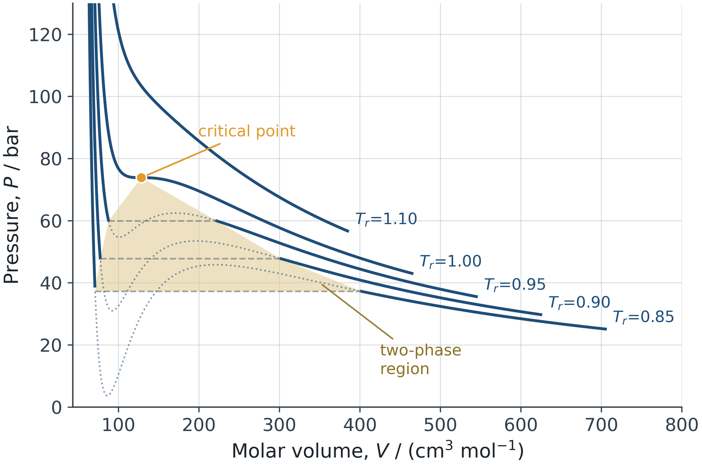{.fig-lg width="66%"}

:::: {.cards}
::: {.card}

[Physical meaning]{.card-h .c-amber}

One analytic expression produces a liquid branch, a vapour branch and a critical point. Before 1873 no theory did this.

:::

::: {.card}

[Engineering implication]{.card-h .c-teal}

Cubic equations remain the only models fast and robust enough to be called millions of times inside a distillation column solver.

:::
::::

::: {.notes}
**TEACHING TIP**
Trace one subcritical isotherm from right to left with a pointer: vapour, saturation, the unphysical loop, saturation again, liquid. Then trace the supercritical isotherm and show that the loop has vanished. The critical isotherm is the boundary case with a horizontal inflection.

**COMMON MISCONCEPTION**
That the loop is a numerical artefact. It is a real prediction of the equation, and it is what makes the equation able to describe two phases at all; it simply must be replaced within the dome by the equal-area construction.

**ASK THE CLASS**
At the critical temperature the loop degenerates to a single point. What does that say about the compressibility of a fluid at its critical point, and why does that matter for supercritical extraction?
:::

## The Maxwell equal-area construction

::: {.kicker .c-amber}
Chapter 3 · The van der Waals equation of state
:::

::: {.lede}
Replace the mechanically unstable loop by the equilibrium saturation pressure using equality of Gibbs energy.
:::

:::::: {.columns}
::::: {.column width="54%"}
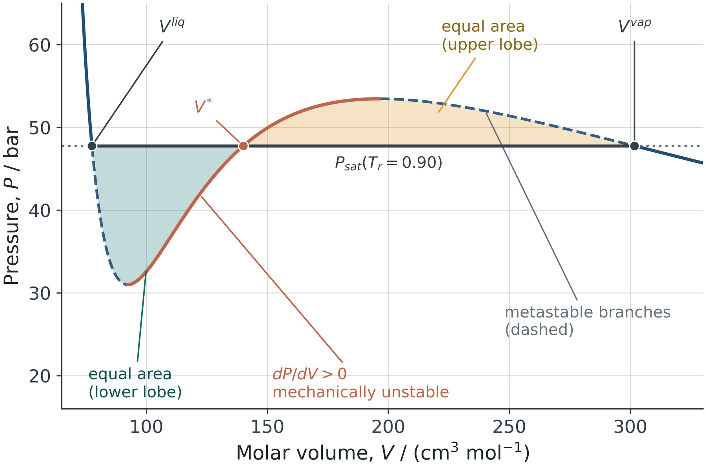{.fig-col}
:::::

::::: {.column width="46%"}
$$
\int_{V^{L}}^{V^{V}}\left[P^{\mathrm{sat}} - P(V)\right]\mathrm{d}V = 0
$$

:::: {.cards}
::: {.card}

[What the rule enforces]{.card-h}

Equality of molar Gibbs energy between the saturated liquid and the saturated vapour, which is the phase-equilibrium criterion applied along one isotherm.

:::
::::

:::: {.cards}
::: {.card}

[The unstable branch]{.card-h .c-rust}

Where dP/dV is positive the fluid has negative compressibility and cannot exist. It is excluded by stability, not by the equation.

:::
::::
:::::
::::::

::: {.notes}
**TEACHING TIP**
Derive the equal-area rule from equality of molar Gibbs energy along the isotherm rather than presenting it as a geometric recipe: integrating V dP between the two saturated states must vanish, which is exactly the equal-area statement.

**COMMON MISCONCEPTION**
That the metastable branches are meaningless. They are physically real and observable: superheated liquid and subcooled vapour both occur, and both matter in relief-valve and flashing-flow calculations.

**ASK THE CLASS**
The branch with positive slope has negative compressibility. What would happen physically to a fluid placed on that branch?
:::

## The verdict on van der Waals

::: {.kicker .c-amber}
Chapter 3 · The van der Waals equation of state
:::

::: {.lede}
Identify the specific quantitative failure that motivates every later cubic equation.
:::

:::::: {.columns}
::::: {.column width="54%"}
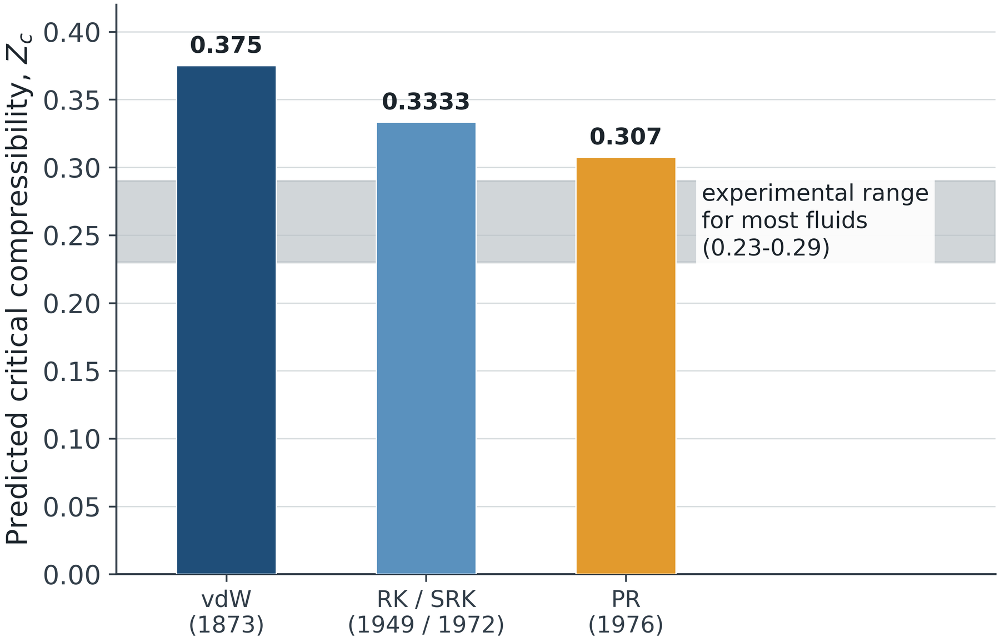{.fig-col}
:::::

::::: {.column width="46%"}
:::: {.cards}
::: {.card}

[Motivates Chapter 8]{.card-h .c-amber}

Redlich and Kwong changed the volume dependence of the attraction and made it decay with temperature.

:::
::::
:::::
::::::

::: {.notes}
**TEACHING TIP**
Make the diagnosis precise. The equation is not merely inaccurate; it is inaccurate in a structural way, because the critical compressibility is fixed by the algebra and cannot be adjusted without changing the functional form. That is why Redlich and Kwong changed the denominator rather than refitting constants.

**COMMON MISCONCEPTION**
Students propose fixing this by refitting a and b. It cannot be fixed that way: with two parameters and two critical conditions, the critical compressibility is completely determined. Only a change of functional form can move it.

**ASK THE CLASS**
Given that 0.375 is roughly 30 per cent too high, in which direction will van der Waals err on saturated liquid density, and by roughly how much?
:::

## The compressibility factor as a diagnostic

::: {.kicker .c-amber}
Chapter 4 · The compressibility factor
:::

::: {.lede}
Interpret the sign of Z minus one, the location of the minimum, and the crossover, in molecular terms.
:::

:::::: {.columns}
::::: {.column width="54%"}
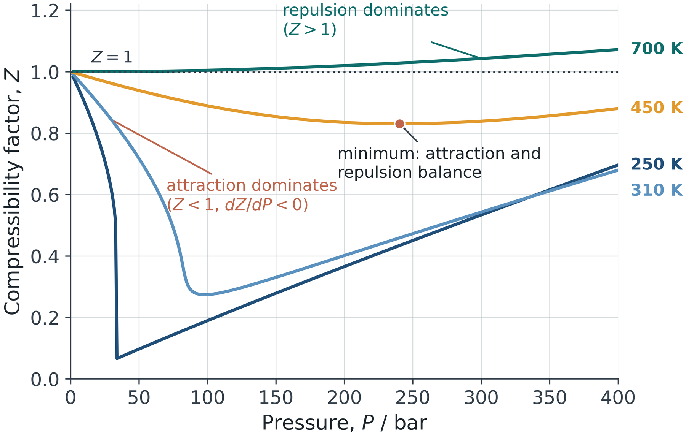{.fig-col}
:::::

::::: {.column width="46%"}
$$
Z<1: \text{ attraction dominates} \qquad Z>1: \text{ repulsion dominates}
$$

:::: {.cards}
::: {.card}

[Z < 1]{.card-h .c-rust}

Attraction dominates: the fluid occupies less volume than an ideal gas at the same T and P.

:::
::::

:::: {.cards}
::: {.card}

[Z > 1]{.card-h .c-teal}

Repulsion dominates: the finite molecular core resists compression and the fluid is stiffer than ideal.

:::
::::

:::: {.cards}
::: {.card}

[Z = 1]{.card-h}

Coincidence, not ideality. The two effects merely cancel.

:::
::::
:::::
::::::

::: {.notes}
**TEACHING TIP**
Insist that Z is not a model. It is a dimensionless statement of how far the fluid is from ideality, and it is the natural variable in which every equation of state should be compared, because it removes the trivial pressure and temperature dependence.

**COMMON MISCONCEPTION**
That Z less than one means the gas is 'compressible' and Z greater than one means it is not. Z is a ratio of actual to ideal molar volume; both regimes are compressible, but for different molecular reasons.

**ASK THE CLASS**
At the Z minimum, attraction and repulsion balance. Does that mean the intermolecular forces are zero there?
:::

## The Boyle temperature

::: {.kicker .c-amber}
Chapter 4 · The compressibility factor
:::

::: {.lede}
Connect the initial slope of Z against P to the second virial coefficient and define the Boyle temperature.
:::

:::::: {.columns}
::::: {.column width="54%"}
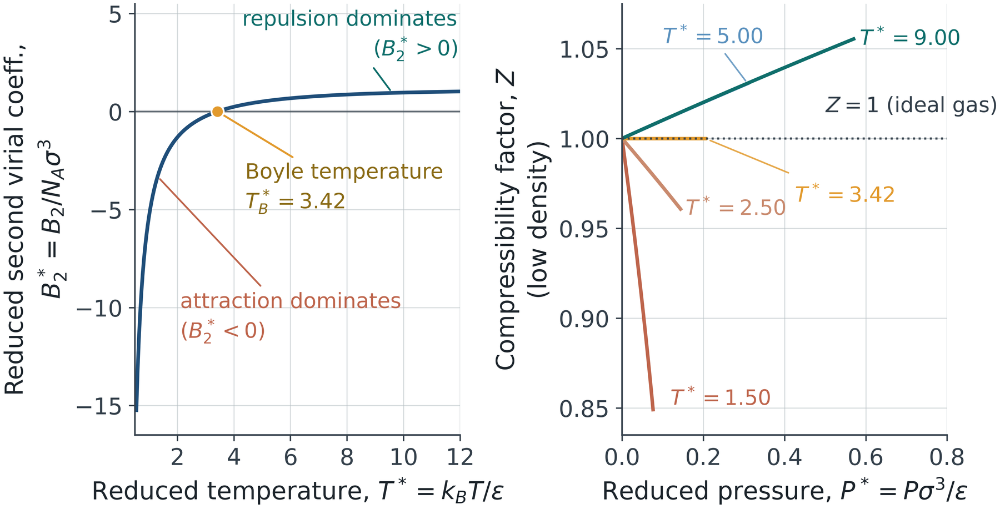{.fig-col}

::: {.source}
Lennard-Jones fluid: the second virial coefficient computed by numerical integration of the Mayer function gives a reduced Boyle temperature of 3.42.
:::
:::::

::::: {.column width="46%"}
$$
\lim_{P\to 0}\left(\frac{\partial Z}{\partial P}\right)_{\!T} = \frac{B_{2}(T)}{RT}
$$

$$
B_{2}(T_{\mathrm{B}}) = 0
$$

:::: {.cards}
::: {.card}

[Reading the slope]{.card-h}

Below the Boyle temperature the initial slope is negative: attraction wins first. Above it the slope is positive: the repulsive core is felt immediately.

:::
::::
:::::
::::::

::: {.notes}
**TEACHING TIP**
This slide is the bridge to Chapter 5. The low-pressure limiting slope of Z is not an empirical observation; it is exactly the second virial coefficient divided by RT, and the second virial coefficient is exactly a two-body integral over the pair potential. Preview that link now so Chapter 5 feels inevitable.

**COMMON MISCONCEPTION**
Students interpret the Boyle temperature as the temperature at which a gas behaves ideally. It is only the temperature at which the leading correction vanishes; higher-order terms remain, so the gas is ideal to first order in density only.

**ASK THE CLASS**
Hydrogen and helium have Boyle temperatures below ambient. What does that predict about the sign of their deviation from ideality at room temperature?
:::

## The generalized compressibility chart

::: {.kicker .c-amber}
Chapter 4 · The compressibility factor
:::

::: {.lede}
Read Z from reduced coordinates and recognise the chart as the engineering form of corresponding states.
:::

:::::: {.columns}
::::: {.column width="50%"}
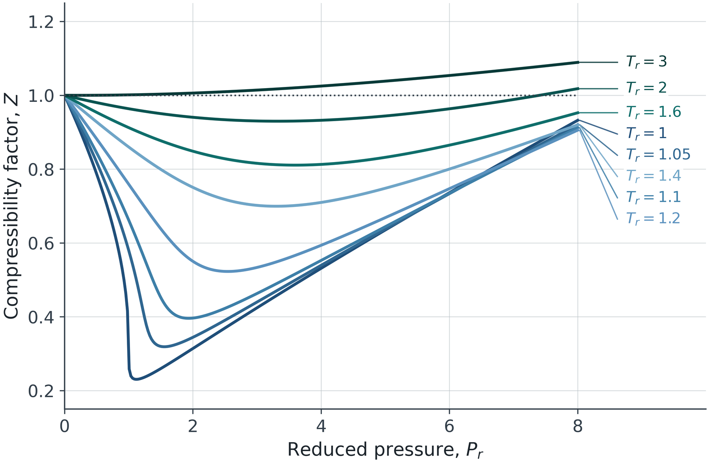{.fig-pair}
:::::

::::: {.column width="50%"}
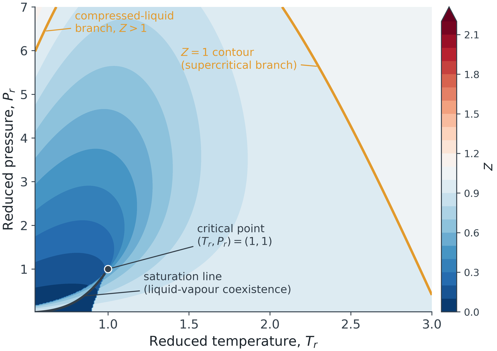{.fig-pair}
:::::
::::::

::: {.source}
Left: the classical chart form. Right: the same information as a contour map of Z over the reduced state plane, with the saturation line and the Z = 1 contour marked.
:::

::: {.notes}
**TEACHING TIP**
Explain that these charts were the working tool of the profession for fifty years and are still the fastest sanity check available. If a simulator returns Z equal to 0.45 for a stream at reduced temperature 1.8 and reduced pressure 0.5, the chart tells you immediately that something is wrong.

**COMMON MISCONCEPTION**
That the chart is a correlation of data for one particular fluid. It is a statement that all fluids collapse onto one surface when plotted in reduced coordinates, which is a theoretical claim, and Chapter 6 examines when it holds.

**ASK THE CLASS**
Estimate Z for a stream at reduced temperature 1.2 and reduced pressure 2.0 from the chart, then decide whether you would trust that number for ammonia.
:::

## The virial equation: an exact expansion

::: {.kicker .c-amber}
Chapter 5 · The virial equation of state
:::

::: {.lede}
Write the density and pressure expansions, relate their coefficients, and identify the physical content of each term.
:::

$$
Z = 1 + B_{2}\rho + B_{3}\rho^{2} + \cdots
$$

$$
Z = 1 + B'P + C'P^{2} + \cdots, \qquad B' = \frac{B_{2}}{RT}
$$

:::: {.cards .quad}
::: {.card}

[Second coefficient]{.card-h}

Two-body interactions only. Computable from the pair potential without approximation, and measurable from low-pressure PVT data.

:::

::: {.card}

[Third coefficient]{.card-h}

Three-body interactions, including genuine non-additive contributions. Far harder to measure and rarely available for industrial compounds.

:::

::: {.card}

[Higher coefficients]{.card-h .c-rust}

Essentially unavailable. The series is therefore always truncated in practice, which restricts the equation to gases at moderate density.

:::

::: {.card}

[The pedagogical point]{.card-h .c-amber}

The virial equation is the only equation in this course that is exact in principle. It is useless for liquids for exactly that reason: an exact expansion in density cannot be truncated where the density is high.

:::
::::

::: {.notes}
**TEACHING TIP**
Emphasise the word exact. Every other equation in this course is a model; the virial expansion is a theorem, valid term by term for any pair potential. The engineering weakness is not the theory but the truncation.

**COMMON MISCONCEPTION**
Students confuse the two expansions and use B interchangeably. The pressure-series coefficient is B divided by RT, and the higher coefficients differ more substantially. Insist on the subscripted notation.

**ASK THE CLASS**
The second virial coefficient describes pairs, the third describes triplets. What does that predict about how many terms you need at liquid density?
:::

## From the pair potential to the second virial coefficient

::: {.kicker .c-amber}
Chapter 5 · The virial equation of state
:::

::: {.lede}
Connect a molecular-level potential to a macroscopic, measurable coefficient through the Mayer function.
:::

::: {.eq-long}
$$
B_{2}(T) = -2\pi N_{\mathrm{A}}\int_0^{\infty}\left[\mathrm{e}^{-u(r)/k_{\mathrm{B}}T}-1\right]r^{2}\,\mathrm{d}r
$$
:::

:::::: {.columns}
::::: {.column width="50%"}
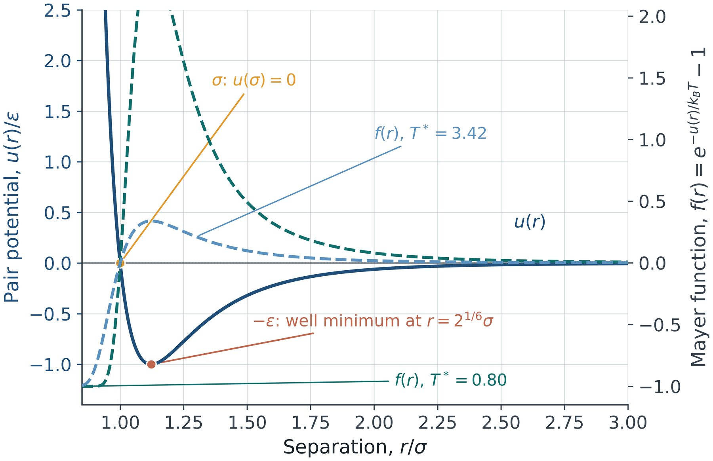{.fig-pair-sm}
:::::

::::: {.column width="50%"}
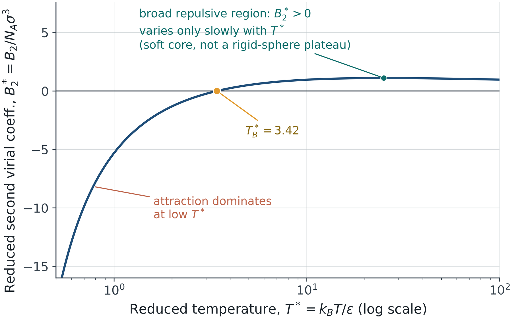{.fig-pair-sm}
:::::
::::::

::: {.source}
Left: the Lennard-Jones potential and its Mayer function at two temperatures. Right: the resulting second virial coefficient, negative at low temperature, crossing zero at the Boyle point.
:::

::: {.notes}
**TEACHING TIP**
This is the first point in the course where a macroscopic thermodynamic property is computed from a molecular model without any adjustable parameter. Dwell on it: it is the intellectual ancestor of SAFT in Chapter 11.

**COMMON MISCONCEPTION**
Students read the Mayer function as a probability. It is not; it is a measure of how much the pair correlation departs from the ideal case, and it is negative where the potential is repulsive and positive where it is attractive.

**ASK THE CLASS**
At very high temperature the exponential approaches one everywhere except inside the core. What limiting value does the integral approach, and what does it correspond to physically?
:::

## Why truncation limits the virial equation

::: {.kicker .c-amber}
Chapter 5 · The virial equation of state
:::

::: {.lede}
Quantify the density at which two-term and three-term truncations fail, and draw the practical boundary.
:::

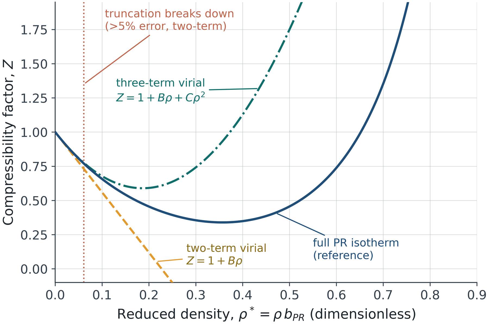{.fig-lg width="66%"}

:::: {.cards}
::: {.card}

[Physical meaning]{.card-h .c-amber}

Truncation is a statement about how many bodies interact simultaneously. At liquid density every molecule interacts with a dozen neighbours at once, so a two-body or three-body expansion cannot converge.

:::

::: {.card}

[Engineering implication]{.card-h .c-teal}

For compressor and pipeline calculations in the gas phase the two-term virial equation is accurate and cheap. For anything involving a liquid it is not an option, which is why the cubic family survived.

:::
::::

::: {.notes}
**TEACHING TIP**
Give the practical rule: the two-term form is reliable to roughly half the critical density, the three-term form somewhat further, and neither is usable in the liquid. Then state the consequence: for a two-phase calculation the virial equation is simply not a candidate.

**COMMON MISCONCEPTION**
That adding more terms would fix this. The coefficients beyond the third are not known for industrial compounds, and the series converges slowly near the critical point in any case.

**ASK THE CLASS**
You need a vapour-liquid flash at 60 per cent of the critical density. Can you use a truncated virial equation for either phase? For which one, and why not the other?
:::

## Generalization {.dark .divider .c-teal background-color="#1C242B"}

::: {.kicker .c-amber}
PART III
:::

::: {.lede}
Chapter 6   The principle of corresponding states Chapter 7   The Pitzer acentric factor
:::

::: {.notes}
**TEACHING TIP**
Frame Part III as a change of question. Parts I and II asked what equation describes a fluid. Part III asks whether all fluids are the same fluid once the axes are rescaled, and if not, what single number measures the difference.

**COMMON MISCONCEPTION**
Students think corresponding states is a curve-fitting convenience. It is a theoretical prediction that follows from the vdW equation and, more generally, from conformal pair potentials.

**ASK THE CLASS**
If two fluids obeyed exactly the same law in reduced coordinates, what would that imply about their molecules?
:::

## Corresponding states falls out of van der Waals

::: {.kicker .c-amber}
Chapter 6 · The principle of corresponding states
:::

::: {.lede}
Derive the reduced form of the van der Waals equation and recognise that it contains no substance-specific constant.
:::

::: {.eq-long}
$$
P_{\mathrm{r}} = \frac{8T_{\mathrm{r}}}{3V_{\mathrm{r}}-1} - \frac{3}{V_{\mathrm{r}}^{2}}
$$
:::

$$
Z = Z(T_{\mathrm{r}},P_{\mathrm{r}}) \quad \text{for every fluid}
$$

:::: {.cards}
::: {.card}

[Where it works]{.card-h .c-teal}

Argon, krypton, xenon, methane and nitrogen: nearly spherical, non-polar molecules whose pair potentials are conformal, differing only by an energy scale and a length scale.

These are the simple fluids, and for them the collapse is close to exact.

:::

::: {.card}

[Where it must fail]{.card-h .c-rust}

Elongated molecules such as n-octane, polar molecules such as ammonia, quadrupolar molecules such as carbon dioxide, and hydrogen-bonding molecules such as water.

Their potentials are not conformal, so no rescaling can superimpose them.

:::
::::

::: {.notes}
**TEACHING TIP**
Do this substitution live on the board. Watching a and b disappear is far more convincing than being shown the result. Then state the general condition: any two-parameter equation of state implies two-parameter corresponding states, and the two statements are equivalent.

**COMMON MISCONCEPTION**
Students believe corresponding states is more general than van der Waals. It is more general in its statistical-mechanical form, based on conformal pair potentials, but the two-parameter version is exactly equivalent to a two-parameter cubic.

**ASK THE CLASS**
Which molecules have pair potentials that are identical after scaling by an energy and a length? Name three, and then name three that certainly do not.
:::

## Universality and its limits

::: {.kicker .c-amber}
Chapter 6 · The principle of corresponding states
:::

::: {.lede}
Observe the collapse for simple fluids and the systematic departure for polar and associating fluids.
:::

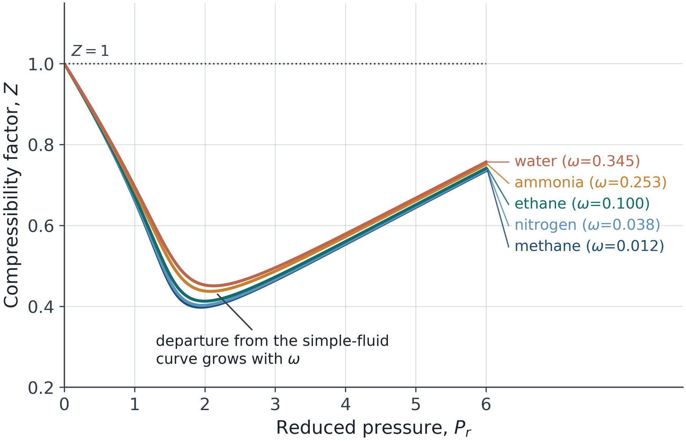{.fig-lg width="66%"}

:::: {.cards}
::: {.card}

[Physical meaning]{.card-h .c-amber}

Two parameters force a single universal critical compressibility. Real fluids have critical compressibilities from 0.23 to 0.29, so a two-parameter theory cannot be exact for all of them.

:::

::: {.card}

[Engineering implication]{.card-h .c-teal}

Two-parameter charts are adequate for light hydrocarbons and permanent gases. For refrigerants, water and amines they are not, and a third parameter is mandatory.

:::
::::

::: {.notes}
**TEACHING TIP**
Direct attention to the ordering of the curves. The departure is not random scatter; it grows monotonically with a molecular property. Ask the class to guess what that property is before revealing the acentric factor in the next chapter.

**COMMON MISCONCEPTION**
Students attribute the spread to experimental error. It is systematic and reproducible, and its regularity is exactly what makes a third parameter possible.

**ASK THE CLASS**
The departure is ordered. What single molecular characteristic could you use to index it, and how would you measure that characteristic without a microscope?
:::

## Why the critical constants are not enough

::: {.kicker .c-amber}
Chapter 7 · The Pitzer acentric factor
:::

::: {.lede}
Show that reduced vapour-pressure curves have different slopes, and that the slope carries the missing information.
:::

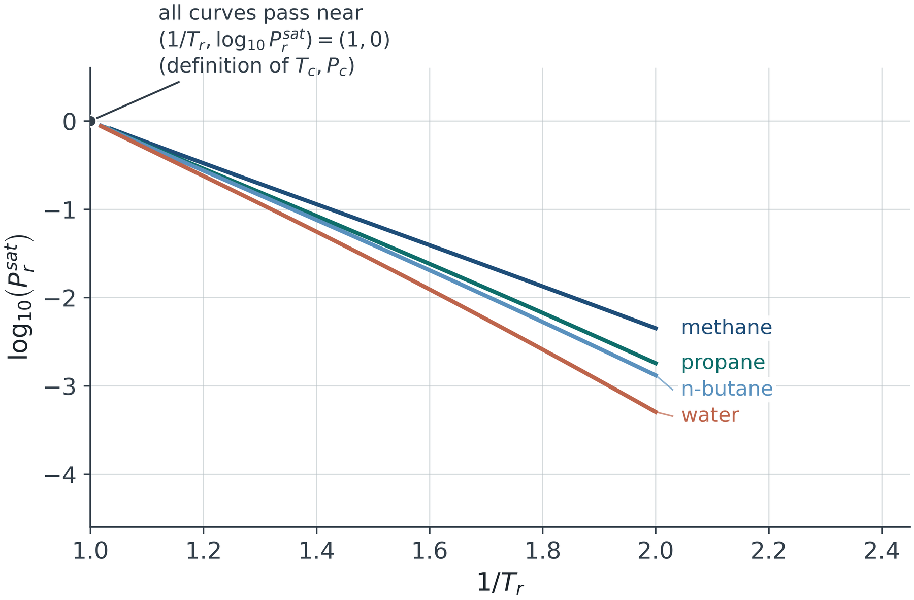{.fig-lg width="66%"}

:::: {.cards}
::: {.card}

[Physical meaning]{.card-h .c-amber}

In reduced coordinates every vapour-pressure line is pinned at the critical point. What distinguishes fluids is how steeply the line falls, which reflects the strength and directionality of the intermolecular forces.

:::

::: {.card}

[Engineering implication]{.card-h .c-teal}

This is a practical choice as well as a physical one: vapour pressure is the most widely measured property in chemical engineering, so a parameter defined from it is available for essentially every compound.

:::
::::

::: {.notes}
**TEACHING TIP**
Point out that all lines pass through the same point at reduced temperature one, by definition of reduced coordinates. The only remaining freedom is the slope, so the slope must be where all the substance-specific information sits.

**COMMON MISCONCEPTION**
Students expect the third parameter to be something structural like a dipole moment. Pitzer deliberately chose a macroscopic, easily measured quantity instead, precisely so that it would be available for industrial compounds.

**ASK THE CLASS**
Two fluids share the same critical temperature and pressure but have vapour-pressure lines of different slope. Which one boils at a lower reduced temperature, and what does that say about its molecules?
:::

## Pitzer's acentric factor

::: {.kicker .c-amber}
Chapter 7 · The Pitzer acentric factor
:::

::: {.lede}
Define the acentric factor from a single point on the reduced vapour-pressure curve and interpret it physically.
:::

:::::: {.columns}
::::: {.column width="54%"}
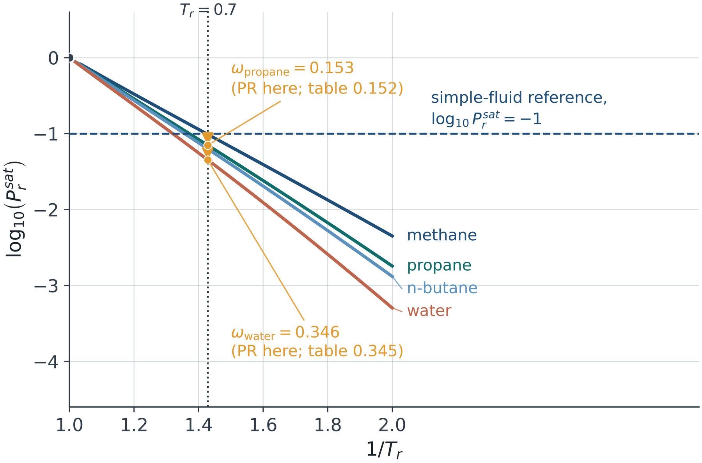{.fig-col}
:::::

::::: {.column width="46%"}
::: {.eq-long}
$$
\omega \;\equiv\; -1 - \log_{10}\left(P_{\mathrm{r}}^{\mathrm{sat}}\right)_{T_{\mathrm{r}}=0.7}
$$
:::

:::: {.cards}
::: {.card}

[Why reduced temperature 0.7]{.card-h}

Close to the normal boiling point of many fluids, comfortably subcritical, easily measured, and far enough from the critical point to avoid critical anomalies.

:::
::::

:::: {.cards}
::: {.card}

[Physical meaning]{.card-h .c-amber}

The acentric factor measures how far the intermolecular force field departs from spherical symmetry. It increases with chain length, with polarity and with hydrogen bonding.

:::
::::
:::::
::::::

::: {.notes}
**TEACHING TIP**
Justify the choice of reduced temperature 0.7: it lies near the normal boiling point of many common fluids, it is comfortably subcritical so the measurement is easy, and it is far enough from the critical point to avoid critical anomalies. The value minus one for simple fluids is an empirical calibration, not a derivation.

**COMMON MISCONCEPTION**
That the acentric factor measures how non-spherical a molecule is in a geometric sense. It measures the departure of the intermolecular force field from spherical symmetry, which includes polarity and hydrogen bonding, not only shape.

**ASK THE CLASS**
Argon has an acentric factor of essentially zero and water has 0.345. Which contributes more to water's value, its shape or its hydrogen bonding?
:::

## The acentric factor across molecular families

::: {.kicker .c-amber}
Chapter 7 · The Pitzer acentric factor
:::

::: {.lede}
Relate the numerical value of the acentric factor to molecular architecture, and state the three-parameter correlation.
:::

:::::: {.columns}
::::: {.column width="54%"}
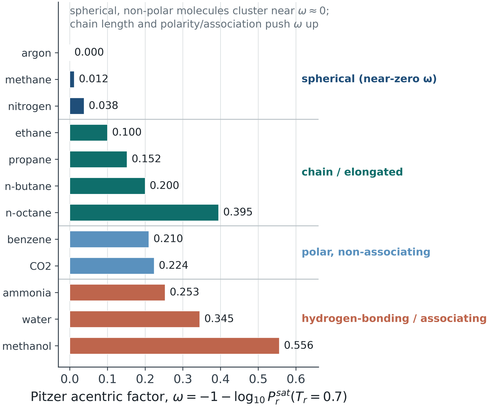{.fig-col}
:::::

::::: {.column width="46%"}
::: {.eq-long}
$$
Z = Z^{(0)}(T_{\mathrm{r}},P_{\mathrm{r}}) \;+\; \omega\,Z^{(1)}(T_{\mathrm{r}},P_{\mathrm{r}})
$$
:::

:::: {.cards}
::: {.card}

[Three-parameter corresponding states]{.card-h}

A simple-fluid reference surface plus a linear correction weighted by the acentric factor. The Lee-Kesler tables are the standard numerical implementation.

:::
::::

:::: {.cards}
::: {.card}

[Where it still fails]{.card-h .c-rust}

Strongly associating fluids, whose reduced vapour-pressure curves are not straight, so a single slope parameter cannot represent them.

:::
::::
:::::
::::::

::: {.notes}
**TEACHING TIP**
Walk down the chart family by family. Note that carbon dioxide, a linear symmetric molecule, has a value comparable with n-butane because of its quadrupole. This breaks the naive shape interpretation and is worth stating explicitly.

**COMMON MISCONCEPTION**
That the acentric factor is a measured molecular property. It is a correlating parameter derived from vapour pressure; it can even be negative for helium and hydrogen, which is meaningless as a shape.

**ASK THE CLASS**
Methanol has a larger acentric factor than benzene despite being a much smaller molecule. Explain.
:::

## The cubic era {.dark .divider .c-teal background-color="#1C242B"}

::: {.kicker .c-amber}
PART IV
:::

::: {.lede}
Chapter 8    Redlich-Kwong, 1949 Chapter 9    Soave-Redlich-Kwong, 1972 Chapter 10  Peng-Robinson, 1976, and the industrial standard
:::

::: {.notes}
**TEACHING TIP**
Set the industrial context. These three equations were developed by and for the petroleum and gas-processing industries, and their arrival coincides with the first commercial process simulators. The design constraint was never elegance; it was that the equation had to be solvable millions of times per flowsheet.

**COMMON MISCONCEPTION**
Students assume the newest equation is always the best. In light-hydrocarbon service the differences among these three are often smaller than the uncertainty in the feed composition.

**ASK THE CLASS**
What would you require of an equation of state before you would allow it inside the inner loop of a distillation column solver?
:::

## Redlich-Kwong, 1949: two changes at once

::: {.kicker .c-amber}
Chapter 8 · Redlich-Kwong
:::

::: {.lede}
Identify the two independent modifications of the van der Waals attraction term and their separate effects.
:::

$$
P = \frac{RT}{V-b} \;-\; \frac{a}{\sqrt{T}\,V(V+b)}
$$

::: {.eq-long}
$$
a = \frac{0.42748\,R^{2}T_{\mathrm{c}}^{5/2}}{P_{\mathrm{c}}}, \qquad b = \frac{0.08664\,RT_{\mathrm{c}}}{P_{\mathrm{c}}}, \qquad Z_{\mathrm{c}} = 1/3 = 0.3333
$$
:::

:::: {.cards}
::: {.card}

[Change 1   Temperature dependence]{.card-h .c-amber}

The attraction is divided by the square root of temperature. Physically, at higher kinetic energy molecules spend less time in the attractive well, so the mean-field average of the attractive energy falls.

:::

::: {.card}

[Change 2   Volume dependence]{.card-h .c-amber}

The denominator becomes V(V + b) rather than V squared. This softens the attraction at high density and lowers the predicted critical compressibility from 0.375 to 0.333.

:::
::::

::: {.notes}
**TEACHING TIP**
Insist that there are two changes, not one. Most textbooks present the temperature dependence and pass over the change in volume dependence, but the second is what moves the critical compressibility from 0.375 to 0.333 and improves the vapour phase.

**COMMON MISCONCEPTION**
Students remember only the inverse square root of temperature. Ask them to write down the denominator from memory; most will write V squared, which is van der Waals.

**ASK THE CLASS**
Why should an effective attraction weaken as temperature rises, given that the pair potential itself is temperature independent?
:::

## The temperature dependence of the attraction

::: {.kicker .c-amber}
Chapter 8 · Redlich-Kwong
:::

::: {.lede}
Compare the alpha functions of the four classical cubics and see how each encodes a different physical assumption.
:::

:::::: {.columns}
::::: {.column width="54%"}
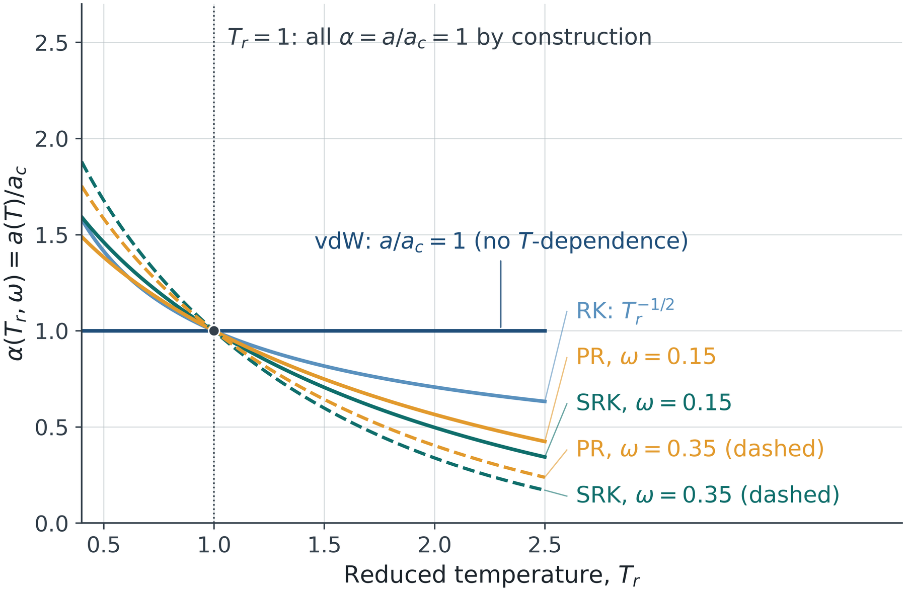{.fig-col}
:::::

::::: {.column width="46%"}
$$
a(T) = a_{\mathrm{c}}\,\alpha(T_{\mathrm{r}},\omega), \qquad \alpha(1,\omega) = 1
$$
:::::
::::::

::: {.notes}
**TEACHING TIP**
This single figure summarises Chapters 3, 8, 9 and 10. Van der Waals is a horizontal line: no temperature dependence at all. Redlich-Kwong is a fixed power law, identical for every substance. Soave and Peng-Robinson add a substance-specific slope through the acentric factor. That is the whole story of the cubic era in one plot.

**COMMON MISCONCEPTION**
Students think alpha is a fudge factor. It is the effective temperature dependence of the mean-field attraction, and its value at the critical temperature is fixed at one by construction so that the critical constants are preserved.

**ASK THE CLASS**
Two fluids with different acentric factors share the same alpha at the critical temperature. Why must that be so?
:::

## What Redlich-Kwong bought, and what it did not

::: {.kicker .c-amber}
Chapter 8 · Redlich-Kwong
:::

::: {.lede}
Separate the genuine improvement in the vapour phase from the persistent failures in the liquid phase.
:::

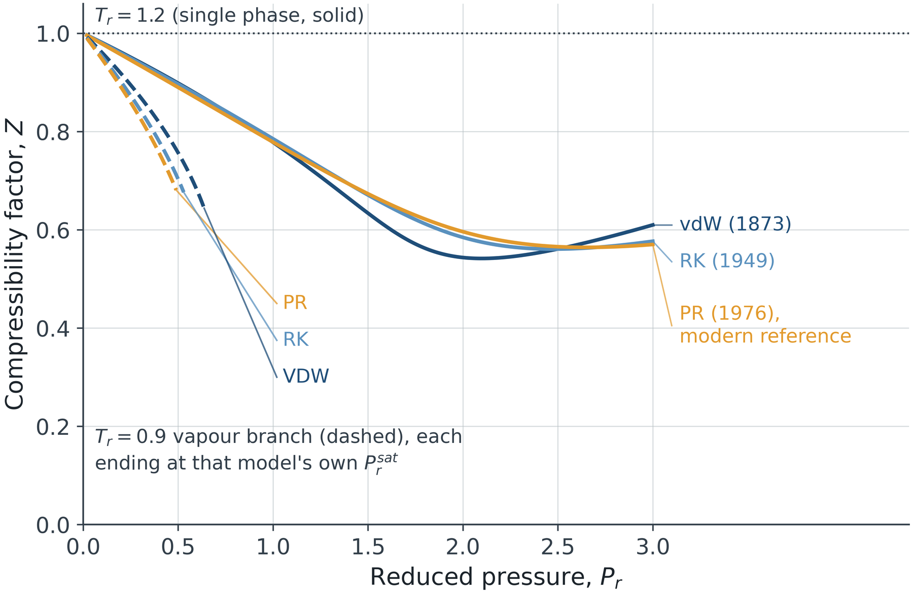{.fig-lg width="66%"}

:::: {.cards}
::: {.card}

[Physical meaning]{.card-h .c-amber}

The vapour-phase compressibility improves substantially: errors of several per cent under van der Waals fall to about one per cent for simple fluids.

:::

::: {.card}

[Engineering implication]{.card-h .c-teal}

Liquid densities remain poor and vapour pressures remain wrong for anything but simple fluids, because no molecular shape or polarity parameter enters the equation.

:::
::::

::: {.notes}
**TEACHING TIP**
State the diagnosis precisely. Redlich-Kwong contains no molecular parameter beyond the critical constants, so it necessarily assigns the same reduced vapour-pressure curve to every substance. In the language of Chapter 7 it has a single fixed acentric factor built in, close to 0.06.

**COMMON MISCONCEPTION**
Students conclude that Redlich-Kwong was superseded because it was inaccurate. It was superseded because it was structurally incapable of distinguishing substances, which is a different and more serious defect.

**ASK THE CLASS**
If Redlich-Kwong behaves as though every fluid had an acentric factor of about 0.06, for which real substances will it perform best?
:::

## Soave 1972: fit the temperature dependence to reality

::: {.kicker .c-amber}
Chapter 9 · Soave-Redlich-Kwong
:::

::: {.lede}
Replace the assumed power law by an alpha function regressed against experimental vapour pressures.
:::

$$
P = \frac{RT}{V-b} \;-\; \frac{a_{\mathrm{c}}\,\alpha(T_{\mathrm{r}},\omega)}{V(V+b)}
$$

::: {.eq-long}
$$
\alpha = \left[1+m\left(1-\sqrt{T_{\mathrm{r}}}\right)\right]^{2}, \qquad m = 0.480+1.574\,\omega-0.176\,\omega^{2}
$$
:::

:::: {.cards}
::: {.card}

[The new physics]{.card-h .c-amber}

Molecular shape and polarity enter the equation of state for the first time, through the acentric factor, and they enter the attraction term where they physically belong.

Alpha equals one at the critical temperature by construction, so the critical constants are preserved exactly.

:::

::: {.card}

[Why this was decisive]{.card-h}

Vapour pressures became quantitative for hydrocarbons, and therefore so did equilibrium ratios. This is the point at which process simulation of hydrocarbon separations became reliable enough for design rather than for checking.

:::
::::

::: {.notes}
**TEACHING TIP**
Explain the regression procedure explicitly: for each of a set of hydrocarbons, choose alpha at each temperature so that the isofugacity condition reproduces the measured vapour pressure, then correlate the resulting slope parameter against the acentric factor. The physics enters through the choice of what to fit, not through the functional form.

**COMMON MISCONCEPTION**
Students see this as pure empiricism replacing theory. It is a deliberate reallocation of the modelling effort: the volumetric behaviour is left to the cubic structure, and the fitted freedom is spent where it buys phase equilibrium.

**ASK THE CLASS**
Why fit alpha to vapour pressure rather than to density? What does that choice say about the intended application?
:::

## The effect on predicted vapour pressure

::: {.kicker .c-amber}
Chapter 9 · Soave-Redlich-Kwong
:::

::: {.lede}
Quantify the improvement Soave's alpha function delivers relative to the fixed Redlich-Kwong power law.
:::

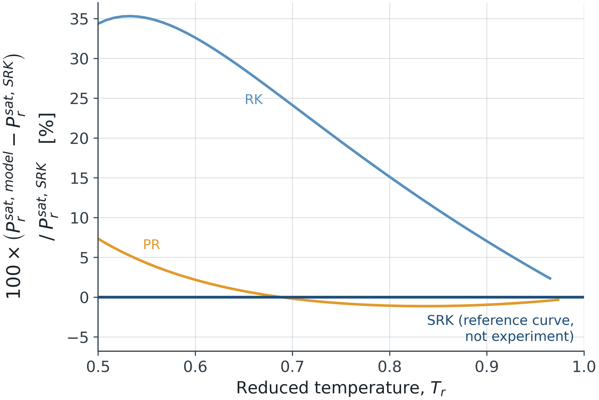{.fig-lg width="66%"}

:::: {.cards}
::: {.card}

[Physical meaning]{.card-h .c-amber}

The fixed power law of Redlich-Kwong is equivalent to assigning every substance the same acentric factor. Soave's regression removes that constraint.

:::

::: {.card}

[Engineering implication]{.card-h .c-teal}

Deviations exceeding thirty per cent at low reduced temperature translate directly into equilibrium-ratio errors, and therefore into stage counts and reflux ratios.

:::
::::

::: {.notes}
**TEACHING TIP**
State clearly that the reference curve here is the Soave result itself, not experimental data, so the figure shows the size of the model change rather than an absolute error. The Redlich-Kwong deviation exceeding thirty per cent at low reduced temperature is the quantity to remember.

**COMMON MISCONCEPTION**
Students read a thirty per cent vapour-pressure error as tolerable. In a multistage separation it compounds: a thirty per cent error in the equilibrium ratio of a key component changes the required number of stages substantially.

**ASK THE CLASS**
The deviation is largest at low reduced temperature and vanishes at the critical point. Why must it vanish there?
:::

## Peng-Robinson 1976: repair the volume dependence

::: {.kicker .c-amber}
Chapter 10 · Peng-Robinson
:::

::: {.lede}
Identify the change in the denominator, its effect on the critical compressibility, and the resulting cubic in Z.
:::

::: {.eq-long}
$$
P = \frac{RT}{V-b} \;-\; \frac{a_{\mathrm{c}}\,\alpha(T_{\mathrm{r}},\omega)}{V(V+b)+b(V-b)}
$$
:::

::: {.eq-long}
$$
a_{\mathrm{c}} = \frac{0.45724\,R^{2}T_{\mathrm{c}}^{2}}{P_{\mathrm{c}}}, \qquad b = \frac{0.07780\,RT_{\mathrm{c}}}{P_{\mathrm{c}}}, \qquad Z_{\mathrm{c}} = 0.3074
$$
:::

:::: {.cards}
::: {.card}

[The new physics]{.card-h .c-amber}

A softer, longer-ranged effective attraction at high density, which is what a real liquid experiences. The critical compressibility falls to 0.3074, much closer to the measured range.

:::

::: {.card}

[Reduced to a cubic in Z, solved analytically]{.card-h}

$$
Z^{3} - (1-B)Z^{2} + \left(A-3B^{2}-2B\right)Z - \left(AB-B^{2}-B^{3}\right) = 0
$$

$$
A \equiv \frac{a P}{R^{2}T^{2}}, \qquad B \equiv \frac{bP}{RT}
$$

:::
::::

::: {.notes}
**TEACHING TIP**
Emphasise the division of labour across three chapters. Redlich-Kwong changed the temperature dependence and the volume dependence together. Soave repaired the temperature dependence properly. Peng and Robinson then repaired the volume dependence properly, which is what liquid density depends on.

**COMMON MISCONCEPTION**
That Peng-Robinson is simply Soave with different constants. The denominator is structurally different, giving the two roots one plus and one minus the square root of two, and that is what shifts the critical compressibility to 0.307.

**ASK THE CLASS**
The critical compressibility moves from 0.333 to 0.307 against a real range of 0.23 to 0.29. Is that a solution or an improvement?
:::

## Liquid density: the reason Peng-Robinson won

::: {.kicker .c-amber}
Chapter 10 · Peng-Robinson
:::

::: {.lede}
Compare saturated liquid volumes and coexistence envelopes from Soave and Peng-Robinson.
:::

:::::: {.columns}
::::: {.column width="50%"}
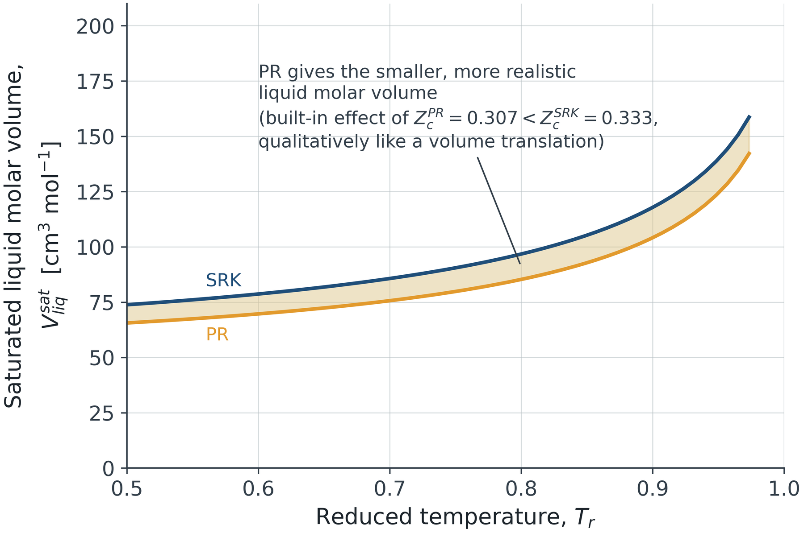{.fig-pair}
:::::

::::: {.column width="50%"}
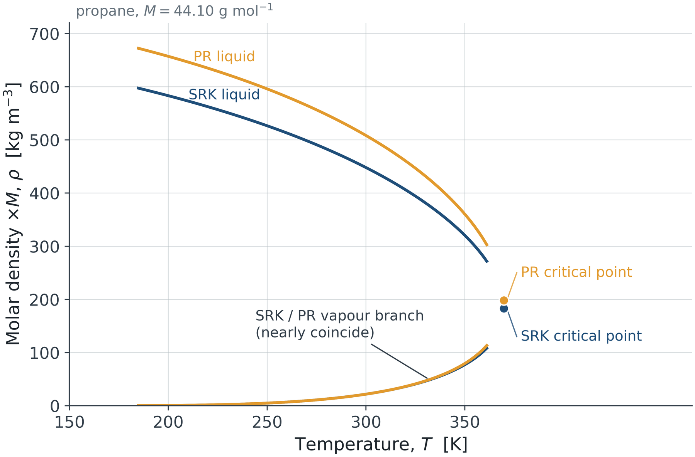{.fig-pair}
:::::
::::::

::: {.source}
Left: saturated liquid molar volume of propane. Right: the coexistence envelope in density-temperature coordinates. The two models agree closely on the vapour branch and differ systematically on the liquid branch.
:::

::: {.notes}
**TEACHING TIP**
Give the number: Peng-Robinson predicts saturated liquid volumes roughly eleven to twelve per cent smaller than Soave across the subcritical range for propane. That is close to the size of the Soave error, which is why the change was adopted so quickly.

**COMMON MISCONCEPTION**
Students expect the improvement to appear in the vapour phase as well. It does not, in any important way. The two equations are nearly indistinguishable for vapour, and the choice between them is decided almost entirely by the liquid.

**ASK THE CLASS**
You are sizing a pump for a saturated hydrocarbon liquid. How much does an eleven per cent volume error change the required duty, and what else does it change?
:::

## van der Waals, Redlich-Kwong, Soave and Peng-Robinson compared

::: {.kicker .c-amber}
Chapter 10 · Peng-Robinson
:::

::: {.lede}
Assess the four classical cubics on the criteria that actually decide model selection in industry.
:::

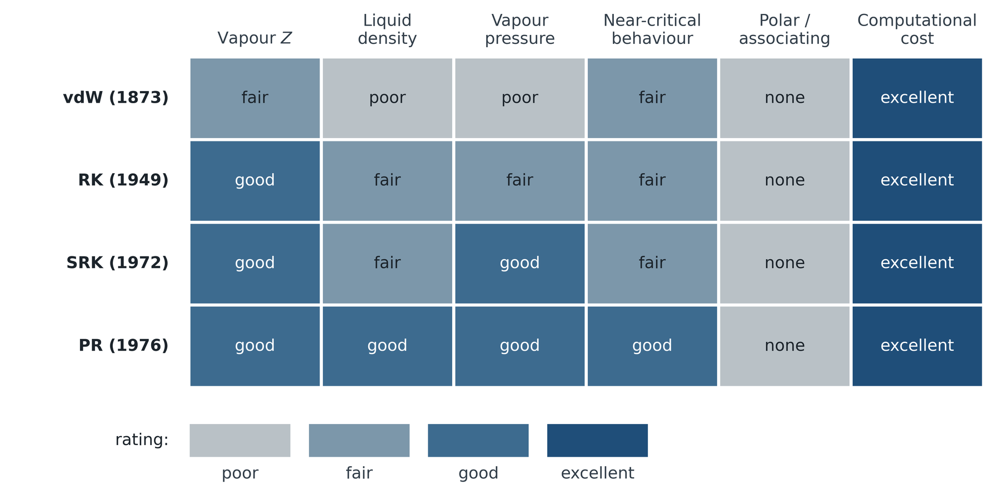{.fig-lg width="66%"}

:::: {.cards}
::: {.card}

[Physical meaning]{.card-h .c-amber}

Each row adds one piece of physics and each addition shows up in exactly one or two columns. No row adds physics that improves every column at once.

:::

::: {.card}

[Engineering implication]{.card-h .c-teal}

The final column explains the persistence of the family: all four are solvable analytically or in a few Newton steps, which is what an inner-loop model must be.

:::
::::

::: {.notes}
**TEACHING TIP**
Read the last column aloud: computational cost is excellent for all four. That is why the family survived a century. Then read the polar and associating column: none. That is why Chapter 11 exists.

**COMMON MISCONCEPTION**
Students look for the single best equation. The table has no best row, only a best row for a given column. Model selection is the identification of which column your problem lives in.

**ASK THE CLASS**
Your feed is a wet natural gas containing methanol as a hydrate inhibitor. Which column decides your choice, and does any row satisfy it?
:::

## Why Peng-Robinson became the industrial standard

::: {.kicker .c-amber}
Chapter 10 · Peng-Robinson
:::

::: {.lede}
Explain the adoption of Peng-Robinson in engineering rather than purely scientific terms, and name the standard patches.
:::

- Adequate for both phases across the ranges of oil and gas processing.
- Analytic cubic solution, so it is fast and robust inside iterative solvers.
- Requires only critical temperature, critical pressure and acentric factor, which are tabulated for essentially every industrial compound.
- Well understood mixing rules and a long record of validated binary interaction parameters.

:::: {.cards .g3}
::: {.card}

[Standard patch 1   Volume translation]{.card-h}

Peneloux and co-workers, 1982: a constant volume shift per compound that corrects liquid density without disturbing the predicted vapour-liquid equilibrium.

:::

::: {.card}

[Standard patch 2   Mathias-Copeman alpha]{.card-h}

A three-constant alpha function fitted per compound, used when vapour pressures of polar species must be reproduced accurately.

:::

::: {.card}

[The cost of every patch, and the limit of the family]{.card-h .c-rust}

Each patch buys accuracy with an additional fitted constant per compound, so predictive power for new molecules is not improved. No amount of patching introduces chain connectivity, hydrogen bonding or electrostatics, because none of those quantities appears anywhere in a cubic equation.

:::
::::

::: {.notes}
**TEACHING TIP**
Stress the third bullet. The parameters required are only the critical temperature, the critical pressure and the acentric factor, all of which are tabulated for essentially every industrial compound. A more accurate model requiring parameters nobody has measured is not usable in a design office.

**COMMON MISCONCEPTION**
That industrial adoption tracks scientific accuracy. It tracks accuracy per unit of parameter availability and computational cost. Peng-Robinson is the optimum of that ratio for hydrocarbon processing.

**ASK THE CLASS**
Volume translation improves liquid density at the cost of one fitted constant per compound. Under what circumstances is that trade worth making?
:::

## Working with Peng-Robinson in practice

::: {.kicker .c-amber}
Chapter 10 · Peng-Robinson
:::

::: {.lede}
Assemble the three expressions needed for a flash calculation and identify the most common practical error.
:::

::: {.eq-long}
$$
\ln\varphi = Z-1-\ln(Z-B) \;-\; \frac{A}{2\sqrt{2}\,B}\,\ln\frac{Z+(1+\sqrt{2})B}{Z+(1-\sqrt{2})B}
$$
:::

::: {.eq-long}
$$
a_{\mathrm{mix}} = \sum_i\sum_j y_iy_j\sqrt{a_ia_j}\,(1-k_{ij}), \qquad b_{\mathrm{mix}} = \sum_i y_ib_i
$$
:::

:::: {.cards}
::: {.card}

[The most common practical error]{.card-h .c-rust}

Selecting the wrong root of the cubic. Below the critical temperature there may be three real roots; the middle root is mechanically unstable and always discarded, and the choice between the smallest and the largest must be made by comparing the fugacity coefficient, never by assumption.

A wrong root gives an answer that is not slightly wrong but wrong by the density ratio between a liquid and a vapour.

:::

::: {.card}

[Mixtures]{.card-h}

The van der Waals one-fluid mixing rules reduce a mixture to a pseudo-pure component. The binary interaction parameter is fitted to binary vapour-liquid equilibrium data and is the only adjustable quantity.

Setting it to zero is a defensible default for similar hydrocarbons and is not defensible for a hydrocarbon with carbon dioxide, water or an alcohol.

:::
::::

::: {.notes}
**TEACHING TIP**
Root selection is the single most common source of wrong answers in student and industrial EOS code. Below the critical temperature the cubic can return three real roots; the middle one is always discarded, and the choice between the outer two must be made by comparing the fugacity coefficient, not by assuming which phase you expect.

**COMMON MISCONCEPTION**
That the largest root is always the vapour and the smallest is always the liquid, so one can be chosen by inspection. The roots exist regardless of which phase is thermodynamically stable; only the fugacity comparison identifies the stable one.

**ASK THE CLASS**
Your flash returns three real roots at 350 K and 10 bar. Which do you use, and what calculation decides it?
:::

## The molecular era {.dark .divider .c-teal background-color="#1C242B"}

::: {.kicker .c-amber}
PART V
:::

::: {.lede}
Chapter 11   SAFT and the statistical associating fluid theory Chapter 12   Electrolyte equations of state Chapter 13   Future directions
:::

::: {.notes}
**TEACHING TIP**
Announce the change of construction. Everything so far wrote down a pressure explicitly. From here the models write down a residual Helmholtz energy as a sum of physically separable terms and obtain the pressure by differentiation. That change is what makes it possible to add one physical effect at a time.

**COMMON MISCONCEPTION**
Students expect SAFT to be a more complicated cubic. It is a different construction with a different reference fluid, and its parameters have molecular meaning that cubic parameters do not.

**ASK THE CLASS**
If you could add one term to a cubic equation to describe an alcohol, what physics would you put in it?
:::

## SAFT: a different construction

::: {.kicker .c-amber}
Chapter 11 · SAFT
:::

::: {.lede}
Contrast writing down a pressure with writing down a residual Helmholtz energy as a sum of separable contributions.
:::

::: {.eq-long}
$$
P = \rho^{2}\left(\frac{\partial\left(A^{\mathrm{res}}/N\right)}{\partial\rho}\right)_{\!T} + \rho\,k_{\mathrm{B}}T
$$
:::

::: {.eq-long}
$$
\tilde a^{\mathrm{res}} = \tilde a^{\mathrm{hs}} + \tilde a^{\mathrm{chain}} + \tilde a^{\mathrm{disp}} + \tilde a^{\mathrm{assoc}}
$$
:::

:::: {.cards}
::: {.card}

[Wertheim 1984 to 1986]{.card-h}

First-order thermodynamic perturbation theory for fluids with highly directional attractive forces. This is the mathematics that makes hydrogen bonding tractable as a free-energy contribution rather than as a fitted correction.

:::

::: {.card}

[Chapman and co-workers 1990, Gross and Sadowski 2001]{.card-h}

SAFT turned the theory into an engineering equation of state. PC-SAFT then perturbed about the hard-chain rather than the hard-sphere reference, which improved the description of long molecules substantially.

:::
::::

::: {.notes}
**TEACHING TIP**
Make the methodological point explicit. Because the Helmholtz energy is additive over physically distinct effects, terms can be added, removed or improved independently. That modularity is impossible in a cubic, where every effect is entangled in two parameters.

**COMMON MISCONCEPTION**
Students ask which term is 'the equation of state'. All of them together are; the pressure is a derivative of the sum, so no single term is an equation of state on its own.

**ASK THE CLASS**
Why is the Helmholtz energy the natural potential here rather than the Gibbs energy?
:::

## Four terms, four pieces of physics

::: {.kicker .c-amber}
Chapter 11 · SAFT
:::

::: {.lede}
Attribute each Helmholtz contribution to a specific molecular mechanism and to the cubic-equation defect it repairs.
:::

:::::: {.columns}
::::: {.column width="54%"}
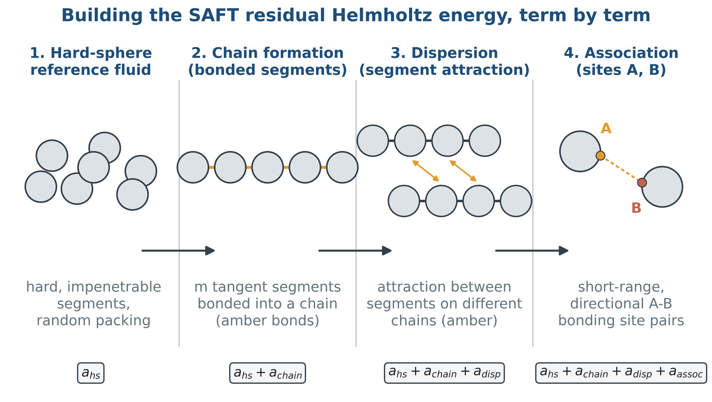{.fig-col}
:::::

::::: {.column width="46%"}
:::: {.cards}
::: {.card}

[Hard sphere]{.card-h .c-teal}

Excluded volume treated with the Carnahan-Starling result rather than a single constant b.

:::
::::

:::: {.cards}
::: {.card}

[Chain]{.card-h .c-teal}

Connectivity of bonded segments. Replaces the acentric factor with a structural parameter.

:::
::::

:::: {.cards}
::: {.card}

[Dispersion]{.card-h .c-teal}

Attraction between segments from perturbation theory rather than a mean field.

:::
::::

:::: {.cards}
::: {.card}

[Association]{.card-h .c-amber}

Short-range directional bonding. No cubic equation contains this at all.

:::
::::
:::::
::::::

::: {.notes}
**TEACHING TIP**
Map each panel back onto the earlier chapters. The hard-sphere term is the co-volume of Chapter 3 done correctly. The dispersion term is the attraction of Chapter 3 done correctly. The chain term replaces the acentric factor of Chapter 7 with an actual structural parameter. The association term has no counterpart anywhere in the cubic family.

**COMMON MISCONCEPTION**
Students treat the association term as an optional extra. For water, alcohols, amines and acids it is the dominant contribution to the phase behaviour, not a correction.

**ASK THE CLASS**
Which of the four terms would you delete first if you needed the model to run ten times faster, and what would you lose?
:::

## The terms in equations

::: {.kicker .c-amber}
Chapter 11 · SAFT
:::

::: {.lede}
Read each contribution and identify the molecular parameter it introduces.
:::

:::: {.cards .quad}
::: {.card}

[Hard-sphere reference (Carnahan-Starling)]{.card-h}

$$
\tilde a^{\mathrm{hs}} = \frac{4\eta-3\eta^{2}}{(1-\eta)^{2}}
$$

:::

::: {.card}

[Chain formation]{.card-h}

$$
\tilde a^{\mathrm{chain}} = (1-m)\ln g^{\mathrm{hs}}(\sigma)
$$

:::

::: {.card}

[Association (Wertheim TPT1)]{.card-h .c-amber}

::: {.eq-long}
$$
\tilde a^{\mathrm{assoc}} = \sum_{A}\left[\ln X^{A} - \frac{X^{A}}{2}\right] + \frac{M}{2}
$$
:::

:::

::: {.card}

[Association strength]{.card-h .c-amber}

::: {.eq-long}
$$
\Delta^{AB} = g^{\mathrm{hs}}\,\kappa^{AB}\left[\mathrm{e}^{\varepsilon^{AB}/k_{\mathrm{B}}T}-1\right]
$$
:::

:::

::: {.card}

[The five molecular parameters]{.card-h}

Segment number, segment diameter, segment energy, association energy and association volume. For an n-alkane series the segment number grows almost linearly with carbon number while the diameter and energy remain nearly constant, which is why SAFT extrapolates to polymers and cubics do not.

:::
::::

::: {.notes}
**TEACHING TIP**
Point at the packing fraction in the hard-sphere term and note that it depends only on segment number, segment diameter and density, with no fitted constant. Then point at the association strength and note that it contains two parameters with direct physical meaning: a bonding energy and a bonding volume.

**COMMON MISCONCEPTION**
Students see five parameters and conclude SAFT is more empirical than a cubic. The opposite is closer to the truth: the parameters are transferable across homologous series, so a value regressed for one alkane predicts its neighbours.

**ASK THE CLASS**
The fraction of unbonded sites is determined by a mass-action balance. What does that resemble from your chemical reaction engineering course?
:::

## What the terms contribute, and what they buy

::: {.kicker .c-amber}
Chapter 11 · SAFT
:::

::: {.lede}
Judge the relative magnitude of each contribution and the class of systems on which the investment pays.
:::

:::::: {.columns}
::::: {.column width="50%"}
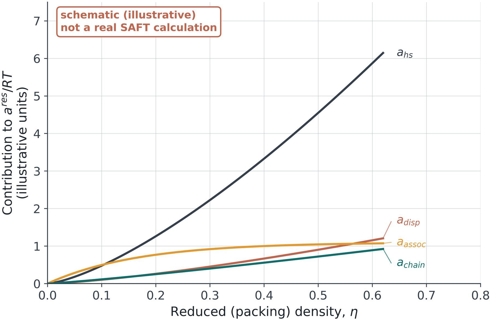{.fig-pair}
:::::

::::: {.column width="50%"}
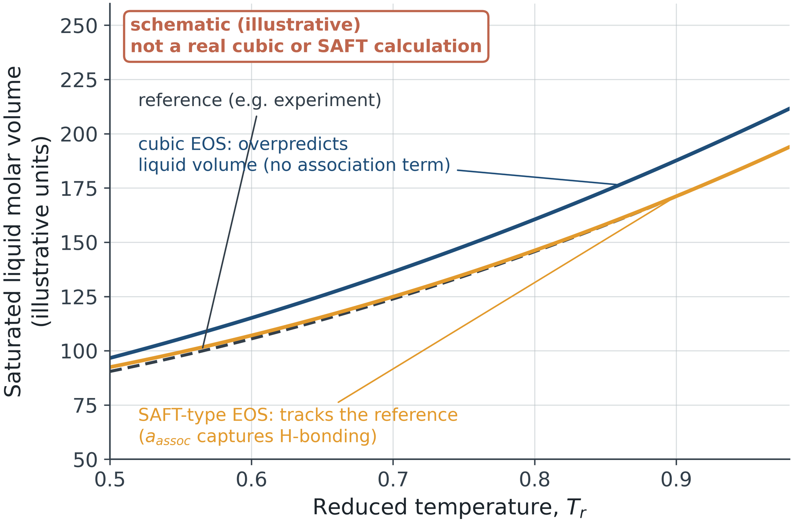{.fig-pair}
:::::
::::::

::: {.source}
Both panels are schematic illustrations of the qualitative behaviour, not output from a validated SAFT implementation.
:::

::: {.notes}
**TEACHING TIP**
Both figures are labelled illustrative because they are not produced by a real SAFT implementation. Say so explicitly to the class; it is a useful lesson in reading figures critically, and the qualitative statements they make are nonetheless correct.

**COMMON MISCONCEPTION**
Students conclude that SAFT should replace cubics everywhere. For a light hydrocarbon flash a cubic is faster, equally accurate and better parameterised. SAFT earns its cost on polymers, associating fluids and mixtures far from ideality.

**ASK THE CLASS**
Name a stream in your own research or workplace for which you would pay the SAFT computational cost, and one for which you would not.
:::

## Ions change the range of the forces

::: {.kicker .c-amber}
Chapter 12 · Electrolyte equations of state
:::

::: {.lede}
Recognise that Coulomb interactions are long ranged and require terms with no counterpart in a neutral-fluid model.
:::

:::::: {.columns}
::::: {.column width="54%"}
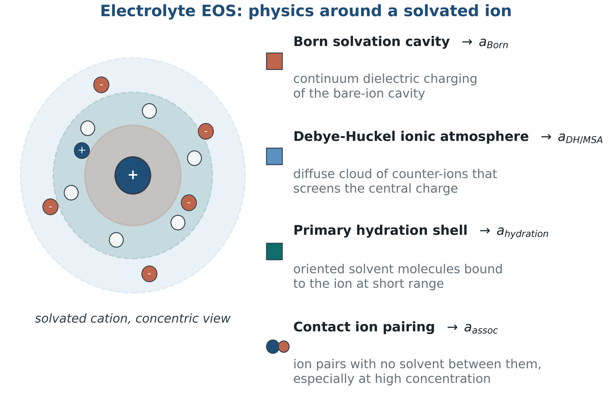{.fig-col}

::: {.source}
The Debye screening length sets the range over which an ion feels the surrounding ionic atmosphere.
:::
:::::

::::: {.column width="46%"}
::: {.eq-long}
$$
\kappa^{-1} = \left(\frac{\varepsilon_{\mathrm{r}}\varepsilon_{0}k_{\mathrm{B}}T}{e^{2}\sum_i \rho_i z_i^{2}}\right)^{\!1/2}
$$
:::
:::::
::::::

::: {.notes}
**TEACHING TIP**
Contrast the ranges numerically. Dispersion falls off as the inverse sixth power of separation and is negligible beyond about one nanometre. The Coulomb interaction falls off as the inverse first power, so in a dilute solution an ion interacts with thousands of others simultaneously. No perturbation about a short-range reference can capture that.

**COMMON MISCONCEPTION**
Students expect an electrolyte model to be a neutral model with an extra fitted parameter. The long-range term is structurally different and must be derived from the Poisson-Boltzmann equation or from the mean spherical approximation.

**ASK THE CLASS**
The Debye length in a one molar aqueous solution is under one nanometre. What does that imply about the applicability of the Debye-Huckel limiting law in a battery electrolyte?
:::

## The electrolyte Helmholtz sum

::: {.kicker .c-amber}
Chapter 12 · Electrolyte equations of state
:::

::: {.lede}
Add the electrostatic and solvation contributions to a molecular reference and identify what each one describes.
:::

::: {.eq-long}
$$
\tilde a^{\mathrm{res}} = \tilde a^{\mathrm{SAFT}} + \tilde a^{\mathrm{Born}} + \tilde a^{\mathrm{DH/MSA}}
$$
:::

::: {.eq-long}
$$
A^{\mathrm{Born}} = -\frac{N_{\mathrm{A}}e^{2}}{8\pi\varepsilon_{0}}\sum_i x_i z_i^{2}\left(1-\frac{1}{\varepsilon_{\mathrm{r}}}\right)\frac{1}{r_i}
$$
:::

$$
\log_{10}\gamma_{\pm} = -A\,|z_{+}z_{-}|\sqrt{I}
$$

:::: {.cards .quad}
::: {.card}

[Molecular reference]{.card-h}

Hard sphere, chain, dispersion and association terms describing the solvent and the uncharged part of the interactions, taken directly from SAFT.

:::

::: {.card}

[Born solvation]{.card-h .c-amber}

The free energy of charging an ion inside a dielectric medium. Usually the largest single contribution, and strongly dependent on the ionic radius.

:::

::: {.card}

[Ion-ion screening]{.card-h .c-amber}

Debye-Huckel or the mean spherical approximation, describing the ionic atmosphere that screens each central charge.

:::

::: {.card}

The Debye-Huckel expression is a limiting law, exact only as the ionic strength approaches zero. Battery and capture solvents operate one to three orders of magnitude above that limit, where ion pairing, hydration and the composition dependence of the dielectric constant all matter.

:::
::::

::: {.notes}
**TEACHING TIP**
This slide is the direct payoff of the modular construction introduced in Chapter 11. Because the Helmholtz energy is additive, electrostatics can be added to an existing SAFT model without rederiving anything. That is exactly what ePC-SAFT does.

**COMMON MISCONCEPTION**
That the Born term is a solvation correction of secondary importance. It is typically the largest single contribution to the free energy of an ion in solution, of the order of hundreds of kilojoules per mole.

**ASK THE CLASS**
Which of these three terms would you expect to dominate at 0.001 molar, and which at 5 molar?
:::

## Concentrated solutions and the activity minimum

::: {.kicker .c-amber}
Chapter 12 · Electrolyte equations of state
:::

::: {.lede}
Explain the minimum and upturn in the mean ionic activity coefficient in terms of competing physics.
:::

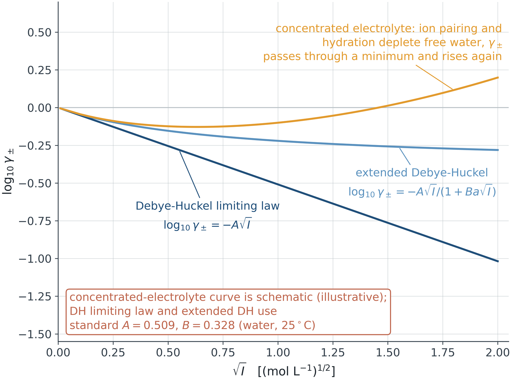{.fig-lg width="66%"}

:::: {.cards}
::: {.card}

[Physical meaning]{.card-h .c-amber}

Screening lowers the activity coefficient. Solvent depletion and hydrated-ion repulsion raise it. The minimum is where the two mechanisms balance.

:::

::: {.card}

[Engineering implication]{.card-h .c-teal}

Salt solubility limits, low-temperature precipitation in battery electrolytes and amine degradation in capture solvents all depend on the region beyond the minimum.

:::
::::

::: {.notes}
**TEACHING TIP**
The upturn is the whole story of this chapter. Electrostatic screening alone predicts a monotonic decrease. The observed rise at high concentration comes from the depletion of free solvent as it is bound into hydration shells, and from short-range repulsion between hydrated ions. A purely electrostatic model cannot produce it at any level of parameterisation.

**COMMON MISCONCEPTION**
Students believe more parameters in a Debye-Huckel-type expression would capture the upturn. They cannot, because the missing physics is solvation and excluded volume, not electrostatics.

**ASK THE CLASS**
In a five molar aqueous salt solution, roughly what fraction of the water is in a primary hydration shell? What does that do to the activity of the solvent?
:::

## Application: battery electrolytes

::: {.kicker .c-amber}
Chapter 12 · Electrolyte equations of state
:::

::: {.lede}
Map electrolyte thermodynamic outputs onto the design targets of an electrochemical cell.
:::

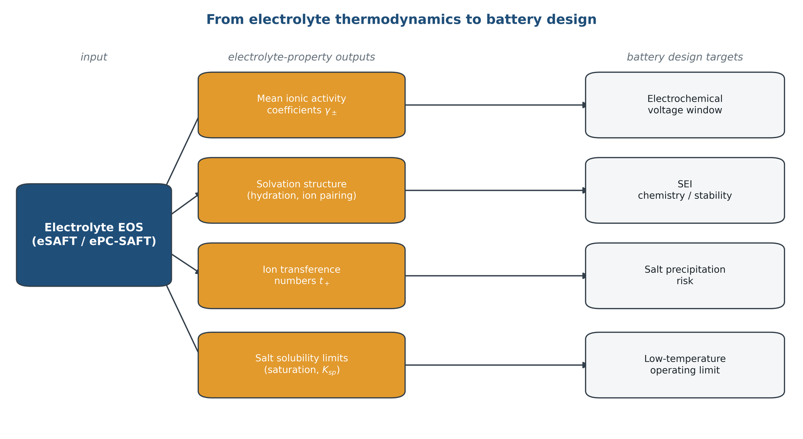{.fig-lg width="66%"}

:::: {.cards}
::: {.card}

[Physical meaning]{.card-h .c-amber}

The solvation shell is the physical object that connects thermodynamics, transport and interfacial chemistry in a cell. An equation of state that resolves it describes all three consistently.

:::

::: {.card}

[Engineering implication]{.card-h .c-teal}

Voltage window, solid-electrolyte-interphase chemistry, salt precipitation risk and low-temperature operating limit are all set by properties an electrolyte equation of state can compute.

:::
::::

::: {.notes}
**TEACHING TIP**
Connect this to the students' own work. Battery electrolytes routinely operate at one molar and above, and water-in-salt and localised high-concentration formulations run far beyond that, where almost every solvent molecule is coordinated to an ion. The dilute-solution intuitions taught in undergraduate physical chemistry are simply not applicable.

**COMMON MISCONCEPTION**
That transport and thermodynamics are separate problems. Activity coefficients enter the driving force for transport, so a thermodynamic error propagates directly into a predicted transference number and into the interpretation of an impedance spectrum.

**ASK THE CLASS**
If your model underestimates the activity coefficient of the salt by twenty per cent, which measured cell quantity would reveal the error first?
:::

## Where the subject is going

::: {.kicker .c-amber}
Chapter 13 · Future directions
:::

::: {.lede}
Identify the four active research directions and the specific limitation each one addresses.
:::

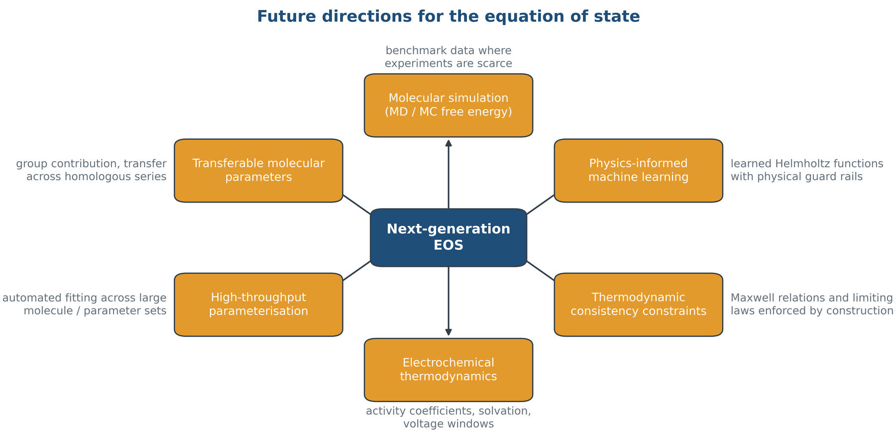{.fig-lg width="66%"}

:::: {.cards}
::: {.card}

[Physical meaning]{.card-h .c-amber}

Each direction targets a specific gap: missing data, rigid functional form, unenforced thermodynamic consistency, or unmodelled electrochemical coupling.

:::

::: {.card}

[Engineering implication]{.card-h .c-teal}

The practical near-term gain is parameter estimation for compounds that have never been measured, which is the binding constraint in specialty chemicals and in new battery chemistries.

:::
::::

::: {.notes}
**TEACHING TIP**
Frame each direction as a response to a limitation named earlier in the course. Molecular simulation supplies reference data where experiments do not exist. Machine learning addresses functional-form rigidity. Consistency constraints address the fact that a flexible model can violate thermodynamics. Electrochemical thermodynamics addresses the coupling ignored in Chapter 12.

**COMMON MISCONCEPTION**
Students assume machine learning will replace physical models. The productive architectures learn the residual Helmholtz energy subject to physical constraints, which is a physical model with a flexible functional form, not a replacement for physics.

**ASK THE CLASS**
Which of these four directions is most relevant to your own thesis, and what limitation of the models you currently use would it remove?
:::

## Physics-informed machine learning equations of state

::: {.kicker .c-amber}
Chapter 13 · Future directions
:::

::: {.lede}
Describe an architecture that learns a Helmholtz function under hard thermodynamic constraints.
:::

:::::: {.columns}
::::: {.column width="54%"}
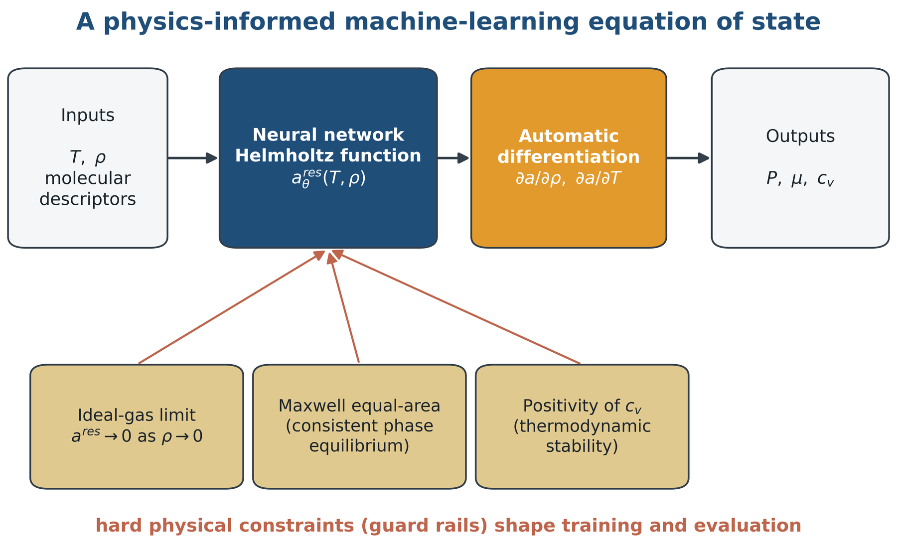{.fig-col}
:::::

::::: {.column width="46%"}
::: {.eq-long}
$$
A^{\mathrm{res}}_{\theta}(T,\rho,\mathbf{d}) \;\longrightarrow\; P,\;\mu_i,\;c_v \;\; \text{by automatic differentiation}
$$
:::

$$
\lim_{\rho\to 0}A^{\mathrm{res}} = 0, \qquad c_v > 0, \qquad \oint V\,\mathrm{d}P = 0
$$

:::: {.cards}
::: {.card}

The honest failure mode is extrapolation. Inside the training envelope such models are accurate; outside it they remain confident and are not. Any deployment must include an explicit domain-of-validity check.

:::
::::
:::::
::::::

::: {.notes}
**TEACHING TIP**
The essential design choice is that the network outputs a scalar free energy and every property is obtained by differentiation. This guarantees that the predicted properties are mutually consistent, which a network that predicts pressure, enthalpy and fugacity independently cannot guarantee.

**COMMON MISCONCEPTION**
Students expect the failure mode to be poor accuracy. Accuracy inside the training envelope is usually excellent. The failure mode is confident, unflagged extrapolation outside it, which is far more dangerous in a design calculation.

**ASK THE CLASS**
How would you detect that such a model is extrapolating, and what should a process simulator do when it is?
:::

## Closing the argument

::: {.kicker .c-amber}
Conclusion
:::

::: {.lede}
Restate the thesis of the course and convert it into a working rule for model selection.
:::

:::::: {.columns}
::::: {.column width="54%"}
{.fig-col}
:::::

::::: {.column width="46%"}
:::: {.cards}
::: {.card}

[The rule to take away]{.card-h .c-amber}

Do not ask whether an equation of state is accurate. Ask which physics it contains, and whether that physics is the physics of your problem. Every model in this course answers that question honestly if you know how to read it.

:::
::::
:::::
::::::

::: {.notes}
**TEACHING TIP**
Return to the first slide deliberately and read the thesis again. Then give the students the operational form: the question is never whether a model is accurate in the abstract, but whether the physics it contains is the physics of their problem.

**COMMON MISCONCEPTION**
Students leave believing they should always use the most sophisticated model available. The correct rule is to use the simplest model that contains the physics of the problem, because every additional term costs parameters, computation and robustness.

**ASK THE CLASS**
Take a system from your own research. Which rung of this ladder does it require, and can you defend that choice on physical grounds rather than on habit?
:::

## References and further reading

::: {.kicker .c-amber}
Conclusion
:::

::: {.lede}
Locate the primary sources and the standard graduate texts for each part of the course.
:::

:::: {.cards}
::: {.card}

[Graduate texts]{.card-h}

Smith, Van Ness, Abbott and Swihart, Introduction to Chemical Engineering Thermodynamics, 9th edition, 2022.

Prausnitz, Lichtenthaler and de Azevedo, Molecular Thermodynamics of Fluid-Phase Equilibria, 3rd edition, 1999.

Poling, Prausnitz and O'Connell, The Properties of Gases and Liquids, 5th edition, 2001.

Sandler, Chemical, Biochemical, and Engineering Thermodynamics, 5th edition, 2017.

Kontogeorgis and Folas, Thermodynamic Models for Industrial Applications, 2010.

:::

::: {.card}

[Primary literature]{.card-h}

van der Waals, doctoral thesis, Leiden, 1873.

Redlich and Kwong, Chemical Reviews 44 (1949) 233.

Pitzer and co-workers, Journal of the American Chemical Society 77 (1955) 3427 and 3433.

Soave, Chemical Engineering Science 27 (1972) 1197.

Peng and Robinson, Industrial and Engineering Chemistry Fundamentals 15 (1976) 59.

Wertheim, Journal of Statistical Physics 35 (1984) 19 and 35; 42 (1986) 459 and 477.

Chapman, Gubbins, Jackson and Radosz, Industrial and Engineering Chemistry Research 29 (1990) 1709.

Gross and Sadowski, Industrial and Engineering Chemistry Research 40 (2001) 1244.

:::
::::

::: {.notes}
**TEACHING TIP**
Direct students to the primary papers, not only the textbooks. Soave 1972 and Peng and Robinson 1976 are each about five pages long and are entirely readable by a graduate student. Reading them is the fastest way to understand how modest and how well argued each contribution was.

**COMMON MISCONCEPTION**
That the original papers are too difficult to read. The cubic-equation papers in particular are short, concrete and far clearer than most textbook accounts of them.

**ASK THE CLASS**
Read Peng and Robinson 1976 before the next session and identify, in their own words, the single defect of Soave they set out to repair.
:::

## Where to go next {.tint background-color="#F3F0EB"}

::: {.kicker .c-amber}
Module EOS · closing
:::

:::: {.cards}
::: {.card}

[Read]{.card-h .c-teal}

The lecture notes carry the full derivations behind every slide. The worked examples work four problems end to end, with the arithmetic shown.

:::

::: {.card}

[Run]{.card-h .c-amber}

Every figure in this deck is generated by a Python script you can download and edit. Change a parameter, re-run, and watch what the physics does.

:::

::: {.card}

[Ask]{.card-h .c-rust}

Bring one fluid from your own research to the next session, and be ready to say which rung of the ladder it needs.

:::
::::
