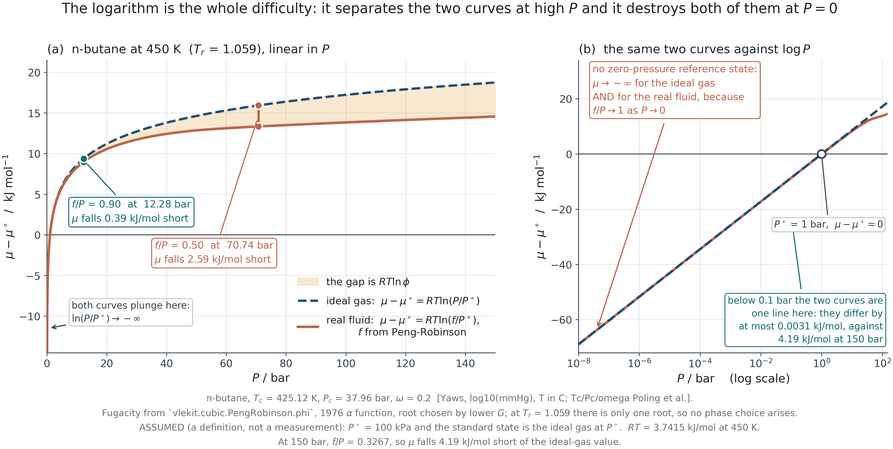
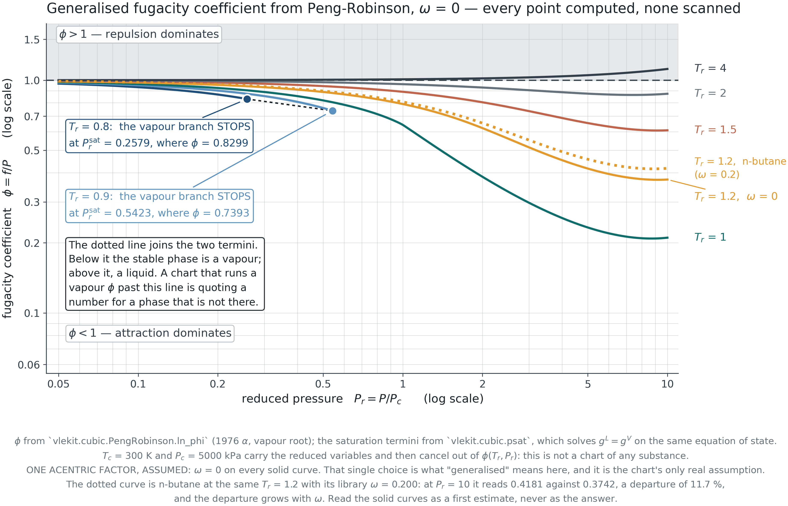
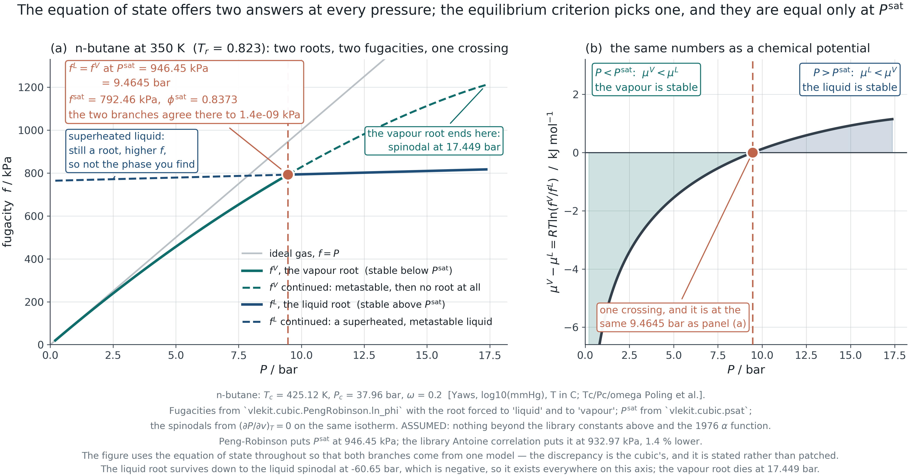
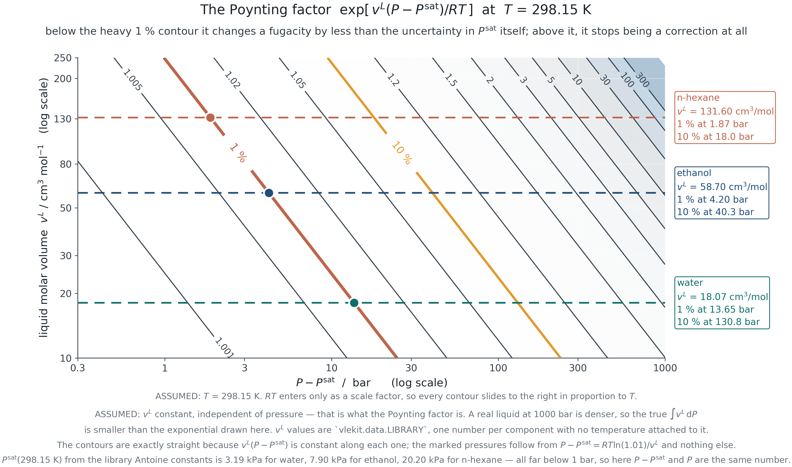
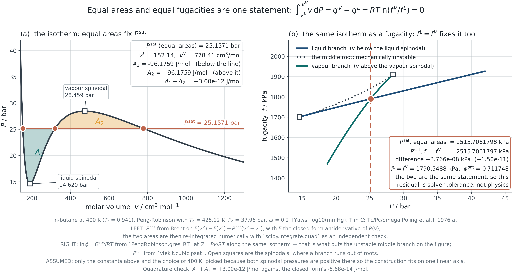

## &nbsp; {.dark .mid background-color="#1C242B"}

:::: {.vcenter}
::: {.statement}
Fugacity is not corrected pressure.
:::

::: {.statement-hi}
It is the quantity constructed so that the ideal-gas equation stays valid for a real fluid.
:::
::::

::: {.notes}
**TEACHING TIP**
Say this before the definition, not after. Students meet fugacity as a symbol
with a strange name and spend the rest of the course treating it as a fudge
factor. Framed as a *construction with a purpose*, the definition stops looking
arbitrary and starts looking inevitable.

**ASK THE CLASS**
What would you have to invent, if you wanted `μ = μ° + RT ln(something)` to
keep working for a real fluid?
:::

## What this module establishes

::: {.kicker .c-amber}
Introduction
:::

::: {.lede}
Chemical potential is the true driving force, it is unusable in raw form, and
fugacity is what makes it usable. Then a result you were handed in Module 1 is
proved.
:::

:::::: {.columns}
::::: {.column width="48%"}
:::: {.cards}
::: {.card}

[The callback]{.card-h .c-teal}

Module 1 presented the Maxwell equal-area construction as a geometric recipe
and asked you to accept it.

This module ends by deriving it from equality of fugacity. You were owed that
proof.

:::
::::
:::::

::::: {.column width="48%"}
:::: {.cards}
::: {.card}

[Four questions]{.card-h .c-amber}

- Why is pressure not the driving force?
- How do you get $\varphi$ out of an equation of state?
- What is the fugacity of a liquid?
- What follows from $f^{\,L} = f^{\,V}$?

:::
::::
:::::
::::::

::: {.notes}
**TEACHING TIP**
Flag the ending at the beginning. Knowing that the module closes by proving
something they were told to take on faith gives students a reason to follow the
middle.
:::

## Why pressure is not the driving force {.dark .divider .c-teal background-color="#1C242B"}

::: {.kicker .c-amber}
PART I
:::

::: {.lede}
Section 2.1&nbsp;&nbsp;&nbsp;Three equalities at equilibrium, and the one that does the work.
:::

## Three equalities

::: {.kicker .c-amber}
2.1 · Why pressure is not the driving force
:::

::: {.lede}
Two of them are familiar. The third is the one this course is about.
:::

$$T^{\,\alpha} = T^{\,\beta}
\qquad\qquad
P^{\,\alpha} = P^{\,\beta}
\qquad\qquad
\mu_i^{\,\alpha} = \mu_i^{\,\beta}$$

:::::: {.cards .g3}
::: {.card}

[Thermal]{.card-h .c-teal}

Equal temperature. Otherwise heat flows, and the state is not equilibrium.

:::

::: {.card}

[Mechanical]{.card-h .c-amber}

Equal pressure — for a flat interface. Otherwise the interface accelerates.
**This holds for a real fluid exactly as it does for an ideal one.**

:::

::: {.card}

[Chemical]{.card-h .c-rust}

Equal chemical potential. Otherwise matter flows from high $\mu$ to low $\mu$,
and that is the transfer every separation process exists to control.

:::
::::::

::: {.note}
Read the middle card again. Nothing in this module says the pressure is unequal
in a real fluid. What is lost is the simple *link* between pressure and
chemical potential — not the mechanical equality itself.
:::

::: {.notes}
**COMMON MISCONCEPTION — address it here, not later**
Students conclude from "pressure is not the driving force" that pressure must
be unequal between phases. It is equal. The driving force for *matter transfer*
is $\mu$; the driving force for *mechanical* motion is $P$. Two different
questions, two different potentials.

**ASK THE CLASS**
Which of the three equalities is violated in a system that is separating?
:::

## The ideal gas is a special case

::: {.kicker .c-amber}
2.1 · Why pressure is not the driving force
:::

::: {.lede}
For an ideal gas, pressure measures the chemical driving force directly. That
is why it feels like a driving force — and why the feeling misleads.
:::

$$\left(\frac{\partial \mu}{\partial P}\right)_T = v = \frac{RT}{P}
\qquad\Longrightarrow\qquad
{\rm d}\mu = RT\,{\rm d}\ln P$$

$$\mu = \mu^\circ + RT\ln\frac{P}{P^\circ}$$

:::: {.cards}
::: {.card}

[Why it fails]{.card-h .c-rust}

For a real fluid $v \ne RT/P$, so ${\rm d}\mu = v\,{\rm d}P$ no longer collapses
to a logarithm in $P$. The relation between the measurable quantity and the
driving force is broken.

:::

::: {.card}

[And a second problem]{.card-h .c-amber}

$\mu \to -\infty$ as $P \to 0$, for **every** fluid, ideal or not. A
zero-pressure reference state is therefore impossible — which is why the
definition on the next slide is written as a *ratio* from the start.

:::
::::

::: {.notes}
**TEACHING TIP**
The divergence is worth dwelling on. It is not a mathematical inconvenience: an
infinitely dilute gas really does have an unboundedly negative chemical
potential, because there is unbounded entropy available in expanding into
nothing.

**ASK THE CLASS**
If $\mu$ diverges at $P = 0$, where can a reference state possibly go?
:::

## Both curves diverge

::: {.kicker .c-amber}
2.1 · Why pressure is not the driving force
:::

{.fig-xl}

::: {.source}
F2.1 · Ideal and real chemical potential on one axis. Both fall without bound as $P \to 0$; they separate at high pressure.
:::

::: {.notes}
**TEACHING TIP**
Two readings. Near zero pressure the curves are indistinguishable and both
diverge — the real fluid becomes ideal, and neither has a usable reference
there. At high pressure they separate, and the separation is exactly
$RT\ln(f/P)$.

**ASK THE CLASS**
At what pressure does the ideal-gas answer stop being good enough for your
purpose? Notice that the question has no answer until you say what your purpose
is.
:::

## The definition

::: {.kicker .c-amber}
2.1 · Why pressure is not the driving force
:::

::: {.lede}
Define the quantity that keeps the logarithmic form true. Everything else
follows.
:::

$${\rm d}\mu \equiv RT\,{\rm d}\ln f
\qquad\text{with}\qquad
\frac{f}{P} \to 1 \ \ \text{as} \ \ P \to 0
\qquad\Longrightarrow\qquad
\mu = \mu^\circ + RT\ln\frac{f}{f^\circ}$$

:::::: {.cards .g3}
::: {.card}

[What it is]{.card-h .c-teal}

A *definition*, not a derivation. $f$ is whatever it has to be for the middle
equation to hold. The second condition fixes the arbitrary constant by anchoring
$f$ to $P$ in the limit where they must agree.

:::

::: {.card}

[Always a ratio]{.card-h .c-amber}

Write $\mu - \mu^\circ = RT\ln(f/f^\circ)$ from the first slide and never write
anything else. Absolute $\mu$ and absolute $f$ are not measurable; only ratios
against a stated reference are.

:::

::: {.card}

[The trap ahead]{.card-h .c-rust}

The reference state $f^\circ$ is what students get wrong in Modules 3, 4 and 6 —
Lewis-Randall against Henry, gas against liquid against solute. Fix the habit of
naming it now.

:::
::::::

::: {.notes}
**TEACHING TIP**
Insist on the ratio form. Every reference-state confusion later in the course
traces back to someone having written $\mu = RT \ln f$ without a reference and
then forgotten which one they meant.

**COMMON MISCONCEPTION**
That fugacity has a deep physical meaning of its own. It does not. It is a
constructed quantity with units of pressure, and its meaning is entirely in the
equation it was built to satisfy.
:::

## The fugacity coefficient {.dark .divider .c-teal background-color="#1C242B"}

::: {.kicker .c-amber}
PART II
:::

::: {.lede}
Section 2.2&nbsp;&nbsp;&nbsp;Where the equation of state finally does something other than plot an isotherm.
:::

## From the equation of state

::: {.kicker .c-amber}
2.2 · The fugacity coefficient from an equation of state
:::

::: {.lede}
$\varphi = f/P$, and it comes out of the same residual property integral you
already met.
:::

$$\ln\varphi = \int_0^P (Z-1)\,\frac{{\rm d}P}{P}
\qquad\qquad
\ln\varphi = \frac{1}{RT}\int_\infty^{V}\!\left[\frac{RT}{V} - P\right]{\rm d}V
 - \ln Z + (Z - 1)$$

:::: {.cards}
::: {.card}

[Which form, and why]{.card-h .c-amber}

The left form needs $Z$ as a function of $P$. A cubic equation of state is
**pressure-explicit** — it gives $P(V)$, not $V(P)$ — so evaluating it would
mean solving the cubic at every integration point.

The right form integrates over volume instead, and a cubic can be integrated
analytically. That is why every implementation uses it.

:::

::: {.card}

[The connection back]{.card-h .c-teal}

This is the same integral that produced the residual enthalpy and entropy in
Module 1. Nothing new has been introduced — the departure-function machinery is
being asked a different question.

:::
::::

::: {.notes}
**TEACHING TIP**
Show the Module 1 slide again. The point of this module is that the equation of
state was not built to draw isotherms; it was built to produce this.
:::

## Peng-Robinson in closed form

::: {.kicker .c-amber}
2.2 · The fugacity coefficient from an equation of state
:::

::: {.lede}
Derive it rather than quote it. The integral is elementary and the result is
used in every remaining module.
:::

$$\ln\varphi = Z - 1 - \ln(Z - B)
 - \frac{A}{2\sqrt2\,B}\,
   \ln\!\left[\frac{Z + (1+\sqrt2)B}{Z + (1-\sqrt2)B}\right]$$

$$A = \frac{aP}{R^2T^2}, \qquad B = \frac{bP}{RT}$$

:::: {.cards}
::: {.card}

[Where each term comes from]{.card-h .c-teal}

$Z - 1 - \ln(Z-B)$ is the repulsive part — the excluded volume. The logarithm
with the $\sqrt2$ is the attractive part, and the $\sqrt2$ is there only because
Peng-Robinson put $b$ in two places in the denominator.

:::

::: {.card}

[The root question]{.card-h .c-rust}

Below the critical temperature the cubic has three roots. The largest is the
vapour, the smallest the liquid, and the middle one is mechanically unstable and
meaningless. Choosing between the two outer roots by the lower $\varphi$ —
equivalently the lower Gibbs energy — is how a code decides which phase it is
looking at.

:::
::::

::: {.notes}
**TEACHING TIP**
Do the integration on the board. It takes four lines and a partial-fraction
split, and it is the only place in the course where students see the equation of
state integrated rather than evaluated.

**ASK THE CLASS**
Which of the two outer roots would you pick, and by what criterion?
:::

## The whole pressure range at once

::: {.kicker .c-amber}
2.2 · The fugacity coefficient from an equation of state
:::

{.fig-xl}

::: {.source}
F2.2 · Generalised chart computed from Peng-Robinson at $\omega = 0$, not scanned from a textbook. The subcritical curves stop at saturation.
:::

::: {.notes}
**TEACHING TIP**
Three readings. $\varphi \to 1$ at low pressure on every isotherm — that is the
definition asserting itself. $\varphi < 1$ where attraction dominates, which
maps exactly onto $Z < 1$ from Module 1. And the subcritical curves *stop*: a
chart that continues a vapour $\varphi$ into the liquid region without saying so
is drawing a fluid that is not there.

**COMMON MISCONCEPTION**
That a generalised chart is a property of nature. It is a property of a model at
one acentric factor. For n-butane at $T_r = 1.2$ and $P_r = 10$ the $\omega = 0$
chart is 12 % out.
:::

## The fugacity of a liquid {.dark .divider .c-teal background-color="#1C242B"}

::: {.kicker .c-amber}
PART III
:::

::: {.lede}
Section 2.3&nbsp;&nbsp;&nbsp;Anchor it at saturation, then carry it to any pressure.
:::

## At saturation, and away from it

::: {.kicker .c-amber}
2.3 · Fugacity of a liquid
:::

::: {.lede}
The liquid has no low-pressure limit to be anchored to, so it is anchored to the
vapour it is in equilibrium with.
:::

$$f^{\,L}(T, P^{\rm sat}) = f^{\,V}(T, P^{\rm sat}) = \varphi^{\rm sat}P^{\rm sat}$$

$$f^{\,L}(T,P) = \varphi^{\rm sat}P^{\rm sat}\,
\underbrace{\exp\!\left[\frac{v^{\,L}(P - P^{\rm sat})}{RT}\right]}_{\text{Poynting factor}}$$

:::: {.cards}
::: {.card}

[Why this works]{.card-h .c-teal}

The liquid is nearly incompressible, so $v^{\,L}$ can be taken outside the
integral $\int v\,{\rm d}P$. Everything hard about the liquid has been pushed
into $P^{\rm sat}$ and $\varphi^{\rm sat}$, both of which are properties of the
saturated state and both of which are measurable.

:::

::: {.card}

[The hypothetical liquid]{.card-h .c-rust}

Above the critical temperature there is no $P^{\rm sat}$ and no liquid to
anchor to. The reference becomes a *hypothetical* subcooled or superheated
liquid, and the resulting arbitrariness reappears in Module 4 as the
Lewis-Randall reference for a component that cannot exist pure at those
conditions.

:::
::::

::: {.notes}
**TEACHING TIP**
Name the structure: a hard quantity has been rewritten as an easy quantity times
a correction. That pattern recurs in every remaining module.
:::

## Fugacity across the saturation line

::: {.kicker .c-amber}
2.3 · Fugacity of a liquid
:::

{.fig-xl}

::: {.source}
F2.3 · The two branches meet at $P^{\rm sat}$. The dashed continuations are the metastable and unstable extensions of each.
:::

::: {.notes}
**TEACHING TIP**
The crossing is the whole of phase equilibrium for a pure substance, in one
point. Below it the vapour has the lower fugacity and is stable; above it the
liquid does. The dashed extensions are where the *other* phase would sit, and
the fact that it sits higher is what "metastable" means.

**ASK THE CLASS**
Which branch is stable on each side of the crossing, and how do you know without
being told?
:::

## When the Poynting factor matters

::: {.kicker .c-amber}
2.3 · Fugacity of a liquid
:::

{.fig-lg width="74%"}

:::: {.cards}
::: {.card}

[Quantified, not asserted]{.card-h .c-amber}

"Usually negligible" is not a statement anyone can act on. At 298 K the
correction reaches one per cent at about 14 bar for water, 4 bar for ethanol
and under 2 bar for n-hexane — because the exponent scales with $v^{\,L}$, and
a bulky molecule has three times the molar volume of water.

:::

::: {.card}

[The rule that follows]{.card-h .c-teal}

Drop it deliberately, with the pressure and the molar volume in front of you,
and record that you dropped it. Never drop it because a textbook said it was
small for a system it was not describing.

:::
::::

::: {.source}
F2.4 · The one per cent contour, with three real liquids marked.
:::

::: {.notes}
**TEACHING TIP**
This is the module's first instance of a habit the whole course enforces: turn
"usually negligible" into a number and a boundary. The students will meet the
same demand for the vapour-phase correction in Module 4 and for the excess
enthalpy term in Module 5.
:::

## The criterion, and a proof {.dark .divider .c-teal background-color="#1C242B"}

::: {.kicker .c-amber}
PART IV
:::

::: {.lede}
Section 2.4&nbsp;&nbsp;&nbsp;One criterion, two classical results — and the answer to a question asked three weeks ago.
:::

## Equality of fugacity

::: {.kicker .c-amber}
2.4 · The equilibrium criterion, and a proof
:::

::: {.lede}
Equal chemical potential becomes equal fugacity the moment the definition is
substituted.
:::

$$\mu^{\,L} = \mu^{\,V}
\quad\text{and}\quad
\mu = \mu^\circ + RT\ln\frac{f}{f^\circ}
\qquad\Longrightarrow\qquad
\boxed{f^{\,L} = f^{\,V}}$$

:::: {.cards}
::: {.card}

[Why this is the useful form]{.card-h .c-teal}

$\mu$ is not measurable and not computable without a reference. $f$ has the units
of pressure, tends to $P$ in a limit everyone agrees on, and comes out of an
equation of state in closed form. The criterion has been made *arithmetic*.

:::

::: {.card}

[How a simulator uses it]{.card-h .c-amber}

Locating $P^{\rm sat}$ is a one-dimensional root find on
$\ln f^{\,L} - \ln f^{\,V} = 0$, with both fugacities from the same cubic. That
is exactly what `cubic.psat` in the course toolkit does, and exactly what a
commercial package does.

:::
::::

::: {.notes}
**TEACHING TIP**
This slide is the hinge of the module: an unmeasurable equality has been turned
into a root find. Say that out loud.
:::

## The equal-area construction, proved

::: {.kicker .c-amber}
2.4 · The equilibrium criterion, and a proof
:::

{.fig-xl}

::: {.source}
F2.5 · The Module 1 construction and the fugacity criterion, on the same isotherm. Agreement: $4\times10^{-8}$ kPa out of 2515.7.
:::

::: {.notes}
**TEACHING TIP — and an honesty point that matters**
Present this as the answer to a question asked three weeks earlier. Students
remember being told to accept the construction.

But say precisely what the agreement is and is not. Along an isotherm
$RT\,{\rm d}\ln f = v\,{\rm d}P$, so
$RT\ln(f^{\,V}/f^{\,L}) = \int v\,{\rm d}P$ between the two saturated states,
and setting that to zero *is* the equal-area statement. The two are **the same
equation**, and the module's job is to show that. The numerical agreement is
therefore a check that both implementations are correct — not independent
physical evidence for either. Claiming more than that would be exactly the kind
of overreach this course spends six modules teaching students to avoid.

**ASK THE CLASS**
Why must the two areas be equal, in one sentence, without using the word "area"?
:::

## The Clapeyron equation, from the same place

::: {.kicker .c-amber}
2.4 · The equilibrium criterion, and a proof
:::

::: {.lede}
One criterion, differentiated along the saturation line, gives the second
classical result.
:::

$$f^{\,L}(T, P^{\rm sat}) = f^{\,V}(T, P^{\rm sat}) \ \text{ for all } T
\qquad\Longrightarrow\qquad
\frac{{\rm d}P^{\rm sat}}{{\rm d}T} = \frac{\Delta h^{\rm vap}}{T\,\Delta v^{\rm vap}}$$

:::: {.cards}
::: {.card}

[The step]{.card-h .c-teal}

Differentiate the equality along the coexistence curve. The Gibbs energies stay
equal, so ${\rm d}g^{\,L} = {\rm d}g^{\,V}$, and with
${\rm d}g = -s\,{\rm d}T + v\,{\rm d}P$ the result falls out in two lines.

:::

::: {.card}

[Why it matters here]{.card-h .c-amber}

Two results that arrive in most courses as separate facts — an equal-area
recipe and a slope formula — are consequences of one statement. That is what it
means for a subject to have a structure rather than a syllabus.

:::
::::

::: {.notes}
**TEACHING TIP**
Do the two lines. Then point back at the previous slide: same criterion, one
differentiated and one integrated.
:::

## Where this goes next

::: {.kicker .c-amber}
2.5 · Where this goes next
:::

::: {.lede}
Everything so far has been a pure substance. Mixtures need one more idea, and it
arrives in Module 3.
:::

:::: {.cards}
::: {.card}

[The preview]{.card-h .c-teal}

In a mixture each species has its own fugacity in the mixture, $\hat f_i$, and
its own coefficient $\hat\varphi_i = \hat f_i / (y_i P)$. The equilibrium
criterion becomes $\hat f_i^{\,L} = \hat f_i^{\,V}$ for **every** species.

:::

::: {.card}

[What is missing]{.card-h .c-amber}

$\hat f_i$ is a *partial molar* quantity — a composition derivative — and the
machinery for those is Module 3. Until then the symbol is a promise, not a
definition.

:::
::::

::: {.note}
The spine: an equation of state gives $P$-$V$-$T$ → **fugacity gives chemical
potential a usable form** → an equation of state lets you compute fugacity →
equality of fugacity predicts phase equilibrium. You are at the second step.
:::

::: {.notes}
**TEACHING TIP**
Put the spine sentence on the board and mark the current position. It is the
same sentence at the end of every module in this course, with a different word
in bold.
:::

## What you must be able to do

::: {.kicker .c-amber}
Closing
:::

::: {.lede}
The module in six statements.
:::

:::: {.numbered .n3 .two-col}
1. **Name the three equalities** and say which one drives mass transfer — and that pressure is still equal in a real fluid.
2. **Say why fugacity was invented.** To keep the ideal-gas logarithmic form valid, and because $\mu$ diverges at zero pressure.
3. **Get $\varphi$ from an equation of state.** Including why the volume-explicit form is the one a cubic can use.
4. **Compute the fugacity of a liquid** from $P^{\rm sat}$, $\varphi^{\rm sat}$ and Poynting — and say when the last term matters.
5. **Derive the equal-area construction and Clapeyron** from $f^{\,L} = f^{\,V}$, and say why they are the same statement rather than two.
6. **Always name the reference state.** Every fugacity is a ratio against something.
::::

::: {.notes}
**TEACHING TIP**
Return to the opening line. Fugacity is not corrected pressure — it is a
construction with a purpose, and by now the purpose has been used four times.
:::
