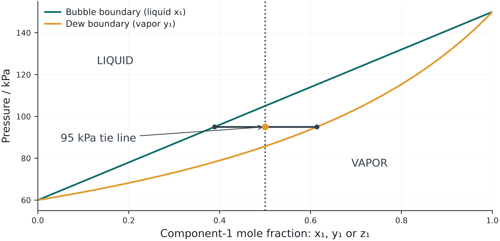

## The question for today

How does pressure change the phase split at fixed temperature?

[Before class: 3-page reading](files/preclass-week-01.pdf) · 15–20 minutes

Bring the three preparation answers. Revisit your prediction after one controlled comparison and an independent check.

## The 180-minute class

| Activity | Minutes |
|---|---:|
| Opening question and essential concepts | 30 |
| One hand calculation | 20 |
| One lab demonstration | 20 |
| Break | 10 |
| Student pair investigation | 70 |
| Discussion and exit question | 30 |

The 70-minute investigation is student work with instructor support.

## Read the phase diagram first

{width="68%"}

Predict the phase at 110 kPa before calculating.

## Boundaries and amounts answer different questions

$$P_{bubble}=\sum_i x_iP_i^{sat},\qquad \frac{1}{P_{dew}}=\sum_i\frac{y_i}{P_i^{sat}}$$
$$z_i=(1-\beta)x_i+\beta y_i,\qquad y_i=K_ix_i$$

The boundary equations assume ideal phases at fixed T. A TP flash supplies T, P and z, then finds compositions and amounts.

In a nonideal liquid, K depends on the unknown liquid composition.

## A reproducible ideal baseline

Lab 01 synthetic binary at 350 K: $P_1^{sat}=150$ kPa and $P_2^{sat}=60$ kPa. Choose ideal liquid, $z_1=0.5$, $P=95$ kPa.

| Quantity | Expected result |
|---|---:|
| Bubble P at x₁=0.5 | 105 kPa |
| Dew P at y₁=0.5 | 85.7143 kPa |
| Flash x₁, y₁ | 0.388889, 0.614035 |
| Vapor fraction β | 0.493506 |

The values are synthetic definitions, not real-fluid measurements.

## An independent check

Independently close both component balances and confirm that all phase compositions sum to one. Explain the phase state using bubble and dew pressures.

## One demonstration · 20 minutes

[Open the core lab](labs/#experiment)

Use the synthetic ideal mixture at T=350 K, P=95 kPa and z1=0.5. Save the baseline, then change only P to 110 kPa. Predict the phase before calculating.

Keep one saved baseline for the pair investigation.

## Pair investigation · 70 minutes

- 10 min: predict and record the baseline.
- 25 min: change one input and calculate.
- 20 min: exchange roles and check the result by hand.
- 15 min: prepare one plot or table and a short explanation.

In Lab 01, save one ideal two-phase baseline and one changed pressure at the same T and z. Predict the change, report phase amounts and check one component balance by hand.

## Discussion and exit question · 30 minutes

Use 20 minutes to compare results and discuss unexpected behavior.

How does pressure change the phase split at fixed temperature?

Use the final 10 minutes to explain your answer individually and name one assumption that limits it.

## Follow-up practice · 30–40 minutes

In Lab 01, save one ideal two-phase baseline and one changed pressure at the same T and z. Predict the change, report phase amounts and check one component balance by hand.

[Assessment 1 and independent checkpoint](labs/assessments.html#session-1)

Retain one study JSON, one comparison and a short explanation. Continue from your classroom case. The hand checkpoint is included. With pre-class reading, independent work totals 45–60 minutes.

## Optional study

Choose one extension: compare liquid activity models, examine zero versus nonzero virial coefficients in Lab 09, or add the energy balance in Lab 07.

[Session appendix](postmidterm-01-appendix.html) · [Module reference](vle.html)

[Learning path](labs/learning-path.html#session-1) · [Offline package](files/thermodynamics-offline.zip)

Optional work is additional. Complete the required investigation first.
