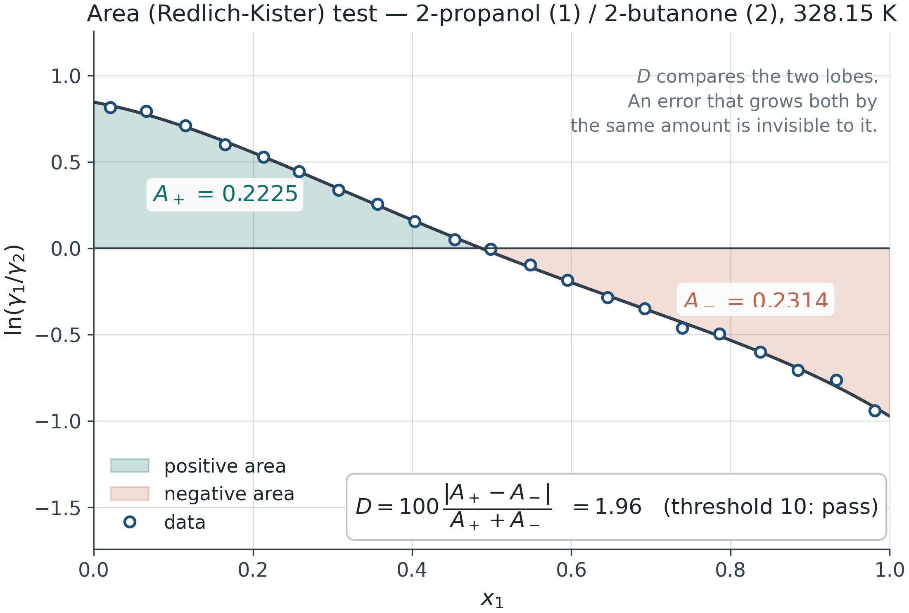

## Session outcome

Separate vapor-pressure inputs, consistency evidence and fitted-model error.

**Before class:** Bring T, P, x1, y1 data or use the explicitly synthetic example; obtain Antoine equation forms, units and validity ranges.

[Learning path and all labs](labs/learning-path.html#session-2)

::: {.notes}
This sequence uses the existing pre-midterm Modules 1–3 as prerequisites. Use questions to identify missing concepts rather than repeating the full reference decks.
:::

## The 180-minute class

| In class | Minutes |
|---|---:|
| Recall and prediction | 10 |
| Concepts and derivation | 45 |
| Worked example | 30 |
| Break | 10 |
| Instructor lab demonstration | 25 |
| Guided student exploration | 35 |
| Discussion and interpretation | 15 |
| Exit question and independent task | 10 |

::: {.notes}
Includes a 10-minute break. The 60 minutes of demonstration and guided work are part of the 180 minutes. If discussion runs long, move the optional extension to independent practice; do not remove the balance/interpretation check.
:::

## The measurement-to-model chain

Measured T, P, x and y → pure-component vapor pressures → inferred activity coefficients → consistency diagnostics → regression → prediction within a stated domain.

Each arrow adds assumptions. A fitted curve does not remove errors introduced earlier.

::: {.notes}
Recall Session 1 standards. Lab 08 uses ideal vapor; corrections assessed in Lab 09 are not silently applied to its regression.
:::

## Activities inferred from VLE

Under the ideal-vapor approximation with neglected Poynting correction,
$$\gamma_i=\frac{y_iP}{x_iP_i^{sat}(T)}$$

The absent component at a pure endpoint has no finite measured γ from this ratio. Small x or y amplifies measurement error.

::: {.notes}
Discuss both components, component ordering and pure-endpoint singularities. Do not substitute a fabricated endpoint activity.
:::

## Antoine inputs are part of the model

A common form is
$$\log_{10}P^{sat}=A-\frac{B}{T+C}$$

A, B and C belong to a specific equation, logarithm base, T unit and pressure unit. Lab 08 supports several forms; changing the selection does not convert constants.

Check Pˢᵃᵗ at one measured temperature and verify the source range.

::: {.notes}
Have a student explain why Kelvin constants cannot be pasted into a Celsius form merely because the same A/B/C symbols are used.
:::

## A vapor-pressure error becomes an activity error

Synthetic point: P=100 kPa, x₁=0.4, y₁=0.6 and P₁ˢᵃᵗ=120 kPa.

$$\gamma_1=\frac{0.6(100)}{0.4(120)}=1.25$$

Using 150 kPa instead yields γ₁=1.00. The measured mixture data did not change; the inferred liquid behavior did.

::: {.notes}
Use as a hand calculation. Ask whether a better fit could repair the incorrect property input without distorting fitted parameters.
:::

## Gibbs–Duhem constrains activities

At constant T and P for a binary liquid,
$$x_1\,d\ln\gamma_1+x_2\,d\ln\gamma_2=0$$

A VLE path may change P or T. Pressure/excess-volume and temperature/excess-enthalpy terms need appropriate treatment or an explicit approximation.

::: {.notes}
State constant-T/P condition carefully. Isothermal VLE often varies P, so neglecting excess volume is an assumption, not an exact identity for that data path.
:::

## Area cancellation is not a local test

{width="78%"}

::: {.notes}
Spend time interpreting sign cancellation rather than teaching a threshold as a universal verdict.
:::

## Different tests answer different questions

| Diagnostic | Evidence and limitation |
|---|---|
| Area | Global signed integral; endpoint coverage matters |
| Point/local | Local deviations; differentiation amplifies noise |
| Model-based | Deviations relative to the chosen model |
| Herington | Empirical temperature-range correction |

Agreement across tests strengthens a diagnosis but does not prove the data are correct.

::: {.notes}
Use Lab 03 labels as implemented. Explain why no vote-counting rule or single percentage threshold is scientifically universal.
:::

## Isobaric data need temperature information

At approximately constant P,
$$\sum_i x_i\,d\ln\gamma_i=-\frac{h^E}{RT^2}\,dT$$

Independent excess-enthalpy data can support the temperature correction. An empirical range correction does not replace measured hᴱ.

Missing endpoints require an explicit extrapolation assumption.

::: {.notes}
Sign follows the excess-Gibbs differential relation. Lab 08 only enables its HE correction when suitable input is supplied. Do not infer HE from a convenient fit and call it independent evidence.
:::

## Fitting objective and parameter convention

Lab 08 minimizes the mean of
$$\left(100\frac{P_{pred}-P_{obs}}{P_{obs}}\right)^2+[100(y_{pred}-y_{obs})]^2$$

Compare one-parameter Margules, two-parameter Margules and NRTL on the same rows. NRTL α is fixed. This objective has no measurement-uncertainty weighting.

::: {.notes}
Explain why a different objective can change parameters. The fixed-alpha NRTL temperature option has its own declared basis; do not confuse it with constant dimensionless tau.
:::

## Residual structure matters

A lower scalar error may accompany biased residuals near an endpoint or a narrow temperature interval.

Compare residuals against composition and temperature. Report parameter bounds and temperature convention.

If a test set is available, keep it independent of fitting. Lab 08 does not provide automated cross-validation or confidence intervals.

::: {.notes}
Separate a proposed student procedure from an implemented feature. In-class comparison can use one shared synthetic dataset; real data require provenance.
:::

## Class demonstration · Labs 03 and 08

[Consistency diagnostics](labs/consistency.html) · [Student VLE input](labs/vle-input.html#vi-experiment)

1. Compare a clean dataset with a controlled defect in Lab 03.
2. Load Lab 08’s synthetic example and inspect its Antoine convention.
3. Fit two models to identical observations and compare residuals.

Synthetic examples are training data, not experimental validation.

::: {.notes}
25 minutes: 8 diagnostic defect, 7 input/units, 10 fits. Preserve model settings in the exported study.
:::

## Guided exploration · 35 minutes

Use your dataset or the provided synthetic example.

Record source, component order, units and valid range. Compare two models. Explain one residual pattern and one unsupported extrapolation.

Save the study JSON, residual CSV and worksheet. If real data are unavailable, clearly label the synthetic case.

::: {.notes}
Students should not invent a literature source for generated data. Work in pairs and spend the final 10 minutes on interpretation rather than another fit.
:::

## A fitted model has a domain

A single-temperature fit supplies composition dependence at that temperature. It does not establish dγ/dT.

A VLE fit need not identify LLE accurately. Similar VLE residuals can conceal different liquid Gibbs-energy curvature.

Session 3 adds stability and liquid coexistence evidence.

::: {.notes}
Link to the existing full Module 4 uncertainty/LLE figures as optional reading.
:::

## Exit question

A dataset passes an area criterion and NRTL gives a small pressure error.

Give two reasons why this is insufficient to claim accurate LLE predictions.

What additional observation or check would reduce each uncertainty?

::: {.notes}
Expected: compensating errors, endpoint coverage, wrong Psat or vapor approximation, parameter identifiability, wrong curvature, external validation. Tie each proposed check to a specific failure mode.
:::

## Independent practice · suggested 60–90 minutes

One dataset, at least two activity models, residuals and a justified validity statement.

Retain the calculator export, your worksheet, a comparison plot/table and one independent check. State an assumption that limits your conclusion.

Use the core labs on the [learning path](labs/learning-path.html#session-2). Optional extensions are additional work.

::: {.notes}
No new grading weights or due dates are announced here. Apply the official course assessment arrangements. Feedback focuses on reproducibility, controlled comparison, verification and interpretation.
:::

## References and further study

[Module reference deck](vle.html) · [Lab sources and equations](labs/learning-path.html#session-2)

Derivations and original figure references remain in the corresponding module deck. Each lab records its implemented equations and assumptions.

Synthetic worked examples illustrate calculations; they are not evidence of real-system accuracy.

::: {.notes}
Use optional reference slides for questions or further reading. Public decks omit instructor notes; present from a local non-public render for prompts and teaching notes.
:::
