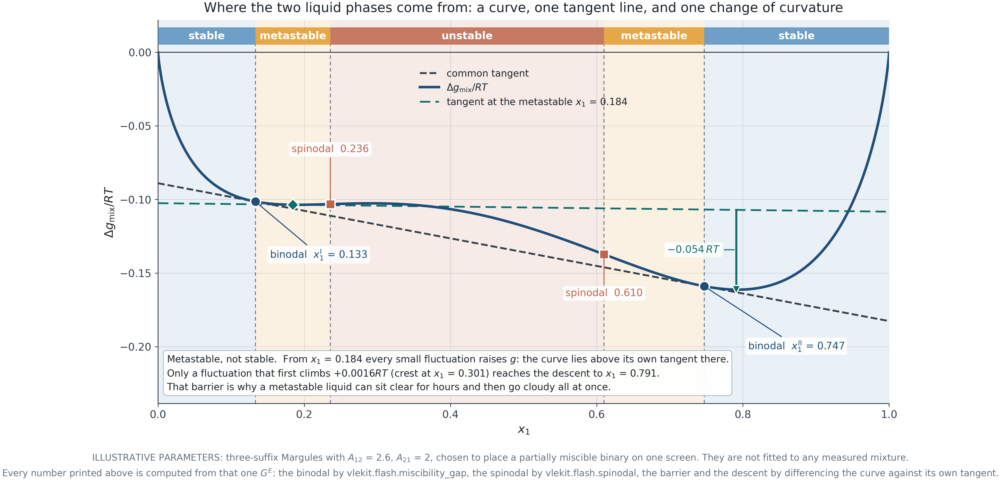

## Optional reference material

Return to the [12-slide classroom deck](postmidterm-03.html).

Use these details when a question from your investigation needs them. They are outside the required 45–60 minute practice.

Choose one extension: NRTL tie-line fitting in Lab 05, paired bootstrap from independent replicates, or feasible three-phase amounts in Lab 06.

## Binodal and spinodal

{width="78%"}

## Tangent-plane distance

For a trial composition w relative to reference z,
$$TPD(w;z)=g(w)-g(z)-g'(z)(w-z)$$

A negative value identifies a Gibbs-energy-lowering perturbation. Local curvature examines only the neighborhood of z.

Lab 04 evaluates the binary model; it is not a general multicomponent TPD package.

## Model shape and liquid splitting

Positive activity deviations alone do not guarantee LLE. The mixing Gibbs-energy shape must support a split.

The labs include Margules and NRTL options with different shapes. Standard Wilson behavior is discussed in the reference deck, not implemented as an LLE solver here.

## LLE fitting uses different evidence

Tie-line data constrain the coexistence compositions. Fitting must reproduce distinct phases and a supported common tangent.

A small tie-line error at one T does not establish a unique parameter set or a temperature law.

Lab 05 retains the input observations and checks stability of the fitted result.

## Vapor–liquid–liquid coexistence

$$\hat f_i^V=\hat f_i^{L\alpha}=\hat f_i^{L\beta}$$

For a binary nonreacting system with three phases, the phase rule gives one intensive degree of freedom before imposing T or P.

Phase compositions and phase amounts are different unknowns. Specifying T and P does not always uniquely determine all amounts.

## Three phase amounts can form a family

Given three fixed binary phase compositions,
$$f_\alpha+f_\beta+f_V=1$$
$$z_1=f_\alpha x_1^\alpha+f_\beta x_1^\beta+f_Vy_1$$

There are two independent constraints on three fractions. Nonnegativity bounds the feasible family. Another independent extensive constraint may select a member.

## VLLE extension

[Open Lab 06](labs/vlle.html#vl-experiment)

Compare the supported liquid and vapor states. Move within the admissible phase-fraction family and verify the overall balance.

Identify a state where the vapor fraction is constrained by nonnegativity. Explain why equal fugacities alone cannot determine every fraction.

## Where the model can be reused

A fitted liquid model needs a matching component order, parameter convention and temperature before reuse.

VLE also requires pure-component vapor pressures and a vapor model. LLE experimental pressure is not a vapor-pressure correlation.

A new phase calculation brings new assumptions and validation needs.

## Sources and further reading

[Module reference deck](stability.html) · [Lab assumptions and sources](labs/learning-path.html#session-3)

The worked examples use synthetic inputs. Each lab states its supported models and validity limits.
