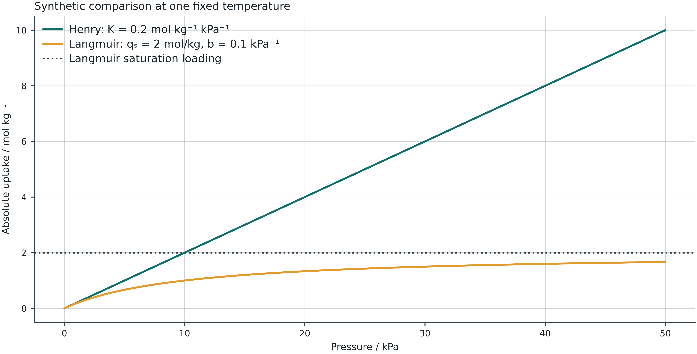

## Optional reference material

Return to the [12-slide classroom deck](postmidterm-04.html).

Use these details when a question from your investigation needs them. They are outside the required 45–60 minute practice.

Choose one extension: compare Henry and Langmuir in Lab 11, check a closed adsorption vessel, or explore pure-solid solubility and the eutectic assumptions in Lab 10.

## Pure-solid solubility

Neglecting fusion heat-capacity corrections for a pure solid,
$$\ln(x_i\gamma_i)=-\frac{\Delta H_{fus,i}}{R}\left(\frac1T-\frac1{T_{m,i}}\right)$$

The standard state is the subcooled pure liquid. The solid is present with unit activity. A solid solution requires a different solid-phase model.

## A solubility hand calculation

Synthetic input: Tₘ=350 K, ΔHfus=10 kJ/mol and T=300 K.

For an ideal liquid,
$$x^{sat}=\exp\left[-\frac{10000}{R}\left(\frac1{300}-\frac1{350}\right)\right]\approx0.564$$

A nonideal γ changes the required liquid composition. A value of xγ alone does not specify phase amounts.

## Binary eutectic assumptions

Each pure-solid branch imposes its own solubility equation. Their intersection gives the eutectic within the admitted model.

The phase amounts follow material balances. The presence of two possible solids does not mean both occur for every overall composition.

Lab 10 excludes solid solutions and chemical reactions.

## Adsorption isotherm assumptions

| Model | Form | Interpretation/domain |
|---|---|---|
| Henry | q=KᴴP | Dilute limit |
| Langmuir | q=qₛbP/(1+bP) | Idealized finite sites |
| Freundlich | q=KPᵐ | Empirical range, no plateau |
| BET | Multilayer expression | Requires P/P₀ and a fitting window |

A better fit alone does not establish the microscopic mechanism.

## Low-pressure agreement and saturation

{width="78%"}

## A closed adsorption vessel

For an ideal gas and absolute uptake q,
$$n_{total}=\frac{PV_g}{RT}+m_s q(P,T)$$

Gas amount and adsorbed amount must sum to inventory. Vg is the accessible gas volume.

Excess adsorption needs a volume/density convention and cannot be substituted for absolute q without conversion.

## Isosteric heat uses common loading

For the ideal-gas pressure convention,
$$Q_{st}=-R\left(\frac{\partial\ln P}{\partial(1/T)}\right)_q$$

Compare pressures at the same absolute loading across temperatures. Interpolation is limited to common measured loading.

An isotherm fit does not justify extrapolated heat estimates outside overlap.

## Independent extension

[Assessment set 4 and rubric](labs/assessments.html#session-4) · [Offline package](files/thermodynamics-offline.zip)

Compare SLE with ideal and nonideal liquid activity. Identify how liquid nonideality changes a solubility branch.

Alternatively, examine Qst only where isotherms overlap in measured loading. Report the interpolation range and do not label extrapolation as measured evidence.

## Sources and further reading

[Module reference deck](stability.html) · [Lab assumptions and sources](labs/learning-path.html#session-4)

The worked examples use synthetic inputs. Each lab states its supported models and validity limits.
