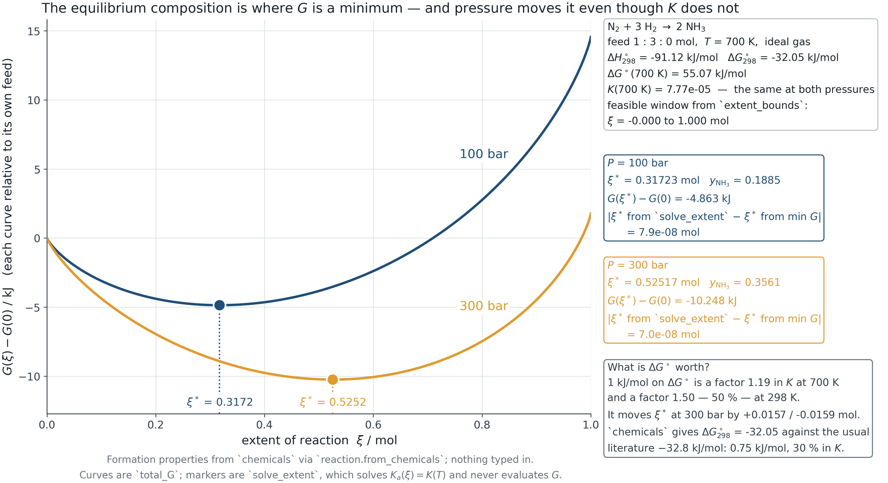

## Optional reference material

Return to the [12-slide classroom deck](postmidterm-05.html).

Use these details when a question from your investigation needs them. They are outside the required 45–60 minutes of weekly independent work.

Choose one extension: vary temperature with and without a heat-capacity correction, reverse the reaction, or scale its coefficients consistently.

## Reaction equilibrium changes composition

$$n_i=n_{i,0}+\nu_i\xi$$
$$\Delta_rG=\sum_i\nu_i\mu_i=\Delta_rG^\circ+RT\ln Q$$

Stoichiometric coefficients are negative for reactants and positive for products. At an interior equilibrium, ΔrG=0.

## Standard states keep K dimensionless

| Phase | Activity used |
|---|---|
| Gas | φᵢ yᵢ P/p° |
| Solute, molarity standard | γᵢ cᵢ/c° |
| Liquid solution | γᵢ xᵢ |
| Present pure solid/liquid | 1 |

Formation data and activities must use matching phases and standards.

## Constant-enthalpy van ’t Hoff relation

$$\frac{d\ln K}{dT}=\frac{\Delta_rH^\circ(T)}{RT^2}$$

With constant ΔrH° over the stated interval,
$$\ln\frac{K(T)}{K(T_r)}=\frac{\Delta_rH_r^\circ}{R}\left(\frac1{T_r}-\frac1T\right)$$

An endothermic reaction has increasing K with T in this approximation.

## Constant heat-capacity correction

$$\Delta_rH^\circ(T)=\Delta_rH_r^\circ+\Delta_rC_p^\circ(T-T_r)$$
$$\Delta_rS^\circ(T)=\Delta_rS_r^\circ+\Delta_rC_p^\circ\ln(T/T_r)$$

The integrated ln K adds
$$\frac{\Delta_rC_p^\circ}{R}\left[\ln(T/T_r)+T_r/T-1\right]$$

to the constant-enthalpy expression.

## Reference consistency and temperature applicability

Changing only Kref while holding reference H and S fixed creates two independent anchors that may disagree.

Point ΔG° and formation-energy data are unavailable away from their supplied T unless an explicit temperature model exists.

Keeping ln K avoids false zeros or infinities from exponent underflow/overflow.

## Equilibrium extent and pressure

For a neutral ideal-gas reaction,
$$Q(\xi)=\prod_i\left[y_i(\xi)P/p^\circ\right]^{\nu_i}$$

Solve lnQ(ξ)−lnK=0 within nonnegative mole amounts. Pressure changes Q and equilibrium composition, not standard K at fixed T.

Adding inert gas at fixed total pressure differs from adding it at fixed volume.

## Gibbs energy along extent

{width="78%"}

## Reaction scaling changes K

Reversing the reaction changes lnK to −lnK. Multiplying every coefficient by c changes lnK to c lnK.

Formation sums, reaction H, S, Cp and direct ΔG must transform on the same basis.

A numerical K without a written reaction is incomplete information.

## Sources and further reading

[Module reference deck](reaction.html) · [Lab assumptions and sources](labs/learning-path.html#session-5)

The worked examples use synthetic inputs. Each lab states its supported models and validity limits.

## More than one reaction: a reference bridge

Choose independent reactions and write species amounts using one extent for each independent reaction, or minimize G subject to atom balances and nonnegative amounts at fixed T and P.

For gas–solid reactions, a pure solid can have unit activity while present. Its disappearance remains a phase-feasibility condition.

These are conceptual extensions. Lab 12 implements one neutral ideal-gas reaction extent.

Reading locator: supplied textbook contents, 17.5 and 17.8.
