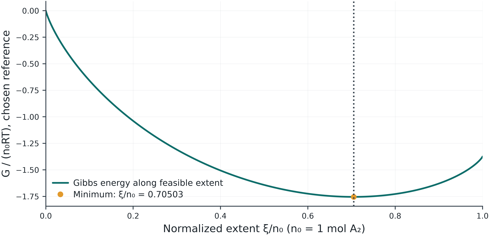

## The question for today

Why can composition change while the equilibrium constant stays the same?

[Before class: 3-page reading](files/preclass-week-05.pdf) · 15–20 minutes

Bring the three preparation answers. Revisit your prediction after one controlled comparison and an independent check.

## The 180-minute class

| Activity | Minutes |
|---|---:|
| Opening question and essential concepts | 30 |
| One hand calculation | 20 |
| One lab demonstration | 20 |
| Break | 10 |
| Student pair investigation | 70 |
| Discussion, exit ticket and feedback | 30 |

The 70-minute investigation is student work. Final block: discussion 20 min, exit ticket 5 min, feedback 3 min, closing 2 min.

## Start with extent and driving force

$$n_i=n_{i,0}+\nu_i\xi,\qquad n_i\geq0$$
$$\left(\frac{dG}{d\xi}\right)_{T,P}=\Delta_rG=\Delta_rG^\circ+RT\ln Q$$

Write the feasible extent interval first. A negative derivative favors increasing extent; a positive derivative favors decreasing extent.

An interior equilibrium has zero derivative. Boundary minima need one-sided checks.

## The equilibrium condition gives K

$$\Delta_rG=0\ \Rightarrow\ Q=K,\qquad\ln K=-\frac{\Delta_rG^\circ}{RT}$$

Obtain standard Gibbs energy from direct data, formation properties, or H−TS at the evaluation temperature.

K depends on T and the reaction/standard-state convention. Q describes the current composition and pressure.

Additional K(T) routes are in the appendix and lab.

## A reference-state check

Lab 12 synthetic A₂ ⇌ 2A at 350 K uses ΔrG°=−4.000 kJ/mol.

$$\ln K=\frac{4000}{R(350)}=1.37454,\qquad K\approx3.95326$$

With ΔrH°=50.000 kJ/mol and ΔrS°=54000/350 J mol⁻¹ K⁻¹, the H−TS route gives the same value.

## Check the minimum and the reaction quotient

{width="68%"}

At ξ≈0.70503 mol, Q≈3.95326=K. Check the atom balance.

## One demonstration · 20 minutes

[Open the core lab](labs/reaction.html#rx-experiment)

Use the synthetic Lab 12 case. Write nA₂=1−ξ, nA=2ξ and 0≤ξ≤1 mol first. Compare the supplied Gibbs-energy and H−TS routes, then change only pressure and inspect K and extent.

Keep one saved baseline for the pair investigation.

## Pair investigation · 70 minutes

- 10 min: predict and record the baseline.
- 25 min: change one input and calculate.
- 20 min: exchange roles and check the result by hand.
- 15 min: prepare one plot or table and a short explanation.

In Lab 12, compare the supplied Gibbs-energy and H−TS routes at the reference temperature. Change pressure at fixed T and compare K with equilibrium extent. Check one balance.

## Discussion · 20 minutes

Why can composition change while the equilibrium constant stays the same?

Compare results and discuss unexpected behavior. Use one numerical check to support your explanation.

## After class · 30–40 minutes

In Lab 12, compare the supplied Gibbs-energy and H−TS routes at the reference temperature. Change pressure at fixed T and compare K with equilibrium extent. Check one balance.

[Assessment 5 and independent checkpoint](labs/assessments.html#session-5)

Retain one study JSON, one comparison and a short explanation.

Optional: [Session appendix](postmidterm-05-appendix.html).

[Learning path](labs/learning-path.html#session-5) · [Offline package](files/thermodynamics-offline.zip)

## Exit ticket + feedback · 8 minutes

:::: {.columns}
::: {.column width="60%"}

**5 min · Explain and check**

Answer the session question in the form. Give one result or independent check from today's lab, with units.

**3 min · Help improve the next class**

Rate the pace, report lab access, and suggest one improvement.

Thai or English. No name, ID or email requested.

Wait for **“Response received.”** We will use the final 2 minutes to close the class.

:::
::: {.column width="36%"}

[{width="100%"}](https://thermo-2105603-exit-ticket.soorathep-k.chatgpt.site/?session=5)

[Open Session 5 form](https://thermo-2105603-exit-ticket.soorathep-k.chatgpt.site/?session=5)

:::
::::
