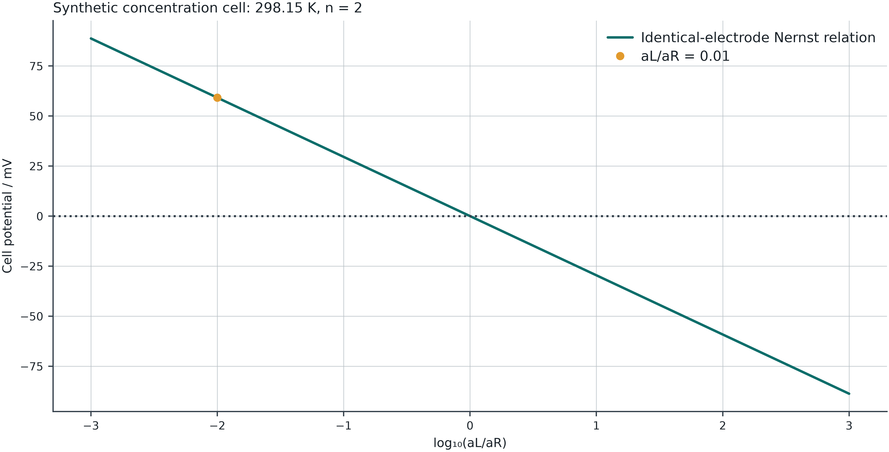

## Session outcome

Connect balanced half-reactions, activities, potential and Gibbs energy.

**Before class:** Review reaction stoichiometry, ΔrG and dimensionless reaction quotients.

[Learning path and all labs](labs/learning-path.html#session-6)

::: {.notes}
This sequence uses the existing pre-midterm Modules 1–3 as prerequisites. Use questions to identify missing concepts rather than repeating the full reference decks.
:::

## The 180-minute class

| In class | Minutes |
|---|---:|
| Recall and prediction | 10 |
| Concepts and derivation | 45 |
| Worked example | 30 |
| Break | 10 |
| Instructor lab demonstration | 25 |
| Guided student exploration | 35 |
| Discussion and interpretation | 15 |
| Exit question and independent task | 10 |

::: {.notes}
Includes a 10-minute break. The 60 minutes of demonstration and guided work are part of the 180 minutes. If discussion runs long, move the optional extension to independent practice; do not remove the balance/interpretation check.
:::

## Chemical and electrochemical potential

For an ion of charge number zᵢ,
$$\tilde\mu_i=\mu_i+z_iF\varphi$$

Chemical and electrical contributions enter the driving force. The cell potential connects that driving force to electrical work under reversible conditions.

::: {.notes}
Recall Module 6 electrochemical-potential slide. Distinguish electric potential phi from fugacity coefficient phi verbally and with context.
:::

## Two reduction half-reactions

Enter both half-reactions as reductions. Reverse the left reaction and add the right after matching electron counts.

$$E_{cell}^\circ=E_{right}^\circ-E_{left}^\circ$$

Both potentials need the same reference electrode and temperature. Multiplying a half-reaction does not multiply its potential.

::: {.notes}
For a negative cell E the actual favored direction reverses; do not label left as the physical anode regardless of sign.
:::

## Electron and charge bookkeeping

A reduction consuming n electrons has
$$\sum_{species}\nu_i z_i+n=0$$

Lab 13 excludes electrons from the species table and adds their charge using the entered n. It checks the declared atom counts independently.

Matching electron counts uses their least common multiple.

::: {.notes}
Try an incorrect n in the demonstration. Explicit atom maps are user declarations; species labels are not automatically parsed into formulas.
:::

## Potential, Gibbs energy and K

$$\Delta_rG^\circ=-nFE^\circ,\qquad \ln K=\frac{nFE^\circ}{RT}$$
$$\Delta_rG=-nFE$$

Positive E favors the written cell reaction. At complete-cell equilibrium Q=K and E=0.

These relationships refer to the written reaction basis.

::: {.notes}
Source: IUPAC standard electromotive force, https://goldbook.iupac.org/terms/view/S05913. Local interfacial equilibrium at each electrode does not imply zero whole-cell open-circuit voltage.
:::

## Nernst equation from reaction thermodynamics

Combine ΔrG=ΔrG°+RTlnQ with ΔrG=−nFE:
$$E=E^\circ-\frac{RT}{nF}\ln Q$$

At 298.15 K,
$$E=E^\circ-\frac{0.05915935\ \mathrm V}{n}\log_{10}Q$$

Changing T requires valid E° data at the new T.

::: {.notes}
Derive before showing the equation in the lab. The reference potentials have temperature dependence; the lab does not invent it.
:::

## Activities remain separate by compartment

For identical M²⁺/M electrodes,
$$M_L+M_R^{2+}\rightleftharpoons M_L^{2+}+M_R$$
$$Q=\frac{a(M_L^{2+})}{a(M_R^{2+})},\qquad E^\circ=0$$

The same ion in different compartments cannot be canceled when its activities differ. Pure present solids have unit activity.

::: {.notes}
Junction potential is assumed zero. This is an idealized concentration-cell model, not a claim that measured junction effects vanish.
:::

## A concentration-cell calculation

At 298.15 K, n=2, aL=0.01 and aR=1:
$$Q=0.01,\qquad E=+0.05915935\ \mathrm V$$

E°=0, K=1, but E is nonzero. Reversing the concentrations changes the sign of E. Equal activities give E=0.

ΔrG≈−11.416 kJ per mol of the written reaction.

::: {.notes}
Use Lab 13 concentration-cell preset. Check ΔG with n=2 and F. The sign refers to right reduction and left oxidation.
:::

## Nernst sensitivity to an activity ratio

{width="78%"}

::: {.notes}
Teal is the Nernst relation; amber marks the preset two-decade activity ratio. Ask for the per-decade slope before reading it off the plot.
:::

## Concentration is not activity

For a molarity standard,
$$a_i=\gamma_i c_i/c^\circ$$

Changing γ changes the activity ratio even if both concentrations are unchanged. A molality-based γ cannot be inserted into this equation without a consistent conversion.

Individual-ion activity conventions and reference states must match the potential data.

::: {.notes}
Explain single-ion conventions without pretending the simple lab solves electrolyte speciation. Counterions maintain bulk electroneutrality even if omitted from the net reaction.
:::

## Reaction scaling leaves E unchanged

Multiply the full cell reaction by two:

| Quantity | Transformation |
|---|---|
| n, ΔrG°, ΔrG | Multiply by 2 |
| lnK, lnQ | Multiply by 2 |
| K, Q | Square |
| E°, E | Unchanged |

Potential is a driving force per unit charge, not a reaction energy.

::: {.notes}
Worked example after the concentration-cell calculation. Scale both species coefficients and electron counts in each half.
:::

## Class demonstration · Lab 13

[Open electrochemistry](labs/electrochemistry.html#ec-experiment)

1. Load the concentration-cell preset and predict E.
2. Swap activities; then make them equal.
3. Change an electron count incorrectly and inspect the balance rejection.
4. Restore the valid study export and reproduce the result.

::: {.notes}
25 minutes. Show the supported input formats and point out that study restoration recalculates rather than trusting saved output values.
:::

## Guided exploration · 35 minutes

Produce two concentration-cell states and a reaction-scaled version of one state.

Check Eright−Eleft, −nFE and the stoichiometric/charge balances. Explain any changed sign.

Save a study file and worksheet, then reopen them to confirm that the calculation and explanation can be reproduced.

::: {.notes}
Pair roles: one handles calculation, one audits reference/units. A successful import is not a scientific validity check.
:::

## Equilibrium voltage and operating voltage

The lab assumes reversible electrodes and zero liquid-junction potential.

It does not calculate current, kinetic overpotential, ohmic loss, mass-transfer limits or full electrolyte speciation.

A nonzero open-circuit potential is compatible with local electrode equilibrium; complete cell-reaction equilibrium gives E=0.

::: {.notes}
Do not overinterpret a Nernst plot as a battery discharge curve. Tie limitations to measurements students might actually perform.
:::

## Exit question and course synthesis

A simulation converges and every balance closes. What could still make the predicted voltage or phase state wrong?

Explain the chain connecting chemical potential, model assumptions, equilibrium constraints, numerical checks and experimental evidence.

::: {.notes}
Expected synthesis: correct numerics do not rescue invalid physical models, wrong standards, bad data or unsupported extrapolation. Use examples from VLE, LLE and electrochemistry.
:::

## Independent practice · suggested 60–90 minutes

[Assessment set 6 and rubric](labs/assessments.html#session-6) · [Offline package](files/thermodynamics-offline.zip)

Two concentration-cell states, a reversal check and a reaction-scaling check, with consistent reference electrodes.

Retain the calculator export, your worksheet, a comparison plot/table and one independent check. State an assumption that limits your conclusion.

Use the core labs on the [learning path](labs/learning-path.html#session-6). Optional extensions are additional work.

::: {.notes}
No new grading weights or due dates are announced here. Apply the official course assessment arrangements. Feedback focuses on reproducibility, controlled comparison, verification and interpretation.
:::

## References and further study

[Module reference deck](reaction.html) · [Lab sources and equations](labs/learning-path.html#session-6)

IUPAC: [standard electromotive force](https://goldbook.iupac.org/terms/view/S05913) and [standard equilibrium constant](https://goldbook.iupac.org/terms/view/S05915).

Synthetic worked examples illustrate calculations; they are not evidence of real-system accuracy.

::: {.notes}
Use optional reference slides for questions or further reading. Public decks omit instructor notes; present from a local non-public render for prompts and teaching notes.
:::
