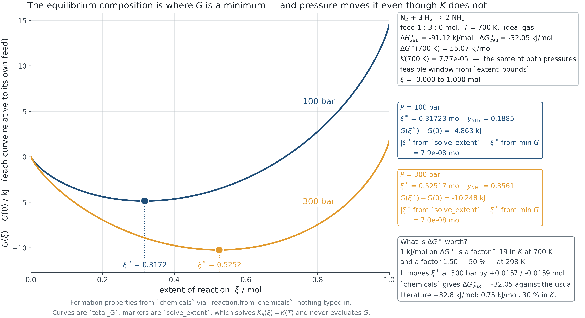
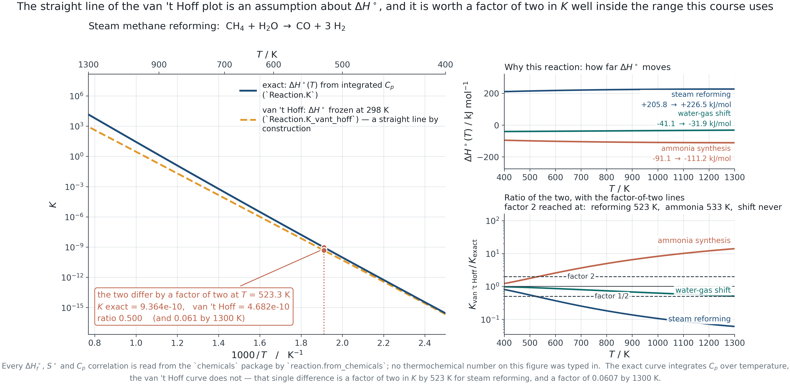
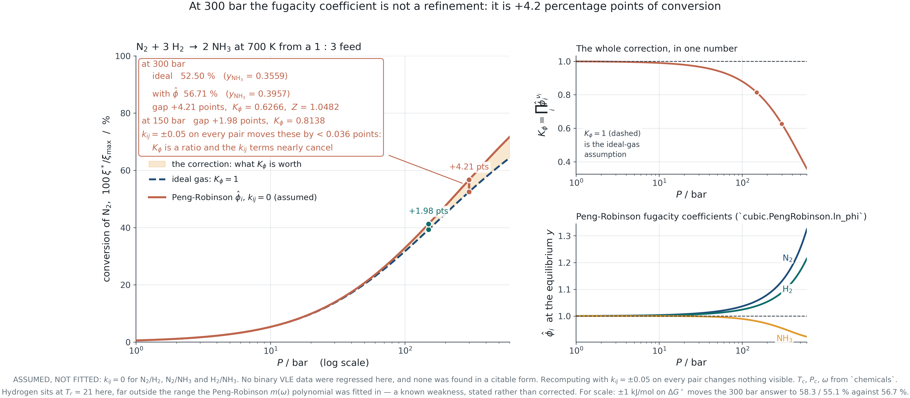
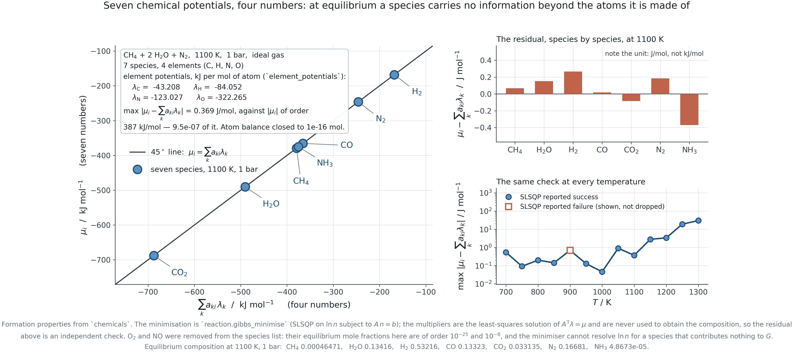
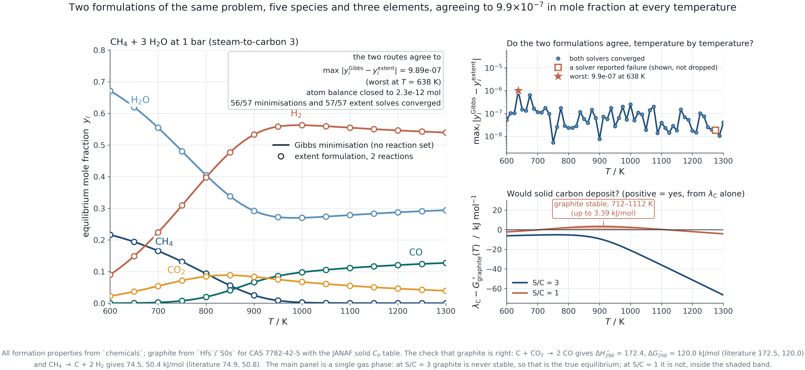
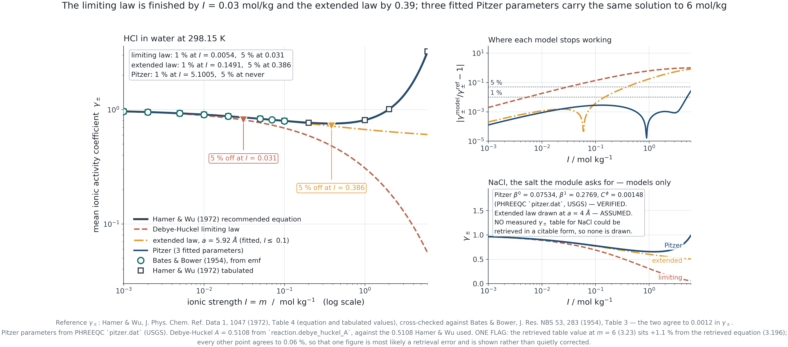
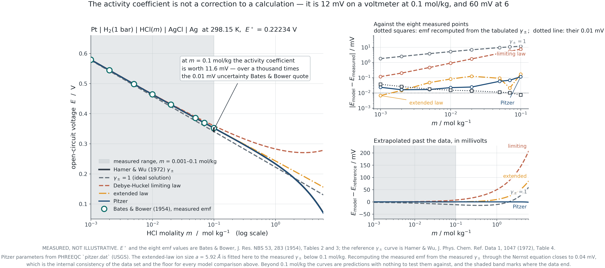

## &nbsp; {.dark .mid background-color="#1C242B"}

:::: {.vcenter}
::: {.statement}
Nothing new is introduced in this module.
:::

::: {.statement-hi}
The same criterion, the same fugacity coefficient, the same activity coefficient — under a different constraint.
:::
::::

::: {.notes}
**TEACHING TIP**
Say this at the start and mean it. Students arrive expecting reaction
equilibrium to be a separate subject with its own machinery. It is the same
minimisation of Gibbs energy, varying moles instead of phase amounts, and every
tool built in Modules 2 to 5 is reused unchanged.

**ASK THE CLASS**
Phase equilibrium sets μᵢ equal between phases. What do you expect reaction
equilibrium to set equal?
:::

## Where this module ends

::: {.kicker .c-amber}
Introduction
:::

::: {.lede}
Everything from Module 1 onward feeds one constrained optimisation, and that
optimisation is what an equilibrium reactor block in a process simulator
solves.
:::

:::::: {.columns}
::::: {.column width="48%"}
:::: {.cards}
::: {.card}

[The arc]{.card-h .c-teal}

Module 1 gave $P$-$V$-$T$.
Module 2 turned it into fugacity.
Module 3 gave the liquid an excess Gibbs energy.
Module 4 fitted it to data.
Module 5 asked whether the answer was stable.

Module 6 minimises the total Gibbs energy of everything at once.

:::
::::
:::::

::::: {.column width="48%"}
:::: {.cards}
::: {.card}

[Four questions]{.card-h .c-amber}

- What is the equilibrium criterion for a reaction, and why is it the same one?
- Where do non-ideality corrections enter, and how much are they worth?
- What do you do when nobody knows the reactions?
- What happens when phases and reactions must be solved together?

:::
::::
:::::
::::::

::: {.notes}
**TEACHING TIP**
Put the arc on the board and leave it. This is the last module; students should
be able to see the whole course as one argument by the end of it.
:::

## The criterion {.dark .divider .c-teal background-color="#1C242B"}

::: {.kicker .c-amber}
PART I
:::

::: {.lede}
Section 6.1&nbsp;&nbsp;&nbsp;Extent of reaction, $\sum_i \nu_i\mu_i = 0$, and the sharp distinction between $K$ and composition.
:::

## Extent of reaction

::: {.kicker .c-amber}
6.1 · The criterion for reaction equilibrium
:::

::: {.lede}
Stoichiometry removes almost all of the freedom. One number describes the whole
composition of a single reaction.
:::

$$n_i = n_{i0} + \nu_i \xi
\qquad\Longrightarrow\qquad
\frac{{\rm d}n_i}{\nu_i} = {\rm d}\xi \ \ \text{for every } i$$

:::: {.cards}
::: {.card}

[Why it is one number]{.card-h .c-teal}

Atoms are conserved, so the composition cannot move in an arbitrary direction.
For a single reaction it can move along exactly one line in composition space,
and $\xi$ is the distance along it.

:::

::: {.card}

[The bounds matter]{.card-h .c-rust}

$\xi$ is limited at one end by the limiting reactant and at the other by the
products. Outside that window a mole number is negative and the objective
evaluates $\ln$ of a negative number. A solver started outside it fails in a
way that looks like a physics problem and is not.

:::
::::

::: {.notes}
**TEACHING TIP**
Compute the bounds explicitly in front of them for a feed that is not
stoichiometric. Students routinely start a Newton solve at $\xi = 0.5$ for a
reaction whose feasible window ends at 0.2.
:::

## The equilibrium condition

::: {.kicker .c-amber}
6.1 · The criterion for reaction equilibrium
:::

::: {.lede}
At constant $T$ and $P$, ${\rm d}G = 0$. Substituting the extent gives the
whole of reaction equilibrium in one line.
:::

$${\rm d}G = \sum_i \mu_i\,{\rm d}n_i = \left(\sum_i \nu_i\mu_i\right){\rm d}\xi = 0
\qquad\Longrightarrow\qquad
\boxed{\sum_i \nu_i\mu_i = 0}$$

:::: {.cards}
::: {.card}

[The same statement]{.card-h .c-amber}

Phase equilibrium says $\mu_i^{\,\alpha} = \mu_i^{\,\beta}$ — a *transfer* of
species $i$ between phases leaves $G$ unchanged. Reaction equilibrium says a
*conversion* along the stoichiometry leaves $G$ unchanged. Both are
${\rm d}G = 0$; only the allowed variation differs.

:::

::: {.card}

[What follows]{.card-h .c-teal}

Substituting $\mu_i = G_i^\circ + RT\ln \hat a_i$ and rearranging gives

$$\prod_i \hat a_i^{\,\nu_i} = \exp\!\left(-\frac{\Delta G^\circ}{RT}\right) = K$$

with $\Delta G^\circ = \sum_i \nu_i G_i^\circ$.

:::
::::

::: {.notes}
**TEACHING TIP**
Do the three lines on the board. This is the only derivation in the module that
every student must be able to reproduce, and it is short enough that there is
no excuse.

**COMMON MISCONCEPTION**
That $\sum\nu_i\mu_i = 0$ means each $\mu_i$ is zero. It is a weighted sum, and
the weights are the stoichiometric coefficients.
:::

## $K$ depends only on temperature

::: {.kicker .c-amber}
6.1 · The criterion for reaction equilibrium
:::

::: {.lede}
The single most-confused point in the subject. The composition depends on
pressure and on non-ideality; $K$ does not.
:::

:::::: {.cards .g3}
::: {.card}

[Why]{.card-h .c-teal}

$K = \exp(-\Delta G^\circ/RT)$ and $\Delta G^\circ$ is built from
*standard-state* properties. The standard state fixes the pressure — 1 bar for
a gas — so nothing on the right-hand side knows the system pressure.

:::

::: {.card}

[What does move]{.card-h .c-amber}

The activity quotient. For a gas
$\prod \hat a_i^{\nu_i} = K_\varphi K_y (P/P^\circ)^{\Delta\nu}$, so raising
$P$ with $\Delta\nu < 0$ forces $K_y$ down — more product — at constant $K$.

:::

::: {.card}

[Verified, not asserted]{.card-h .c-rust}

For ammonia synthesis at 700 K, raising the pressure from 1 to 300 bar changes
$K$ by exactly nothing and multiplies the ammonia mole fraction by more than a
hundred.

:::
::::::

::: {.notes}
**TEACHING TIP**
This is where Le Chatelier gets its rigorous statement. Ask the class to
predict the effect of pressure on the water-gas shift, where $\Delta\nu = 0$,
before showing them that it is exactly zero.

**ASK THE CLASS**
If $K$ is unchanged, what physically changed when you raised the pressure?
:::

## Gibbs energy against extent

::: {.kicker .c-amber}
6.1 · The criterion for reaction equilibrium
:::

{.fig-xl}

::: {.source}
F6.1 · The minimum moves with pressure. $K$ does not.
:::

::: {.notes}
**TEACHING TIP**
The two curves have their minima in different places and the same $K$. That is
the previous slide in one picture, and it is the picture to keep.

The equilibrium extent is marked from an independent root-find, not read off
the curve — the two agree to eight decimal places, which is worth pointing at
as a habit rather than as a result.
:::

## Temperature dependence

::: {.kicker .c-amber}
6.1 · The criterion for reaction equilibrium
:::

::: {.lede}
Van 't Hoff, and where the constant-enthalpy shortcut stops being a shortcut.
:::

$$\frac{{\rm d}\ln K}{{\rm d}T} = \frac{\Delta H^\circ}{RT^2}
\qquad\xrightarrow[\ \Delta H^\circ \ \text{constant}\ ]{}\qquad
\ln\frac{K(T)}{K(T_0)} = -\frac{\Delta H^\circ}{R}\left(\frac1T - \frac1{T_0}\right)$$

{.fig-cap width="72%"}

::: {.source}
F6.2 · Exact against constant-enthalpy, with the temperature at which they differ by a factor of two.
:::

::: {.notes}
**TEACHING TIP**
For steam reforming the two forms differ by a factor of two by 523 K and by a
factor of sixteen at 1300 K. The approximation is not a small correction at
reforming temperatures — it is the wrong answer.

**ASK THE CLASS**
Which reactions can you trust the shortcut for, and how would you decide
without computing the exact answer first?
:::

## Standard states, and the traps in each

::: {.kicker .c-amber}
6.1 · The criterion for reaction equilibrium
:::

:::: {.evidence}
| | |
|---|---|
| Gas | Pure ideal gas at 1 bar. $\hat a_i = \hat\varphi_i y_i P / P^\circ$. The trap: forgetting $P^\circ$, which makes $K$ dimensional and wrong by $(P/P^\circ)^{\Delta\nu}$ |
| Liquid | Pure liquid at $T$ and $P$. $\hat a_i = \gamma_i x_i$. The trap: the Lewis-Randall reference is the *pure* liquid, which may not exist at those conditions |
| Solid | Pure solid. $\hat a_i = 1$, so it drops out of $K$ entirely — but not out of the question of whether the solid is present at all |
| Solute | Hypothetical ideal 1 molal solution. $\hat a_i = \gamma_i m_i / m^\circ$. The trap: molarity, molality and mole fraction give three different numerical $K$ values for the same physics |
::::

::: {.notes}
**TEACHING TIP**
The solid row is the one that catches people twice: first they forget that
$a = 1$, then they forget that a solid with $a = 1$ can still be absent, in
which case the equilibrium is not the one they computed. Module 5's stability
question returns here.

**COMMON MISCONCEPTION**
That a change of concentration scale changes the physics. It changes the
numerical value of $K$ and of $\Delta G^\circ$ together, and every measurable
quantity is unchanged.
:::

## Non-ideality {.dark .divider .c-teal background-color="#1C242B"}

::: {.kicker .c-amber}
PART II
:::

::: {.lede}
Section 6.2&nbsp;&nbsp;&nbsp;Where $\hat\varphi_i$ from Module 2 and $\gamma_i$ from Module 3 re-enter. Nothing new is introduced. Existing tools meet a new constraint.
:::

## The decomposition

::: {.kicker .c-amber}
6.2 · Non-ideality in reaction equilibrium
:::

::: {.lede}
Split the activity quotient into a composition part and a non-ideality part.
Each factor is something you already know how to compute.
:::

$$K = \underbrace{\prod_i \hat\varphi_i^{\,\nu_i}}_{K_\varphi}
      \underbrace{\prod_i y_i^{\,\nu_i}}_{K_y}
      \left(\frac{P}{P^\circ}\right)^{\Delta\nu}
\qquad\text{(gas)}
\qquad\qquad
K = \underbrace{\prod_i \gamma_i^{\,\nu_i}}_{K_\gamma}
    \underbrace{\prod_i x_i^{\,\nu_i}}_{K_x}
\qquad\text{(liquid)}$$

:::: {.cards}
::: {.card}

[$K_\varphi$ is a ratio]{.card-h .c-teal}

Which has a useful consequence: much of the model error cancels. Changing
every binary interaction parameter by $\pm 0.05$ moves the ammonia conversion
by less than 0.04 percentage points at any pressure marked on the next slide.
The fugacity coefficients themselves are worth 4.2 points at 300 bar.

:::

::: {.card}

[Where the effort belongs]{.card-h .c-amber}

At 300 bar the corrections rank: $\hat\varphi$ is worth 4.2 points of
conversion, an uncertainty of 1 kJ/mol in $\Delta G^\circ$ is worth 1.6 points,
and $k_{ij}$ is worth less than 0.04 — forty times smaller than the
thermochemical uncertainty. Improve the data before the mixing rule.

:::
::::

::: {.notes}
**TEACHING TIP**
The ranking is the engineering content of this slide. Students want to refine
the mixing rule because it is the most recently learned thing; the number says
the standard-state data matter four hundred times more.
:::

## Ammonia synthesis, done properly

::: {.kicker .c-amber}
6.2 · Non-ideality in reaction equilibrium
:::

{.fig-xl}

::: {.source}
F6.3 · Conversion against pressure with and without $K_\varphi$, from Peng-Robinson. $k_{ij} = 0$ assumed and labelled.
:::

::: {.notes}
**TEACHING TIP**
This is the callback: the same problem was set in the 2025 final examination
with an ideal gas assumed. At 300 bar that answer is 4.2 percentage points low,
and at 600 bar it is 7.3 points low. Students see their earlier answer
corrected by machinery they built themselves.

**COMMON MISCONCEPTION**
That the ideal-gas answer is conservative. It is low here, which means a plant
designed on it would be *under*-predicting its own conversion — but the sign is
a property of this reaction, not a rule.

**ASK THE CLASS**
Hydrogen at 700 K is at a reduced temperature of about 21. What is the
Peng-Robinson α function doing there, and should you trust it?
:::

## Reactions in solution

::: {.kicker .c-amber}
6.2 · Non-ideality in reaction equilibrium
:::

::: {.lede}
Three concentration scales, three numerical values of $K$, one physical answer.
:::

:::::: {.cards .g3}
::: {.card}

[Mole fraction]{.card-h .c-teal}

Lewis-Randall reference: $\gamma_i \to 1$ as $x_i \to 1$. Natural for a solvent
and for a mixture of comparable components.

:::

::: {.card}

[Molality]{.card-h .c-amber}

Henry reference: $\gamma_i \to 1$ as $m_i \to 0$. Natural for a solute that
never approaches purity, and the scale on which electrolyte data are tabulated.

:::

::: {.card}

[Molarity]{.card-h .c-rust}

Convenient in the laboratory and awkward in thermodynamics, because it depends
on the solution density and therefore on temperature and on composition.

:::
::::::

::: {.note}
Converting between scales changes $K$ and $\Delta G^\circ$ together. A reported
$K$ without its concentration scale is not a number, and neither is a
$\Delta G^\circ$ without its standard state.
:::

::: {.notes}
**TEACHING TIP**
Make them convert one $K$ between two scales as an exercise. It is arithmetic,
and doing it once removes the confusion permanently.
:::

## When nobody knows the reactions {.dark .divider .c-teal background-color="#1C242B"}

::: {.kicker .c-amber}
PART III
:::

::: {.lede}
Section 6.3&nbsp;&nbsp;&nbsp;Multiple extents, and then the formulation that needs no reaction set at all.
:::

## Several reactions at once

::: {.kicker .c-amber}
6.3 · Multiple reactions and Gibbs energy minimisation
:::

::: {.lede}
The extent formulation generalises directly — as long as the reaction set is
known and independent.
:::

$$n_i = n_{i0} + \sum_j \nu_{ij}\,\xi_j
\qquad\qquad
\sum_i \nu_{ij}\,\mu_i = 0 \quad \text{for each } j$$

:::: {.cards}
::: {.card}

[How many are independent]{.card-h .c-teal}

$R = S - \text{rank}(\mathbf{A})$, with $S$ species and $\mathbf{A}$ the
element matrix. Gas-phase steam reforming: 5 species, 3 elements, rank 3, so
**2** independent reactions — and which two you write down is a choice, not a
fact. Admit solid carbon and it becomes 6 species and 3 reactions.

:::

::: {.card}

[Why the choice does not matter]{.card-h .c-amber}

Any independent set spans the same reaction space and gives the same
equilibrium. If two choices give different answers, one set was not
independent — which is worth checking with a rank rather than by inspection.

:::
::::

::: {.notes}
**TEACHING TIP**
Have them compute the rank for a system they think they know. Reforming with
carbon added is the good case: adding one species adds one reaction, and the
one they will write is usually not independent of the others.
:::

## Where the extent formulation fails

::: {.kicker .c-amber}
6.3 · Multiple reactions and Gibbs energy minimisation
:::

::: {.lede}
It needs a reaction set. Combustion, reforming and pyrolysis do not come with
one.
:::

:::: {.cards}
::: {.card}

[The problem]{.card-h .c-rust}

A hydrocarbon flame contains hundreds of species. Nobody writes down the
reaction set; there is no agreed set to write. Any list you choose is a
modelling assumption you cannot defend, and omitting a species that matters is
invisible in the result.

:::

::: {.card}

[The alternative]{.card-h .c-teal}

Minimise the total Gibbs energy over all species subject to conservation of
atoms. No stoichiometry is required, only an element list — and an element list
is not a modelling choice.

$$\min_{\mathbf n} \sum_i n_i\mu_i
\quad\text{s.t.}\quad \mathbf{A}\mathbf{n} = \mathbf{b},\ \ n_i \ge 0$$

:::
::::

::: {.notes}
**TEACHING TIP**
State the trade plainly: the extent formulation is faster and exact, and it
requires knowledge you may not have. The minimisation requires almost nothing
and is numerically nastier. Both are in the course because both are used.
:::

## Element potentials

::: {.kicker .c-amber}
6.3 · Multiple reactions and Gibbs energy minimisation
:::

::: {.lede}
The Lagrange multipliers of the element balances are not bookkeeping. They are
the chemical potential of an atom.
:::

$$\mathcal{L} = \sum_i n_i\mu_i - \sum_k \lambda_k\!\left(\sum_i a_{ki}n_i - b_k\right)
\qquad\Longrightarrow\qquad
\boxed{\mu_i = \sum_k a_{ki}\lambda_k}$$

:::: {.cards}
::: {.card}

[What it says]{.card-h .c-amber}

At equilibrium a species carries no information beyond the atoms it is made of.
Its chemical potential is a weighted sum of element potentials, and the weights
are its formula.

:::

::: {.card}

[Why it is useful]{.card-h .c-teal}

It is the cheapest possible check on a converged solution: the residual of that
relation costs nothing to compute and does not require re-solving anything.
For the reforming case it comes out at 0.37 J/mol against chemical potentials
of order 400 kJ/mol.

:::
::::

::: {.notes}
**TEACHING TIP**
This is the deepest idea in the module. Ask them what it would mean for a
species whose potential did *not* satisfy the relation — the answer is that the
solution is not converged, which is why the residual is the diagnostic.
:::

## What the multipliers look like

::: {.kicker .c-amber}
6.3 · Multiple reactions and Gibbs energy minimisation
:::

{.fig-xl}

::: {.source}
F6.4 · Every species on the 45° line. The residual, and the one temperature at which the optimiser failed, are both reported.
:::

::: {.notes}
**TEACHING TIP**
The failed point is drawn with its own marker rather than dropped. Say why:
a figure that silently omits the case where the method broke teaches the
opposite of what this module is for.

**ASK THE CLASS**
Two species have very different chemical potentials and the same element
potentials. How is that consistent?
:::

## The numerical difficulty

::: {.kicker .c-amber}
6.3 · Multiple reactions and Gibbs energy minimisation
:::

::: {.lede}
The objective contains $\sum n_i \ln(n_i/n)$, which is ill-conditioned as any
mole number approaches zero. Student code fails here, and so does ours.
:::

:::::: {.cards .g3}
::: {.card}

[What goes wrong]{.card-h .c-rust}

A trace species contributes almost nothing to $G$ and has a large derivative.
Finite-difference gradients lose it entirely. Below about $y = 10^{-10}$ the
solution is not resolved — adding O₂ and NO to a reforming calculation drove
the element-potential residual from 0.37 to $5\times10^4$ J/mol.

:::

::: {.card}

[What helps]{.card-h .c-amber}

Optimise in $\ln n_i$, which enforces positivity exactly rather than by a
constraint the solver can step across. Restart from several compositions. Drop
species that cannot matter — and say that you dropped them.

:::

::: {.card}

[What settles it]{.card-h .c-teal}

Cross-check against the extent formulation wherever a reaction set *is* known.
For steam reforming over 600–1300 K the two agree to $10^{-6}$ in mole
fraction. Build that check in before you trust an answer you cannot verify.

:::
::::::

::: {.notes}
**TEACHING TIP**
This is the module's hazard slide. Students will believe a converged
optimisation. The cross-check is not optional and it is the reason both
formulations are taught.
:::

## Product distribution from Gibbs minimisation

::: {.kicker .c-amber}
6.3 · Multiple reactions and Gibbs energy minimisation
:::

{.fig-xl}

::: {.source}
F6.5 · Steam reforming against temperature. Maximum disagreement with the extent formulation over the whole scan: $10^{-6}$ in mole fraction.
:::

::: {.notes}
**TEACHING TIP**
Read the chemistry off the figure: methane disappears above about 1100 K, the
shift equilibrium moves CO₂ to CO as temperature rises, and the hydrogen yield
peaks and then falls. Every one of those is a design decision for a reformer.

**COMMON MISCONCEPTION**
That a gas-phase calculation settles the question. At a steam-to-carbon ratio
of 1 the element potential of carbon says solid carbon is stable between about
712 and 1112 K, and inside that window the gas-only answer is not the
equilibrium. Coking is not a kinetic surprise; it is on the thermodynamics.
:::

## Phases, reactions and charge {.dark .divider .c-teal background-color="#1C242B"}

::: {.kicker .c-amber}
PART IV
:::

::: {.lede}
Section 6.4&nbsp;&nbsp;&nbsp;Everything at once, and then the one place where a potential difference enters the chemical potential itself.
:::

## Reactive flash

::: {.kicker .c-amber}
6.4 · Simultaneous phase and reaction equilibrium
:::

::: {.lede}
Nothing changes. The species list gains a phase label, the element balance sums
over both phases, and the same minimisation runs.
:::

$$\min_{\{n_i^{\,\alpha}\}} \sum_\alpha\sum_i n_i^{\,\alpha}\mu_i^{\,\alpha}
\qquad\text{s.t.}\qquad
\sum_\alpha \mathbf{A}\,\mathbf{n}^{\,\alpha} = \mathbf{b}$$

:::: {.cards}
::: {.card}

[Why this is the ending]{.card-h .c-teal}

Phase equilibrium falls out as the condition $\mu_i^{\,\alpha} =
\mu_i^{\,\beta}$; reaction equilibrium falls out as $\sum\nu_i\mu_i = 0$.
Neither was imposed. Both are consequences of minimising one function subject
to atom conservation.

:::

::: {.card}

[And the stability question returns]{.card-h .c-rust}

The minimisation is only over the phases you listed. Whether *another* phase
should be present is the Module 5 question, and the answer is still the tangent
plane criterion. A reactive flash that was never asked about a second liquid
will not find one.

:::
::::

::: {.notes}
**TEACHING TIP**
This slide is the summit of the course. Take a moment on it. One objective, one
constraint, and every equilibrium relation in six modules appears as a
first-order condition.
:::

## Reactive distillation

::: {.kicker .c-amber}
6.4 · Simultaneous phase and reaction equilibrium
:::

::: {.lede}
Why it works, not how it is designed.
:::

:::: {.cards}
::: {.card}

[The trick]{.card-h .c-amber}

Run the reaction inside the column. Removing a product by distillation as it
forms pulls the reaction past its equilibrium conversion — the composition
never sits at equilibrium, because the separation keeps moving it.

Equilibrium-limited esterifications are the standard case: methyl acetate
production replaced a reactor and eight columns with one column.

:::

::: {.card}

[Why it is hard]{.card-h .c-rust}

The reaction changes the phase behaviour and the phase behaviour changes the
reaction. Reactive azeotropes exist that are not azeotropes of the
non-reacting mixture, and the distillation boundaries of Module 5 move.

Nothing about the design is separable, which is why it is a specialist subject
and why the thermodynamics has to be right first.

:::
::::

::: {.notes}
**TEACHING TIP**
Name the payoff and the cost. Reactive distillation is one of the clearest
cases where thermodynamic understanding is worth capital cost, and one of the
clearest where getting the phase equilibrium wrong makes the design worthless.
:::

## Electrolytes

::: {.kicker .c-amber}
6.4 · Electrochemical systems
:::

::: {.lede}
Long-range Coulomb interactions make an electrolyte non-ideal at
concentrations where a molecular solution would still be ideal.
:::

$$\log_{10}\gamma_\pm = -A|z_+z_-|\sqrt{I}
\qquad\qquad
\log_{10}\gamma_\pm = \frac{-A|z_+z_-|\sqrt{I}}{1 + Ba\sqrt{I}}
\qquad\qquad I = \tfrac12\sum_i m_i z_i^2$$

:::::: {.cards .g3}
::: {.card}

[Limiting law]{.card-h .c-teal}

Derived, with no fitted parameter, from the Poisson-Boltzmann equation and a
point-charge ion. Exact as $I \to 0$ and 1 % wrong by $I = 0.005$ mol/kg.

:::

::: {.card}

[Extended law]{.card-h .c-amber}

One fitted ion-size parameter. Buys a factor of thirty: 1 % wrong by
$I = 0.15$ mol/kg.

:::

::: {.card}

[Pitzer]{.card-h .c-rust}

Three fitted parameters and a virial-like expansion. 1 % to about
$I = 5$ mol/kg — which is where industrial brines and battery electrolytes
actually sit.

:::
::::::

::: {.notes}
**TEACHING TIP**
The progression is the same one as Module 1's equation-of-state ladder and
Module 4's activity models: more physics, more parameters, more range. Say so.

**COMMON MISCONCEPTION**
That the limiting law is "the theory" and the rest are corrections. The
limiting law is the exact behaviour of a model that treats ions as point
charges in a continuum, and real ions have a size.
:::

## How far each one reaches

::: {.kicker .c-amber}
6.4 · Electrochemical systems
:::

{.fig-xl}

::: {.source}
F6.6 · Three models against critically-evaluated data for HCl(aq) at 298.15 K. The electrolyte is HCl rather than NaCl because that is the data that could be retrieved and corroborated.
:::

::: {.notes}
**TEACHING TIP**
Point at the minimum and the upturn. $\gamma_\pm$ passes below one and comes
back above it, and neither Debye-Hückel form can produce that shape at all.
This is the same argument as Wilson and liquid-liquid equilibrium in Module 5:
a functional form has a shape, and no fitting repairs the wrong one.

The $A$ constant on this figure was computed from the solvent permittivity, not
quoted, and comes out at 0.5108 against the 0.5108 in the source.
:::

## Electrochemical potential

::: {.kicker .c-amber}
6.4 · Electrochemical systems
:::

::: {.lede}
The one place in this course where a potential difference enters the chemical
potential itself.
:::

$$\tilde\mu_i = \mu_i + z_i F\phi
\qquad\qquad
\sum_i \nu_i\tilde\mu_i = 0
\qquad\Longrightarrow\qquad
E = E^\circ - \frac{RT}{nF}\ln Q$$

:::: {.cards}
::: {.card}

[Derived, not quoted]{.card-h .c-teal}

Nernst is not a new principle. It is $\sum_i\nu_i\tilde\mu_i = 0$ with the
electrical term collected: the $z_iF\phi$ contributions across the two
electrodes sum to $nF(\phi^{\rm R} - \phi^{\rm L}) = nFE$, and the rest is the
activity quotient.

:::

::: {.card}

[The slope is a check]{.card-h .c-amber}

$2.303\,RT/F = 59.16$ mV per decade at 25 °C. If your derivation gives
anything else, the electron count or a sign is wrong — and it is checkable
before any data are involved.

:::
::::

::: {.notes}
**TEACHING TIP**
Do the derivation in five lines. Students meet Nernst as a formula in first
year and rarely see that it is the same equilibrium condition they have used
all semester.
:::

## What the activity coefficient is worth, in millivolts

::: {.kicker .c-amber}
6.4 · Electrochemical systems
:::

{.fig-lg width="76%"}

:::: {.cards}
::: {.card}

[The number]{.card-h .c-rust}

Against the Bates and Bower cell data, the rms error is 7.4 mV if $\gamma_\pm$
is taken as one, 3.6 mV with the limiting law, 0.09 mV with the extended law,
and 0.054 mV with Pitzer.

:::

::: {.card}

[Why it matters]{.card-h .c-teal}

At 0.1 molal the activity coefficient is worth 11.6 mV, against a measurement
uncertainty of 0.01 mV. A battery state-of-charge estimate built on ideal
activities is wrong by a thousand times the resolution of its own sensor.

:::
::::

::: {.source}
F6.7 · Predicted against measured cell voltage. The tabulated data were closed back through Nernst as an independent check on the transcription.
:::

::: {.notes}
**TEACHING TIP**
This is the module's payoff for anyone working on batteries, and there are
usually several in the room. The chain runs from a Poisson-Boltzmann argument
about ionic atmospheres to a voltage a multimeter can read.
:::

## What you must be able to do

::: {.kicker .c-amber}
Closing
:::

::: {.lede}
The module in six statements.
:::

:::: {.numbered .n3 .two-col}
1. **Derive the equilibrium condition.** From ${\rm d}G = 0$ to $\sum\nu_i\mu_i = 0$ to $K$, and say why it is the same criterion as phase equilibrium.
2. **Separate $K$ from composition.** $K$ is a function of temperature alone; everything else moves with pressure and non-ideality.
3. **Put the corrections in the right order.** $\hat\varphi$, then $\Delta G^\circ$ uncertainty, then $k_{ij}$ — and know the size of each.
4. **Minimise Gibbs energy with an element balance.** Set up the constraints, interpret the multipliers, and know where the objective is ill-conditioned.
5. **Cross-check.** Extent against minimisation wherever a reaction set exists, because a converged optimisation is not an answer.
6. **Carry non-ideality to a measurable.** From $\gamma_\pm$ to a cell voltage, and say what ignoring it would have cost.
::::

::: {.notes}
**TEACHING TIP**
Close the course here. Six modules, one criterion: the Gibbs energy is at a
minimum subject to whatever is conserved. Everything else — the equation of
state, the excess Gibbs energy, the consistency test, the stability analysis —
was machinery for evaluating that one statement honestly.
:::
