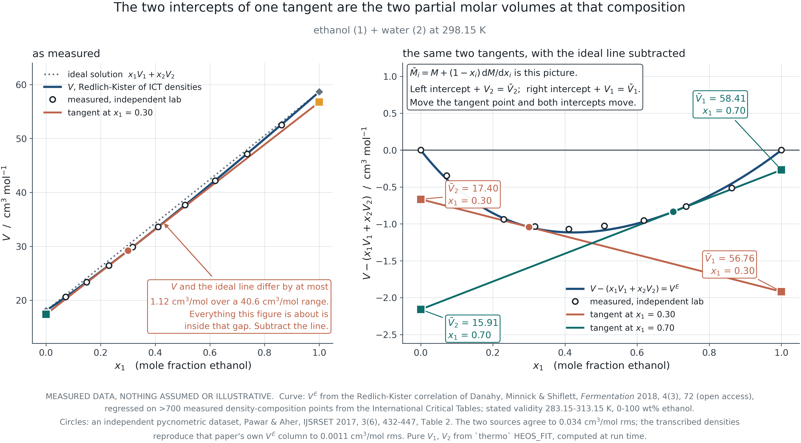
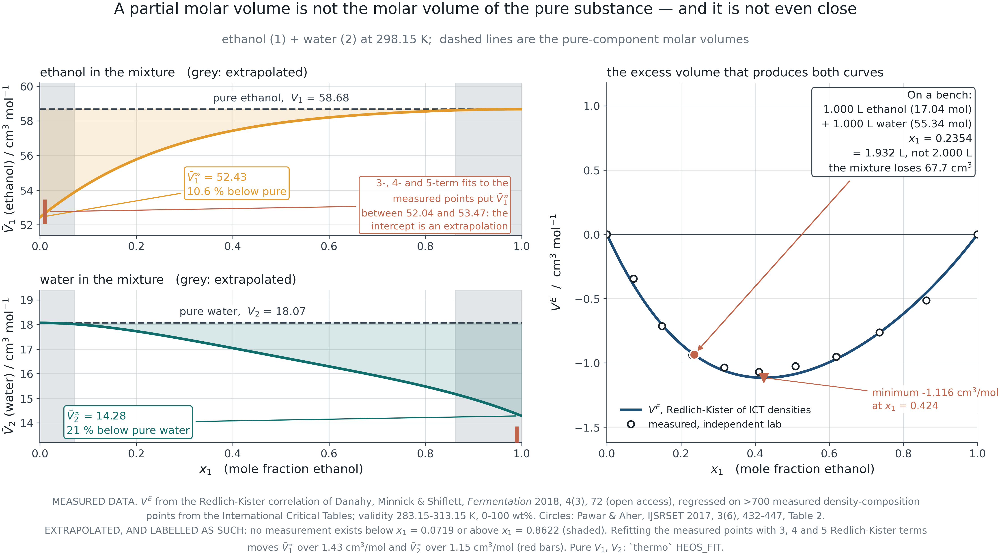
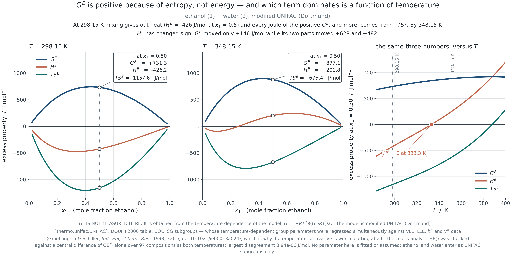
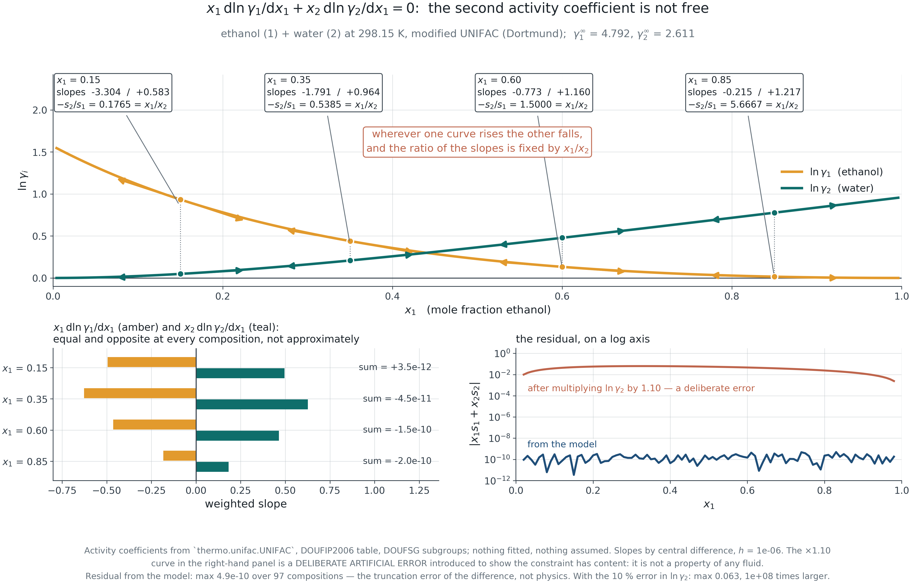
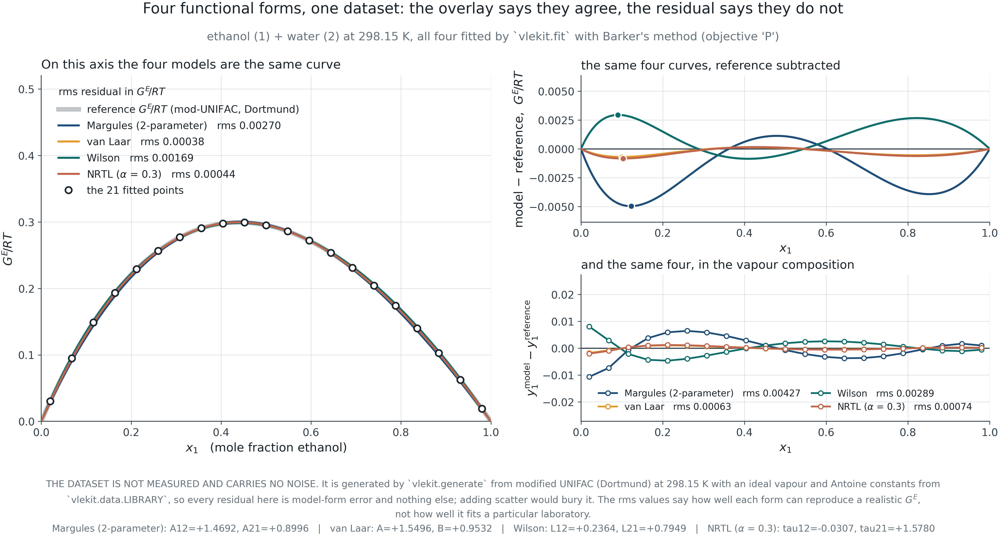
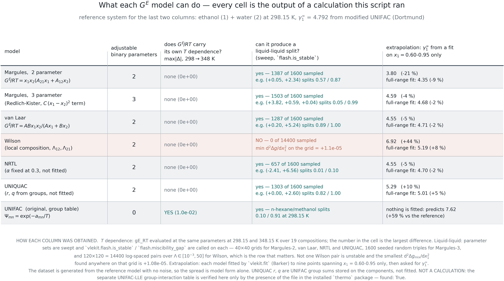

## &nbsp; {.dark .mid background-color="#1C242B"}

:::: {.vcenter}
::: {.statement}
A partial molar property is not a property of the pure substance.
:::

::: {.statement-hi}
Mix one litre of ethanol with one litre of water and you get 1.93 litres.
:::
::::

::: {.notes}
**TEACHING TIP**
Open with the measurement, not the definition. The volume contraction is
counter-intuitive, it is enormous — 68 cm³ out of 2000 — and it is the single
most effective way to make "partial molar" mean something before any algebra
appears.

**ASK THE CLASS**
Where did the missing 68 cm³ go?
:::

## What this module builds

::: {.kicker .c-amber}
Introduction
:::

::: {.lede}
The mixture toolkit, with the rigour Module 1 applied to pure fluids: partial
molar properties, fugacity in a mixture, excess properties, activity, and the
constraint that ties them together.
:::

:::::: {.columns}
::::: {.column width="48%"}
:::: {.cards}
::: {.card}

[The callback]{.card-h .c-teal}

The mixture fugacity coefficient is a **composition derivative of the same
residual Helmholtz energy Module 1 built**. The equation of state is not left
behind when mixtures arrive; it is differentiated once more.

:::
::::
:::::

::::: {.column width="48%"}
:::: {.cards}
::: {.card}

[Five questions]{.card-h .c-amber}

- What is a partial molar property, and why is it not a pure-component one?
- What is $\hat f_i$, promised at the end of Module 2?
- What is an excess property measured against?
- What constraint links $\gamma_1$ and $\gamma_2$?
- What is a model, once you see what $G^E$ is?

:::
::::
:::::
::::::

::: {.notes}
**TEACHING TIP**
The last question is the hinge of the module. Every activity coefficient model
in Section 3.5 is nothing but a choice of functional form for $G^E$. Once
students see that, the list of models stops being a list to memorise.
:::

## Partial molar properties {.dark .divider .c-teal background-color="#1C242B"}

::: {.kicker .c-amber}
PART I
:::

::: {.lede}
Section 3.1&nbsp;&nbsp;&nbsp;A composition derivative, a tangent construction, and a constraint that returns in Module 4.
:::

## The definition, and the Euler relation

::: {.kicker .c-amber}
3.1 · Partial molar properties
:::

::: {.lede}
The contribution one species makes to a mixture property, at fixed everything
else.
:::

$$\bar M_i \equiv \left(\frac{\partial (nM)}{\partial n_i}\right)_{T,P,n_{j\ne i}}
\qquad\qquad
nM = \sum_i n_i \bar M_i
\qquad\qquad
M = \sum_i x_i \bar M_i$$

:::: {.cards}
::: {.card}

[Why $T$, $P$ and $n_j$ are all fixed]{.card-h .c-teal}

Change any of them and you are measuring something else. The subscripts are not
decoration: a derivative at constant $T$ and $V$ is a different quantity with a
different value, and the two get confused constantly.

:::

::: {.card}

[What the Euler relation says]{.card-h .c-amber}

The mixture property is exactly the mole-weighted sum of the partial molar
values — with no leftover term. That is not obvious, and it is the reason the
partial molar quantity is the *right* way to apportion a mixture property among
its species.

:::
::::

::: {.notes}
**TEACHING TIP**
The Euler relation follows from $nM$ being homogeneous of degree one in the mole
numbers. State that; do not prove it unless asked.

**COMMON MISCONCEPTION**
That $\bar M_i$ is "the property of $i$ in the mixture" in a possessive sense.
It is the *marginal* contribution of adding a mole of $i$ — which is why it can
be negative.
:::

## The tangent-intercept construction

::: {.kicker .c-amber}
3.1 · Partial molar properties
:::

{.fig-xl}

::: {.source}
F3.1 · Measured ethanol/water molar volume at 298.15 K. The tangent's two intercepts *are* the partial molar volumes.
:::

::: {.notes}
**TEACHING TIP**
The construction is the geometric content of
$\bar M_1 = M + (1-x_1)\,{\rm d}M/{\rm d}x_1$. Draw the tangent, drop to both
axes, read off two numbers.

Note the second panel: on the raw molar volume axis the excess is 1.1 cm³/mol
against a 40 cm³/mol range and is invisible. The same tangents are redrawn with
the ideal line subtracted, which is the only way to see what is going on. That
is a general lesson about plotting a small departure from a large trend.

**ASK THE CLASS**
What would the tangent look like for an ideal solution, and what would the
intercepts be?
:::

## Partial molar volume can be negative

::: {.kicker .c-amber}
3.1 · Partial molar properties
:::

{.fig-lg width="74%"}

:::: {.cards}
::: {.card}

[The number]{.card-h .c-rust}

At infinite dilution in water, the partial molar volume of ethanol falls about
11 % below its pure molar volume, and water's falls about 21 % below its own.
Adding a mole of ethanol to a large volume of water adds *less* volume than a
mole of pure ethanol occupies.

:::

::: {.card}

[Why]{.card-h .c-teal}

Water's hydrogen-bonded network has voids. A small solute can sit in them, so
the mixture takes up less room than the sum of the parts. In systems with
stronger effects — an electrolyte in water — the partial molar volume of the
salt is genuinely **negative**.

:::
::::

::: {.source}
F3.2 · From the same measured data, differentiated. The infinite-dilution values are extrapolations and the figure marks the region where no data exist.
:::

::: {.notes}
**TEACHING TIP**
This is the demonstration to spend time on. A property that is negative cannot
possibly be "the volume of the species".

**HONESTY POINT worth making to the class**
The infinite-dilution values are extrapolated — the data stop around
$x_{\rm EtOH} = 0.07$. Refitting with three, four and five Redlich-Kister terms
moves $\bar V_1^\infty$ by about 1.4 cm³/mol, and the accepted dilatometric
value from the literature sits above all of them. Say so. The figure shades the
extrapolated region for exactly this reason, and it previews the extrapolation
argument that Module 4 makes central.
:::

## Gibbs-Duhem, in full

::: {.kicker .c-amber}
3.1 · Partial molar properties
:::

::: {.lede}
Write it with all its terms before dropping any, because the dropped ones come
back in Module 4.
:::

$$\left(\frac{\partial M}{\partial T}\right)_{P,x}{\rm d}T
+ \left(\frac{\partial M}{\partial P}\right)_{T,x}{\rm d}P
- \sum_i x_i\,{\rm d}\bar M_i = 0$$

$$\xrightarrow[\ \text{constant } T,\,P\ ]{}\qquad
\sum_i x_i\,{\rm d}\bar M_i = 0$$

:::: {.cards}
::: {.card}

[What it means]{.card-h .c-teal}

The partial molar properties of a mixture are **not independent functions of
composition**. Specify one across the range and the other is determined. This is
a constraint imposed by thermodynamics, not a modelling convenience.

:::

::: {.card}

[The dropped terms]{.card-h .c-rust}

Constant $T$ and $P$ is the usual specialisation and it is the one every
textbook uses. Isobaric VLE data are *not* at constant $T$, so the temperature
term survives — as an excess enthalpy contribution that most published
consistency tests quietly drop. Module 4 quantifies it.

:::
::::

::: {.notes}
**TEACHING TIP**
Flag the dropped term audibly. Three weeks later, in Module 4, a figure shows
that at the dilute end of an isobaric ethanol/water set the dropped term is
comparable to the residual being tested. Students who heard the flag here will
recognise it.
:::

## Fugacity in a mixture {.dark .divider .c-teal background-color="#1C242B"}

::: {.kicker .c-amber}
PART II
:::

::: {.lede}
Section 3.2&nbsp;&nbsp;&nbsp;The composition derivative promised at the end of Module 2.
:::

## Chemical potential is a partial molar property

::: {.kicker .c-amber}
3.2 · Chemical potential and fugacity in a mixture
:::

::: {.lede}
Nothing mysterious. It is the partial molar Gibbs energy, and it inherits every
property partial molar quantities have.
:::

$$\mu_i \equiv \left(\frac{\partial (nG)}{\partial n_i}\right)_{T,P,n_{j\ne i}} = \bar G_i$$

$$\hat f_i \ \text{ defined by }\ {\rm d}\mu_i = RT\,{\rm d}\ln \hat f_i
\qquad\qquad
\hat\varphi_i = \frac{\hat f_i}{y_i P}$$

:::: {.cards}
::: {.card}

[The pattern repeats]{.card-h .c-amber}

Module 2 defined $f$ so that ${\rm d}\mu = RT\,{\rm d}\ln f$ held for a pure
fluid. The mixture definition is the same construction applied to $\mu_i$, with
$\hat f_i / (y_i P) \to 1$ as $P \to 0$ fixing the constant.

:::

::: {.card}

[Where Gibbs-Duhem bites]{.card-h .c-teal}

Because $\mu_i$ is a partial molar property, $\sum_i x_i\,{\rm d}\mu_i = 0$ at
constant $T$ and $P$ — and therefore $\sum_i x_i\,{\rm d}\ln\hat f_i = 0$. The
constraint is inherited, not added.

:::
::::

::: {.notes}
**TEACHING TIP**
Make the inheritance explicit. Students treat the Gibbs-Duhem relation for
activity coefficients as a separate fact to memorise; it is a consequence of
$\mu_i$ being a partial molar quantity.
:::

## From the equation of state, again

::: {.kicker .c-amber}
3.2 · Chemical potential and fugacity in a mixture
:::

::: {.lede}
$\ln\hat\varphi_i$ is the composition derivative of the residual property Module
1 built. The equation of state carries straight into mixtures.
:::

$$\ln\hat\varphi_i = \frac{1}{RT}\int_\infty^{V}\!
\left[\left(\frac{\partial P}{\partial n_i}\right)_{T,V,n_{j}} - \frac{RT}{V}\right]{\rm d}V
\; - \ln Z$$

:::: {.cards}
::: {.card}

[For Peng-Robinson]{.card-h .c-teal}

With the van der Waals one-fluid rule
$a = \sum_i\sum_j x_ix_j\sqrt{a_ia_j}(1-k_{ij})$ and $b = \sum_i x_i b_i$, the
integral closes and gives a formula of the same shape as the pure-component one
plus two composition-derivative terms — $\bar b_i/b$ and
$\sum_j x_j a_{ij}/a$.

:::

::: {.card}

[Why this matters later]{.card-h .c-amber}

This is the $\hat\varphi_i$ that appears in the gamma-phi equation of Module 4,
in the phi-phi route of Module 5, and in $K_\varphi$ in Module 6. It is
computed once and used in three later modules.

:::
::::

::: {.notes}
**TEACHING TIP**
Point out that $k_{ij}$ has just appeared for the first time and that it is
*fitted*, not predicted. Module 6 will quantify how little it is worth for one
particular problem — and Module 5 will show where the quadratic rule fails
structurally.
:::

## The ideal solution is a model

::: {.kicker .c-amber}
3.2 · Chemical potential and fugacity in a mixture
:::

::: {.lede}
The Lewis-Randall rule is an assumption about behaviour, not a definition.
Saying so now prevents a lot of confusion in Module 4.
:::

$$\hat f_i^{\,\rm id} = x_i f_i
\qquad\qquad
\bar M_i^{\,\rm id} = M_i \ \ \text{for } V \text{ and } U,
\qquad
\bar G_i^{\,\rm id} = G_i + RT\ln x_i$$

:::: {.cards}
::: {.card}

[What it assumes]{.card-h .c-rust}

That a molecule of $i$ sees the same environment in the mixture as in pure $i$.
True when the species are chemically almost identical — benzene and toluene —
and false the moment hydrogen bonding or a size disparity enters.

:::

::: {.card}

[Why the entropy term survives]{.card-h .c-teal}

Even an ideal solution has $\bar G_i \ne G_i$: there is an entropy of mixing
whatever the interactions are. Ideality is a statement about *energies*, not
about entropy — which is why $\Delta g_{\rm mix}$ never vanishes and why Module
5's stability argument has an ideal part that always favours mixing.

:::
::::

::: {.notes}
**COMMON MISCONCEPTION**
That an ideal solution has zero Gibbs energy of mixing. It has zero *excess*
Gibbs energy. The distinction is exactly the subject of the next section.
:::

## Excess properties and activity {.dark .divider .c-teal background-color="#1C242B"}

::: {.kicker .c-amber}
PART III
:::

::: {.lede}
Section 3.3&nbsp;&nbsp;&nbsp;Departure from an ideal solution, and the reference state that decides the number.
:::

## Excess, and why the reference is a solution

::: {.kicker .c-amber}
3.3 · Excess properties, activity and the reference state
:::

::: {.lede}
A residual property is measured against an ideal *gas*. An excess property is
measured against an ideal *solution*. Different baselines, different questions.
:::

$$M^E \equiv M - M^{\,\rm id}
\qquad\qquad
a_i \equiv \frac{\hat f_i}{f_i^{\,\circ}}
\qquad\qquad
\gamma_i \equiv \frac{a_i}{x_i} = \frac{\hat f_i}{x_i f_i^{\,\circ}}$$

:::: {.cards}
::: {.card}

[Why not an ideal gas]{.card-h .c-teal}

Because the departure of a liquid from an ideal gas is enormous and almost
entirely uninteresting — it is dominated by condensation, which is a
pure-component effect. The departure from an ideal *solution* isolates what
mixing did.

:::

::: {.card}

[The central identity]{.card-h .c-amber}

$$\frac{G^E}{RT} = \sum_i x_i \ln\gamma_i$$

and $\ln\gamma_i$ is the **partial molar quantity of $G^E/RT$**. Everything in
Modules 4 and 5 rests on that one line.

:::
::::

::: {.notes}
**TEACHING TIP**
Write the identity and box it. In Module 4 the toolkit will verify numerically,
for every model, that the analytical $\ln\gamma_i$ really is the partial molar
derivative of that model's own $G^E$ — because a class that disagrees describes
two different models.
:::

## Which terms dominate, and when

::: {.kicker .c-amber}
3.3 · Excess properties, activity and the reference state
:::

{.fig-xl}

::: {.source}
F3.3 · $G^E = H^E - TS^E$ at two temperatures. $H^E$ here is a model derivative, not a calorimeter reading — the figure says so.
:::

::: {.notes}
**TEACHING TIP**
Read the balance. At 298 K this system's excess Gibbs energy is positive while
its excess enthalpy is *negative* — the positive $G^E$ is entirely entropic,
which is the signature of structural ordering in the mixture. By 348 K the
enthalpy term has changed sign.

**HONESTY POINT**
$H^E$ was obtained from the temperature dependence of a $G^E$ model, not
measured. It is checked against its own definition to $4\times10^{-6}$ J/mol,
which verifies the differentiation and nothing else. A calorimetric $H^E$ would
be a genuinely independent test and would be worth having.
:::

## Lewis-Randall against Henry

::: {.kicker .c-amber}
3.3 · Excess properties, activity and the reference state
:::

::: {.lede}
The same physical system gives different numerical $\gamma$ under the two
conventions. Two papers can disagree without either being wrong.
:::

:::: {.cards}
::: {.card}

[Lewis-Randall]{.card-h .c-teal}

$f_i^{\,\circ} = f_i$, the pure liquid, so $\gamma_i \to 1$ as $x_i \to 1$.

Natural for a solvent, or for components of comparable amount. The convention
used throughout Modules 4 and 5.

:::

::: {.card}

[Henry]{.card-h .c-amber}

$f_i^{\,\circ} = \mathcal{H}_i$, the Henry constant, so $\gamma_i^* \to 1$ as
$x_i \to 0$.

Natural for a dissolved gas or a solute that never approaches purity — and
essential when the pure liquid does not exist at those conditions.

:::
::::

::: {.note}
$\gamma_i^* = \gamma_i / \gamma_i^\infty$. The conversion is one division, and
the number changes by whatever $\gamma_i^\infty$ happens to be — often a factor
of five or more. **A $\gamma$ without its convention is not a number.**
:::

::: {.notes}
**TEACHING TIP — the risk this module carries**
The reference-state distinction is abstract until it bites. Bring two published
$\gamma$ values for the same system that differ by a factor, hand them out, and
let the class discover why before you explain it. Nothing else makes the point
stick.
:::

## Gibbs-Duhem as a constraint {.dark .divider .c-teal background-color="#1C242B"}

::: {.kicker .c-amber}
PART IV
:::

::: {.lede}
Section 3.4&nbsp;&nbsp;&nbsp;$\gamma_1$ and $\gamma_2$ are not independent functions. Fitting them separately is not allowed.
:::

## The binary form

::: {.kicker .c-amber}
3.4 · Gibbs-Duhem as a constraint on activity coefficients
:::

$$\sum_i x_i\,{\rm d}\ln\gamma_i = 0
\qquad\Longrightarrow\qquad
x_1 \frac{{\rm d}\ln\gamma_1}{{\rm d}x_1}
+ x_2 \frac{{\rm d}\ln\gamma_2}{{\rm d}x_1} = 0$$

:::::: {.cards .g3}
::: {.card}

[Opposite signs, fixed ratio]{.card-h .c-teal}

Wherever one curve rises the other must fall, and the slopes stand in the ratio
$-x_2/x_1$. Not approximately — exactly, at every composition.

:::

::: {.card}

[At the ends]{.card-h .c-amber}

As $x_1 \to 1$, ${\rm d}\ln\gamma_1/{\rm d}x_1 \to 0$: the curve for the
*abundant* component must flatten. A fitted $\gamma_1$ with a finite slope at
$x_1 = 1$ is not admissible, whatever its residual.

:::

::: {.card}

[The consequence]{.card-h .c-rust}

Fitting $\ln\gamma_1$ and $\ln\gamma_2$ as two independent functions produces a
pair that thermodynamics forbids. Fitting one $G^E$ and differentiating it
cannot — which is the whole reason models are written as $G^E$.

:::
::::::

::: {.notes}
**TEACHING TIP**
The end-slope condition is the one students can check by eye on any published
figure, and a surprising number of published figures fail it.
:::

## The constraint, drawn

::: {.kicker .c-amber}
3.4 · Gibbs-Duhem as a constraint on activity coefficients
:::

{.fig-xl}

::: {.source}
F3.4 · Paired tangents at four compositions. The slope ratio equals $-x_2/x_1$ at every one.
:::

::: {.notes}
**TEACHING TIP**
Walk along the four pairs. At $x_1 = 0.15$ the ratio is 0.176; at 0.85 it is
5.67 — and $x_1/x_2$ at those compositions is 0.176 and 5.67. The agreement is
exact, not fitted.

Then the demonstration that matters: scaling $\ln\gamma_2$ alone by 10 % — a
change no eye would catch on the plot — raises the weighted sum from
$5\times10^{-10}$ to 0.063, a hundred million times larger. That is why a
consistency test can detect an error a plot cannot show.
:::

## Models are choices of $G^E$ {.dark .divider .c-teal background-color="#1C242B"}

::: {.kicker .c-amber}
PART V
:::

::: {.lede}
Section 3.5&nbsp;&nbsp;&nbsp;Once you see that, the list of models stops being a list to memorise.
:::

## One expansion, several special cases

::: {.kicker .c-amber}
3.5 · Models as choices of excess Gibbs energy
:::

::: {.lede}
Redlich-Kister is the general polynomial truncation. Margules and van Laar fall
out of it.
:::

$$\frac{G^E}{RT} = x_1x_2\left[A + B(x_1-x_2) + C(x_1-x_2)^2 + \cdots\right]$$

:::::: {.cards .g3}
::: {.card}

[$B = C = 0$]{.card-h .c-teal}

Two-suffix Margules. One parameter, symmetric, and structurally unable to skew.

:::

::: {.card}

[$C = 0$]{.card-h .c-amber}

Three-suffix Margules. Two parameters, and $\ln(\gamma_1/\gamma_2)$ becomes
quadratic in $x_1 - x_2$ — which is enough to produce a **double azeotrope**, a
thing often wrongly said to need three.

:::

::: {.card}

[van Laar]{.card-h .c-rust}

Not a truncation but a ratio of polynomials. Two parameters, and its
$\ln(\gamma_1/\gamma_2)$ has exactly one interior zero for same-sign
parameters — so it *cannot* produce a double azeotrope, whatever the fit.

:::
::::::

::: {.notes}
**TEACHING TIP**
The Margules-versus-van-Laar contrast is the cleanest example in the course of
"the shape of $G^E$ decides what the model can represent, not the parameter
count". Module 5 makes the same argument for liquid-liquid equilibrium.
:::

## Local composition models

::: {.kicker .c-amber}
3.5 · Models as choices of excess Gibbs energy
:::

::: {.lede}
State the physical assumption behind each, not only the algebra.
:::

:::::: {.cards .g3}
::: {.card}

[Wilson]{.card-h .c-teal}

The composition *around* a molecule differs from the bulk composition,
Boltzmann-weighted by interaction energy. Two parameters, good temperature
behaviour, and **structurally incapable of liquid-liquid equilibrium**.

:::

::: {.card}

[NRTL]{.card-h .c-amber}

The same local-composition idea plus a non-randomness parameter $\alpha$, which
gives the model a second length scale. Two fitted parameters with $\alpha$
usually fixed at 0.3 — and it *can* produce a phase split.

:::

::: {.card}

[UNIQUAC]{.card-h .c-rust}

Splits $G^E$ into a combinatorial part from molecular size and shape — fixed by
$r$ and $q$, which are **not fitted** — and a residual part carrying the two
adjustable energies. Extrapolates in composition better for that reason.

:::
::::::

::: {.note}
**UNIFAC** is UNIQUAC with the residual parameters estimated from functional
groups instead of fitted. That makes it *predictive* — usable with no data at
all — and correspondingly less accurate than a fit to your own measurements.
:::

::: {.notes}
**TEACHING TIP**
Say the Wilson limitation now and prove it in Module 5, where the tangent-plane
machinery exists to demonstrate it over a parameter sweep rather than assert it.
:::

## Four models, one dataset

::: {.kicker .c-amber}
3.5 · Models as choices of excess Gibbs energy
:::

{.fig-xl}

::: {.source}
F3.5 · The same $G^E$ fitted four ways. On the upper axis the curves are indistinguishable; the residual panel is where the differences live.
:::

::: {.notes}
**TEACHING TIP**
The upper panel is the lesson: four models with genuinely different functional
forms lie on top of one another, and only the residual panel separates them —
by a factor of seven, van Laar best and two-parameter Margules worst on this
skewed aqueous system.

**HONESTY POINT**
This dataset is synthetic, generated from a group-contribution model with no
noise. The ranking is therefore a statement about which functional form fits
*this shape of $G^E$*, not a league table. On a symmetric system the ordering
would change.
:::

## What each model can and cannot do

::: {.kicker .c-amber}
3.5 · Models as choices of excess Gibbs energy
:::

{.fig-xl}

::: {.source}
F3.6 · Every claim in the table is either derivable from the functional form or verified by a sweep run for this figure.
:::

::: {.notes}
**TEACHING TIP**
Two entries repay dwelling on.

The Wilson row: a sweep of 14,400 parameter pairs found **zero** splits, with
the minimum second derivative of $\Delta g_{\rm mix}$ still positive at
$1\times10^{-5}$. That is not a rule to memorise; it is a computed fact, and
Module 5 will show why the functional form forbids it.

The extrapolation column: fitting only $x_1 = 0.60$ to $0.95$ and predicting
$\gamma_1^\infty$ gives answers spanning 65 percentage points across models
that all match the fitted window to under 0.0005 kPa. That is the entire
argument of Module 4, previewed here on models rather than data.
:::

## What you must be able to do

::: {.kicker .c-amber}
Closing
:::

::: {.lede}
The module in six statements.
:::

:::: {.numbered .n3 .two-col}
1. **Define a partial molar property** and explain, with the ethanol/water number, why it is not a property of the pure substance.
2. **Use the tangent-intercept construction** and say what it is computing.
3. **Write Gibbs-Duhem in full** and name the term that is dropped at constant $T$ and $P$ — and where it returns.
4. **Get $\hat\varphi_i$ from an equation of state** and recognise it as a composition derivative of Module 1's residual property.
5. **State a reference state whenever you state a $\gamma$.** Lewis-Randall or Henry, and the conversion between them.
6. **Read a model as a choice of $G^E$** and say what its functional form can and cannot represent.
::::

::: {.notes}
**TEACHING TIP**
Close on the hinge. Module 4 fits these models to data and asks what the fit is
worth; Module 5 asks whether the answer is stable. Both take for granted that a
model is a choice of $G^E$ — which is the one idea this module exists to
install.
:::
