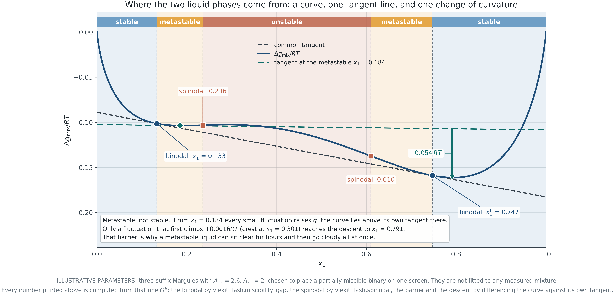
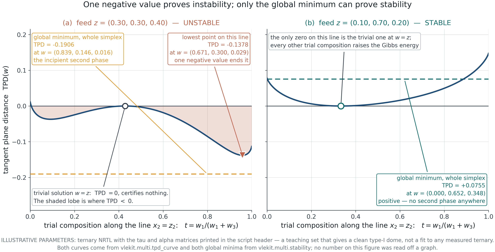
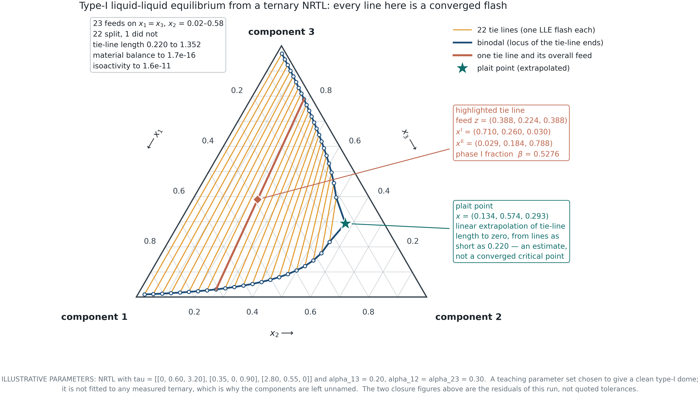
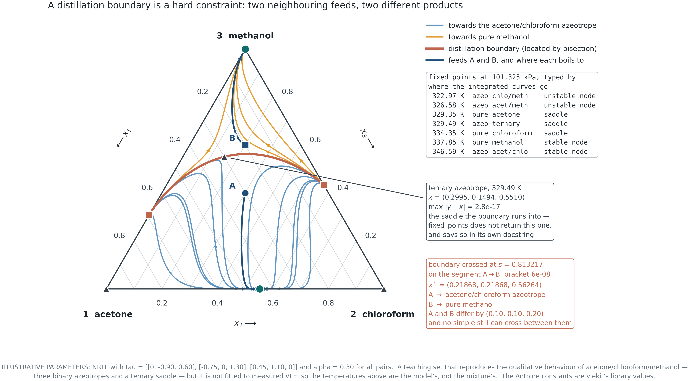
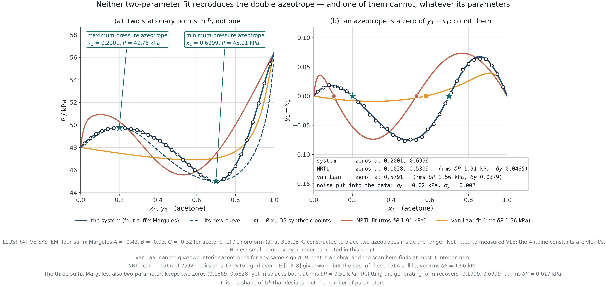
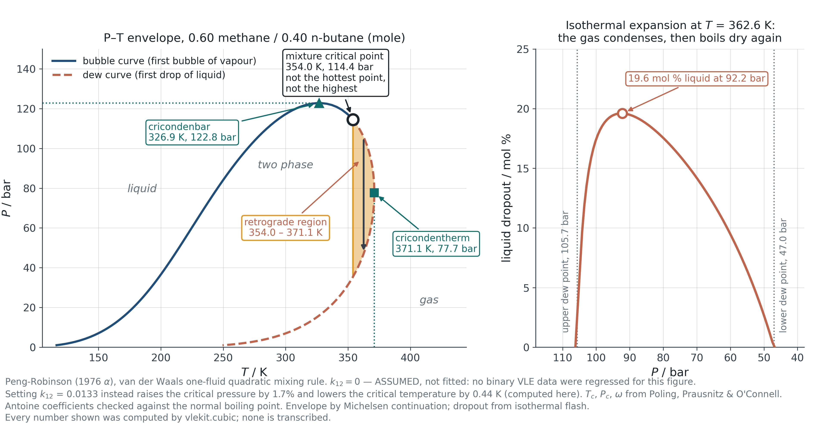

## &nbsp; {.dark .mid background-color="#1C242B"}

:::: {.vcenter}
::: {.statement}
Convergence is not correctness.
:::

::: {.statement-hi}
A flash calculation solves the equations it was given. It does not check that they were the right equations.
:::
::::

::: {.notes}
**TEACHING TIP**
Lead with the counterexample, not the theory. Before any equation, run a flash
that converges cleanly in four iterations to a single-phase answer, then show
that the stability test rejects it. Students treat a converged calculation as a
correct one, and the habit only breaks when they watch it fail.

**ASK THE CLASS**
Your simulator returns a liquid composition and no error message. What have you
actually been told?
:::

## What this module establishes

::: {.kicker .c-amber}
Introduction
:::

::: {.lede}
Module 4 ended with a flash that had no way of noticing it was solving the
wrong problem. This module supplies the missing test, and then follows the
consequences.
:::

:::::: {.columns}
::::: {.column width="48%"}
:::: {.cards}
::: {.card}

[The callback]{.card-h .c-teal}

Module 1 introduced mechanical stability for a pure fluid through the
spinodal — the locus where $(\partial P/\partial V)_T = 0$ and the fluid can no
longer resist a density fluctuation.

This module is the same idea in composition space, where it becomes the
tangent plane criterion.

:::
::::
:::::

::::: {.column width="48%"}
:::: {.cards}
::: {.card}

[Four questions]{.card-h .c-amber}

- Where do two liquid phases come from?
- How do I test whether a computed phase is stable?
- What does a ternary split look like, and which models can produce one?
- What does all this cost a separation designer?

:::
::::
:::::
::::::

::: {.notes}
**TEACHING TIP**
The vertical rhyme with Module 1 is the organising idea. Draw the pure-fluid
spinodal on the board first, then say that everything today replaces "volume"
with "composition" and "curve" with "surface".
:::

## Stability from the Gibbs energy of mixing {.dark .divider .c-teal background-color="#1C242B"}

::: {.kicker .c-amber}
PART I
:::

::: {.lede}
Section 5.1&nbsp;&nbsp;&nbsp;One curve, one tangent line, and one change of curvature. Everything about a binary split is in that picture.
:::

::: {.notes}
**TEACHING TIP**
Keep this section geometric. The algebra is trivial; the picture is what
students retain and what generalises to the ternary case.
:::

## Why a liquid splits at all

::: {.kicker .c-amber}
5.1 · Stability from the Gibbs energy of mixing
:::

::: {.lede}
Mixing is entropically favourable. A split needs the energetic term to defeat
that, and it can only do so over part of the range.
:::

$$\frac{\Delta g_{\rm mix}}{RT}
 = \underbrace{x_1\ln x_1 + x_2\ln x_2}_{\text{ideal, always convex}}
 \; + \; \underbrace{\frac{G^E}{RT}}_{\text{can be concave}}$$

:::: {.cards}
::: {.card}

[The competition]{.card-h .c-teal}

The ideal part is convex everywhere and has infinite slope at both ends, which
is why a *little* of anything always dissolves. A split therefore never reaches
the pure vertices.

:::

::: {.card}

[The threshold]{.card-h .c-amber}

For the symmetric case $G^E/RT = A x_1 x_2$, the curve first loses convexity at
$A = 2$, at $x_1 = \tfrac12$. Below that value no parameter combination can
produce two phases; above it, the gap opens from the middle outwards.

:::
::::

::: {.notes}
**TEACHING TIP**
$A = 2$ is worth deriving live: $\mathrm{d}^2\Delta g/\mathrm{d}x^2 =
1/x_1 + 1/x_2 - 2A$, which first vanishes at $x_1 = 1/2$ where
$1/x_1 + 1/x_2 = 4$.

**COMMON MISCONCEPTION**
That immiscibility means "no dissolution". The infinite slope of the ideal term
at the vertices guarantees finite mutual solubility for every pair, however
unlike. Water and hexane dissolve in each other; only barely.
:::

## The picture

::: {.kicker .c-amber}
5.1 · Stability from the Gibbs energy of mixing
:::

{.fig-xl}

::: {.source}
F5.1 · Binodal from the common tangent, spinodal from the change of curvature, and the metastable band between them.
:::

::: {.notes}
**TEACHING TIP**
Trace the construction in order: draw the curve, lay a ruler on it until it
touches twice, mark the two touch points — those are the phases in equilibrium.
Then mark the two inflections. The bands between them are metastable.

**ASK THE CLASS**
Why must the tangent touch at two points rather than cross?
:::

## Metastable is not stable, and it is not a technicality

::: {.kicker .c-amber}
5.1 · Stability from the Gibbs energy of mixing
:::

::: {.lede}
Between the binodal and the spinodal a liquid is stable against *small*
fluctuations and unstable against large ones.
:::

:::::: {.cards .g3}
::: {.card}

[Unstable]{.card-h .c-rust}

Inside the spinodal, $\mathrm{d}^2\Delta g/\mathrm{d}x_1^2 < 0$. Any
fluctuation, however small, lowers the Gibbs energy. Separation begins
everywhere at once and needs no nucleus.

:::

::: {.card}

[Metastable]{.card-h .c-amber}

Between binodal and spinodal the curve lies **above** its own local tangent
nearby, so a small fluctuation is resisted. In the case on the previous slide
the barrier is $+0.0016\,RT$ and the eventual descent is $-0.054\,RT$: a
thirty-fold reward, behind a small wall.

:::

::: {.card}

[Why it matters]{.card-h .c-teal}

A metastable liquid can sit clear for hours and then go cloudy all at once when
a nucleus appears. Emulsions, supersaturated solutions and polymer blends all
live in this band, and a design that assumes equilibrium will be surprised.

:::
::::::

::: {.notes}
**TEACHING TIP**
The barrier and the descent are on the figure and are computed, not asserted.
Point at the ratio: metastability is not a small effect that can be neglected;
it is a small barrier in front of a large reward, which is exactly the
configuration that produces long induction times.

**ASK THE CLASS**
Which region does a laboratory sample that "suddenly turned milky" come from?
:::

## Tangent plane distance {.dark .divider .c-teal background-color="#1C242B"}

::: {.kicker .c-amber}
PART II
:::

::: {.lede}
Section 5.2&nbsp;&nbsp;&nbsp;The common tangent works for a binary because a tangent is a line. For three components it is a plane, and for more it cannot be drawn at all.
:::

::: {.notes}
**TEACHING TIP**
Say what breaks. The construction in Part I is not wrong for a ternary — it is
undrawable. Michelsen's criterion is what survives the loss of the picture.
:::

## The criterion

::: {.kicker .c-amber}
5.2 · Tangent plane distance
:::

::: {.lede}
Michelsen: a phase is stable if and only if the tangent plane distance is
non-negative for **every** trial composition.
:::

$$\mathrm{TPD}(\mathbf{w})
 = \sum_i w_i\left[\ln w_i + \ln\gamma_i(\mathbf{w})
   - \ln z_i - \ln\gamma_i(\mathbf{z})\right]$$

:::: {.cards}
::: {.card}

[What it measures]{.card-h .c-teal}

The vertical distance from the Gibbs energy surface at the trial composition
$\mathbf{w}$ down to the plane tangent to that surface at the feed
$\mathbf{z}$. Negative means some other phase lies below the plane, so the feed
is not the global minimum.

:::

::: {.card}

[The asymmetry]{.card-h .c-rust}

**One negative value anywhere proves instability.** Proving *stability*
requires the global minimum over the whole composition space — a much harder
claim, and the reason stability analysis is a research topic rather than a
formula.

:::
::::

::: {.notes}
**TEACHING TIP**
Emphasise the asymmetry. Instability has a certificate: show the composition.
Stability has none, only a failure to find one, which is why implementations
use many starting points and still cannot promise correctness.
:::

## What it looks like

::: {.kicker .c-amber}
5.2 · Tangent plane distance
:::

{.fig-xl}

::: {.source}
F5.2 · The same criterion on an unstable and a stable feed. Note that the drawn line is a slice: the global minimum of the unstable case lies off it.
:::

::: {.notes}
**TEACHING TIP**
The slice caveat on the right of the figure is not a defect, it is the lesson.
A one-dimensional cut through composition space can miss instability
altogether — for this feed the constant-$x_3$ cut is non-negative everywhere.
That is precisely why the criterion is stated over the whole simplex and why
the minimisation needs several starting points.

**ASK THE CLASS**
If a slice can miss it, how would you choose where to start looking?
:::

## The trivial solution

::: {.kicker .c-amber}
5.2 · Tangent plane distance
:::

::: {.lede}
$\mathbf{w} = \mathbf{z}$ gives $\mathrm{TPD} = 0$ exactly, for every feed,
stable or not. It is a stationary point and it certifies nothing.
:::

:::::: {.cards .g3}
::: {.card}

[The trap]{.card-h .c-rust}

Start the minimisation at the feed and it will sit there, return zero, and
report stability. The answer looks like a converged calculation because it is
one.

:::

::: {.card}

[The remedy]{.card-h .c-amber}

Start near each pure component, and from the feed pushed halfway toward each
vertex. Discard any converged trial phase that has come back to the feed. This
is Michelsen's recommendation and it is what the course code does.

:::

::: {.card}

[Where it is used]{.card-h .c-teal}

Stability analysis runs **before** the flash, not after. The trial phase it
returns is also the best available initial estimate for the flash that follows,
so the test pays for itself.

:::
::::::

::: {.notes}
**TEACHING TIP**
This is the slide that connects theory to what a simulator actually does. The
sequence is: stability test → if unstable, use the trial phase to initialise →
flash. Students who have seen that sequence understand why a flowsheet package
sometimes reports three phases without being asked.
:::

## Liquid-liquid equilibrium {.dark .divider .c-teal background-color="#1C242B"}

::: {.kicker .c-amber}
PART III
:::

::: {.lede}
Section 5.3&nbsp;&nbsp;&nbsp;What a split looks like when there are three components, and which models can produce one at all.
:::

## The ternary picture

::: {.kicker .c-amber}
5.3 · Liquid-liquid and vapour-liquid-liquid equilibrium
:::

{.fig-xl}

::: {.source}
F5.3 · Type-I dome from a ternary NRTL. Every tie line is a converged flash; the plait point is an extrapolation and is labelled as one.
:::

::: {.notes}
**TEACHING TIP**
Three things to point at. The tie lines are not parallel — the distributing
component prefers one phase, and that preference is the whole basis of solvent
extraction. The tie lines shorten upward. At the plait point the two phases
become identical, which is a critical point of the liquid.

**COMMON MISCONCEPTION**
That the tie lines should be horizontal. They would be only if the third
component distributed equally, which would make the extraction useless.

**ASK THE CLASS**
Which phase would you take as the extract, and what does the tie-line slope
tell you about the solvent you should choose?
:::

## Why NRTL can and Wilson cannot

::: {.kicker .c-amber}
5.3 · Liquid-liquid and vapour-liquid-liquid equilibrium
:::

::: {.lede}
This is a property of the functional form, argued from the $G^E$ introduced in
Module 3 — not a matter of finding better parameters.
:::

:::: {.cards}
::: {.card}

[Wilson]{.card-h .c-rust}

$$\frac{G^E}{RT} = -\sum_i x_i \ln\!\Big(\sum_j \Lambda_{ij} x_j\Big)$$

The form cannot make $\Delta g_{\rm mix}$ lose convexity for any positive
$\Lambda$. A sweep over thirty-six binary parameter pairs and twelve random
ternary matrices produces no split — ever.

:::

::: {.card}

[NRTL]{.card-h .c-teal}

The local-composition weighting $G_{ij} = \exp(-\alpha\tau_{ij})$ gives the
model a second scale, and with it the ability to make $G^E$ large and asymmetric
enough to defeat the entropy of mixing. This is why every published LLE
correlation uses NRTL or UNIQUAC and none uses Wilson.

:::
::::

::: {.note}
Module 4 met the same limitation from the other side: fitted to a system that
*does* split, Wilson bought the fit with an infinite-dilution activity
coefficient of about twenty thousand. The absurd number was the symptom; this
is the cause.
:::

::: {.notes}
**TEACHING TIP**
Close the loop explicitly. Students saw the symptom three weeks ago and now see
the mechanism. That kind of delayed payoff is worth naming out loud.
:::

## Three phases, and the counting that goes with them

::: {.kicker .c-amber}
5.3 · Liquid-liquid and vapour-liquid-liquid equilibrium
:::

::: {.lede}
Vapour over two liquids is common in practice — steam distillation, azeotropic
drying, any decanter on a column overhead.
:::

$$F = C - \pi + 2$$

| System | $C$ | $\pi$ | $F$ | What is left free |
|---|---|---|---|---|
| Binary VLE | 2 | 2 | 2 | $T$ and $P$, or $T$ and $x_1$ |
| Binary VLLE | 2 | 3 | 1 | Fix $P$ and everything else is determined |
| Ternary LLE | 3 | 2 | 3 | $T$, $P$ and one composition |
| Ternary VLLE | 3 | 3 | 2 | $T$ and $P$; all compositions follow |

::: {.note}
Binary VLLE at fixed pressure has **no** remaining freedom: the temperature and
all three compositions are fixed by the system. That is why a heterogeneous
azeotrope boils at a single reproducible temperature.
:::

::: {.notes}
**TEACHING TIP**
The binary VLLE row is the one that surprises people, and it is the one that
makes the decanter trick on the next slide work.
:::

## Parameters fitted to VLE, used for LLE

::: {.kicker .c-amber}
5.3 · Liquid-liquid and vapour-liquid-liquid equilibrium
:::

::: {.lede}
The extrapolation warning from Module 4, in its most expensive form.
:::

:::: {.cards}
::: {.card}

[Why it fails]{.card-h .c-rust}

VLE data constrain $G^E$ mainly through its *first* derivative, over the
composition range measured. A phase split is governed by the *second*
derivative, often in a range where no VLE data exist. A parameter set can
reproduce every measured bubble pressure and be wrong about whether the liquid
splits at all.

:::

::: {.card}

[What to do]{.card-h .c-teal}

If the answer depends on the split, fit LLE data — mutual solubilities are
cheap to measure and pin the second derivative directly. Where both matter,
fit both together and report the compromise. Never present a VLE-fitted split
as a prediction without saying which data it rests on.

:::
::::

::: {.notes}
**TEACHING TIP**
Recall F4.8: four models indistinguishable on the data, disagreeing about a
liquid-liquid split. This slide is the answer to the question that figure
raised, and the answer is "measure the mutual solubility", not "choose a better
model".
:::

## Azeotropy, boundaries and critical behaviour {.dark .divider .c-teal background-color="#1C242B"}

::: {.kicker .c-amber}
PART IV
:::

::: {.lede}
Section 5.4&nbsp;&nbsp;&nbsp;What all of this costs a separation designer.
:::

## Two kinds of azeotrope

::: {.kicker .c-amber}
5.4 · Azeotropy, distillation boundaries and critical behaviour
:::

::: {.lede}
Homogeneous and heterogeneous. The difference is worth money.
:::

:::: {.cards}
::: {.card}

[Homogeneous]{.card-h .c-amber}

One liquid phase at the azeotropic composition. $y_i = x_i$, no further
separation by ordinary distillation, and no way around it without changing the
pressure or adding an entrainer.

:::

::: {.card}

[Heterogeneous]{.card-h .c-teal}

The azeotropic liquid is **inside a miscibility gap**, so the condensate splits
in a decanter into two liquids of different composition — neither of which is
the azeotrope. The split does the separation that distillation could not, and
each layer is returned to a different column.

That is the industrial route for ethanol dehydration and for drying solvents
with an entrainer.

:::
::::

::: {.notes}
**TEACHING TIP**
Draw the decanter. Vapour of azeotropic composition condenses, separates into
an organic-rich and a water-rich layer, and the two layers go to different
columns. Nothing has crossed a boundary in the vapour; the *liquid* did it.

**ASK THE CLASS**
Why is a heterogeneous azeotrope a gift and a homogeneous one a problem?
:::

## Residue curves and the boundary

::: {.kicker .c-amber}
5.4 · Azeotropy, distillation boundaries and critical behaviour
:::

{.fig-xl}

::: {.source}
F5.4 · Residue curve map. The boundary was located by bisecting between two feeds until the end node flipped, not drawn by hand.
:::

::: {.notes}
**TEACHING TIP**
Residue curves are the composition path of the liquid left behind as a batch
boils away: $\mathrm{d}x_i/\mathrm{d}\xi = x_i - y_i$. Their fixed points are
the pure components and the azeotropes, and the separatrices joining them are
the distillation boundaries.

The two marked feeds differ by 0.10 in two mole fractions and end at completely
different products. No simple still can carry one to the other side.

**COMMON MISCONCEPTION**
That a boundary can be crossed by adding more stages. It cannot: it is a
property of the phase equilibrium, not of the column. Crossing it needs a
different mechanism — a decanter, a pressure swing, or an entrainer that moves
the boundary.

**ASK THE CLASS**
Feed A and feed B differ by a tenth in two mole fractions. Would you have
predicted that they give different products?
:::

## A saddle the search does not look for

::: {.kicker .c-amber}
5.4 · Azeotropy, distillation boundaries and critical behaviour
:::

::: {.lede}
The boundary on the previous slide runs into a **ternary** azeotrope — a fixed
point that involves all three components at once.
:::

:::: {.cards}
::: {.card}

[Why it is hard to find]{.card-h .c-rust}

The course code searches every binary edge for azeotropes by sign change, which
is reliable because each edge is one-dimensional. A ternary azeotrope sits in
the interior, where a sign-change scan does not generalise; finding it reliably
needs a homotopy method. The code says so in its own docstring rather than
returning a list that quietly misses one.

:::

::: {.card}

[Why it matters]{.card-h .c-amber}

Interior fixed points are usually saddles, and saddles are where boundaries
terminate. Miss one and the topology of the map is wrong — which means the
predicted set of reachable products is wrong.

For this system it sits at $x = (0.30, 0.15, 0.55)$ and 329.5 K, where
$\max|y_i - x_i| = 3\times10^{-17}$.

:::
::::

::: {.notes}
**TEACHING TIP**
This is a good place to be honest about the limits of the teaching code. A
tool that tells you what it does not do is more useful than one that appears
complete. Ask the students how they would find an interior fixed point, then
tell them the standard answer is continuation from a known solution.
:::

## Double azeotropy, and what actually decides it

::: {.kicker .c-amber}
5.4 · Azeotropy, distillation boundaries and critical behaviour
:::

{.fig-lg width="82%"}

:::: {.cards}
::: {.card}

[The received version is wrong]{.card-h .c-rust}

It is usually said that a two-parameter model cannot produce a double
azeotrope. Van Laar indeed cannot — for same-sign parameters its
$\ln(\gamma_1/\gamma_2)$ has exactly one interior zero. But NRTL can, and so can
the two-parameter three-suffix Margules.

:::

::: {.card}

[What decides it]{.card-h .c-teal}

The **shape** of $G^E$, not the number of parameters. Here neither fitted
two-parameter model reproduces the second azeotrope: NRTL misplaces both zeros
and leaves an rms error a hundred times the noise.

:::
::::

::: {.source}
F5.6 · An illustrative double azeotrope, with two fitted two-parameter models failing to reproduce it.
:::

::: {.notes}
**TEACHING TIP**
This slide exists partly to correct a piece of received wisdom that appears in
several textbooks. Say that plainly. A scan of 25,921 NRTL parameter pairs
found 1,564 with two interior azeotropes — the model can do it, it just cannot
do it *and* fit this data.

**ASK THE CLASS**
"Model X cannot represent behaviour Y." How would you check a claim of that
kind before repeating it?
:::

## The mixture critical point is not the top

::: {.kicker .c-amber}
5.4 · Azeotropy, distillation boundaries and critical behaviour
:::

{.fig-xl}

::: {.source}
F5.5 · Peng-Robinson envelope for a light/heavy pair. Critical point, cricondentherm and cricondenbar are all different points. $k_{ij} = 0$, assumed and labelled.
:::

::: {.notes}
**TEACHING TIP**
For a pure fluid the critical point *is* the end of the vapour pressure curve,
so students arrive expecting the critical point to be the top of the envelope.
For a mixture the envelope extends beyond it in both temperature and pressure,
and the region between is where retrograde behaviour lives.

**COMMON MISCONCEPTION**
That the two-phase region ends at the critical point. It does not: the
cricondentherm here is 17 K hotter and the cricondenbar 8 bar higher.
:::

## Retrograde condensation

::: {.kicker .c-amber}
5.4 · Azeotropy, distillation boundaries and critical behaviour
:::

::: {.lede}
Drop the pressure at constant temperature and liquid **appears**. Then keep
dropping and it evaporates again.
:::

:::: {.cards}
::: {.card}

[Why it happens]{.card-h .c-amber}

Between the critical temperature and the cricondentherm the dew curve is
crossed **twice** at one temperature. Expanding from high pressure the mixture
enters the two-phase region through the upper dew point, drops out liquid, and
leaves again through the lower one.

:::

::: {.card}

[Why it costs money]{.card-h .c-rust}

Gas-condensate reservoirs sit in exactly this region. As the reservoir is
produced its pressure falls and valuable heavy hydrocarbons condense **in the
pore space**, where they are largely unrecoverable. Field development plans are
built around keeping the pressure above the dew point.

:::
::::

::: {.notes}
**TEACHING TIP**
The dropout panel of F5.5 is computed from ninety isothermal flashes, so the
peak at about 20 mol % is a calculation rather than a sketch. Ask what
operating decision follows from it.

**ASK THE CLASS**
Your reservoir pressure is falling toward the upper dew point. What are your
options, and what does each cost?
:::

## What you must be able to do

::: {.kicker .c-amber}
Closing
:::

::: {.lede}
The module in six statements.
:::

:::: {.numbered .n3 .two-col}
1. **Read a $\Delta g_{\rm mix}$ curve.** Locate the binodal by common tangent and the spinodal by curvature, and say which region a given composition is in.
2. **Apply the tangent plane criterion.** Compute it, interpret its sign, and explain why instability has a certificate and stability does not.
3. **Distinguish metastable from unstable.** And say what each means for what you would observe in a vessel.
4. **Say which models can produce a split, and why.** Argued from the functional form, not from a table of which ones people use.
5. **Read a residue curve map.** Identify the nodes, the boundary, and the products reachable from a given feed.
6. **Explain retrograde condensation.** Including why the critical point is not the top of the envelope.
::::

::: {.notes}
**TEACHING TIP**
Return to the opening statement. Ask whether anyone would now accept a
single-phase flash result without a stability test behind it — and point out
that a commercial simulator runs one whether or not the user asks.
:::
