## &nbsp; {.dark .mid background-color="#1C242B"}

:::: {.vcenter}
::: {.statement}
A parameter set is not a result.
:::

::: {.statement-hi}
A result is a parameter set plus a statement of where it may be used.
:::
::::

::: {.notes}
**TEACHING TIP**
Say this before any equation appears, and say it again at the end. Module 1 was
about which physics a model contains. This module is about what evidence a
number rests on. The two halves of the course meet here: the equation of state
told us how a fluid behaves, and now we ask how we know.

**ASK THE CLASS**
You have a fitted NRTL parameter pair from a paper. What would you need to know
before using it in a column simulation?
:::

## What this module establishes

::: {.kicker .c-amber}
Introduction
:::

::: {.lede}
Four descriptions of the same equilibrium, the behaviour they produce, then the
full working cycle: data, consistency, regression, a stated domain of validity —
and the route back into the equation of state. F4.22, the last figure of the
module, is that whole structure as one decision map.
:::

:::::: {.columns}
::::: {.column width="48%"}
:::: {.cards}
::: {.card}

[The chain of reasoning]{.card-h .c-teal}

An equation of state gives $P$-$V$-$T$ behaviour → equilibrium is governed by
chemical potential → fugacity gives chemical potential a usable form → equality
of fugacity predicts phase equilibrium.

Module 4 is where that chain meets measurement — and, in Section 4.7, where it
returns to the equation of state it started from.

:::
::::
:::::

::::: {.column width="48%"}
:::: {.cards}
::: {.card}

[Seven questions]{.card-h .c-amber}

- Which description of VLE, and what does it cost?
- What kind of mixture is this, and will it azeotrope?
- What is actually measured, and how well?
- Can this dataset be believed?
- Which model, fitted against what?
- Where may the answer be used?
- When does the activity route run out?

:::
::::
:::::
::::::

::: {.notes}
**TEACHING TIP**
Put the seven questions on the board and leave them there for the whole module.
Every slide answers one of them; students should be able to say which.

**COMMON MISCONCEPTION**
That this module is about learning NRTL. NRTL takes ten minutes. The module is
about evidence, and the model is the smallest part of it.
:::

## Four descriptions of one equilibrium {.dark .divider .c-teal background-color="#1C242B"}

::: {.kicker .c-amber}
PART I
:::

::: {.lede}
Section 4.1&nbsp;&nbsp;&nbsp;Raoult, modified Raoult, gamma-phi, phi-phi Each rung adds physics the rung below omitted, and each addition costs something.
:::

::: {.notes}
**TEACHING TIP**
Draw the deliberate parallel with the equation-of-state ladder from Module 1.
The visual rhyme is not decoration: it is the same argument applied to a
different question, and students who saw it once will see it faster the second
time.
:::

## Raoult's law, and its two assumptions

::: {.kicker .c-amber}
4.1 · Four descriptions of the same equilibrium
:::

::: {.lede}
State the two assumptions separately, because they fail separately.
:::

$$y_i P = x_i P_i^{\rm sat}$$

:::::: {.cards .g3}
::: {.card}

[Assumption 1 — ideal liquid]{.card-h .c-teal}

Every molecule sees the same environment whatever the composition. True only
when the two species are chemically almost identical: benzene and toluene,
hexane and heptane.

:::

::: {.card}

[Assumption 2 — ideal vapour]{.card-h .c-amber}

$\hat\varphi_i = 1$. Fails at high pressure, and also at low pressure when the
vapour associates. Acetic acid dimerises in the vapour at one atmosphere.

:::

::: {.card}

[What it costs]{.card-h .c-rust}

Nothing but $P_i^{\rm sat}(T)$. No binary parameter, no data, no fitting.
That is why it survives as the first estimate.

:::
::::::

::: {.notes}
**TEACHING TIP**
Insist on the separation. Students learn "Raoult's law assumes ideality" as one
sentence and then cannot diagnose which half failed when it does.

**COMMON MISCONCEPTION**
That the vapour assumption is safe below one atmosphere. Acetic acid is the
counterexample that kills it: association is a chemical effect, not a pressure
effect. The dataset for this is in the course paper library.

**ASK THE CLASS**
Name a pair for which assumption 1 holds and assumption 2 fails. Then the
reverse.
:::

## Modified Raoult's law

::: {.kicker .c-amber}
4.1 · Four descriptions of the same equilibrium
:::

::: {.lede}
Liquid non-ideality admitted; the vapour still treated as an ideal gas.
:::

$$y_i P = x_i \gamma_i P_i^{\rm sat}$$

:::: {.cards}
::: {.card}

[Physical meaning]{.card-h .c-amber}

$\gamma_i$ measures how much the liquid environment differs from the pure
liquid. It is a property of the *mixture*, derived from an excess Gibbs energy,
and it carries the reference state with it — Lewis-Randall here, so
$\gamma_i \to 1$ as $x_i \to 1$.

:::

::: {.card}

[Engineering implication]{.card-h .c-teal}

This is the description behind almost every distillation column ever designed
at moderate pressure. Two fitted parameters per binary pair, from binary VLE
data. Everything in Sections 4.3 to 4.5 is about where those two numbers come
from and what they are worth.

:::
::::

::: {.notes}
**TEACHING TIP**
Emphasise that $\gamma$ is not a fudge factor. It is defined, it obeys
Gibbs-Duhem, and that constraint is what makes the whole of Section 4.4
possible.

**ASK THE CLASS**
If $\gamma_1 > 1$, is the mixture easier or harder to separate than an ideal
one? Under what circumstance does that reverse?
:::

## The gamma-phi formulation

::: {.kicker .c-amber}
4.1 · Four descriptions of the same equilibrium
:::

::: {.lede}
Both phases non-ideal — but described by two different kinds of model.
:::

$$y_i \hat\varphi_i P
  = x_i \gamma_i P_i^{\rm sat} \varphi_i^{\rm sat}
    \exp\!\left[\frac{v_i^L\,(P - P_i^{\rm sat})}{RT}\right]$$

:::::: {.cards .g3}
::: {.card}

[$\hat\varphi_i$]{.card-h .c-teal}

Vapour fugacity coefficient, from an equation of state. The two-term virial
equation is enough below a few bar.

:::

::: {.card}

[$\varphi_i^{\rm sat}$]{.card-h .c-amber}

The same quantity for the pure saturated vapour. It is the reference the liquid
fugacity is measured against, and it does not cancel.

:::

::: {.card}

[Poynting factor]{.card-h .c-rust}

Corrects the liquid from $P_i^{\rm sat}$ to $P$. Small below a few bar, but it
is not zero, and omitting it silently is not the same as knowing it is small.

:::
::::::

::: {.notes}
**TEACHING TIP**
Write the three correction factors as one group $\Phi_i$ and show that setting
$\Phi_i = 1$ returns the previous slide exactly. Students should see that these
descriptions are nested, not alternative.

**COMMON MISCONCEPTION**
That $\varphi_i^{\rm sat}$ cancels against $\hat\varphi_i$. It does not, except
for a pure component.
:::

## The phi-phi formulation

::: {.kicker .c-amber}
4.1 · Four descriptions of the same equilibrium
:::

::: {.lede}
One equation of state for both phases. The only option above the critical
temperature of a component.
:::

$$y_i \hat\varphi_i^{\,V} = x_i \hat\varphi_i^{\,L}$$

:::: {.cards}
::: {.card}

[Why it is needed]{.card-h .c-amber}

A supercritical component has no $P_i^{\rm sat}$, so the whole right-hand side
of the gamma-phi equation is undefined. Natural gas, hydrogen, supercritical
CO₂: there is no vapour pressure to refer to.

:::

::: {.card}

[What it costs]{.card-h .c-rust}

One equation of state that must describe a dense liquid and a dilute vapour
with the same parameters, a binary interaction parameter $k_{ij}$ fitted to
data, and a root selection problem — the cubic has three roots and choosing
wrongly gives a confidently wrong answer.

:::
::::

::: {.notes}
**TEACHING TIP**
Connect back to Module 1: this is why the cubics were worth all that trouble.
The reward for one equation that spans both phases is a description of
equilibrium that survives the critical point.

**ASK THE CLASS**
Why can a gamma-phi calculation not be pushed to the mixture critical point,
even with a very good activity model?
:::

## The ladder

::: {.kicker .c-amber}
4.1 · Four descriptions of the same equilibrium
:::

::: {.lede}
Each rung is exact given its own assumptions. Choosing a rung is choosing which
assumption to defend.
:::

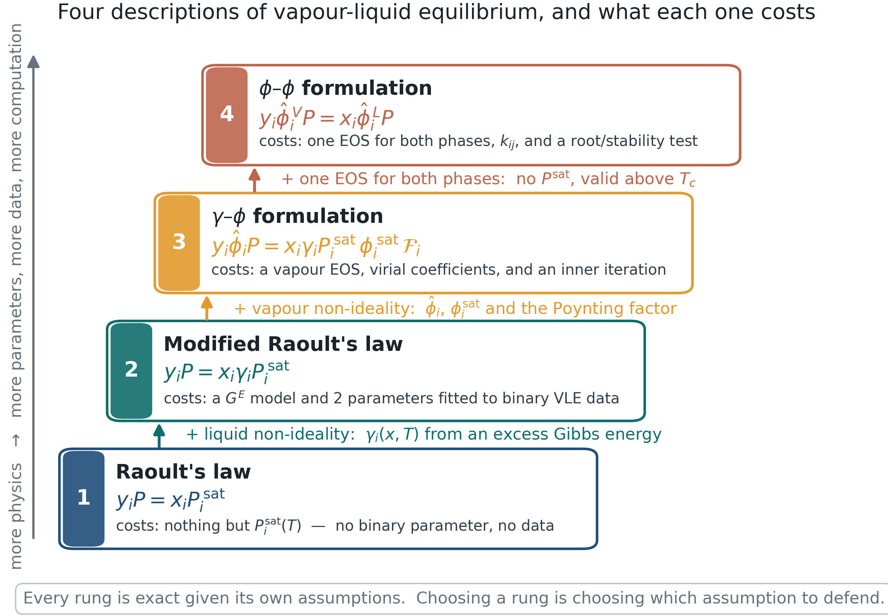{.fig-xl}

::: {.source}
F4.1 · The four descriptions, with the physics added and the cost incurred at each step.
:::

::: {.notes}
**TEACHING TIP**
Walk up from the bottom naming only the physics added, not the equations. The
vertical axis is physical content, not accuracy and not calendar time.

**COMMON MISCONCEPTION**
That higher is better. A phi-phi calculation on an ethanol/water column at one
atmosphere is slower, needs more parameters, and is *worse* than modified
Raoult with a decent activity model. Content is only worth its cost when your
problem contains that physics.

**ASK THE CLASS**
Which rung for: an ethanol/water column at 1 atm; a natural gas separator at
80 bar; an acetic acid/water column at 1 atm? The third is the interesting one.
:::

## Choosing a description

::: {.kicker .c-amber}
4.1 · Four descriptions of the same equilibrium
:::

::: {.lede}
A decision table, not a ranking.
:::

| System | Description | Because |
|---|---|---|
| Benzene / toluene, 1 atm | Raoult | Chemically similar; no binary data needed |
| Ethanol / water, 1 atm | Modified Raoult | Strongly non-ideal liquid, near-ideal vapour |
| Acetic acid / water, 1 atm | Gamma-phi | Vapour associates; $\hat\varphi \ne 1$ at 1 atm |
| Methane / propane, 80 bar | Phi-phi | One component is supercritical |
| CO₂ / ethanol, 100 bar | Phi-phi with a $G^E$ mixing rule | Supercritical *and* polar — Section 4.7 |

::: {.note}
The last row is the case neither classical description handles. Section 4.7
builds the description that does, and reports honestly what it is worth.
:::

::: {.notes}
**TEACHING TIP**
Make the students defend one row each. The acetic acid row is the one that
teaches the most, because the pressure is low and the naive answer is wrong.

**ASK THE CLASS**
Which row would change if the column ran at 10 bar instead of 1?
:::

## Solution types and azeotropes {.dark .divider .c-teal background-color="#1C242B"}

::: {.kicker .c-amber}
PART II
:::

::: {.lede}
Section 4.2&nbsp;&nbsp;&nbsp;What the four descriptions produce. Four classes of behaviour, one criterion, and an azeotrope that belongs to the pressure rather than to the mixture.
:::

::: {.notes}
**TEACHING TIP**
This section is the bridge between the formalism of 4.1 and the data of 4.3. It
is also the section students think they already know, because they met
azeotropes as a definition. They met the phenomenon; they did not meet the
criterion, and they cannot usually say why one azeotrope boils low and another
boils high.

**ASK THE CLASS**
Before anything: name a mixture that forms an azeotrope, and say what property
of the two molecules made you expect it. Collect the answers and return to them
at the end of the section.
:::

## Four types, on four measured systems

::: {.kicker .c-amber}
4.2 · Solution types and azeotropes
:::

::: {.lede}
The classification is one statement about the sign and size of $G^E$, read
against a common Raoult reference.
:::

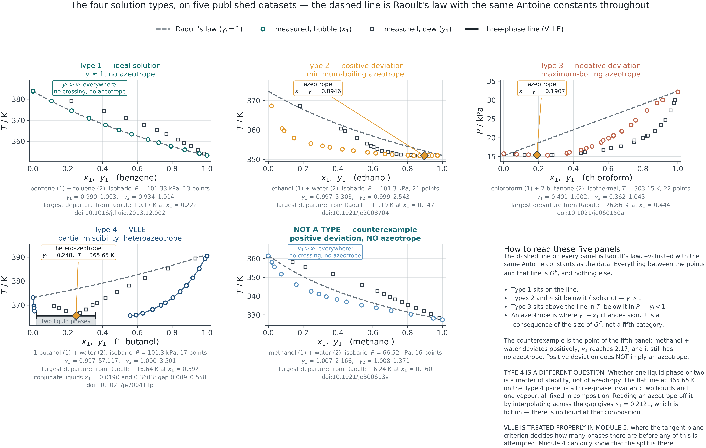{.fig-xl}

::: {.source}
F4.11 · Four published sets, DOIs on the figure. Dashed line: Raoult's law with the same Antoine constants throughout.
:::

::: {.notes}
**TEACHING TIP**
Walk the four panels in order and name only what changes. Type 1:
$\gamma_1 = 0.990$–$1.003$, largest departure from Raoult $+0.17$ K — two
aromatics differing by one methyl group. Type 2: $\gamma_1$ up to 2.17,
$-6.24$ K at $x_1 = 0.160$, and still no azeotrope. Type 3: $\gamma_1$ to 5.30,
$-11.19$ K, azeotrope at $x_1 = 0.8946$. Type 4: $\gamma < 1$ throughout,
$-26.9$ % in pressure, azeotrope at $x_1 = 0.1907$.

**COMMON MISCONCEPTION**
That Type 2 is a weak Type 3 — that a big enough positive deviation always
produces an azeotrope. Methanol + water is the counterexample and the next
slide says why: the vapour-pressure ratio also has a vote.

**ASK THE CLASS**
Which panel would change type if you halved the pressure? Hold the answer until
F4.13.
:::

## The criterion, derived

::: {.kicker .c-amber}
4.2 · Solution types and azeotropes
:::

::: {.lede}
An azeotrope is not a category a mixture belongs to. It is a root of one
equation, and the root either lies in $(0,1)$ or it does not.
:::

$$y_1 = x_1
\iff \gamma_1 P_1^{\rm sat} = \gamma_2 P_2^{\rm sat}
\iff \alpha_{12} \equiv \frac{\gamma_1 P_1^{\rm sat}}{\gamma_2 P_2^{\rm sat}} = 1$$

$$\alpha_{12}\big|_{x_1 \to 0} = \gamma_1^\infty\,\frac{P_1^{\rm sat}}{P_2^{\rm sat}},
\qquad
\alpha_{12}\big|_{x_1 \to 1} = \frac{1}{\gamma_2^\infty}\,\frac{P_1^{\rm sat}}{P_2^{\rm sat}}$$

:::: {.cards}
::: {.card}

[The test at the ends]{.card-h .c-teal}

If $\alpha_{12}$ is above 1 at one end and below 1 at the other, a continuous
$\alpha_{12}(x_1)$ must cross, and the crossing is the azeotrope. Only the two
$\gamma^\infty$ and the vapour-pressure ratio are needed — no interior data at
all.

:::

::: {.card}

[Two components, one verdict]{.card-h .c-amber}

Methanol + water has a genuine positive deviation, $\gamma_1^\infty = 2.41$,
and no azeotrope: $P_1^{\rm sat}/P_2^{\rm sat}$ is already 3.6 to 4.3, so
$\alpha_{12}$ never approaches 1. **Type 2 and Type 3 differ by the vapour
pressures, not by the deviation.**

:::
::::

::: {.notes}
**TEACHING TIP**
Derive the two end limits on the board rather than showing them. $\gamma_1 \to
\gamma_1^\infty$ and $\gamma_2 \to 1$ as $x_1 \to 0$; the reverse at the other
end. The whole criterion is those two substitutions.

**COMMON MISCONCEPTION**
That straddling ends are necessary as well as sufficient. They are sufficient.
A $G^E$ with three or more parameters can make $\gamma_1/\gamma_2$
non-monotonic and place two azeotropes with both ends on the same side. The
monotonic assumption is stated on F4.12 and it is an assumption.

**ASK THE CLASS**
Methanol + water at $\gamma_1^\infty = 2.41$: how small would
$P_1^{\rm sat}/P_2^{\rm sat}$ have to become before an azeotrope appeared, and
could you reach that condition?
:::

## The criterion as a map

::: {.kicker .c-amber}
4.2 · Solution types and azeotropes
:::

::: {.lede}
Two end-point volatilities place a system in a quadrant. Five published systems,
five correct verdicts.
:::

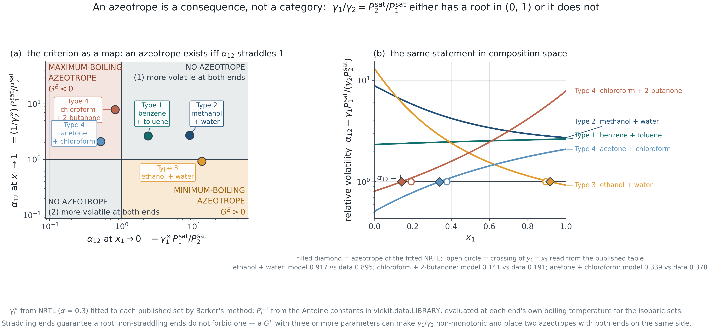{.fig-cap width="82%"}

:::: {.cards}
::: {.card}

[What was predicted]{.card-h .c-teal}

$\gamma^\infty$ from an NRTL fitted by Barker to each set, and $P^{\rm sat}$
from Antoine. Ethanol + water: $\alpha = 12.96$ and $0.92$ — straddles, so
minimum-boiling. Chloroform + 2-butanone: $0.81$ and $7.83$ — straddles from
below, so maximum-boiling.

:::

::: {.card}

[What checked it]{.card-h .c-amber}

The measured relative volatility, from $x_1$ and $y_1$ alone, with no
$P^{\rm sat}$ and no model: it crosses 1 for exactly the three systems the map
predicted. **Five out of five**, by two routes sharing no numbers.

:::
::::

::: {.source}
F4.12 · Five published systems on the criterion map, and the same statement in composition space. The two routes are independent.
:::

::: {.notes}
**TEACHING TIP**
The value of this figure is that the prediction and the check share nothing.
The prediction touches $\gamma^\infty$ and Antoine; the check touches $x_1$ and
$y_1$. Agreement is therefore evidence and not bookkeeping.

**ASSUMPTION, STATED**
$\gamma^\infty$ is an extrapolation. Ethanol + water agrees with the measured
volatility to 1 % at the end where the data reach $x_1 = 0.972$ and to 8 % at
the end where they stop at $x_1 = 0.018$. That is the right way round, and it
is the honest way to report an extrapolated quantity.

**ASK THE CLASS**
Panel (a) is a map with four quadrants but only three verdicts. Why do two
quadrants say the same thing?
:::

## Minimum-boiling and maximum-boiling

::: {.kicker .c-amber}
4.2 · Solution types and azeotropes
:::

::: {.lede}
Gibbs-Konovalov: ${\rm d}P/{\rm d}x_1 = 0$ exactly where $y_1 = x_1$. An
azeotrope is always a stationary point; the sign of $G^E$ decides which kind.
:::

:::::: {.cards .g3}
::: {.card}

[The argument, without a model]{.card-h .c-teal}

$\gamma_i > 1$ puts
$P = x_1\gamma_1 P_1^{\rm sat} + x_2\gamma_2 P_2^{\rm sat}$ **above** the Raoult
straight line at every interior composition. A continuous curve that starts and
ends on a line and lies above it in between has an interior maximum.

:::

::: {.card}

[Maximum in $P$ is minimum in $T$]{.card-h .c-amber}

Higher pressure at fixed $T$ means the mixture boils below both pure
components. So positive deviation gives a **minimum-boiling** azeotrope, and
negative deviation reverses every step of the argument to give a
**maximum-boiling** one.

:::

::: {.card}

[Confirmed, not quoted]{.card-h .c-rust}

${\rm d}P/{\rm d}x_1$ at the computed azeotrope is $-2\times10^{-9}$ kPa for
ethanol + water, $+2\times10^{-9}$ for chloroform + 2-butanone and
$-1\times10^{-9}$ for acetone + chloroform. Konovalov to nine decimals.

:::
::::::

::: {.note}
And the uncomfortable corollary: the $P$-$x$ curve is **flat** at the
azeotrope, so the pressure carries almost no information about where it sits.
The same fits that reproduce $P$ to 0.32 kPa misplace the azeotrope by $+0.023$,
$-0.050$ and $-0.038$ in $x_1$. If the azeotropic composition is the number your
design needs, it must be in the objective function.
:::

::: {.notes}
**TEACHING TIP**
Draw the two curves on the board before showing any number: a chord, a bulge
above it, a bulge below it. The whole theorem is visible in that sketch, and no
student who has drawn it once confuses minimum-boiling with minimum-pressure
again.

**COMMON MISCONCEPTION**
That "minimum-boiling" and "maximum-pressure" are different phenomena. They are
one stationary point read on two different axes.

**ASK THE CLASS**
The fit reproduces the measured pressures within their scatter and still puts
the azeotrope 0.05 in the wrong place. Is the fit bad? What would you change?
:::

## The azeotrope moves with pressure

::: {.kicker .c-amber}
4.2 · Solution types and azeotropes
:::

::: {.lede}
$\gamma_1/\gamma_2$ depends on composition, $P_2^{\rm sat}/P_1^{\rm sat}$ only on temperature. Move the pressure and the balance point moves.
:::

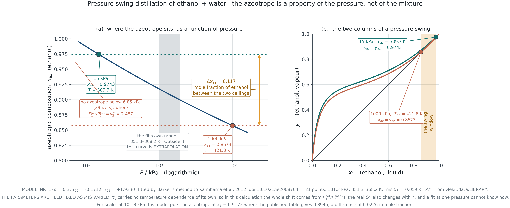{.fig-cap width="88%"}

:::: {.cards}
::: {.card}

[The window]{.card-h .c-teal}

Ethanol + water: $x_{\rm az} = 0.9743$ at 15 kPa and $0.8573$ at 1000 kPa — a
window of **0.117**. Below 6.85 kPa (295.7 K) there is no azeotrope at all,
because $P_1^{\rm sat}/P_2^{\rm sat}$ has fallen to $\gamma_2^\infty = 2.487$.

:::

::: {.card}

[What is assumed]{.card-h .c-rust}

NRTL was fitted at 101.3 kPa over 351.3–368.2 K and its $\tau_{ij}$ carry no
$T$ dependence, so the whole shift comes from $P^{\rm sat}(T)$. The 1000 kPa
point sits 53.6 K outside that range: **an extrapolation.**

:::
::::

::: {.source}
F4.13 · NRTL by Barker on [doi:10.1021/je2008704]{.small}, held fixed as $P$ varies.
:::

::: {.notes}
**TEACHING TIP**
State the assumption before the result, not after. Everything on this slide
rests on holding $\tau_{ij}$ fixed while moving 50 K, and a genuine design
calculation needs $\tau_{ij}(T)$ fitted at more than one pressure.

**COMMON MISCONCEPTION**
That the azeotropic composition is a property of the mixture, like a boiling
point. It is a property of the mixture *at a pressure*, and a handbook value
quoted without one is incomplete.

**ASK THE CLASS**
The published azeotrope at 101.3 kPa is $x_1 = 0.8946$; this model says 0.9172.
Which of the two would you put in a design, and what would you measure to
decide?
:::

## When a pressure swing is worth building

::: {.kicker .c-amber}
4.2 · Solution types and azeotropes
:::

::: {.lede}
Two columns at two pressures beat the azeotrope only if the azeotrope moves.
Two Type 3/4 systems, two answers.
:::

:::: {.cards}
::: {.card}

[Ethanol + water: it moves]{.card-h .c-teal}

$x_{\rm az}$ runs 0.9743 at 15 kPa to 0.9172 at 101 kPa — 0.057 over the range
a real vacuum column would use, and 0.117 out to 1000 kPa. The prize is real
but modest, which is why industry usually prefers extractive or azeotropic
distillation to a second column plus a vacuum system.

:::

::: {.card}

[Acetone + chloroform: it does not]{.card-h .c-rust}

$x_{\rm az}$ runs 0.3402 at 90 kPa to 0.3469 at 25 kPa — **0.007 over a factor
of 3.5 in pressure**. A pressure swing on this pair is not a separation, it is a
rounding error.

:::
::::

::: {.note}
The reason is in the criterion. Acetone + chloroform has
$P_1^{\rm sat}/P_2^{\rm sat} \approx 1.18$ at both ends, barely moving with
temperature, while $\gamma_1/\gamma_2$ is steep in composition, so the root
hardly shifts. Ethanol + water has two components of similar volatility and a
$\gamma_1/\gamma_2$ that is nearly flat near $x_1 = 0.9$: a small change in the
vapour-pressure ratio then moves the crossing a long way.
:::

::: {.notes}
**TEACHING TIP**
This is the payoff of the whole section: the criterion is not a classification
exercise, it predicts whether a process option exists. Make them state the
general rule — the swing is large when $\gamma_1/\gamma_2$ is *flat* where it
crosses, and small when it is steep.

**ASK THE CLASS**
Sketch $\gamma_1/\gamma_2$ and the horizontal line $P_2^{\rm sat}/P_1^{\rm sat}$
for both systems, then move the line up and down. Which geometry gives a large
swing?
:::

## From measurement to activity coefficient {.dark .divider .c-teal background-color="#1C242B"}

::: {.kicker .c-amber}
PART III
:::

::: {.lede}
Section 4.3&nbsp;&nbsp;&nbsp;A reported $\gamma$ is not a measurement. It is four measured numbers and two assumptions.
:::

::: {.notes}
**TEACHING TIP**
This is the shortest section and the one students most often skip. Slow down.
Everything in Sections 4.4 and 4.5 inherits the errors introduced here.
:::

## What a VLE apparatus measures

::: {.kicker .c-amber}
4.3 · From measurement to activity coefficient
:::

::: {.lede}
Four numbers per point, each with its own uncertainty, and none of them is
$\gamma$.
:::

:::::: {.cards .quad}
::: {.card}

[Temperature]{.card-h .c-teal}

Calibrated thermometer in the boiling liquid. Typically $\pm 0.05$ K.
Its error enters through $P_i^{\rm sat}(T)$, which is exponential in $T$.

:::

::: {.card}

[Pressure]{.card-h .c-amber}

Manometer or transducer. Typically $\pm 0.05$ kPa. Usually the *best* measured
variable, which is why Barker's method uses it.

:::

::: {.card}

[Liquid composition]{.card-h .c-rust}

Sample and analyse — refractometry, gas chromatography, density. Typically
$\pm 0.001$ mole fraction, and only if the calibration is honest.

:::

::: {.card}

[Vapour composition]{.card-h .c-sky}

Condense and analyse. The hardest measurement: partial condensation, holdup,
and entrainment all bias it. Typically $\pm 0.002$, often worse.

:::
::::::

::: {.notes}
**TEACHING TIP**
Ask which of the four would you drop if you could only measure three. The
answer — $y$ — is exactly what Barker's method does, and it prepares Section
4.4.

**COMMON MISCONCEPTION**
That an old dataset is worse than a modern one because the instruments were
cruder. Often the reverse: careful 1950s recirculating-still work with
gravimetric analysis beats a hurried modern GC calibration.
:::

## Computing gamma

::: {.kicker .c-amber}
4.3 · From measurement to activity coefficient
:::

::: {.lede}
Two assumptions convert four measurements into an activity coefficient.
:::

$$\gamma_i = \frac{y_i \Phi_i P}{x_i P_i^{\rm sat}(T)},
\qquad
\Phi_i = \frac{\hat\varphi_i}{\varphi_i^{\rm sat}}
\exp\!\left[-\frac{v_i^L (P - P_i^{\rm sat})}{RT}\right]$$

:::: {.cards}
::: {.card}

[Assumption A — the vapour]{.card-h .c-amber}

Setting $\Phi_i = 1$ is modified Raoult. For acetone/chloroform at 50 °C the
virial correction shifts $\ln\gamma_1$ by up to 0.008 — small, but
**systematic**, and a consistency test reacts to systematic errors, not to
scatter.

:::

::: {.card}

[Assumption B — the vapour pressure]{.card-h .c-teal}

$P_i^{\rm sat}$ comes from a correlation, not from this experiment. Antoine
coefficients are copied between references with unit errors more often than any
other quantity in this subject. Check the correlation against the normal
boiling point before you trust one activity coefficient.

:::
::::

::: {.notes}
**TEACHING TIP**
Do the boiling-point check live. It takes one line of code and it has caught a
wrong-isomer Antoine set in this course twice.

**COMMON MISCONCEPTION**
That the vapour correction is negligible because the pressure is low. Its size
is not the point — its *systematic* character is. A 0.008 bias in $\ln\gamma$
is invisible in a plot and fatal in a consistency test.
:::

## Taking $\gamma$ out of a published table

::: {.kicker .c-amber}
4.3 · From measurement to activity coefficient
:::

::: {.lede}
The paper gives you four columns. Three of the things you need are not in it.
:::

:::: {.numbered .n4}
1. **Copy the table with its DOI and its stated uncertainties.** $u(T)$, $u(P)$, $u(x)$, $u(y)$ are part of the data. A table transcribed without them cannot be reduced honestly.
2. **Check $P_i^{\rm sat}$ against the paper's own end points.** The pure rows are a free calibration of your Antoine constants — and they are the check almost nobody runs.
3. **Choose $\Phi_i$ and say which.** Ideal vapour, virial $\hat\varphi$, or the full three factors. The next two slides say how to decide rather than how to prefer.
4. **Report $\gamma$ with an uncertainty, then test it.** The consistency tests of Section 4.4 are the reason the reduction was worth doing.
::::

::: {.note}
Step 2, on chloroform + 2-butanone at 303.15 K
([doi:10.1021/je060150a]{.small}): the table's pure end points read 32.19 and
15.74 kPa, and the stored Antoine constants give 32.33 and 15.22 — $+0.44$ % on
chloroform but $-3.28$ % on 2-butanone. That error goes straight into every
$\gamma_2$, and it is larger than every vapour-phase correction on the next
slide put together.
:::

::: {.notes}
**TEACHING TIP**
Run step 2 live. It is one line of code, it takes ten seconds, and it changes
how students read a paper: the pure-component rows stop being padding and
become the calibration.

**COMMON MISCONCEPTION**
That the hard part of reducing published data is the thermodynamics. The hard
part is the auxiliary data — Antoine constants, molar volumes, virial
coefficients — none of which the paper supplies and all of which you must
source and check yourself.

**ASK THE CLASS**
The Antoine correlation is 3.3 % low on component 2. Before doing anything: is
$\gamma_2$ then too high or too low, and by how much?
:::

## Where the error actually comes from

::: {.kicker .c-amber}
4.3 · From measurement to activity coefficient
:::

::: {.lede}
Propagate, and the ranking is not the one students expect.
:::

$$\sigma^2(\ln\gamma_1)
 = \left(\frac{\sigma_y}{y_1}\right)^{\!2}
 + \left(\frac{\sigma_P}{P}\right)^{\!2}
 + \left(\frac{\sigma_x}{x_1}\right)^{\!2}
 + \left(\frac{{\rm d}\ln P_1^{\rm sat}}{{\rm d}T}\,\sigma_T\right)^{\!2}$$

:::::: {.cards .g3}
::: {.card}

[The temperature term]{.card-h .c-rust}

$P^{\rm sat}$ is exponential in $T$, so ${\rm d}\ln P^{\rm sat}/{\rm d}T$ is of
order $0.03\ {\rm K^{-1}}$ near the normal boiling point. A 0.05 K error is
then worth 0.0015 in $\ln\gamma$ — comparable to the composition term.

:::

::: {.card}

[The dilute ends]{.card-h .c-amber}

$\sigma_x/x_1$ blows up as $x_1 \to 0$. At $x_1 = 0.02$ a 0.001 error in
composition is 5 % in $\gamma_1$. That is exactly where the model is least
constrained and where $\gamma^\infty$ is read off.

:::

::: {.card}

[The consequence]{.card-h .c-teal}

Quoting $\gamma$ to four figures from a thermometer read to 0.1 K is
arithmetic, not measurement. Report the uncertainty or do not report the
figure.

:::
::::::

::: {.notes}
**TEACHING TIP**
Have them change one $\sigma$ at a time in the notebook and watch the ranking
change with composition. The instrument you should improve is not the same at
$x_1 = 0.05$ and $x_1 = 0.5$.

**ASK THE CLASS**
You have money for one better instrument. Which, and does your answer depend on
the composition range you care about?
:::

## The corrections, switched on one at a time

::: {.kicker .c-amber}
4.3 · From measurement to activity coefficient
:::

::: {.lede}
$\Phi_i$ is three factors, not one. Applied together they largely cancel;
applied singly they do not.
:::

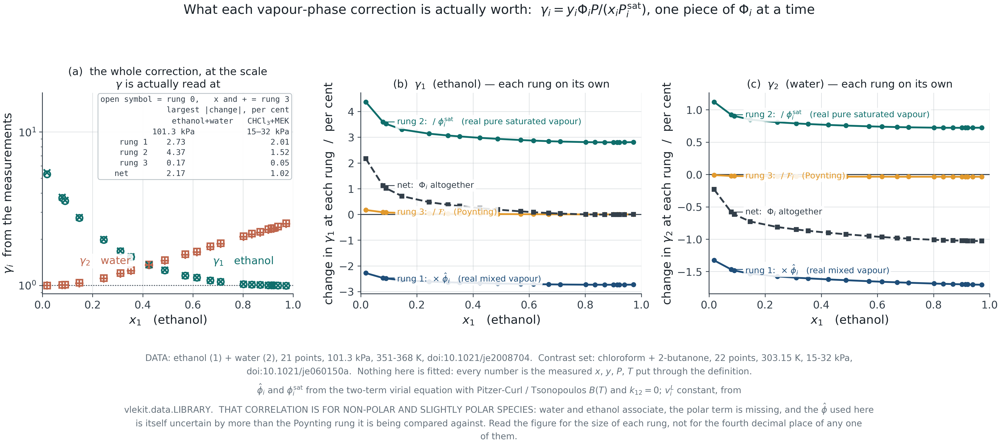{.fig-cap width="84%"}

:::: {.cards}
::: {.card}

[The sizes, chloroform + 2-butanone at 15–32 kPa]{.card-h .c-teal}

$\hat\varphi_i$ alone moves $\ln\gamma$ by 0.014 and 0.020. Adding
$\varphi_i^{\rm sat}$ moves it **back** by 0.015 and 0.011. Poynting adds
0.0005. Net over all three: 0.009 and 0.010.

:::

::: {.card}

[Why they cancel]{.card-h .c-rust}

$\hat\varphi_i$ in the mixture and $\varphi_i^{\rm sat}$ for the pure saturated
vapour have the same physical origin and, at these pressures, nearly the same
value. **Applying one without the other is worse than applying neither** — a
correction of one sign with its compensating partner omitted.

:::
::::

::: {.source}
F4.15 · Each rung of $\Phi_i$ on its own, ethanol + water at 101.3 kPa ([doi:10.1021/je2008704]{.small}) with chloroform + 2-butanone ([doi:10.1021/je060150a]{.small}) as the low-pressure contrast. Nothing here is fitted.
:::

::: {.notes}
**TEACHING TIP**
Read panels (b) and (c) as two curves that mirror each other about zero, with
the net barely off the axis. That picture is the argument, and the numbers only
confirm it.

**ASSUMPTION, STATED**
$\hat\varphi$ and $\varphi^{\rm sat}$ here come from the two-term virial
equation with Pitzer-Curl / Tsonopoulos $B(T)$ and $k_{12} = 0$. That
correlation is for non-polar and slightly polar species; water and ethanol
associate. The $\hat\varphi$ used is itself uncertain by more than the Poynting
rung it is being compared against — read the figure for the size of each rung,
not for the fourth decimal of any one.

**ASK THE CLASS**
Which single omission would bias a consistency test most: dropping all three
factors, or dropping only $\varphi^{\rm sat}$?
:::

## The rule: compare the correction with the noise

::: {.kicker .c-amber}
4.3 · From measurement to activity coefficient
:::

::: {.lede}
Not "correct above one bar". Compare the size of the correction with the
uncertainty of the measurement it is correcting, on your own dataset.
:::

| System | $P$ / kPa | net $\max\lvert\Delta\ln\gamma_1\rvert$ | median $\sigma(\ln\gamma_1)$ | ratio |
|---|---|---|---|---|
| Benzene + toluene | 101.3 | 0.0329 | 0.0130 | 2.53 |
| Acetone + chloroform | 101.3 | 0.0108 | 0.0064 | 1.70 |
| Methanol + water | 66.5 | 0.0282 | 0.0185 | 1.53 |
| Ethanol + water | 101.3 | 0.0214 | 0.0215 | 1.00 |
| Chloroform + 2-butanone | 20.4 | 0.0086 | 0.0443 | 0.19 |

::: {.note}
At atmospheric pressure the correction is comparable to or larger than the
noise and you may not neglect it. At 20 kPa it is a fifth of the noise and you
may — **and you say so, with the number**. $\sigma$ is propagated from the
uncertainties the papers themselves report.
:::

::: {.notes}
**TEACHING TIP**
This table is the deliverable of the section. It replaces a rule of thumb about
pressure with a comparison that takes four lines of code and applies to any
dataset, including ones at conditions nobody wrote a rule of thumb for.

**COMMON MISCONCEPTION**
That "negligible" is a property of a correction. It is a relation between a
correction and an uncertainty. The same $\hat\varphi$ that is negligible on a
noisy 1950s set is decisive on a careful modern one.

**ASK THE CLASS**
$\ln\hat\varphi_i \approx BP/RT$, so the correction is roughly linear in $P$.
Take the chloroform set to 500 kPa: does the verdict in the last row survive?
:::

## Isothermal, isobaric, and the azeotrope

::: {.kicker .c-amber}
4.3 · From measurement to activity coefficient
:::

::: {.lede}
The two kinds of dataset, and the one composition where $\gamma$ comes for free.
:::

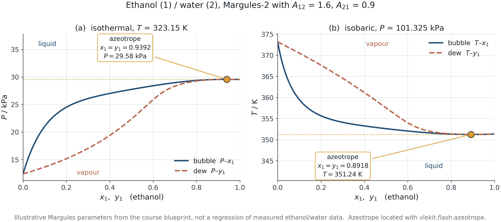{.fig-cap width="78%"}

:::: {.cards}
::: {.card}

[Isothermal is easier to use]{.card-h .c-teal}

At constant $T$ the Gibbs-Duhem equation has no enthalpy term. Isobaric data
are more common — that is how a column runs — and harder, because $T$ varies
across the composition range.

:::

::: {.card}

[The azeotrope is a free measurement]{.card-h .c-amber}

At $x_i = y_i$ the equilibrium condition gives
$\gamma_1 / \gamma_2 = P_2^{\rm sat} / P_1^{\rm sat}$ directly, with no vapour
sample at all. In an old dataset it is often the only point that can be
trusted without qualification.

:::
::::

::: {.source}
F4.2 · The same system as $P$-$x$-$y$ and as $T$-$x$-$y$, with the azeotrope marked on both.
:::

::: {.notes}
**TEACHING TIP**
Point out that the azeotrope is a maximum in $P$ on the left and a *minimum* in
$T$ on the right. Students confuse the two constantly, and the pair of panels
settles it.

**ASK THE CLASS**
Why does a maximum-pressure azeotrope appear as a minimum-boiling one?
:::

## Thermodynamic consistency {.dark .divider .c-teal background-color="#1C242B"}

::: {.kicker .c-amber}
PART IV
:::

::: {.lede}
Section 4.4&nbsp;&nbsp;&nbsp;Can this dataset be believed? Gibbs-Duhem makes a binary VLE dataset over-determined, so the data can be tested against thermodynamics with no model assumed correct.
:::

::: {.notes}
**TEACHING TIP**
This is the heart of the module and the part that transfers to every other
subject they will meet. The idea — use a physical constraint to test data
rather than to fit them — is general.
:::

## The premise

::: {.kicker .c-amber}
4.4 · Thermodynamic consistency testing
:::

::: {.lede}
One of the four measured variables is redundant. The size of the prediction
error is the test.
:::

$$x_1 \frac{{\rm d}\ln\gamma_1}{{\rm d}x_1}
 + x_2 \frac{{\rm d}\ln\gamma_2}{{\rm d}x_1} = 0
\qquad \text{(constant } T,\,P)$$

:::: {.cards}
::: {.card}

[Satisfied by construction]{.card-h .c-teal}

Any model derived from a single $G^E$ satisfies this **identically** — the
residual is zero to machine precision. Finding otherwise means the code is
wrong, not the fluid.

:::

::: {.card}

[Satisfied by measurement]{.card-h .c-rust}

Data satisfy it only to within their errors. The two statements look alike on a
slide and are completely different in practice. Everything that follows is a
way of deciding whether the gap is noise or a real error.

:::
::::

::: {.notes}
**TEACHING TIP**
Run both residuals in front of them. The model's is $10^{-11}$; the data's is
$10^{-2}$. The contrast is the whole section in one line of output.

**COMMON MISCONCEPTION**
That the test checks whether the data are *correct*. It checks whether they are
internally consistent with thermodynamics. A dataset can be consistent and
wrong — for instance if the sample was impure but the impurity behaved
smoothly.
:::

## The area test

::: {.kicker .c-amber}
4.4 · Thermodynamic consistency testing
:::

::: {.lede}
The oldest test, the most quoted, and the weakest.
:::

$$\int_0^1 \ln\frac{\gamma_1}{\gamma_2}\,{\rm d}x_1 = 0,
\qquad
D = 100\,\frac{|A^+ - A^-|}{A^+ + A^-}$$

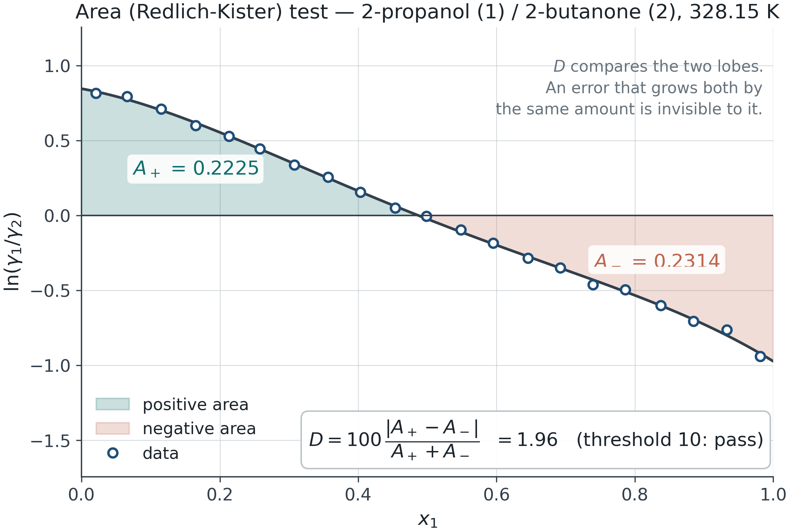{.fig-lg width="60%"}

::: {.source}
F4.3 · The two areas whose difference must vanish, with $D$ reported.
:::

::: {.notes}
**TEACHING TIP**
Derive the integral in one line from Gibbs-Duhem so they see it is not a
recipe. Then say immediately that it is an integral, and integrals lose
information.

**ASK THE CLASS**
Before the next slide: what kind of error would this test fail to notice?
:::

## Why the area test is weak

::: {.kicker .c-amber}
4.4 · Thermodynamic consistency testing
:::

::: {.lede}
An integral cannot see an error that changes sign. This is a structural
limitation, not a matter of threshold.
:::

:::: {.cards}
::: {.card}

[The construction]{.card-h .c-rust}

Perturbing $y_1$ shifts the measured ratio by
$\delta\ln(\gamma_1/\gamma_2) = \delta y_1 / [\,y_1(1-y_1)\,]$.

Choose $\delta y_1 = \varepsilon\, y_1 (1-y_1)(2x_1 - 1)$ and the ratio shifts
by $\varepsilon(2x_1-1)$ — odd about $x_1 = \tfrac12$, so it contributes
**exactly nothing** to the integral.

:::

::: {.card}

[The result]{.card-h .c-amber}

At $\varepsilon = 0.4$ the dataset is grossly wrong. The area test reports
$D = 1.3$ against a threshold of 10 — healthier than the merely noisy control —
while the point and direct tests both return the worst possible index.

An area test is a necessary condition. It is never a sufficient one.

:::
::::

::: {.notes}
**TEACHING TIP**
Build the error live in the notebook rather than asserting it. Students who
have seen a dataset constructed to defeat a test stop treating a passed test as
a certificate.

**COMMON MISCONCEPTION**
That the fix is a tighter threshold. It is not. No threshold on an integral can
detect a function that integrates to zero.

**ASK THE CLASS**
Which Redlich-Kister coefficients of $\ln(\gamma_1/\gamma_2)$ can the area test
respond to at all?
:::

## The point test

::: {.kicker .c-amber}
4.4 · Thermodynamic consistency testing
:::

::: {.lede}
Van Ness, Byer and Gibbs: fit $P$-$x$ only, then predict $y$. Errors cannot
cancel, because nothing is integrated.
:::

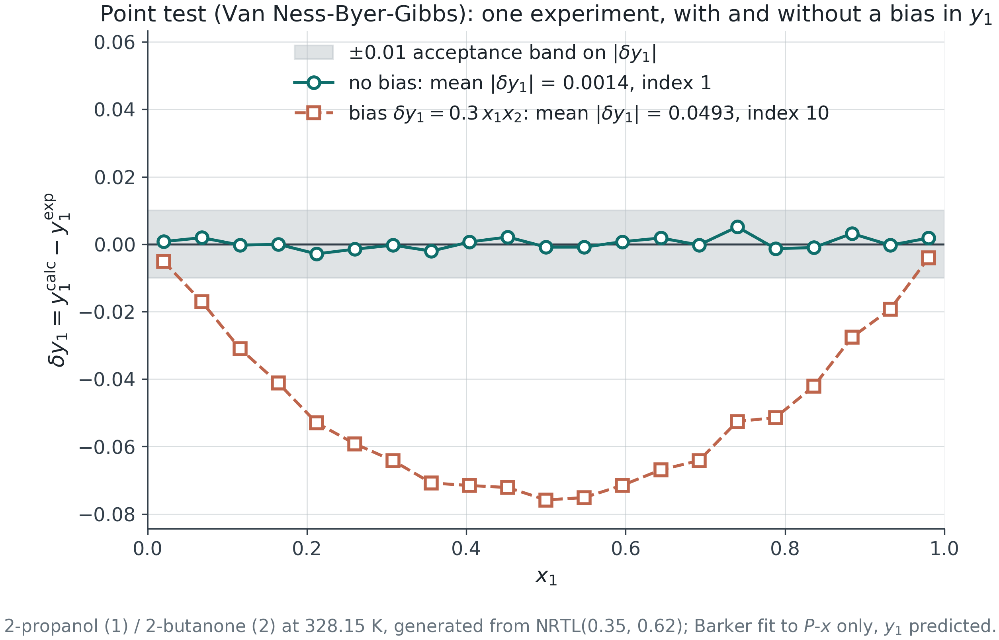{.fig-cap width="62%"}

:::: {.cards}
::: {.card}

[The logic]{.card-h .c-teal}

Barker's method uses only $P$ and $x$. If the data obey Gibbs-Duhem, $y$ is
already implied by the $P$-$x$ curve, so the fit must reproduce it. Mean
$|\delta y_1| < 0.01$ is the conventional pass.

:::

::: {.card}

[The trap]{.card-h .c-rust}

A large residual in $P$ means the **model** failed, not the data. Check
${\rm rms}\,\delta P$ before blaming the measurement, and use a model flexible
enough to follow the $P$-$x$ curve.

:::
::::

::: {.source}
F4.4 · Point-test residuals for a consistent and an inconsistent dataset on common axes.
:::

::: {.notes}
**TEACHING TIP**
Stress that this is local, not global. Every point contributes its own
residual, so an error of one sign in one half and the other sign in the other
half shows up twice rather than cancelling.

**ASK THE CLASS**
The residual is all of one sign and roughly constant. Now it changes sign once,
near the azeotrope. What causes each?
:::

## The direct test, and the 1-10 index

::: {.kicker .c-amber}
4.4 · Thermodynamic consistency testing
:::

::: {.lede}
The same redundancy, expressed in the variable Gibbs-Duhem is actually written
in. This is what modern journals expect.
:::

$$\delta = \ln\!\left(\frac{\gamma_1}{\gamma_2}\right)_{\!\rm exp}
        - \ln\!\left(\frac{\gamma_1}{\gamma_2}\right)_{\!\rm fitted}$$

| Index | RMS $\delta$ | Verdict |
|---|---|---|
| 1 – 3 | < 0.075 | Good. Publishable without comment |
| 4 – 5 | 0.075 – 0.125 | Marginal. Requires an explanation |
| 6 – 10 | > 0.125 | Reject, or diagnose the fault |

::: {.note}
The fitted values come from a Barker fit to $P$-$x$ alone, so $\delta$ measures
the data, not the fit — provided the model follows $P$-$x$.
:::

::: {.notes}
**TEACHING TIP**
Point out that the index is a convention, not a probability. It is useful
because everyone uses the same one, and for no deeper reason.

**COMMON MISCONCEPTION**
That an index of 1 proves the data are right. It proves they are consistent
with thermodynamics under the vapour-phase assumption used to reduce them.
:::

## Two more tests, and what they add

::: {.kicker .c-amber}
4.4 · Thermodynamic consistency testing
:::

::: {.lede}
Different tests are blind to different things. That is the reason to run more
than one.
:::

:::::: {.cards .g3}
::: {.card}

[Infinite dilution]{.card-h .c-teal}

Kojima's test compares $(G^E/RT)/x_1x_2$ with $\ln(\gamma_1/\gamma_2)$ at each
pure end point, where the two must coincide. Catches the dilute region, which
the area test averages away and where $\gamma^\infty$ is read off.

:::

::: {.card}

[Herington $D-J$]{.card-h .c-amber}

The area test with an empirical allowance $J = 150\,\Delta T/T_{\min}$ for the
temperature variation of an isobaric set. Widely required by referees; Wisniak
has shown it both passes bad data and fails good data.

:::

::: {.card}

[Wisniak L/W]{.card-h .c-rust}

Built on an energy balance rather than on $G^E$, so it responds to a different
combination of the measurements. Worth quoting when a dataset is contested.

:::
::::::

::: {.notes}
**TEACHING TIP**
Say plainly that Herington is a correlation, not a derivation, and that we
report it because reviewers ask for it. Students should know the difference
between a test with a derivation behind it and a test with a convention behind
it.
:::

## Isobaric data: the term that does not vanish

::: {.kicker .c-amber}
4.4 · Thermodynamic consistency testing
:::

::: {.lede}
At constant $P$ the temperature varies across the composition range, and the
excess enthalpy term returns.
:::

$$x_1 \frac{{\rm d}\ln\gamma_1}{{\rm d}x_1}
 + x_2 \frac{{\rm d}\ln\gamma_2}{{\rm d}x_1}
 = -\frac{H^E}{RT^2}\,\frac{{\rm d}T}{{\rm d}x_1}$$

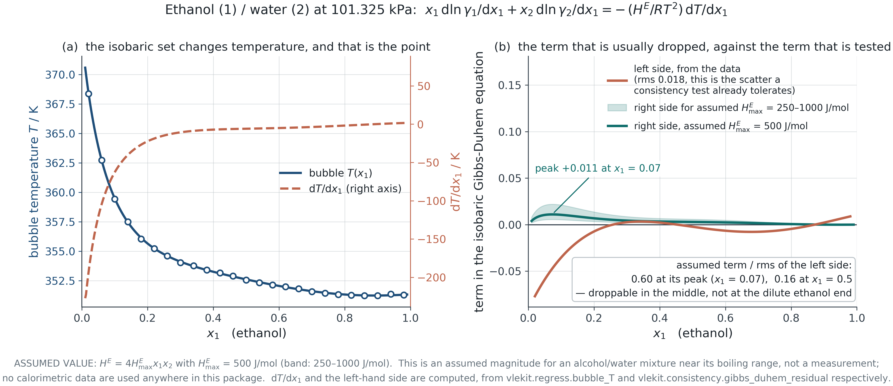{.fig-lg width="76%"}

::: {.source}
F4.9 · Size of the enthalpy term against the left-hand side, ethanol/water at 101.325 kPa. The $H^E$ magnitude is assumed and labelled as such on the figure.
:::

::: {.notes}
**TEACHING TIP**
The honest teaching point is that we usually drop this term because we do not
have $H^E$, not because we have shown it is small. The figure shows when that
is defensible: in mid-range, yes; at the dilute ends, where ${\rm d}T/{\rm d}x$
is steep, no.

**COMMON MISCONCEPTION**
That isobaric data can be tested with the isothermal form and a shrug. They can
— everyone does — but the omission belongs in the report.
:::

## Three datasets, five tests

::: {.kicker .c-amber}
4.4 · Thermodynamic consistency testing
:::

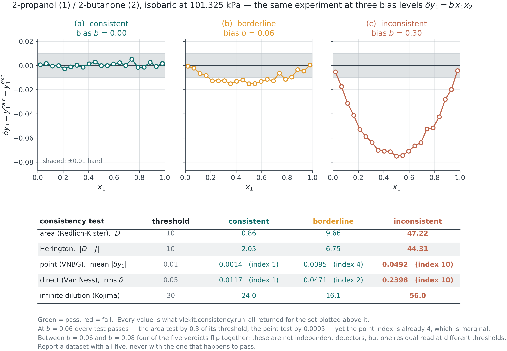{.fig-xl}

::: {.source}
F4.5 · The same experiment at three bias levels, with every statistic tabulated.
:::

::: {.notes}
**TEACHING TIP**
The middle column is the one to dwell on. At $b = 0.06$ every test passes — the
area test by 0.3 of its threshold and the point test by 0.0005 — and the point
index is already 4. A dataset that passes on the third decimal place is not a
dataset that has been vindicated.

Then show the cliff: between $b = 0.06$ and $b = 0.08$ four of the five
verdicts flip together. These are not independent detectors. They are one
residual read at different thresholds.

**ASK THE CLASS**
If four tests flip together, what have you learned by running all four?
:::

## Diagnosis, not verdict

::: {.kicker .c-amber}
4.4 · Thermodynamic consistency testing
:::

::: {.lede}
A failure is the beginning of an investigation. Each fault has a signature.
:::

:::: {.evidence}
| | |
|---|---|
| Constant offset in $\delta y$ | Vapour sampling bias — partial condensation, or a GC calibration offset |
| Residual bowed, one sign throughout | Wrong Antoine constants, or the vapour-phase correction omitted when it mattered |
| Sign change near the azeotrope | Composition analysis non-linear across the range |
| Fails at one end only | Impurity concentrating in the volatile or the heavy component |
| Large ${\rm rms}\,\delta P$ as well | The model, not the data. Refit with a more flexible $G^E$ before concluding anything |
::::

::: {.notes}
**TEACHING TIP**
This table is the useful output of consistency testing and the part textbooks
omit. Assign it as an exercise: corrupt a good dataset three ways and tabulate
the signatures.

**COMMON MISCONCEPTION**
That failing means the paper is wrong. It may mean *your* reduction is wrong —
your Antoine constants, your vapour assumption, your model.
:::

## Building a model from data {.dark .divider .c-teal background-color="#1C242B"}

::: {.kicker .c-amber}
PART V
:::

::: {.lede}
Section 4.5&nbsp;&nbsp;&nbsp;Regression converges to something for almost any input. The question is never whether a fit exists. It is what the fit is worth.
:::

::: {.notes}
**TEACHING TIP**
Open with the hazard: students will believe the first parameter set they
obtain, because it came out of a computer and it plotted nicely. Everything in
this section is a defence against that.
:::

## The objective function is a modelling decision

::: {.kicker .c-amber}
4.5 · Building an activity coefficient model from data
:::

::: {.lede}
Same data, same model, four objectives, four answers. This is not numerical
noise; it is a choice about which measurement you trust.
:::

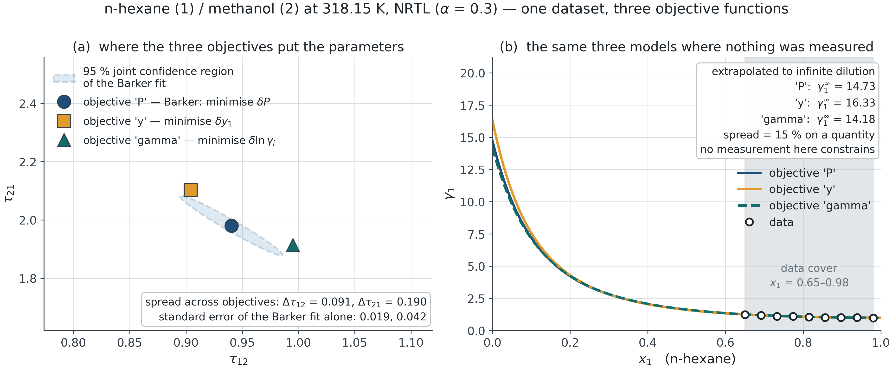{.fig-cap width="80%"}

:::: {.cards}
::: {.card}

[The spread is not small]{.card-h .c-rust}

Across objectives the parameters move by several times the standard error that
any one of them reports. An uncertainty that ignores the choice of objective is
understating the real one.

:::

::: {.card}

[Minimise what you measured well]{.card-h .c-teal}

Fitting $\ln\gamma$ weights the dilute ends heavily — precisely where the
measurement is worst. Fitting $y$ fits the least accurate variable. Fitting
$P$ uses the best one.

:::
::::

::: {.source}
F4.6 · Parameters and predictions from three objective functions on one dataset.
:::

::: {.notes}
**TEACHING TIP**
Ask them to predict which objective will be worst before showing the numbers.
Most guess $P$, on the grounds that $y$ is "the answer".

**ASK THE CLASS**
Your composition analysis is excellent and your pressure transducer is old.
Does the recommendation change?
:::

## Barker's method

::: {.kicker .c-amber}
4.5 · Building an activity coefficient model from data
:::

::: {.lede}
Fit to $P$-$x$ alone. Do not fit $y$ at all.
:::

$$P^{\rm calc}(x_1) = x_1 \gamma_1 P_1^{\rm sat} + x_2 \gamma_2 P_2^{\rm sat},
\qquad
\min_{\boldsymbol\theta} \sum_k \left(P^{\rm calc}_k - P^{\rm exp}_k\right)^2$$

:::::: {.cards .g3}
::: {.card}

[It uses the best data]{.card-h .c-teal}

$P$ and $x$ are the two accurately measured variables. Nothing in the objective
depends on the vapour sample.

:::

::: {.card}

[It makes the tests possible]{.card-h .c-amber}

A $y$ that was never fitted can be compared with a $y$ that was measured. That
comparison is the point test and the direct test. Fit $y$ and you destroy your
own diagnostic.

:::

::: {.card}

[Many datasets have no $y$]{.card-h .c-rust}

Static-cell measurements report $P$-$x$ only, by design. Barker is not a
compromise for those data — it is the intended method.

:::
::::::

::: {.notes}
**TEACHING TIP**
This is the slide that ties Sections 4.4 and 4.5 together. The consistency
tests are not a separate activity bolted on before fitting; they are what
Barker's method makes available.
:::

## Does the parameter earn its place?

::: {.kicker .c-amber}
4.5 · Building an activity coefficient model from data
:::

::: {.lede}
A model with more parameters cannot fit worse. The residual alone will always
choose the larger model.
:::

$${\rm AIC} = n \ln\frac{\rm SSE}{n} + 2k$$

:::: {.cards}
::: {.card}

[What AIC answers]{.card-h .c-teal}

Whether the improvement in fit is worth the parameter. A difference below about
2 is conventionally no evidence at all — the data cannot separate those models.

:::

::: {.card}

[Typical outcome]{.card-h .c-amber}

On twenty-one points at realistic noise, Margules, van Laar, Wilson, NRTL and
UNIQUAC land within 2 AIC units of one another. Any claim that one "describes
the system better" needs more than that dataset.

:::
::::

::: {.note}
AIC compares models fitted the same way. It does **not** compare objective
functions: each minimises a different residual vector, so the likelihood being
approximated is not the same likelihood.
:::

::: {.notes}
**TEACHING TIP**
Make them state, in one sentence, which model their data actually support. The
honest sentence is usually "the data do not distinguish these four", and
students find that unsatisfying until they see slide F4.8.
:::

## Parameter uncertainty is a region, not two numbers

::: {.kicker .c-amber}
4.5 · Building an activity coefficient model from data
:::

::: {.lede}
Two standard errors quoted separately describe a rectangle the fit never
occupied.
:::

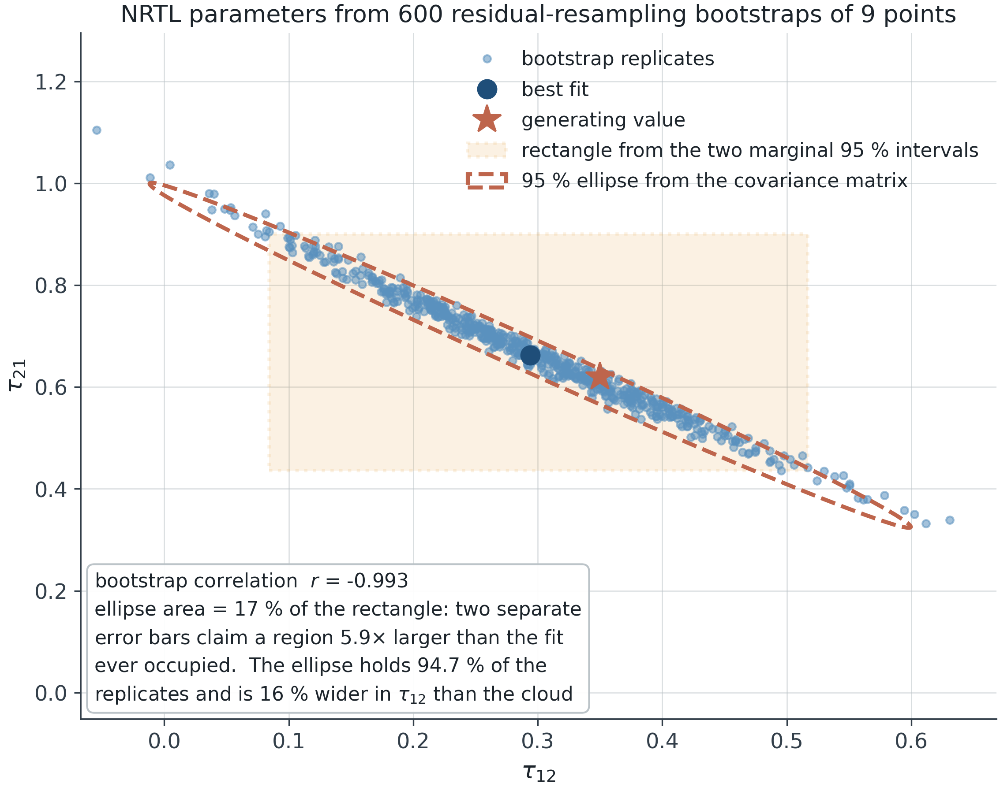{.fig-cap width="60%"}

:::: {.cards}
::: {.card}

[What the cloud shows]{.card-h .c-rust}

A correlation near $-1$: a long narrow ridge of parameter pairs that fit
equally well. The two parameters are not separately identifiable from one
isotherm.

:::

::: {.card}

[Why bootstrap]{.card-h .c-teal}

The linearised errors assume a quadratic optimum and normal residuals. For two
parameters and twenty points, neither holds well. Resampling makes no such
assumption and is transparent enough to explain in a report.

:::
::::

::: {.source}
F4.7 · Bootstrap replicates with the linearised ellipse over them.
:::

::: {.notes}
**TEACHING TIP**
Draw the rectangle implied by two independent error bars on the board, then put
the cloud inside it. The area difference is the argument.

**COMMON MISCONCEPTION**
That a strong correlation means the fit is bad. It means the *parameterisation*
is redundant for this experiment. The predictions can still be excellent.
:::

## The consequence that actually matters

::: {.kicker .c-amber}
4.5 · Building an activity coefficient model from data
:::

::: {.lede}
Two fits the data cannot separate can disagree completely about the region you
care about.
:::

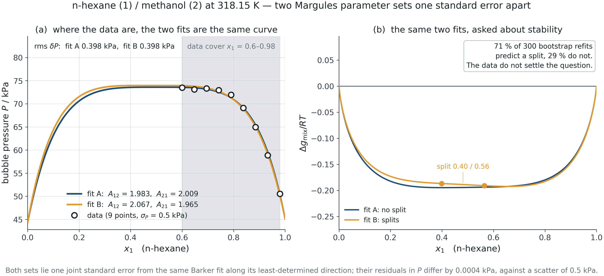{.fig-cap width="80%"}

:::: {.cards}
::: {.card}

[Same evidence, different claims]{.card-h .c-rust}

Fitted only where data exist, several models agree to within the scatter. They
then report $\gamma^\infty$ differing by tens of per cent, and they do not agree
on whether the liquid splits into two phases.

:::

::: {.card}

[Wilson is the clearest case]{.card-h .c-amber}

Wilson is structurally incapable of predicting a miscibility gap for **any**
parameters. Fitted to a system that has one, it buys the same fit with an
absurd $\gamma^\infty$ instead. That number is a symptom of the functional
form, not a property of the fluid.

:::
::::

::: {.source}
F4.8 · Statistically indistinguishable fits extrapolated beyond the data.
:::

::: {.notes}
**TEACHING TIP**
This is the single most important slide in the module. A liquid-liquid split
predicted outside the data range is a warning about extrapolation, not a
discovery.

**ASK THE CLASS**
You must size a stripper operating at $x_1 = 0.02$ and the data start at 0.55.
Which $\gamma^\infty$ do you use, and what measurement do you ask for first?
:::

## Five models on one real dataset

::: {.kicker .c-amber}
4.5 · Building an activity coefficient model from data
:::

::: {.lede}
Ethanol + water, 21 published points. The models agree where the measurements
are and disagree about the limit the data barely reach.
:::

| Model | $\gamma_1^\infty$ | $\gamma_2^\infty$ | rms $\delta y_1$ | $\Delta$AIC |
|---|---|---|---|---|
| UNIQUAC | 6.00 | 2.54 | 0.0042 | 0 |
| van Laar | 5.85 | 2.51 | 0.0040 | 8.7 |
| NRTL | 5.77 | 2.49 | 0.0039 | 20.2 |
| Wilson | 6.56 | 2.65 | 0.0062 | 49.5 |
| Margules-2 | 5.19 | 2.25 | 0.0068 | 76.5 |

::: {.note}
The paper reports $u(y_1) = 0.015$. The top three models predict $y_1$ to
0.004 — **indistinguishable within the measurement error**, with an AIC ordering
driven by differences the data cannot resolve. What separates them is not the
fit. It is that $\gamma_1^\infty$ spans 5.19 to 6.56, a spread of 26 %.
Data: [doi:10.1021/je2008704]{.small}.
:::

::: {.notes}
**TEACHING TIP**
Contrast this deliberately with the AIC slide. There the five models sat within
2 AIC units; here they span 76. The difference is real data with real systematic
structure — but the top three are still separated by less than $u(y_1)$, so the
lesson is unchanged: AIC ranks, it does not adjudicate.

**ASK THE CLASS**
You need $\gamma_1^\infty$ for a stripper design. Five models, five answers
spanning 26 %, all fitting the data equally well. What do you report?
:::

## Pin the ends, and what is left is the form

::: {.kicker .c-amber}
4.5 · Building an activity coefficient model from data
:::

::: {.lede}
Solve each model's two parameters so that every model has *identical*
$\gamma_1^\infty$ and $\gamma_2^\infty$. Nothing is left to adjust. The curves
still differ.
:::

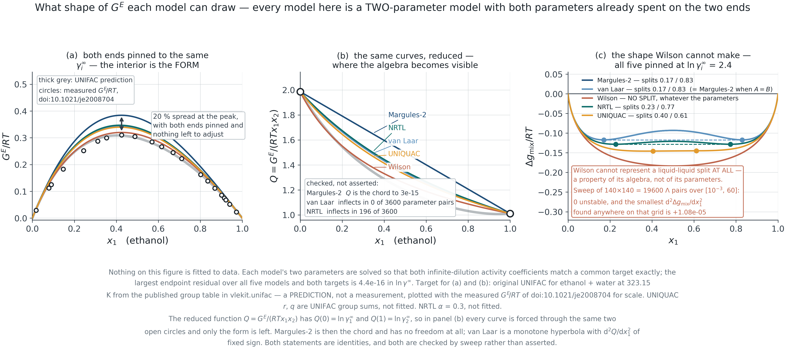{.fig-cap width="86%"}

:::: {.cards}
::: {.card}

[The cost of choosing a form]{.card-h .c-rust}

With both ends matched to $4\times10^{-16}$ in $\ln\gamma^\infty$, $G^E/RT$ at
its peak still spans **20 %** across the five forms — 16 % when the ends are
pinned to the NRTL fit instead of to UNIFAC. That residue is the functional
form and nothing else.

:::

::: {.card}

[Same numbers, different function]{.card-h .c-amber}

Margules-2 and van Laar come out with *identical* parameters, 1.7528 and
0.9112: in both, the two parameters **are** $\ln\gamma_1^\infty$ and
$\ln\gamma_2^\infty$. Different curves all the same. A parameter value quoted
without its model is meaningless.

:::
::::

::: {.source}
F4.16 · Nothing on this figure is fitted. Ends pinned to an original-UNIFAC *prediction* for ethanol + water at 323.15 K, plotted against measured $G^E/RT$ ([doi:10.1021/je2008704]{.small}) for scale.
:::

::: {.notes}
**TEACHING TIP**
This is the experiment Module 3's capability table cannot do. There the models
were compared by what they can represent; here they are compared with every
degree of freedom spent, which is the situation a two-parameter fit actually
leaves you in.

**COMMON MISCONCEPTION**
That agreeing on $\gamma^\infty$ means agreeing. Two papers can report the same
infinite-dilution values for a system and disagree by a fifth about the middle
of the composition range.

**ASK THE CLASS**
Which of the five would you trust at $x_1 = 0.5$ if the only data you had were
at the two dilute ends? On what grounds — and is any of them evidence?
:::

## What each form can draw

::: {.kicker .c-amber}
4.5 · Building an activity coefficient model from data
:::

::: {.lede}
Reduce out the ends. $Q = G^E/(RT x_1 x_2)$ has $Q(0) = \ln\gamma_1^\infty$ and
$Q(1) = \ln\gamma_2^\infty$, so every pinned model passes through the same two
points and only the shape is left.
:::

:::::: {.cards .g3}
::: {.card}

[No freedom at all]{.card-h .c-teal}

For Margules-2, $Q$ **is** the straight chord between the two end values —
verified to $3\times10^{-15}$ over a $60\times60$ parameter grid. There is
nothing to choose: fix the ends and the whole curve is fixed.

:::

::: {.card}

[One curvature, fixed sign]{.card-h .c-amber}

Van Laar's $Q$ is a monotone hyperbola: ${\rm d}^2Q/{\rm d}x_1^2$ changed sign
in **0 of 3600** parameter pairs. It can bow away from the chord, but only one
way, and it cannot carry an interior feature.

:::

::: {.card}

[Local composition buys inflection]{.card-h .c-rust}

Wilson inflects in 392 of 3600 pairs, UNIQUAC in 377, NRTL in 196. That is what
the extra structure is for — not a better fit at the ends, which any of them
can match exactly, but a shape the two-parameter chord cannot make.

:::
::::::

::: {.note}
This is the honest reason to prefer NRTL or UNIQUAC over Margules for a
strongly non-ideal binary, and it has nothing to do with the number of
parameters: all five here have exactly two.
:::

::: {.notes}
**TEACHING TIP**
$Q$ is worth the two minutes it takes to introduce. It removes the part of
$G^E$ that every model gets right by construction and leaves the part that is
actually a modelling choice — which is exactly what a comparison should do.

**ASK THE CLASS**
Your measured $G^E/(RTx_1x_2)$ is clearly S-shaped. Which of the five forms have
you just eliminated, and with what argument?
:::

## Wilson cannot split a liquid

::: {.kicker .c-amber}
4.5 · Building an activity coefficient model from data
:::

::: {.lede}
Not "does not usually". Cannot, for any parameters. This is algebra, not a
limitation of fitting.
:::

$$\frac{{\rm d}^2}{{\rm d}x_1^2}\frac{\Delta g_{\rm mix}}{RT}
 = \frac{\Lambda_{12}^2}{x_1 (x_1 + \Lambda_{12}x_2)^2}
 + \frac{\Lambda_{21}^2}{x_2 (x_2 + \Lambda_{21}x_1)^2}$$

:::: {.cards}
::: {.card}

[Why that settles it]{.card-h .c-teal}

A sum of two squares over positive quantities. Both $\Lambda$ are ratios of
Boltzmann factors and so are positive, hence the second derivative is strictly
positive at every composition, hence $\Delta g_{\rm mix}$ is convex, hence there
is no common tangent and no phase split. Ever.

:::

::: {.card}

[Checked, not asserted]{.card-h .c-amber}

The closed form matches a numerical second derivative to one part in $10^5$
over **4000 random** $(\Lambda_{12}, \Lambda_{21}, x_1)$; the smallest value
found anywhere is 0, approached only as $\Lambda \to 0$. A $140\times140$ grid
gives 0 unstable pairs of 19600. For contrast, Margules-2 crosses at $A = 2$
exactly and splits above it.

:::
::::

::: {.notes}
**TEACHING TIP**
Derive the boxed expression on the board — it is four lines — and then say what
kind of statement it is. Students meet "Wilson cannot do LLE" as a rule to
memorise. It is a theorem, and the difference matters because a theorem tells
you what the symptom will look like instead.

**COMMON MISCONCEPTION**
That a bad Wilson fit to a partially miscible pair means bad parameters. It
means a category error. What the fit does instead is buy the same residual with
an absurd $\gamma^\infty$ — 6.56 in the table two slides back is a mild example
of exactly that.

**ASK THE CLASS**
A paper reports Wilson parameters for a partially miscible binary. What has the
regression actually done, and where will the damage show up?
:::

## Choosing a form, on shape grounds

::: {.kicker .c-amber}
4.5 · Building an activity coefficient model from data
:::

::: {.lede}
Not a capability table. Three questions about your own system, answered before
the regression runs.
:::

:::: {.evidence}
| | |
|---|---|
| Is $G^E$ skewed, or symmetric about $x_1 = \tfrac12$? | Symmetric: Margules-2 is enough and its parameters mean something. Strongly skewed: the chord will not do it |
| Does the reduced $Q$ change curvature? | If it does, only the local-composition forms can follow it. Van Laar and Margules cannot, at any parameter values |
| Might the system split into two liquid phases, now or under extrapolation? | Wilson is excluded by algebra. NRTL and UNIQUAC can represent a split; whether they should is Module 5 |
| Do you need the parameters at another temperature? | Fit $\Delta u_{ij}$, not $\tau_{ij}$, and say what you assumed — three slides on, and F4.9 |
::::

::: {.notes}
**TEACHING TIP**
Insist that these questions are answerable *before* fitting, from a plot of
$G^E/(RTx_1x_2)$ against $x_1$ and from what the molecules are. Choosing the
model after seeing which one fits best is how the 26 % spread in
$\gamma^\infty$ gets laundered into a claim.

**ASK THE CLASS**
Take your capstone system. Answer all four rows now, before you have fitted
anything, and write the answers down. We will check them against the fit.
:::

## More than two components

::: {.kicker .c-amber}
4.5 · Building an activity coefficient model from data
:::

::: {.lede}
Every dataset in this module is binary. No column is. What extends to $N$
components, and what it costs in data, is what actually decided which model you
were taught.
:::

$$\ln\gamma_i = \frac{\sum_j \tau_{ji}G_{ji}x_j}{\sum_k G_{ki}x_k}
+ \sum_j \frac{x_j G_{ij}}{\sum_k G_{kj}x_k}\left(\tau_{ij} - \bar\tau_j\right),
\qquad G_{ij} = \exp(-\alpha_{ij}\tau_{ij})$$

:::: {.cards}
::: {.card}

[Every index runs over pairs]{.card-h .c-teal}

Wilson, NRTL and UNIQUAC are built from the local composition around one
molecule, which is a sum over its neighbours. A third component adds terms to
those sums and no new *kind* of term: the $\tau_{12}$ fitted on the 1-2 binary
is the $\tau_{12}$ that appears above. $N$ components need $N(N-1)/2$ binary
pairs and **no ternary parameter at all**.

:::

::: {.card}

[Margules and van Laar have no such extension]{.card-h .c-rust}

Their multicomponent forms are constructed rather than derived, and each
carries a ternary constant that has to be fitted to ternary data — which is
rarely measured. That, and not binary accuracy, is why the local-composition
models won, and it is why a process simulator asks you for binary parameters
and nothing else.

:::
::::

::: {.notes}
**TEACHING TIP**
Write the binary NRTL and this one side by side and let them find the
difference: there is none, except that the sums run over three indices instead
of two. The extension is not an approximation added on top of the binary model;
it is the model, read at $N > 2$.

**COMMON MISCONCEPTION**
That a simulator's binary-parameter table is a convenience, and that somewhere
behind it there are ternary parameters being estimated. There are none. The
table is a statement that the model has no other kind of parameter — and
therefore that every ternary prediction is only as good as three binary fits.

**ASK THE CLASS**
A four-component column. How many parameter pairs must you find, and how many
of them are likely to be in the literature?
:::

## A ternary assembled from three binaries

::: {.kicker .c-amber}
4.5 · Building an activity coefficient model from data
:::

::: {.lede}
Three binary parameter sets, no ternary parameter, one ternary map.
:::

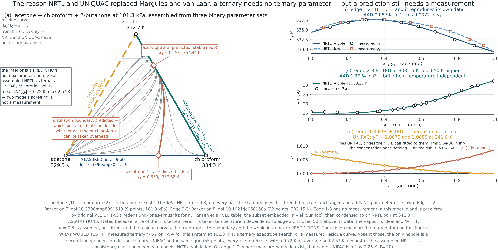{.fig-cap width="80%"}

:::: {.cards}
::: {.card}

[Two edges fitted to measurement]{.card-h .c-teal}

Acetone + chloroform, 9 points at the map's own pressure: AAD **0.087 K** in
$T$ ([doi:10.3390/app8091519]{.small}). Chloroform + 2-butanone, 22 points: AAD
**1.27 %** in $P$ ([doi:10.1021/je060150a]{.small}), measured 50 K below where
it is used.

:::

::: {.card}

[One edge predicted]{.card-h .c-rust}

Acetone + 2-butanone: no dataset could be sourced, so UNIFAC supplies it —
$\gamma^\infty = 1.0070$ and $1.0085$ at 341.0 K, almost ideal. All of the risk
on this edge is in UNIFAC.

:::
::::

::: {.source}
F4.19 · Acetone + chloroform + 2-butanone at 101.3 kPa. Original VLE UNIFAC on the unmeasured edge; $\tau$ temperature-independent and $\alpha = 0.3$ assumed.
:::

::: {.notes}
**TEACHING TIP**
Take the three edges one at a time and ask what evidence each rests on: a fit at
the right condition, a fit 50 K away, and no measurement at all. Students expect
a ternary study to be a ternary experiment; almost none of them are.

**ASSUMPTION, STATED**
$\tau$ temperature-independent, so edge 2-3 is used 50 K above its data;
$\alpha = 0.3$ assumed, not fitted; ideal vapour, $\Phi_i = 1$.

**ASK THE CLASS**
Which of the three edges would you measure first, if you could measure one?
:::

## What the map predicts

::: {.kicker .c-amber}
4.5 · Building an activity coefficient model from data
:::

::: {.lede}
Five fixed points, two azeotropes and a distillation boundary — every one of
them out of binary numbers, and every one of them a prediction.
:::

:::::: {.cards .g3}
::: {.card}

[The fixed points]{.card-h .c-teal}

Pure acetone at 329.34&nbsp;K and pure chloroform at 334.35&nbsp;K are unstable
nodes.
The acetone + chloroform azeotrope, $x_1 = 0.3395$ at **337.62 K**, is a
saddle; the chloroform + 2-butanone azeotrope, $x_2 = 0.2568$ at **354.44 K**,
is the stable node. Both are maximum-boiling.

:::

::: {.card}

[The boundary follows]{.card-h .c-amber}

Two unstable nodes and one stable node force a separatrix, integrated here from
the 1-2 azeotrope to the 2-3 azeotrope. Which side of that line a feed falls on
decides whether acetone or chloroform can be taken overhead — a process
decision resting on no ternary measurement.

:::

::: {.card}

[What was checked]{.card-h .c-rust}

Gibbs-Duhem residual $2\times10^{-11}$ on the assembled ternary, pure limits
exact, and each fitted edge reproducing its own data. Those test the algebra
and the edges. **They say nothing about the interior.**

:::
::::::

::: {.notes}
**TEACHING TIP**
Residue curves are worth two minutes: ${\rm d}x_i/{\rm d}\xi = x_i - y_i$ is the
liquid left in a still as a batch boils away, so its fixed points are exactly
the pure components and the azeotropes. Nodes and saddles then follow from the
boiling temperatures with no extra physics.

**COMMON MISCONCEPTION**
That a distillation boundary is a measured object. It is a computed separatrix,
and it moves when the parameters move.

**ASK THE CLASS**
Both azeotropes here are maximum-boiling. What does that make the stable node,
and what therefore ends up in the still pot?
:::

## A prediction is not a validation

::: {.kicker .c-amber}
4.5 · Building an activity coefficient model from data
:::

::: {.lede}
The interior of that triangle is scored against a second prediction. Say what
that is worth, and say what would test it.
:::

:::: {.cards}
::: {.card}

[The only handle available]{.card-h .c-amber}

Over 55 interior points with every $x_i \ge 0.05$, the assembled binary NRTL
and a direct ternary UNIFAC agree to a mean of **0.72 K** in bubble
temperature, **2.57 K** at worst. Two models built on the same kind of
assumption agreeing is a lower bound on the uncertainty — not evidence about
the fluid.

:::

::: {.card}

[And the calibration of that handle]{.card-h .c-rust}

On edge 1-2, where measurement exists, that same UNIFAC is 0.25 K out on
average. So the interior spread is of the order of one model's *known* error on
an edge. It bounds nothing by itself, and quoting it as an accuracy would be a
misrepresentation.

:::
::::

::: {.note}
What would test it: measured ternary $P$-$x$-$y$ or $T$-$x$-$y$ for this system
at 101.3 kPa, a ternary azeotrope search, or a measured residue curve. None
could be sourced, so the map stands as a prediction and is labelled as one on
its own face.
:::

::: {.notes}
**TEACHING TIP**
This is the epistemic slide of the section. Model-versus-model agreement is
routinely reported in papers as if it were validation, and students who cannot
name the difference will reproduce the error in their capstone.

**COMMON MISCONCEPTION**
That because the edges were fitted to data, the interior has been checked. The
edges are what was fitted. The interior is what was extrapolated, and no
residual on the edges constrains it.

**ASK THE CLASS**
Your simulator has just drawn this boundary and your feed sits 0.02 from it.
What do you do before spending money?
:::

## Two ways to find out whether you have learned the noise

::: {.kicker .c-amber}
4.5 · Building an activity coefficient model from data
:::

::: {.lede}
Reporting the residual on the points you fitted is not evidence.
:::

:::: {.cards}
::: {.card}

[Cross-validation by composition]{.card-h .c-teal}

Train on the middle of the range and predict the dilute ends, then the reverse.
Report both. A model that fits its training points three times better than it
predicts the held-out ones has learned the scatter.

Splitting on alternate points tests almost nothing — neighbouring points carry
almost the same information.

:::

::: {.card}

[Against a prediction]{.card-h .c-amber}

UNIFAC predicts $\gamma$ from group contributions with nothing fitted to your
data. Your model must beat it — it saw the answer. The question is by how much,
and whether the margin survives outside the fitted range.

State the margin in a quantity someone would act on: $\gamma^\infty$, or the
azeotrope composition. Not in rms.

:::
::::

::: {.notes}
**TEACHING TIP**
The UNIFAC comparison is the reality check on the whole enterprise. If two
fitted parameters buy 20 % on $\gamma^\infty$ over a zero-parameter prediction,
say so, and say whether that was worth the experiment.

**ASK THE CLASS**
When would you use UNIFAC in preference to your own fitted parameters?
:::

## When there is nothing to fit

::: {.kicker .c-amber}
4.5 · Building an activity coefficient model from data
:::

::: {.lede}
The common industrial case is not a noisy dataset. It is no dataset. Group
contribution answers with nothing fitted, and the question a student must
answer with a **number** is how wrong that is.
:::

:::::: {.cards .g3}
::: {.card}

[Which UNIFAC]{.card-h .c-teal}

Original VLE UNIFAC — the Fredenslund-Jones-Prausnitz form with the Hansen et
al. group-interaction table. **Not** modified UNIFAC (Dortmund): no
temperature-dependent $a_{mn}$, no revised combinatorial. Dortmund was fitted
to more data and gives different numbers. A prediction is reproducible only if
the table it came from is named.

:::

::: {.card}

[The ladder]{.card-h .c-amber}

Three published binaries, the same bubble-point routine, the same ideal-vapour
assumption, the same points: 0 parameters (UNIFAC), 1 (two-suffix Margules by
Barker), 2 (NRTL by Barker, $\alpha = 0.3$). The only thing that changes is how
many numbers were allowed to see the data.

:::

::: {.card}

[The measuring stick]{.card-h .c-rust}

Every error divided by the uncertainty the **source paper** reports. Below 1,
the model sits inside the noise of the measurement judging it, and no further
fitting can be shown to help. An error is only "good enough" against something.

:::
::::::

::: {.notes}
**TEACHING TIP**
Ask what they would do tomorrow if the pair they need has never been measured.
Most say "find a similar system". The defensible answer is: predict it, name the
revision and the table, and quote the expected error against a system where both
were available.

**COMMON MISCONCEPTION**
That "UNIFAC" names one model. There are at least three in common use with
different parameter tables, and they disagree. Naming the revision is part of
reporting the number.

**ASK THE CLASS**
Your prediction is 3 % out in bubble pressure. Is that acceptable? What single
piece of information do you need before you can answer?
:::

## How wrong is a prediction with nothing fitted?

::: {.kicker .c-amber}
4.5 · Building an activity coefficient model from data
:::

::: {.lede}
Three published binaries, and two of the three answers are not the ones the
usual story predicts.
:::

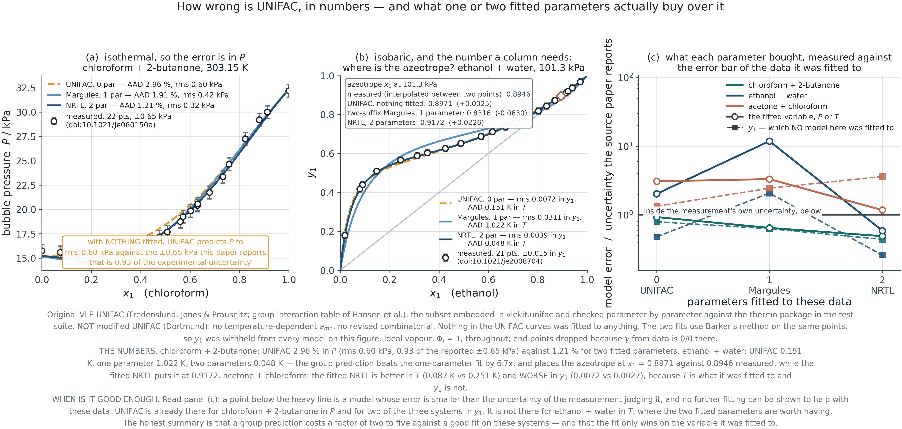{.fig-cap width="82%"}

:::: {.cards}
::: {.card}

[The prediction beats the fit]{.card-h .c-teal}

Ethanol + water at 101.3 kPa: UNIFAC gives AAD **0.15 K** in bubble temperature
against **1.02 K** for the one-parameter fit — better by 6.7 times, with
nothing fitted. It places the azeotrope at $x_1 = 0.8971$ against 0.8946
measured, where the Barker-fitted NRTL says 0.9172.

:::

::: {.card}

[Inside the experimental error bar]{.card-h .c-amber}

Chloroform + 2-butanone at 303.15 K: UNIFAC's rms in bubble pressure is
**0.60 kPa** against the $\pm 0.65$ kPa the paper itself reports — 0.93 of the
measurement's own uncertainty, with no parameter fitted to it.

:::
::::

::: {.source}
F4.20 · [doi:10.1021/je060150a]{.small}, [doi:10.1021/je2008704]{.small}, [doi:10.3390/app8091519]{.small}. Both fits are Barker on the same points, so $y_1$ was withheld from every model on the figure.
:::

::: {.notes}
**TEACHING TIP**
The one-parameter row is the one to dwell on. A two-suffix Margules is
symmetric, and ethanol + water is not; forcing a symmetric $G^E$ onto a skewed
system costs more than having no parameters at all. The fit is not bad
arithmetic — it is the wrong shape, and Section 4.5's shape argument predicted
it.

**COMMON MISCONCEPTION**
That more fitted parameters is monotonically better. It is monotonic in the
residual on the fitted variable, and in nothing else.

**ASK THE CLASS**
Panel (c): a point below the heavy line is inside the measurement's own
uncertainty. What would you have to do to demonstrate an improvement below that
line?
:::

## A fit is only better where you fitted it

::: {.kicker .c-amber}
4.5 · Building an activity coefficient model from data
:::

::: {.lede}
Acetone + chloroform: the fitted NRTL wins on the variable it was fitted to and
loses on the one it never saw.
:::

:::: {.cards}
::: {.card}

[The two columns]{.card-h .c-rust}

NRTL fitted by Barker on $T$: AAD **0.087 K** against UNIFAC's 0.251 K — the
fit wins where it was fitted. rms in $y_1$: **0.0072** against UNIFAC's
**0.0027** — the fit loses by a factor of 2.7 on the variable Barker's method
deliberately withholds. And $y$ is what an azeotrope and a stage count are made
of.

:::

::: {.card}

[The lesson]{.card-h .c-teal}

A fit to a poor objective on thin data can be worse than a prediction that used
none of it. State the margin over UNIFAC in a quantity someone would act on,
and on a variable the fit did not get to optimise — otherwise the margin is
bookkeeping.

:::
::::

::: {.note}
This is not a claim that UNIFAC is as good as a fit. On these three systems two
fitted parameters buy a factor of 1.9 to 3.4 on the *fitted* variable. The claim
is that the gap is a number, that it is often smaller than the measurement
error, and that it must be quoted somewhere the fit had no advantage.
:::

::: {.notes}
**TEACHING TIP**
Put this beside the point test of Section 4.4. Both rest on the same fact: a $y$
that was never fitted is the only $y$ that can test anything. Here it tests the
model instead of the data.

**COMMON MISCONCEPTION**
That reporting the residual on the fitted variable describes the model. It
describes the fit. The two coincide only when the objective happened to be the
quantity you need.

**ASK THE CLASS**
You need the azeotropic composition. Which of the two models on this slide do
you use, and what does that say about the objective you should have fitted?
:::

## Temperature, and the limits of two numbers

::: {.kicker .c-amber}
4.5 · Building an activity coefficient model from data
:::

::: {.lede}
Parameters fitted at one temperature, used at another.
:::

$$\tau_{ij} = \exp\!\left(-\frac{\Delta u_{ij}}{RT}\right)
\quad\Longrightarrow\quad
\frac{\partial (G^E/RT)}{\partial T}\Big|_{x} = -\frac{H^E}{RT^2}$$

:::: {.cards}
::: {.card}

[What the extrapolation assumes]{.card-h .c-rust}

Fitting $\tau$ directly at one temperature and reusing it assumes $G^E/RT$ is
independent of $T$ — that is, $H^E = 0$. Fitting $\Delta u$ instead assumes
$\Delta u$ is constant, which is weaker but still an assumption.

:::

::: {.card}

[In practice]{.card-h .c-teal}

Twenty or thirty kelvin is usually tolerable for a non-associating mixture.
Across an alcohol/water column from reboiler to condenser it is not, and the
error shows up exactly where the column is hardest to control.

:::
::::

::: {.notes}
**TEACHING TIP**
Tie this back to F4.9: the same $H^E$ that we could not obtain for the isobaric
consistency test is the quantity that governs temperature extrapolation. The
gap in the data appears twice.
:::

## The deliverable

::: {.kicker .c-amber}
4.5 · Building an activity coefficient model from data
:::

::: {.lede}
A regression report that stops at the parameters is not finished.
:::

:::: {.numbered .n4}
1. **Model, parameters and objective.** Which $G^E$ form, which two numbers, minimised against what, with which vapour-phase assumption.
2. **Range of validity.** The composition, temperature and pressure range of the data, stated as a range and not as a midpoint.
3. **Uncertainty and correlation.** A confidence region or a covariance, not two independent error bars.
4. **What was extrapolated.** Every quantity you report that lies outside the data — $\gamma^\infty$, an azeotrope, a predicted phase split — named as an extrapolation.
::::

::: {.notes}
**TEACHING TIP**
This list is the marking scheme for the capstone. Say so. Students write the
statement when they know it is marked and not otherwise.

**COMMON MISCONCEPTION**
That the domain of validity is a formality. It is the difference between a
number and an engineering result.
:::

## Using the model {.dark .divider .c-teal background-color="#1C242B"}

::: {.kicker .c-amber}
PART VI
:::

::: {.lede}
Section 4.6&nbsp;&nbsp;&nbsp;Bubble, dew, flash — and the question none of them asks.
:::

::: {.notes}
**TEACHING TIP**
Short closing section. Its purpose is to connect the fitted model to the
calculations the students will actually run, and to open the door to Module 5.
:::

## Four calculations, one equation

::: {.kicker .c-amber}
4.6 · Bubble, dew and flash
:::

::: {.lede}
$y_i P = x_i \gamma_i P_i^{\rm sat}$ throughout. What changes is which two of
$P$, $T$, $x$, $y$ you were given.
:::

:::::: {.cards .quad}
::: {.card}

[BUBL P]{.card-h .c-teal}

Given $x$, $T$; solve for $P$, $y$.
$$P = \sum_i x_i \gamma_i P_i^{\rm sat}$$
Everything on the right is known. **Explicit.**

:::

::: {.card}

[DEW P]{.card-h .c-sky}

Given $y$, $T$; solve for $P$, $x$.
$$\frac{1}{P} = \sum_i \frac{y_i}{\gamma_i P_i^{\rm sat}}$$
$\gamma_i$ needs $x$, which is the answer.

:::

::: {.card}

[BUBL T]{.card-h .c-amber}

Given $x$, $P$; solve for $T$, $y$.
$$\sum_i x_i \gamma_i P_i^{\rm sat}(T) = P$$
$P_i^{\rm sat}$ is not computable yet.

:::

::: {.card}

[DEW T]{.card-h .c-rust}

Given $y$, $P$; solve for $T$, $x$.
$$\sum_i \frac{y_i}{\gamma_i P_i^{\rm sat}(T)} = \frac{1}{P}$$
Both difficulties at once.

:::
::::::

::: {.note}
The pattern is in the algebra, not in the physics: the bubble forms are sums,
the dew forms are sums of reciprocals. Everything that follows — which one
needs a loop, which one is slow, which one fails — comes from that difference
and from where the unknown sits.
:::

::: {.notes}
**TEACHING TIP**
Write the four equations side by side and let the students find the pattern
themselves: the bubble forms are sums, the dew forms are sums of reciprocals,
and that is the whole difference in structure.

**COMMON MISCONCEPTION**
That these are four algorithms. They are one equation with four different
things unknown, and a simulator keeps them separate only because the numerics
differ.

**ASK THE CLASS**
Which of the four is the one a flash calculation reduces to at $V = 0$? At
$V = 1$?
:::

## Which of them needs an inner loop, and why

::: {.kicker .c-amber}
4.6 · Bubble, dew and flash
:::

::: {.lede}
Two independent difficulties, and they compose. Nothing here is about the
solver; it is about which unknown appears inside which function.
:::

:::: {.cards}
::: {.card}

[Difficulty 1 — $\gamma_i$ needs the liquid]{.card-h .c-rust}

The activity coefficient is a function of $x$. In the two DEW problems $x$ is
what you are solving for, so $\gamma_i$ must be re-evaluated every step:
successive substitution on $x$, starting from the ideal answer $x = y$.

:::

::: {.card}

[Difficulty 2 — $P_i^{\rm sat}$ needs the temperature]{.card-h .c-amber}

Antoine is evaluated at the unknown $T$ in the two $T$ problems, so an outer
root-find on $T$ wraps whatever is inside. **DEW T has both**, and the inner
loop runs to convergence at every outer trial temperature.

:::
::::

::: {.note}
Which is why the cost is multiplicative rather than additive, and why a loose
inner tolerance corrupts the outer root-find instead of merely slowing it: the
outer function stops being a smooth function of $T$.
:::

::: {.notes}
**TEACHING TIP**
Ask them to predict the iteration counts before the next slide. Most expect
DEW T to be about twice BUBL T. It is thirteen outer iterations each carrying
its own inner loop.

**ASK THE CLASS**
Turn on a virial vapour correction. Which of the four gains an *extra* loop,
and why does BUBL P stop being explicit?
:::

## The four, worked

::: {.kicker .c-amber}
4.6 · Bubble, dew and flash
:::

::: {.lede}
Methanol + water, NRTL fitted by Barker to 16 published points, ideal vapour,
composition specified as 0.40 in each case.
:::

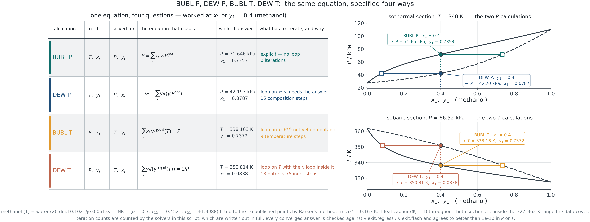{.fig-cap width="92%"}

:::: {.cards}
::: {.card}

[The four answers]{.card-h .c-teal}

BUBL P 71.646 kPa, no iteration at all. DEW P 42.197 kPa in 15 composition
steps. BUBL T 338.163 K in 9 temperature steps. DEW T 350.814 K in
**13 outer × 75 inner**.

:::

::: {.card}

[The ratio is the lesson]{.card-h .c-rust}

Nothing was made harder: same system, same model, same tolerance. Moving the
specification from the liquid to the vapour and from $P$ to $T$ costs about two
orders of magnitude in work, and that cost is where a flowsheet fails.

:::
::::

::: {.source}
F4.14 · Iteration counts counted by the solvers, not estimated; every answer checked against `vlekit` to better than $10^{-10}$. Data: [doi:10.1021/je300613v]{.small}.
:::

::: {.notes}
**TEACHING TIP**
Have them write `my_bubble_P` and `my_dew_T` from scratch in the notebook
before seeing this. Fifteen minutes of that teaches the asymmetry better than
any slide, and the check against `vlekit` at $10^{-10}$ is what agreement
between two implementations should look like.

**COMMON MISCONCEPTION**
That 0.40 means the same thing in all four. It does not: 0.40 in the liquid and
0.40 in the vapour are different states, which is why the answers are not
comparable pairs.
:::

## The cheapest check you can run

::: {.kicker .c-amber}
4.6 · Bubble, dew and flash
:::

::: {.lede}
For one composition at one condition, the four answers must be ordered. If they
are not, you have a sign error.
:::

:::: {.cards}
::: {.card}

[The ordering, and why it must hold]{.card-h .c-teal}

At the same $T$ and specified composition, BUBL $P >$ DEW $P$: 71.646 against
42.197 kPa. At the same $P$, BUBL $T <$ DEW $T$: 338.163 against 350.814 K.
The bubble point is the first bubble of vapour, the dew point the last drop of
liquid, and the two-phase region lies between them.

:::

::: {.card}

[It held on all four systems]{.card-h .c-amber}

Benzene + toluene, methanol + water, ethanol + water and chloroform +
2-butanone: sixteen numbers, ordered correctly in every row, with the
from-scratch code and `vlekit` agreeing to $10^{-10}$. Two failure modes are
caught by one comparison that costs nothing.

:::
::::

::: {.notes}
**TEACHING TIP**
This is the habit worth transferring: before trusting a new routine, find the
inequality that must hold and check it, rather than checking against a number
someone else computed. It catches swapped components, swapped phases and
reciprocal errors in one line.

**ASK THE CLASS**
Your DEW T comes out below your BUBL T. Name three specific bugs that would do
that.
:::

## What the activity coefficient is actually for

::: {.kicker .c-amber}
4.6 · Bubble, dew and flash
:::

::: {.lede}
The output of the whole module is two numbers, a column is sized on the second,
and neither of them is a constant.
:::

$$K_i = \frac{y_i}{x_i} = \frac{\gamma_i P_i^{\rm sat}(T)}{P},
\qquad
\alpha_{12} = \frac{K_1}{K_2} = \frac{\gamma_1 P_1^{\rm sat}}{\gamma_2 P_2^{\rm sat}}$$

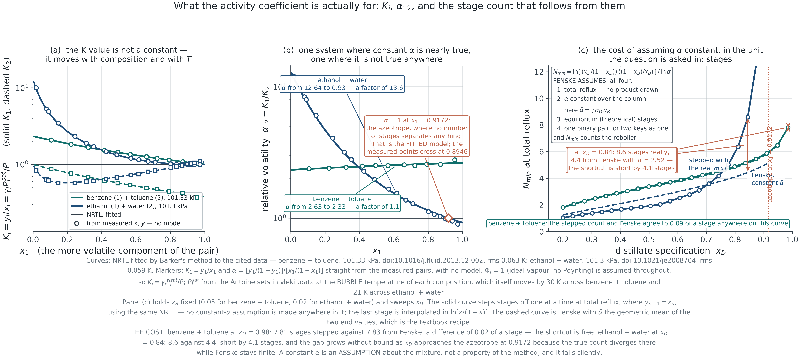{.fig-cap width="80%"}

::: {.note}
Benzene + toluene: $\alpha$ runs 2.63 to 2.33, a factor of **1.13**. Ethanol +
water: 12.64 to 0.93, a factor of **13.6**, through 1 at the azeotrope. The
markers need no model: $K_1 = y_1/x_1$ from the measured pairs gives 2.38 to
2.78 and 0.90 to 11.98. NRTL by Barker on
[doi:10.1016/j.fluid.2013.12.002]{.small} and [doi:10.1021/je2008704]{.small}.
:::

::: {.notes}
**TEACHING TIP**
$K_i$ is the only place the whole module's machinery becomes visible to a
process engineer, and $K_1 = y_1/x_1$ is measurable with no model at all. Show
the markers first, then the curve, so they see that the model is being tested
rather than defining the quantity.

**COMMON MISCONCEPTION**
That $K$ is a property tabulated per component. It carries $\gamma_i(x, T)$ and
$P$, so it is a property of the mixture at a state — which is why a De Priester
chart works for light hydrocarbons and fails for alcohols.

**ASK THE CLASS**
$\alpha_{12} < 1$ past the ethanol + water azeotrope. What has physically
happened to the column above that composition?
:::

## Fenske, and what constant $\alpha$ costs

::: {.kicker .c-amber}
4.6 · Bubble, dew and flash
:::

::: {.lede}
The shortcut is free on one system and wrong by four stages on the other — same
equation, same effort, no warning either way.
:::

$$N_{\min} = \frac{\ln\!\left[\dfrac{x_D}{1-x_D}\cdot\dfrac{1-x_B}{x_B}\right]}
{\ln\tilde\alpha},
\qquad \tilde\alpha = \sqrt{\alpha_D\,\alpha_B}$$

:::::: {.cards .g3}
::: {.card}

[Four assumptions]{.card-h .c-teal}

Total reflux, so no product is drawn; $\alpha$ constant over the column, taken
as the geometric mean of the two end values; equilibrium stages; and one binary
pair, or two keys treated as one. $N_{\min}$ counts the reboiler.

:::

::: {.card}

[Where it costs nothing]{.card-h .c-amber}

Benzene + toluene, $x_B = 0.05$: stepping the stages off one at a time with the
real $\alpha(x)$ agrees with Fenske to **0.09 of a stage** anywhere on the
curve. At a distillate of 0.985 the stepped count is 7.81 and Fenske 7.83.

:::

::: {.card}

[Where it costs four stages]{.card-h .c-rust}

Ethanol + water, $x_B = 0.02$, $x_D = 0.84$: **8.6 stages** stepped against
**4.4** from Fenske at $\tilde\alpha = 3.52$. At $x_D = 0.912$ the true count is
34 and diverging into the azeotrope at 0.9172 — and Fenske returns **5.1**.

:::
::::::

::: {.note}
The stepping assumes nothing extra: at total reflux $y_{n+1} = x_n$, so the same
NRTL that gave $\alpha$ gives the stage count. Constant $\alpha$ is an
assumption about the *mixture*, not a property of the method — and it does not
fail loudly. It fails by returning a plausible number.
:::

::: {.notes}
**TEACHING TIP**
Ask for the sign of the error before showing it. Most expect the shortcut to be
conservative. It is short by four stages here, in the direction that builds a
column that cannot make the specification.

**COMMON MISCONCEPTION**
That the geometric mean fixes the varying $\alpha$. It is exact only if
$\ln\alpha$ is linear in the stage number, which is a statement about the
mixture nobody checked.

**ASK THE CLASS**
Fenske returns 5.1 stages at a distillate specification that actually needs
infinitely many. What would have told you, without doing the stepping?
:::

## Rachford-Rice

::: {.kicker .c-amber}
4.6 · Bubble, dew and flash
:::

::: {.lede}
Monotonic in the vapour fraction, and therefore safe. Show the plot before the
algebra.
:::

$$F(V) = \sum_i \frac{z_i (K_i - 1)}{1 + V(K_i - 1)} = 0,
\qquad K_i = \frac{y_i}{x_i} = \frac{\gamma_i P_i^{\rm sat}}{P}$$

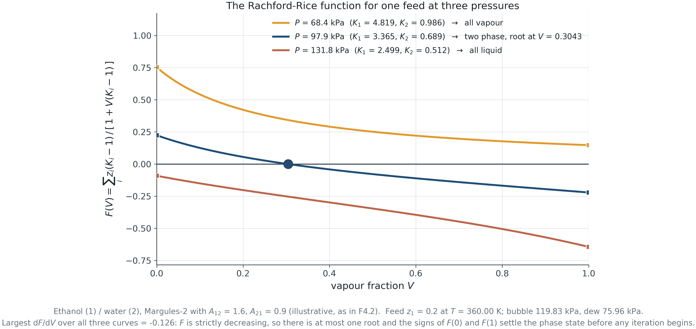{.fig-lg width="66%"}

::: {.source}
F4.10 · One feed at three pressures. The signs of $F(0)$ and $F(1)$ settle the phase state before any iteration begins.
:::

::: {.notes}
**TEACHING TIP**
${\rm d}F/{\rm d}V < 0$ everywhere, so there is at most one root and bisection
cannot fail. That is the whole reason this formulation is used rather than the
algebraically equivalent ones.

**ASK THE CLASS**
$F(0) < 0$. What have you learned without solving anything?
:::

## The question the flash never asks

::: {.kicker .c-amber}
4.6 · Bubble, dew and flash
:::

::: {.lede}
Rachford-Rice was told there are two phases, and it will find two phases.
:::

:::: {.cards}
::: {.card}

[What is missing]{.card-h .c-rust}

Nothing in the equilibrium equations checks **how many** phases there should
be. A fitted model that predicts a liquid-liquid split will still return a
single perfectly reasonable-looking liquid composition inside the gap.

:::

::: {.card}

[What answers it]{.card-h .c-teal}

The Gibbs energy of mixing and a tangent construction — not the equilibrium
equations. A liquid splits when $\Delta g_{\rm mix}$ dips below its own chord.
That is Module 5, and it is why the capstone spans both modules.

:::
::::

::: {.notes}
**TEACHING TIP**
Demonstrate the failure rather than describing it: flash a feed inside the
predicted miscibility gap and show the plausible wrong answer. Then show the
$\Delta g_{\rm mix}$ curve.
:::

## The link to equations of state {.dark .divider .c-teal background-color="#1C242B"}

::: {.kicker .c-amber}
PART VII
:::

::: {.lede}
Section 4.7&nbsp;&nbsp;&nbsp;The activity route runs out. The equation of state does not describe polar liquids. A mixing rule built from $G^E$ is the bridge — and this section reports what it is actually worth.
:::

::: {.notes}
**TEACHING TIP**
This section used to be an appendix marked "not examined". It is now lectured,
because every simulator property-method list contains PRWS, PSRK and MHV2 and a
graduate who cannot say what those mean will pick one from a dropdown.

**TEACHING TIP**
The section ends with a number that goes against the usual telling of this
story. Do not skip it. A deck that hides the losing number teaches students to
hide theirs.
:::

## Where gamma-phi stops working

::: {.kicker .c-amber}
4.7 · Equations of state and the $G^E$ link
:::

::: {.lede}
Methane + n-butane at 310.93 K. Methane sits at $T/T_c = 1.63$: no pure liquid, so no reference fugacity to write $\gamma$ against.
:::

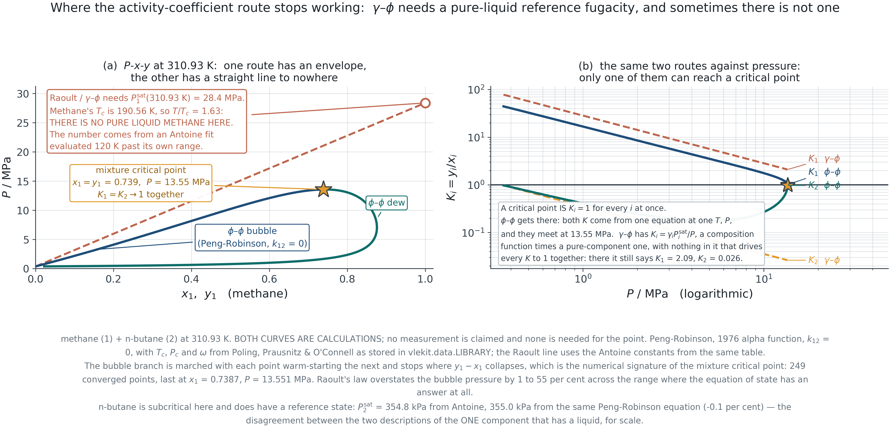{.fig-cap width="82%"}

:::: {.cards}
::: {.card}

[What the two routes say at the critical point]{.card-h .c-rust}

The mixture critical point is at $x_1 = y_1 = 0.7387$, 13.551 MPa. Phi-phi
gives $K_1 = 1.010$, $K_2 = 0.972$ — going to one together, which is what a
critical point *is*. Gamma-phi says 2.09 and 0.026, and cannot make them meet.

:::

::: {.card}

[The fiction underneath]{.card-h .c-amber}

$P_1^{\rm sat} = 28.4$ MPa at 310.93 K comes from an Antoine correlation
evaluated 120 K past its 91–190 K range: a number, not a vapour pressure.

:::
::::

::: {.source}
F4.17 · Both curves are calculations: Peng-Robinson, 1976 $\alpha$, $k_{12} = 0$.
:::

::: {.notes}
**TEACHING TIP**
$K_i = \gamma_i P_i^{\rm sat}/P$ is a composition function times a
pure-component function. There is no mechanism in that product that drives every
$K$ to one simultaneously. Phi-phi gets there because both $K$ come from one
equation at one $T$ and $P$.

**COMMON MISCONCEPTION**
That a better activity model would fix this. No activity model can, because the
reference state itself does not exist.

**ASK THE CLASS**
n-butane *is* subcritical here: Antoine gives 354.8 kPa and Peng-Robinson
355.0 kPa. Why is that agreement not evidence that the gamma-phi route is sound
for this mixture?
:::

## What the classical mixing rule is secretly assuming

::: {.kicker .c-amber}
4.7 · Equations of state and the $G^E$ link
:::

::: {.lede}
Run the argument backwards. With $a$ quadratic and $b$ linear, the cubic already
has an excess Gibbs energy — and you can write it down.
:::

$$\frac{G^E_{\rm cl}}{RT} = \frac{C}{RT}
\left[\frac{a_{\rm cl}(T,x)}{b_{\rm cl}(x)} - \sum_i x_i \frac{a_i}{b_i}\right]
\;\xrightarrow{\;k_{12}=0\;}\;
\frac{K\,x_1x_2}{x_1b_1 + x_2b_2}$$

:::: {.cards}
::: {.card}

[It is a van Laar with no freedom]{.card-h .c-rust}

With $k_{12} = 0$ the bracket factorises into a perfect square, so
$G^E_{\rm cl}$ is exactly a van Laar function with $A = K/b_2$, $B = K/b_1$ —
both constants fixed by the pure-component $a_i$ and $b_i$. Nothing is
adjustable, and $K > 0$, so the classical rule at $k_{12}=0$ **can only produce
positive deviations**.

:::

::: {.card}

[On a real Type 4 binary]{.card-h .c-amber}

Chloroform + 2-butanone at 303.15 K needs $G^E/RT = -0.278$ at equimolar. The
classical rule at $k_{12} = 0$ offers $+0.024$ — the wrong sign. One fitted
$k_{12} = -0.072$ buys $-0.306$, which is why it works here; but the *shape*
stays a single skewed lobe with the skew set by $b_1 : b_2 = 63.4 : 82.5$
cm³/mol.

:::
::::

::: {.note}
So the classical rule is not an alternative to the $G^E$ route. It **is** the
$G^E$ route, with one particular and rather rigid choice of activity model.
:::

::: {.notes}
**TEACHING TIP**
This is a correction to the version of this argument that circulates in
textbooks, where the equivalent model is called a one-constant Margules. Van
Laar reduces to Margules only when $b_1 = b_2$; in general the implied model is
skewed, and the skew is fixed by the co-volumes rather than by the mixture.

**COMMON MISCONCEPTION**
That $k_{ij}$ is a shape parameter. It scales the lobe and can flip its sign; it
cannot move the peak or change the curvature.

**ASK THE CLASS**
An alcohol + water mixture has a strongly skewed, strongly positive $G^E$. Which
feature can a single $k_{ij}$ reproduce, and which is out of reach?
:::

## The bridge: Huron-Vidal

::: {.kicker .c-amber}
4.7 · Equations of state and the $G^E$ link
:::

::: {.lede}
Stop guessing $a(x)$. **Require** the equation of state to reproduce a chosen
$G^E$ — which can only be done at one reference pressure, because the equation
of state's $G^E$ depends on $P$ and the activity model's does not.
:::

$$\frac{a_{\rm mix}}{b_{\rm mix}} = \sum_i x_i \frac{a_i}{b_i}
+ \frac{G^E_\infty}{C},
\qquad
b_{\rm mix} = \sum_i x_i b_i,
\qquad
C = \frac{\ln(\sqrt2 - 1)}{\sqrt2} = -0.6232$$

:::::: {.cards .g3}
::: {.card}

[Why infinite pressure]{.card-h .c-teal}

There $v \to b$, the excess volume vanishes and the expression closes in $a$
and $b$ alone. MHV1 and MHV2 match at zero pressure instead — messier algebra,
one large reward, on the last slide of this section.

:::

::: {.card}

[Watch the sign]{.card-h .c-rust}

$C$ is **negative**, so a positive $G^E$ *lowers* $a/b$ — the direction a
positive $k_{ij}$ moves it, which is the check that the convention is right.
Some references define $C$ with the opposite sign and then subtract. Both are
in print; only one works with the value above. SRK gives $C = -\ln 2$.

:::

::: {.card}

[What it costs]{.card-h .c-amber}

The reference state is not the real liquid, so **published low-pressure NRTL
parameters cannot be reused**, and they do not transfer between SRK and PR
because $C$ differs. Unit tests: the pure limits, and $G^E$ from the equation
of state converging to the activity model as $P \to \infty$.

:::
::::::

::: {.notes}
**TEACHING TIP**
Do the infinite-pressure limit on the board: $Z \to B$, the logarithm tends to
$2\ln(1+\sqrt2)$, the pressure cancels, and what is left is $C\,a/(bRT)$. Five
lines, and it turns a quoted formula into a derived one. The full version is
appendix A.2.

**TEACHING TIP**
Make the reference pressure the centre of the slide. Students accept "match
$G^E$" too easily and then cannot explain why two rules that both match $G^E$
disagree. They match it in different places.

**COMMON MISCONCEPTION**
That you can take NRTL parameters from a low-pressure VLE paper and drop them
into a Huron-Vidal rule. The reference state is different; the numbers mean
different things.

**ASK THE CLASS**
The reference state is infinite pressure and your column runs at 1 bar. In what
sense is the match relevant at all? (Answer honestly: it is an extrapolation,
and its quality is an empirical question — which two slides from now measures.)
:::

## Wong-Sandler, and the constraint it exists for

::: {.kicker .c-amber}
4.7 · Equations of state and the $G^E$ link
:::

::: {.lede}
Every cubic has a low-density expansion, and statistical mechanics fixes the
composition dependence of its leading term exactly.
:::

$$Z = 1 + \frac{B(T,x)}{v} + \dots,
\qquad B(T,x) = b(x) - \frac{a(T,x)}{RT}
= \sum_i\sum_j x_i x_j B_{ij}$$

:::: {.cards}
::: {.card}

[Huron-Vidal violates it]{.card-h .c-rust}

It keeps $b$ linear and puts $G^E$ into $a/b$, so $B$ inherits the composition
dependence of the activity model, which is not a quadratic. Measured on the
excess second virial: **2.20 %** for chloroform + 2-butanone, **22.9 %** for
ethanol + water — ten times worse, and the violation scales with $G^E$.

:::

::: {.card}

[Wong-Sandler imposes it]{.card-h .c-teal}

The quadratic form becomes a second equation, solved together with the
$G^E$ match for $a$ **and** $b$, so $b_{\rm mix}$ stops being linear. Its
violation is $4\times10^{-11}$ %: machine precision, because for that rule it
is an identity and not an approximation. Cost: one extra binary parameter
inside $B_{ij}$.

:::
::::

::: {.note}
The error Huron-Vidal makes is an error in a limit where the cubic ought to be
exact. That is the practical form of the complaint that its parameters do not
travel in temperature — and it is an argument about a region nobody measured.
:::

::: {.notes}
**TEACHING TIP**
Insist on the right denominator. Against $B$ itself the Huron-Vidal violation is
0.026 % and looks like nothing; against the *excess* second virial, which is the
part mixing is responsible for, it is 2.2 %. Choosing the flattering denominator
is how this failure stayed invisible.

**ASK THE CLASS**
Wong-Sandler's $k_{12}$ multiplies the second-virial cross coefficient; the
classical $k_{12}$ multiplies $\sqrt{a_ia_j}$. Why can you not carry a value
from one to the other?
:::

## What it is actually worth, on real data

::: {.kicker .c-amber}
4.7 · Equations of state and the $G^E$ link
:::

::: {.lede}
Chloroform + 2-butanone at 303.15 K: bubble pressures from the cubic alone.
:::

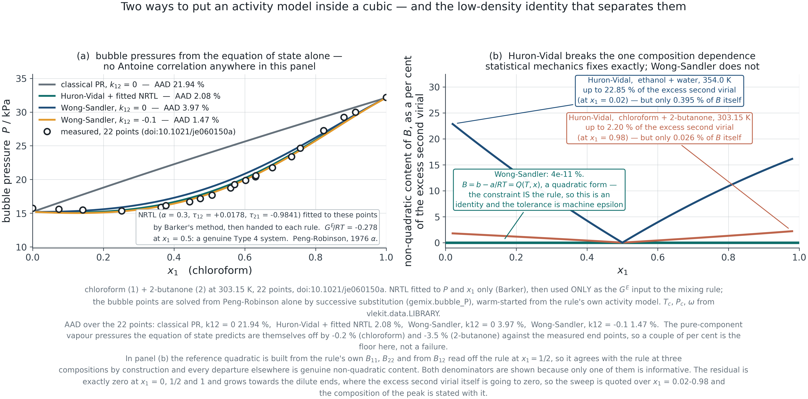{.fig-cap width="78%"}

:::: {.cards}
::: {.card}

[A factor of ten, for no fitted parameter]{.card-h .c-teal}

Classical Peng-Robinson at $k_{12} = 0$: **21.94 %** AAD in bubble pressure.
The same cubic with Huron-Vidal and the Section 4.5 NRTL, which never saw the
equation of state: **2.08 %**. Wong-Sandler 3.97 % at $k_{12}=0$, 1.47 % at
$k_{12} = -0.1$.

:::

::: {.card}

[And the number that loses]{.card-h .c-rust}

Give the classical rule its one parameter, fitted to these pressures:
$k_{12} = -0.072$, AAD **1.34 %**. **It beats Huron-Vidal here** — not the
result the usual telling leads you to expect.

:::
::::

::: {.source}
F4.18 · Peng-Robinson alone; its own pure vapour pressures are $-0.2$ % and $-3.5$ % out, so a per cent or two is the floor. [doi:10.1021/je060150a]{.small}
:::

::: {.notes}
**TEACHING TIP**
Read the last row aloud. The classical rule with one fitted $k_{12}$ beats
Huron-Vidal on this dataset, and that is not the result the usual telling leads
you to expect.

**TEACHING TIP**
Also state the floor: Peng-Robinson misses the pure 2-butanone vapour pressure
by $-3.5$ %, so a couple of per cent is the floor for every phi-phi row here,
not a failure of the mixing rule.
:::

## Reading that result honestly

::: {.kicker .c-amber}
4.7 · Equations of state and the $G^E$ link
:::

::: {.lede}
The case for the $G^E$ rules is not that they fit better on one binary. Two
things in the table are worth more than the AAD column.
:::

:::: {.cards}
::: {.card}

[It fits comparably without being fitted here]{.card-h .c-teal}

The Huron-Vidal 2.08 % used NRTL parameters regressed in Section 4.5, which
never saw the equation of state and never saw these pressures through it. The
classical 1.34 % was regressed against **these very pressures**. Those two
numbers are not the same kind of number.

:::

::: {.card}

[And this binary is an easy case]{.card-h .c-rust}

$G^E/RT = -0.28$ at equimolar: moderately non-ideal, well inside what a single
$k_{12}$ can absorb. The claim for the $G^E$ route is that it does not fall
apart where the classical rule does — strongly associating mixtures, and
extrapolation in temperature, which is where the second-virial violation bites.

:::
::::

| Route | Fitted to these pressures? | AAD in $P$ |
|---|---|---|
| Classical PR, $k_{12} = 0$ | no | 21.94 % |
| Huron-Vidal + the Section 4.5 NRTL | no | 2.08 % |
| Wong-Sandler, $k_{12} = 0$ | no | 3.97 % |
| Wong-Sandler, $k_{12} = -0.1$ | one number | 1.47 % |
| **Classical PR, $k_{12} = -0.072$** | **yes** | **1.34 %** |

::: {.note}
The last two claims are about conditions this dataset does not contain. Say so,
and say what would test them: the same binary at a second temperature, with the
classical $k_{12}$ held at the value fitted here.
:::

::: {.notes}
**TEACHING TIP**
This is the slide that makes the section worth lecturing. The honest structure
of the argument is: comparable fit, unfitted, plus one exact property, plus an
untested extrapolation claim. Students who can state it that way can read any
method-comparison paper.

**ASK THE CLASS**
Design the experiment that separates the classical rule from Huron-Vidal, given
one extra temperature. What result would make you abandon the $G^E$ route?
:::

## What the property-method names mean

::: {.kicker .c-amber}
4.7 · Equations of state and the $G^E$ link
:::

::: {.lede}
The dropdown in a process simulator, decoded. The reference state is the thing
to read off the name.
:::

| Property method | Is | Parameters |
|---|---|---|
| PRWS, RKSWS | Wong-Sandler on PR or SRK | Refit; not the published low-pressure set |
| PRMHV2, RKSMHV2 | Modified Huron-Vidal, second order | Zero-pressure reference — published UNIFAC/UNIQUAC parameters **can** be reused |
| PSRK | Predictive SRK: MHV1 with UNIFAC | Predictive; no binary VLE data needed |
| PR, SRK with $k_{ij}$ | The classical rule | One number per pair, fitted, with a range of validity like any other |

::: {.note}
Choosing a row is choosing a reference state and a parameter obligation, not a
level of sophistication. Appendix slides A.2 and A.3 carry the algebra behind
the first two rows; A.4 is this table with the derivation references.
:::

::: {.notes}
**TEACHING TIP**
Ask which row they would pick for CO₂ + ethanol at 100 bar, and then ask what
they would have to find before they could use it. The answer — a refitted
parameter set at the right reference state, or a predictive method — is the
practical content of this whole section.

**COMMON MISCONCEPTION**
That PSRK being "predictive" makes it safest. It means it needs no binary data,
which is an advantage exactly when you have none and a liability when you have
some and ignore it.
:::

## The module on one page

::: {.kicker .c-amber}
Closing
:::

::: {.lede}
Which question you are in, and which section answers it. Every box carries its
section and the figure that does the work.
:::

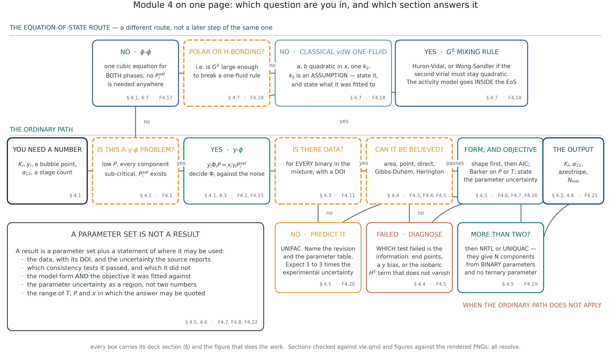{.fig-xl}

::: {.source}
F4.22 · Checked before it was drawn: every section number and every figure tag on the map resolves against this deck and its rendered figures. There is no measured quantity on it — a number here would be a number without a citation.
:::

::: {.notes}
**TEACHING TIP**
Use this twice: once in the first lecture, when nobody can follow it yet, and
once here, when every box has a slide behind it. The three branches below the
spine — no data, failed consistency, more than two components — are the ones
students meet in the capstone and not in the textbook.

**COMMON MISCONCEPTION**
That the equation-of-state row along the top is the end of the same path. It is
a different route with a different reference state, taken from the start, not a
more advanced version of the one below it.

**ASK THE CLASS**
Put your capstone system on this map. Which box are you in, and which branch
will you have to take?
:::

## What you must be able to do

::: {.kicker .c-amber}
Closing
:::

::: {.lede}
The module in eight statements.
:::

:::: {.numbered .n3 .two-col}
1. **Choose a description and defend the assumption.** Raoult, modified Raoult, gamma-phi or phi-phi — and say which assumption you are relying on.
2. **Predict the solution type before fitting.** Two $\gamma^\infty$ and a vapour-pressure ratio decide whether an azeotrope exists, and whether it moves with pressure.
3. **Turn $T$, $P$, $x$, $y$ into $\gamma$ with its uncertainty.** Vapour-phase assumption stated, $P^{\rm sat}$ checked against the paper's own end points.
4. **Test a dataset and diagnose the failure.** All five tests, and a signature-based diagnosis rather than a verdict.
5. **Fit, and say what the fit is worth.** Objective chosen deliberately, confidence region reported, extrapolations named — and compared against UNIFAC.
6. **Choose the functional form on shape grounds.** With both ends pinned, 20 % of $G^E$ is still the form; Wilson cannot split a liquid at all.
7. **Run all four bubble and dew calculations.** Know which need an inner loop, and check the ordering before trusting the answer.
8. **Know where the activity route stops.** No reference fugacity above $T_c$; a $G^E$ mixing rule is the bridge, at a stated reference state.
::::

::: {.notes}
**TEACHING TIP**
Return to the opening statement: a parameter set is not a result. Ask whether
anyone would now use a published NRTL pair without checking the paper's
consistency table and composition range.
:::

## &nbsp; {.dark .mid background-color="#1C242B" visibility="uncounted"}

:::: {.vcenter}
::: {.statement}
Appendix
:::

::: {.statement-hi}
EoS-$G^E$ mixing rules the derivations, in full
:::

::: {.statement-sub}
The algebra behind Section 4.7 — and the unit tests that settle it.
:::
::::

## A.1 · Two worlds that do not meet {visibility="uncounted"}

::: {.kicker .c-amber}
Appendix · EoS-$G^E$ mixing rules
:::

:::: {.cards}
::: {.card}

[Equations of state]{.card-h .c-teal}

Handle high pressure and supercritical components. One model for both phases,
no reference vapour pressure required. Fail on polar and hydrogen-bonding
mixtures, because the quadratic mixing rule assumes random mixing.

:::

::: {.card}

[Activity coefficient models]{.card-h .c-rust}

Handle polar and associating liquids, through local-composition terms fitted to
data. Cannot cross the critical point, and need a reference fugacity that a
supercritical component does not have.

:::
::::

::: {.note}
The engineering problem is the mixture that is both — CO₂ with ethanol, water
with a light gas — and neither description can be pushed into the other's
territory. Section 4.7 builds the bridge; the two slides that follow carry the
algebra it quotes.
:::

## A.2 · The Huron-Vidal algebra {visibility="uncounted"}

::: {.kicker .c-amber}
Appendix · the derivation behind Section 4.7
:::

::: {.lede}
Where $C$ comes from, in five lines. Section 4.7 quotes the result; this is the
limit it is quoted from.
:::

$$\frac{G^{\rm res}}{RT} = B - \frac{A}{2\sqrt2 B}\,
\ln\frac{Z + (1+\sqrt2)B}{Z + (1-\sqrt2)B} + Z - 1 - \ln Z$$

$$P \to \infty:\quad Z \to B,
\qquad \ln\frac{2+\sqrt2}{2-\sqrt2} = 2\ln(1+\sqrt2),
\qquad \frac{G^{\rm res}}{RT} \to B + C\,\frac{a}{bRT}$$

:::: {.cards}
::: {.card}

[Then subtract the pure components]{.card-h .c-teal}

$$\frac{G^E_\infty}{RT} = \frac{P}{RT}\Big(b - \textstyle\sum_i x_i b_i\Big)
+ C\left[\frac{a}{bRT} - \sum_i x_i \frac{a_i}{b_iRT}\right]$$

The first bracket is $PV^E$ and vanishes **iff $b$ is linear in composition** —
exactly the assumption Huron-Vidal makes and exactly the one Wong-Sandler gives
up. With it gone, $a/b = \sum_i x_i a_i/b_i + G^E_\infty/C$.

:::

::: {.card}

[The sign, done slowly]{.card-h .c-rust}

$C = -\ln(1+\sqrt2)/\sqrt2 = \ln(\sqrt2-1)/\sqrt2 = -0.6232$ — the same number
written two ways, and negative. A positive $G^E$ therefore lowers $a/b$, which
is the direction a positive $k_{ij}$ moves it. Writing the rule as
"$-\,G^E/C$" with a negative $C$ turns every positive-deviation system into a
negative-deviation one. Settle it with a numerical limit, not with a reference.

:::
::::

::: {.source}
Huron, M.; Vidal, J. *Fluid Phase Equilib.* **3** (1979) 255-271. SRK gives $C = -\ln 2$; the constant depends on the volume translation of the cubic and on nothing else.
:::

## A.3 · The Wong-Sandler algebra, and the trap {visibility="uncounted"}

::: {.kicker .c-amber}
Appendix · the derivation behind Section 4.7
:::

::: {.lede}
Two conditions, two unknowns. Then the test that makes a correct implementation
look broken.
:::

$$Q = \sum_i\sum_j x_i x_j \left(b - \frac{a}{RT}\right)_{ij},
\qquad
D = \sum_i x_i \frac{a_i}{b_i RT} + \frac{G^E_\infty}{CRT}$$

$$b_{\rm mix} = \frac{Q}{1 - D},
\qquad
a_{\rm mix} = RT\,\frac{Q\,D}{1 - D}$$

:::: {.cards}
::: {.card}

[Why $b$ stops being linear]{.card-h .c-teal}

$Q$ is the imposed quadratic second virial and $D$ carries the $G^E$ match, so
$b_{\rm mix} = Q/(1-D)$ inherits the composition dependence of both. That is the
structural difference from Huron-Vidal, and it is what buys
$B(T,x) = \sum_i\sum_j x_ix_jB_{ij}$ as an identity.

:::

::: {.card}

[The trap]{.card-h .c-rust}

The infinite-pressure derivation matches an excess **Helmholtz** energy.
$G^E - A^E = PV^E$; Huron-Vidal has $V^E_\infty = 0$ so the two coincide, but
Wong-Sandler's $b_{\rm mix}$ is not linear, so its $G^E$ from the equation of
state **diverges** like $PV^E$ while its $A^E$ converges. At
$P = 10^{11}$ kPa and $x_1 = 0.4$: $A^E/RT = -0.258836$ against the activity
model's $-0.258836$, while $G^E/RT$ reads $-93713$.

:::
::::

::: {.source}
Wong, D. S. H.; Sandler, S. I. *AIChE J.* **38** (1992) 671-680. Pure-component reduction ($b_{\rm mix} = b_i$, $a_{\rm mix} = a_i$) is the first unit test; the $A^E$ limit above is the second.
:::

## A.4 · Before you trust an implementation {visibility="uncounted"}

::: {.kicker .c-amber}
Appendix · the derivation behind Section 4.7
:::

::: {.lede}
Five checks, each a limit the algebra must reproduce exactly. Every number
below came out of a run, not out of a reference.
:::

:::: {.evidence}
| | |
|---|---|
| Pure-component reduction | $b_{\rm mix} = b_i$ and $a_{\rm mix} = a_i$ at $x_i = 1$, for both rules. Catches most indexing errors immediately |
| Huron-Vidal, $P \to \infty$ | $G^E/RT$ from the equation of state $= -0.258836$ at $x_1 = 0.4$, against the activity model's $-0.258836$. Converged by $10^{11}$ kPa |
| Wong-Sandler, $P \to \infty$ | Test $A^E$, not $G^E$: $-0.258836$ against the same target, while $G^E/RT$ reads $-93713$ and is *supposed* to |
| Second virial | Wong-Sandler reproduces $\sum_i\sum_j x_ix_jB_{ij}$ to $4\times10^{-11}$ % of the excess; Huron-Vidal to 2.20 % and 22.9 % |
| The classical rule as a special case | Feed the equation of state's own $G^E$ back into either rule and the classical result returns. At $k_{12} = 0$ it is a van Laar: $A = 0.0840$, $B = 0.1093$ for chloroform + 2-butanone at 303.15 K |
::::

::: {.source}
All five are in `vlekit/gemix.py` and its test module. MHV1 and MHV2 (Michelsen, 1990) match at zero pressure instead and are not implemented in the course toolkit — the reason published UNIFAC parameters transfer to PSRK is the reference state, and that argument is on the taught slide.
:::
