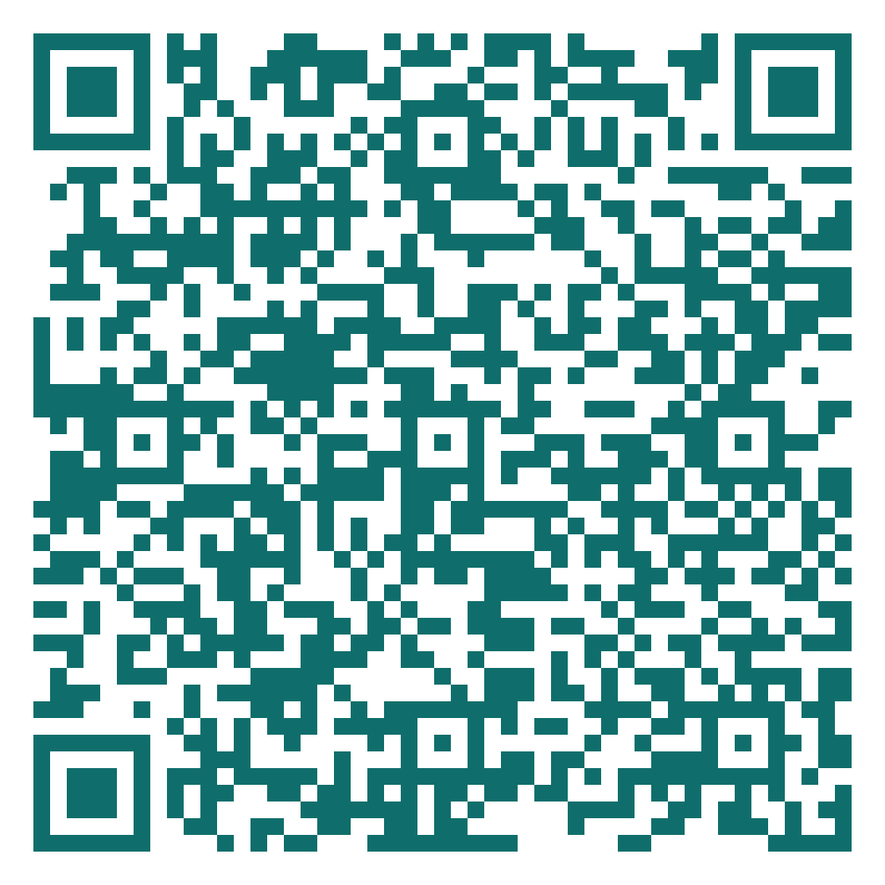

## How was today? {.dark background-color="#1C242B"}

:::: {.columns}
::: {.column width="58%"}

**Before you leave**

Identify one point that is still unclear.

Name one change you will make in your writing or figure.

Complete the short anonymous feedback form.

:::
::: {.column width="42%"}
::: {.qr-card}
{height=400 fig-alt="QR code linking to the existing weekly feedback form"}
:::
:::
::::

::: {.notes}
11:57–12:00 ให้เวลานิสิตส่งแบบสะท้อนการเรียนรู้ ผู้สอนรออยู่หน้าห้อง รับคำถามที่ยังติดค้าง และจบคาบตรงเวลา
:::
