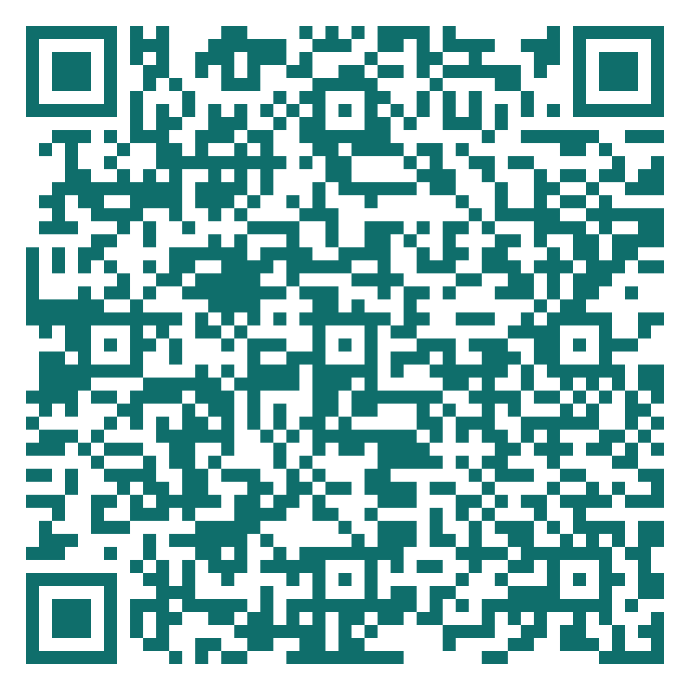

<!-- Shared closing slide. Every week's deck ends with an include of this file
     (see the last line of w01.qmd). One QR serves all fourteen weeks; the
     submission timestamp separates the sessions. -->

## &nbsp; {.dark .mid background-color="#1C242B"}

:::: {.vcenter}
:::: {.columns}
::: {.column width="58%"}
::: {.kicker}
Before you go · 45 seconds
:::

### How was today?

::: {.lede}
Five questions. Anonymous — no name, no email, no login.
:::

::: {.flag}
The fourth question is the one I actually use.
:::

::: {.statement-sub}
The two most common answers open next week's session.
:::

::: {.source}
oxidized-challenge-ed9.notion.site
:::
:::

::: {.column width="42%"}
::: {.qr-card}
{fig-alt="QR code linking to the weekly feedback form"}
:::

::: {.flag .center}
Scan now — I will wait
:::
:::
::::
::::

::: {.notes}
**[ last 3 minutes — stay in the room, QR on screen ]**

**SAY —**

"Before you go. Forty-five seconds, and it is anonymous — no name, no email, no login.

Five questions. The fourth one asks what is still muddiest for you, and that is the one I actually use: the two most common answers open next week's session.

Scan it now. I will wait."

**DO —**

- Do NOT email the link afterwards. In-room versus after-class is more than a twofold difference in response rate.
- Do not pack up or start a conversation while they fill it in. If you look busy, half the room leaves. Stand still.
- From the following week, open the session by answering the top two muddiest points and say where they came from. That is the whole mechanism — a survey students never see used is a survey they stop filling in.
:::
