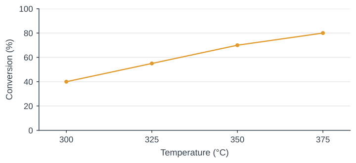
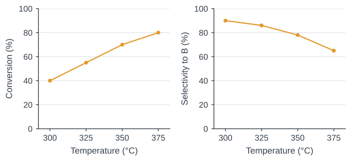
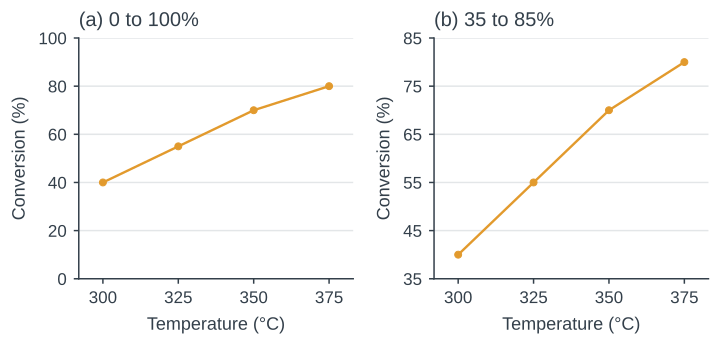

## Is conversion enough?

{height=390 fig-alt="Conversion increases from 40% at 300 degrees Celsius to 80% at 375 degrees Celsius. Only conversion is shown."}

Write one sentence, then discuss: **what other measurement would you want?**

::: {.notes}
Title slide: 09:00–09:01 ทักทายและบอกผลงานปลายคาบ

09:01–09:05 ให้เขียนคนละประโยคก่อนจับคู่ ถามว่า conversion เพียงพอต่อการตัดสิน performance หรือไม่
:::

## The reaction case

**Research question:** How do conversion of A and selectivity to B change with temperature at a residence time of **2.0 s**?

- A forms desired product B and by-products.
- Test **300–375 °C**; assume other conditions are fixed.
- All values are synthetic teaching data.

::: {.notes}
09:05–09:08 ย้ำว่าไม่มีการอ้างถึงตัวเร่งหรือเครื่องปฏิกรณ์จริง สมมติองค์ประกอบป้อนและเงื่อนไขอื่นคงที่
:::

## Evidence for the first sentence

| Temperature (°C) | Conversion (%) | Selectivity to B (%) |
| ---: | ---: | ---: |
| 300 | 40 ± 2 | 90 ± 1 |
| 325 | 55 ± 2 | 86 ± 1 |
| 350 | 70 ± 2 | 78 ± 1 |
| 375 | 80 ± 2 | 65 ± 1 |

::: {.figure-note}
Mean ± sample SD, n = 3 independent runs per temperature. Synthetic data.
:::

::: {.notes}
09:08–09:15 แสดงตาราง ให้นิสิตเขียนข้อค้นพบหนึ่งประโยค เก็บไว้เทียบฉบับท้ายคาบ

Synthetic teaching case. Source: course worksheet and figures/build_figures.py.
:::

## Today’s writing task

By the end of class, you will:

- Write Results (**120–180 words**) with a finding, magnitude and scope.
- Sketch a figure and write a caption (**40–70 words**) that defines the marks and **n**.
- Revise one claim using specific feedback and explain the change.

::: {.notes}
09:15–09:18 ชี้ว่าความยาวเป็นกรอบฝึก ไม่ใช่กฎสากลของวารสาร
:::

## Definitions for this case

**Conversion** = A consumed / A fed × 100%

**Selectivity** = B formed / A consumed × 100%

Assumption: one mole of A can form one mole of B.

**Yield** = conversion × selectivity / 100

::: {.notes}
09:18–09:23 ใช้ฐานโมล สมมติไม่มี B ใน feed และสโตอิชิโอเมทรีหนึ่งต่อหนึ่ง อธิบายว่าคำว่า selectivity อาจใช้นิยามต่างกันในสาขาหรือบทความอื่น
:::

## Observation, implication and hypothesis

**Observation**

Mean conversion increased from 40% to 80% between 300 and 375 °C.

**Implication**

Conversion alone cannot decide the operating condition because selectivity also changes.

**Hypothesis**

Competing pathways may contribute to the trade-off. The present data do not test this explanation.

::: {.notes}
09:23–09:28 ให้จำแนก observation implication และ hypothesis ก่อนเฉลย Observation รายงานสิ่งที่วัด ส่วน implication อธิบายผลต่อการตัดสินใจ และ hypothesis เสนอคำอธิบายที่ยังต้องทดสอบ ไม่ถือว่าการเติม may ทำให้ข้ออ้างมีหลักฐาน ถามว่าการทดลองใดช่วยแยก pathways ออกจากคำอธิบายทางเลือก
:::

## The structure of a Results paragraph

**Finding**

Conversion increased with temperature, while selectivity to B decreased.

**Evidence**

From 300 to 375 °C, conversion rose by 40 percentage points and selectivity fell by 25.

**Scope**

The comparison applies at a residence time of 2.0 s over the tested temperature range.

::: {.notes}
09:28–09:33 ใช้เป็น scaffold ไม่ใช่สูตรบังคับทุกย่อหน้า ยกตัวอย่างเหตุผลที่ไม่ควรไล่ค่าทุกช่อง
:::

## Percent and percentage points

Conversion changes from **40% to 80%**.

| Change | Calculation |
| :--- | :--- |
| **+40 percentage points** | 80 − 40 = 40 |
| **+100% relative to the initial value** | (80 − 40) / 40 × 100 = 100% |

**Quick check:** selectivity changes from 90% to 65%. State both changes.

::: {.notes}
09:33–09:37 ให้คำนวณเองก่อนดูคำตอบ คำตอบ selectivity เปลี่ยน −25 percentage points หรือ −27.8% เทียบกับ 90% เริ่มต้น ไม่ใช่ลดลง 25% ในความหมาย relative change
:::

## One quantitative sentence

- Include the temperature range and the residence time.
- State the direction and magnitude for **both responses**.
- Keep the sentence within what the data show.

**Check:** could your reader recover the comparison without seeing the table?

::: {.notes}
09:37–09:40 ให้แก้ประโยคแรกโดยเพิ่มเงื่อนไขและตัวเลข แล้วขอสองตัวอย่างจากห้อง
:::

## A claim that needs revision

> Temperature dramatically improved reactor performance.
>
> Conversion increased significantly, proving that the catalyst became more active.
>
> Therefore, 375 °C is optimal for industrial operation.

::: {.figure-note}
Deliberately flawed example for critique.
:::

**In pairs:** underline each unsupported claim, then name the evidence it would need.

::: {.notes}
09:40–09:50 ข้อความผิดโดยเจตนา ให้ขีดคำที่ต้องมีหลักฐานเพิ่ม ระบุ performance objective และชี้ว่าการอ้าง catalyst activity ไม่ได้มาจากข้อมูลนี้
:::

## What evidence is missing?

- **“Dramatically”** needs a stated magnitude.
- **“Significantly”** needs a defined statistical basis.
- **Catalyst activity** needs additional measurements.
- **Industrial optimum** needs an objective and constraints.

::: {.notes}
09:50–09:57 ถามพลังงาน การแยก ความเสถียรและต้นทุน ให้แยกข้อมูลที่จำเป็นต่อข้ออ้างแต่ละแบบ
:::

## A revision grounded in the measurements

At a residence time of **2.0 s**, mean conversion increased from **40% at 300 °C** to **80% at 375 °C**.

Mean selectivity to B decreased from **90% to 65%** over the same range.

These measurements show a trade-off between conversion and selectivity.

::: {.notes}
09:57–10:05 เปิดหลังนิสิตแก้เอง ให้เปรียบเทียบกับฉบับตนเอง ยอมรับประโยคอื่นที่มีความหมายถูกต้อง
:::

## The question determines the display

| Question | Useful display |
| :--- | :--- |
| How does response vary with temperature? | Scatter plot, optionally with connecting lines |
| How variable are repeated runs? | Individual points with a defined summary |
| What are the exact values? | A table with units and uncertainty |

Connecting lines guide the eye unless a fitted model is explicitly stated.

::: {.notes}
10:05–10:10 ให้นิสิตเสนอเหตุผลก่อนแสดงคำตอบ ไม่กล่าวว่ามีรูปแบบเดียวที่ถูกต้อง

Synthetic teaching case. Source: course worksheet and figures/build_figures.py.
:::

## Conversion rises while selectivity falls

{width=1050 height=430 fig-alt="Two scatter plots with connecting lines. Conversion increases from 40% to 80% as temperature rises from 300 to 375 °C, while selectivity to B decreases from 90% to 65%. No variability is displayed."}

::: {.figure-note}
Synthetic means at a residence time of 2.0 s. Variability omitted here for the design exercise.
:::

::: {.notes}
10:10–10:15 แสดงค่าเฉลี่ยเท่านั้นในหน้านี้ ถามว่าข้อมูลอะไรหายไปก่อนสอน error bars หลังพัก

Synthetic teaching case. Source: course worksheet and figures/build_figures.py.
:::

## Break {.dark .break background-color="#1C242B"}

::: {.vcenter}
**15 minutes**

Resume at **10:30**
:::

::: {.notes}
10:15–10:30
:::

## Axis limits change the visual impression

{width=1050 height=430 fig-alt="The same conversion means, 40%, 55%, 70%, and 80%, plotted against temperatures 300, 325, 350, and 375 °C in both panels. The left vertical axis spans 0% to 100%, while the right spans 35% to 85%."}

::: {.figure-note}
Same conversion means in both panels. Axis limits must remain visible.
:::

::: {.notes}
10:30–10:36 กราฟสองข้างเป็นข้อมูลเดียวกัน ให้สังเกตขอบแกน กราฟจุดไม่จำเป็นต้องเริ่มศูนย์ทุกกรณี แต่ต้องให้ผู้อ่านตีความขนาดได้ สำหรับแท่งให้ใช้ฐานศูนย์

Synthetic teaching case. Source: course worksheet and figures/build_figures.py.
:::

## Independent runs and repeated readings

**n = 3** means three independent runs in this exercise.

Three readings from one run do not establish three independent experiments.

The sampling unit belongs in the caption.

::: {.notes}
10:36–10:40 ใช้ตัวอย่างการวัดตัวอย่างเดิมสามครั้ง ถามว่าอะไรคือ independent unit ในงานวิจัยของแต่ละคน
:::

## Sample SD describes variation between runs

**Run values:** at 300 °C, conversion is 38%, 40% and 42%.

**Summary:** mean = 40%. Sample SD = 2 percentage points.

Report as mean ± SD: **(40 ± 2)%**.

**SD:** spread between runs. **SE:** precision of the estimated mean; here, SD/√n ≈ 1.15 percentage points.

Neither is a 95% confidence interval. SD-bar overlap alone does not test significance.

::: {.notes}
10:40–10:42 Mean=40, sample SD=2 percentage points, SE=2/√3≈1.15 percentage points. SD บอกการกระจายระหว่าง run ส่วน SE บอกความแม่นของค่าเฉลี่ยโดยประมาณภายใต้สมมติฐานการสุ่มอิสระ ไม่ใช้สองคำแทนกัน ไม่ตัดสินนัยสำคัญจาก SD bars
:::

## Means with sample SD

{width=1050 height=430 fig-alt="Two scatter plots with connecting lines and error bars. Conversion means are 40%, 55%, 70%, and 80% with sample SD of 2 percentage points. Selectivity means are 90%, 86%, 78%, and 65% with sample SD of 1 percentage point. Temperatures are 300, 325, 350, and 375 °C."}

::: {.figure-note}
Synthetic data, n = 3 independent runs per temperature. Bars show ±1 sample SD.
:::

::: {.notes}
10:42–10:44 ใช้ประกอบหน้าอธิบาย error bars ค่า SD เป็น 2 และ 1 percentage points ตามตัวแปร สังเกตว่าช่วงเล็กไม่ใช่หลักฐานกลไก

Synthetic teaching case. Source: course worksheet and figures/build_figures.py.
:::

## A caption makes the figure interpretable

- **System and variable:** temperature in the hypothetical reaction
- **Conditions:** residence time 2.0 s
- **Display:** points are means, bars are ±1 sample SD
- **Replication:** three independent runs per temperature

**Check:** can the reader identify every mark without reading the main text?

::: {.notes}
10:44–10:47 ให้เขียน caption หลังตัดสินใจว่ารูปแสดงอะไรจริง อย่าเขียน error bars ถ้ารูปไม่ได้แสดง
:::

## A caption linked to the marks on the figure

**What and where**

Figure 1. Conversion of A (left) and selectivity to B (right) versus temperature at a residence time of 2.0 s.

**Summary and n**

Points are means of three independent runs per temperature. Bars show ±1 sample SD.

**Other marks**

Lines guide the eye. The data are synthetic and were constructed for teaching.

::: {.notes}
10:47–10:50 ให้จับคู่ข้อความใน caption กับเครื่องหมายบนรูป ชี้ว่า left และ right ต้องตรงกับ panel จริง
:::

## Writing workshop

**35 minutes**

1. **First 10 min:** sketch Figure 1 with labels, units and defined error bars.
2. **Next 20 min:** write Results (120–180 words) and a caption (40–70 words).
3. **Last 5 min:** underline the finding and check every numerical claim.

**Ready for review:** Figure 1 is cited; conditions, units, **n** and error-bar meaning are explicit; no untested mechanism is claimed.

::: {.notes}
10:50–11:25 ให้ 10 นาทีร่างรูป 20 นาทีเขียน 5 นาทีตรวจตนเอง อ้างอิงใบงาน week08_student_worksheet.md เดินดูว่ามีการอ้างกลไกเกินข้อมูลหรือไม่
:::

## Peer review

**20 minutes**

1. Read your partner’s paragraph and figure for **5 minutes**.
2. Check **numbers and units**, **claim strength**, and **caption–figure agreement**.
3. Write **two specific revisions:** quote the sentence, explain the issue and propose a fix.

Discuss which change most improves the match between claim and evidence.

::: {.notes}
11:25–11:45 จับคู่ 5 นาทีอ่าน 10 นาทีเขียนข้อเสนอแนะ 5 นาทีคุย ให้ชี้ประโยคจริงแทนคำว่า good หรือ unclear ลอย ๆ
:::

## Results with a clear finding and scope

**Finding**

At a residence time of 2.0 s, conversion increased with temperature while selectivity to B decreased.

**Magnitude**

From 300 to 375 °C, mean conversion rose by 40 percentage points and selectivity fell by 25.

**Scope**

The measurements show a conversion–selectivity trade-off within the tested range.

::: {.notes}
11:45–11:50 ตัวอย่างย่อสำหรับอ่านบนจอ ฉบับยาวอยู่ใน instructor notes ให้ชี้ประโยคข้อค้นพบ หลักฐาน และขอบเขต
:::

## Exit ticket

**7 minutes**

1. Submit the revised Results paragraph and caption.
2. State **one supported finding** and **one conclusion the data cannot establish**.
3. Identify one sentence you changed after peer review and explain why.

::: {.notes}
11:50–11:57 ให้อธิบายหนึ่งประโยคที่เปลี่ยนหลัง peer review และเก็บงานก่อนเปิด feedback ช่วง 11:57–12:00
:::


