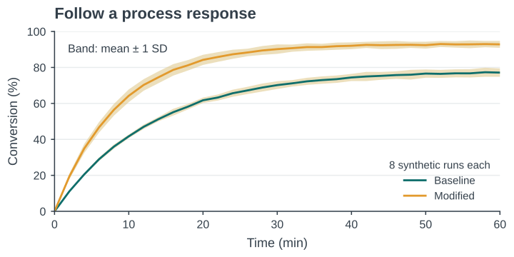
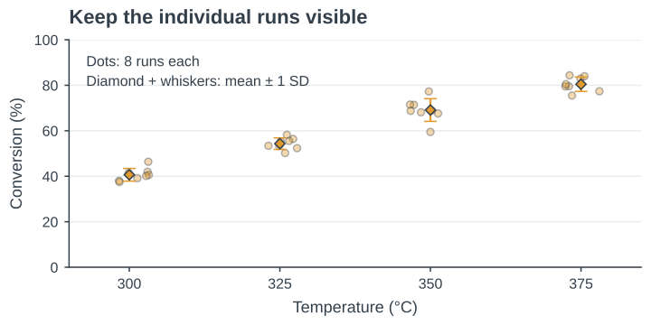
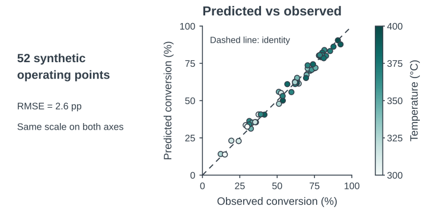
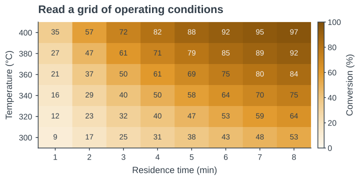
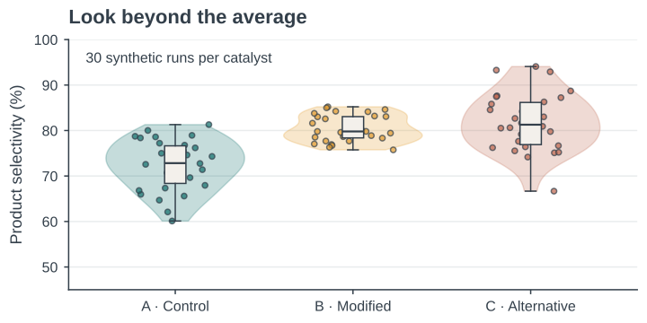
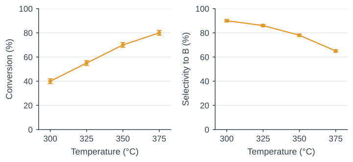

## Today’s deliverables

- A two-panel figure with units and defined SD bars
- A 40–70-word caption that matches the plotted data
- A notebook that recreates the figure after a restart

**Today’s routine:** predict a change, run the cell, check the result.

::: {.notes}
09:00:30–09:02 หลังเปิดคาบ 30 วินาที เชื่อมกับ Week 8: วันนี้สร้างหลักฐานภาพด้วยโค้ด ใช้ข้อมูลสมมติ reaction case เดิม เตรียม Python, pandas, Matplotlib และ Jupyter ไว้ก่อนคาบ
:::

## Time series with an SD band {.gallery-preview}

{height=450 fig-alt="Two synthetic conversion curves rise from zero. The modified condition rises faster and approaches a higher plateau than the baseline. Sand bands show one standard deviation across eight runs."}

::: {.figure-caption}
Synthetic runs: lines are means; sand bands show ±1 sample SD, n = 8 per condition.
:::

::: {.notes}
09:02–09:02:30 เทียบเส้นbaselineกับmodified ให้เห็นการตอบสนองตามเวลา แถบเป็น±1 SDจาก8runsต่อเงื่อนไข ไม่ใช่CI ข้อมูลสมมติแยกจากlab
:::

## Raw observations and a summary {.gallery-preview}

{height=450 fig-alt="Eight dots at each of four temperatures with overlaid mean diamonds and standard-deviation whiskers. Synthetic conversion increases from approximately 40% to 80%."}

::: {.figure-caption}
Synthetic data: eight runs per temperature; diamonds and whiskers show mean ±1 SD. Horizontal jitter separates points.
:::

::: {.notes}
09:02:30–09:03 จุด8runsต่ออุณหภูมิเปิดให้เห็นการกระจาย ขยับแนวนอนเพื่อเลี่ยงซ้อนเท่านั้น diamondและwhiskerคือmean±SD
:::

## Predictions against observations {.gallery-preview}

{height=450 fig-alt="Predicted versus observed synthetic conversion with equal zero-to-100 axes, a dashed identity line, and points colored continuously by temperature from 300 to 400 degrees Celsius."}

::: {.figure-caption}
Synthetic example: 52 operating points. Equal axes and the identity line show agreement; color encodes temperature. RMSE is reported in percentage points (pp).
:::

::: {.notes}
09:03–09:03:30 เส้นidentity y=x ช่วยดูความสอดคล้องของpredictionกับobservation ใช้scaleแกนเท่ากัน สีแสดงtemperatureต่อเนื่อง เป็นตัวอย่างสมมติ52จุด
:::

## A heatmap of operating conditions {.gallery-preview}

{height=450 fig-alt="An amber sequential heatmap of synthetic conversion across six temperature settings and eight residence times. Conversion increases toward the high-temperature, long-residence corner."}

::: {.figure-caption}
Synthetic model: 48 operating settings. Numbers and color show conversion on the same 0–100% scale.
:::

::: {.notes}
09:03:30–09:04 แถวและคอลัมน์คือ48settingsจากแบบจำลอง สีเรียงความเข้มพร้อมค่าตัวเลขช่วยอ่านสองตัวแปร ใช้scale0–100%
:::

## Contours of equal response {.gallery-preview}

{height=450 fig-alt="A smooth amber contour map with labeled lines at 20%, 40%, 60%, 80%, and 90% synthetic conversion. Higher temperature can produce the same model conversion at shorter residence time."}

::: {.figure-caption}
The same assumed model on a finer grid. Smooth contours are model predictions, not extra measurements.
:::

::: {.notes}
09:04–09:04:30 contourเชื่อมค่าคงที่จากแบบจำลองเดียวกับheatmap คำนวณgridละเอียดขึ้น ไม่ได้เพิ่มจำนวนการทดลอง
:::

## Distributions beyond the mean {.gallery-preview}

{height=450 fig-alt="Three catalyst distributions, shown as teal, amber, and rust violins with raw points and small box plots. The modified group is relatively narrow; the alternative group has a broader synthetic spread."}

::: {.figure-caption}
Synthetic data: 30 runs per group. Dots show runs, boxes show median and IQR, and violin width shows a smoothed density.
:::

::: {.notes}
09:04:30–09:05 จุดคือ30runsต่อกลุ่ม boxคือmedianและIQR violinคือdensityที่smooth ชวนเลือกหนึ่งรูปที่อยากทำ ไม่สอนโค้ดขั้นสูงตอนนี้
:::

## Notebook basics

- A **code cell** runs Python. A **Markdown cell** explains it.
- **Shift + Enter** runs a cell. The Run button also works.
- The **kernel** keeps values in memory until you restart it.
- Run code cells from top to bottom. Wait for each to finish.

**Code cell 1:** setup. **Code cell 2:** variables and lists.

::: {.notes}
09:05–09:10 แสดง code cell และ Markdown จริง ชี้หมายเลขการรันซึ่งเปลี่ยนได้ จำนวน code cell ในบทพูดนับเฉพาะ code จากบนลงล่าง ไม่ใช่ execution count ถ้า kernel ยังทำงานให้รอ
:::

## First run

1. Unzip the [lab materials](files/week09_lab_materials.zip) into one folder.
2. Open `week09_starter.ipynb` in the prepared Jupyter environment.
3. Keep the CSV and `skh_palette.py` beside the notebook.
4. Run **code cell 1**. Look for **Setup complete**.

**If setup is still blocked at 09:15:** work with a partner and use the instructor’s running notebook.

::: {.notes}
09:10–09:20 ตรวจการเปิด notebook และข้อความ Setup complete cell นี้ import pandas, matplotlib.pyplot และ skh_palette แล้วใช้ skh.use() ก่อนพล็อต หากติดตั้งไม่สำเร็จให้จับคู่ที่ 09:15 และบันทึกปัญหาแก้หลังคาบ
:::

## A variable stores a value

```python
temperature_C = 300
conversion_pct = 40
print(temperature_C, conversion_pct)
```

**Expected output:** `300 40`

Change `temperature_C` to `325`. Predict, run, then check.

The names record our intended units. Python stores the numbers.

::: {.notes}
09:20–09:25 สร้าง scratch code cell หลัง setup เพื่อสาธิต ชื่อตัวแปรนี้ไม่ทับ temperature ซึ่งเป็น list ใน starter เครื่องหมาย = เก็บค่า เปลี่ยนอุณหภูมิไม่ทำให้ conversion เปลี่ยนเอง
:::

## Lists preserve the pairing of values

```python
temperature = [300, 325, 350, 375]
conversion = [40, 55, 70, 80]
print(len(temperature), len(conversion))
```

**Expected output:** `4 4`

Pair by position: 300 °C with 40%, then 325 °C with 55%.

**Code cell 2:** each x value needs a matching y value.

::: {.notes}
09:25–09:30 ใช้ Variables and lists ใน starter เพิ่ม len(conversion) เพื่อเช็กความยาว อย่าให้ scalar จากสไลด์ก่อนทับ list ถ้าลองแก้รายการให้คืนค่าเดิมก่อนอ่าน CSV
:::

## Functions and named arguments

```python
fig, ax = plt.subplots()
ax.plot(temperature, conversion,
        marker="o", linewidth=1.8,
        color=skh.C["amber"])
plt.show()
```

`fig`: the whole figure. `ax`: one plotting area.

`plot(...)` draws data. Named arguments set its appearance.

**After code cells 1–2:** try `marker="s"`. Check what changes.

::: {.notes}
09:30–09:38 ใช้ scratch cell หลัง Variables and lists โดย setup นำเข้า plt และ skh แล้ว สาธิตวงเล็บ function และ named arguments เปลี่ยน marker o เป็น s ค่าข้อมูลยังเท่าเดิม
References:
https://matplotlib.org/stable/users/explain/quick_start.html
:::

## Errors are clues

| Message | First check |
| --- | --- |
| `NameError` | Correct spelling? Definition cell already run? |
| `FileNotFoundError` | CSV beside notebook? Exact filename? |
| `KeyError` | Column name matches `df.columns`? |
| `SyntaxError` | Quotes, commas and brackets complete? |

Read the **last error line**, then the line it points to.

::: {.notes}
09:38–09:45 สะกด conversion ผิดใน scratch cell ให้เกิด NameError แก้สะกดแล้วรันใหม่ หากไม่หายตรวจว่ารัน cell นิยามแล้ว เมื่อลบ demo error ให้ตรวจ notebook กลับมารันได้
:::

## Reading a CSV file

```python
df = pd.read_csv("synthetic_reaction_runs.csv")
display(df.head())
print(df.columns.tolist())
print(df.groupby("temperature_C").size())
```

**Code cell 3:** setup already imports pandas as `pd`.

Check: 12 rows, 4 temperatures, 3 independent runs each.

::: {.notes}
09:45–09:52 ใช้ Reading the runs ไม่พิมพ์ชื่อไฟล์ใหม่โดยเดา อธิบาย df เป็นตารางและ head แสดงเพียง 5 แถวแรก แสดง len(df) เพื่อเช็ก 12 แถว ข้อมูลสมมติทั้งหมด
:::

## The structure of the teaching data

| temperature_C | run | conversion_pct | selectivity_pct |
| --- | --- | --- | --- |
| 300 | 1 | 38 | 91 |
| 300 | 2 | 40 | 90 |
| 300 | 3 | 42 | 89 |

One row = one independent simulated run at fixed residence time, 2.0 s.

::: {.note}
First 3 of 12 rows. Conversion and selectivity in the same row belong to the same run.
:::

::: {.notes}
09:52–09:57 ให้ชี้ค่าที่เป็นคู่กัน เช่น run1 X38 และ S91 จำนวนซ้ำคือ 3 ต่ออุณหภูมิ ไม่ใช่ 12 ต่ออุณหภูมิ แยก gallery n8/n30 ออกจากกรณีนี้
:::

## The first scatter plot

```python
fig, ax = plt.subplots()
ax.scatter(df["temperature_C"],
           df["conversion_pct"],
           color=skh.C["amber"], s=36)
plt.show()
```

**Code cell 4:** brackets select a column. Each point is one run.

Try `s=64`. Marker area changes. The data stay fixed.

::: {.notes}
09:57–10:05 starter มี labels ให้แล้ว รันทั้ง cell แล้วทดลอง s36 เป็น64 อธิบาย s เป็นพื้นที่ marker หน่วย pt² จึงไม่ใช่เส้นผ่านศูนย์กลาง ไม่มี jitter ในรูปนี้
References:
https://matplotlib.org/stable/api/_as_gen/matplotlib.axes.Axes.scatter.html
:::

## Labels state the quantity and unit

```python
ax.set_xlabel("Temperature (°C)")
ax.set_ylabel("Conversion (%)")
ax.set_ylim(0, 100)
ax.set_xticks([300, 325, 350, 375])
```

In **code cell 4**, keep these lines **before** `plt.show()`.

Run the whole cell again. Check quantity, unit and tick positions.

::: {.notes}
10:05–10:10 ป้ายในเครื่องหมายคำพูดเป็นข้อความที่คนอ่านเห็น ไม่เปลี่ยนตัวข้อมูล ชี้ set_ylim เป็นขอบเขตการแสดงผล ไม่ใช่การแก้ข้อมูล
:::

## Checkpoint before the break

- The figure contains **12 runs** at four temperatures.
- The axes show **Temperature (°C)** and **Conversion (%)**.
- Both list variables still contain four entries.
- Explain one changed line and its visible effect to a partner.

If the plot fails, read the first failing cell with your partner.

::: {.notes}
10:10–10:15 เดินดูกราฟจริง ไม่ใช้การยกมืออย่างเดียว ให้ผู้เรียนชี้จุดที่ 300°C ทั้งสามจุดและอธิบายการแก้ marker บันทึกปัญหาที่ต้องช่วยต่อหลังพัก
:::

## Break

::: {.break-content}
**15 minutes**

Resume at 10:30
:::

::: {.notes}
10:15–10:30
:::

## The summary should match the original data

```python
summary = df.groupby("temperature_C").agg(
    mean_X=("conversion_pct", "mean"),
    sd_X=("conversion_pct", "std"),
    mean_S=("selectivity_pct", "mean"),
    sd_S=("selectivity_pct", "std")
)
```

**Code cell 5, at 300 °C:** X = 40 ± 2%, S = 90 ± 1% (mean ± SD).

Three runs per temperature. Sample SD uses n − 1.

::: {.notes}
10:30–10:38 รัน Means and sample SD แล้วตรวจแถว300°C ค่า X38,40,42 ให้mean40 SD2 percentage points และ S91,90,89 ให้mean90 SD1 percentage point ไม่ต้องจำ groupby syntax
Reference:
https://pandas.pydata.org/docs/reference/api/pandas.DataFrame.std.html
:::

## Error bars show a defined quantity

```python
fig, ax = plt.subplots()
ax.errorbar(summary.index, summary["mean_X"],
            yerr=summary["sd_X"], fmt="o-",
            color=skh.C["amber"], capsize=4,
            linewidth=1.8, markersize=5)
```

Four means and four SDs in the **same temperature order**.

`yerr` gives nonnegative distances from each mean. At 300 °C: 38–42%.

::: {.notes}
10:38–10:45 สาธิต scratch cell หลัง summary หรืออ่าน errorbar บรรทัดแรกใน code cell6 ค่า sd_X เป็น4ค่าที่เรียงตรงกับmean_X ไม่ส่งค่าปลาย38และ42เป็นyerr นิยาม ±1 SD เป็นหน้าที่ผู้เขียน
References:
https://matplotlib.org/stable/api/_as_gen/matplotlib.pyplot.errorbar.html
:::

## The summary still needs a caption

- Points: mean conversion at each temperature
- Bars: ±1 sample SD across independent simulated runs
- Sample size: n = 3 per temperature
- Fixed residence time: 2.0 s
- Data status: synthetic, for teaching

A reader should understand the figure without opening the code.

::: {.notes}
10:45–10:50 ให้นิสิตพูด caption หนึ่งประโยคก่อนเขียน ระบุ sample SD ไม่เรียก CI ช่วง38–42 คือmean±SD ไม่ใช่ขอบเขตที่ครอบคลุมทุกประชากร
:::

## Two panels share one temperature scale

```python
fig, axes = plt.subplots(
    1, 2, figsize=(9, 3.8),
    sharex=True, layout="constrained"
)
# axes[0]: conversion, left panel
# axes[1]: selectivity, right panel
```

**Code cell 6:** one figure, two plotting areas.

Each panel needs its own response label and matching SD column.

::: {.notes}
10:50–10:56 เปิด Two panels ฉบับเต็ม ให้ชี้ axes0 ใช้mean_X/sd_X และ axes1 ใช้mean_S/sd_S ตัวเลข index เริ่ม0 ไม่ให้พิมพ์โค้ดเต็มใหม่
References:
https://matplotlib.org/stable/users/explain/quick_start.html
:::

## Color and symbols carry meaning

- Amber marks the response being studied.
- Teal represents a control or reference when one exists.
- Both response panels use amber and distinct axis labels.
- Symbols and labels preserve meaning in grayscale.

A color change needs a reason the reader can understand.

::: {.notes}
10:56–10:59 selectivity ไม่ใช่ control ของ conversion จึงไม่เปลี่ยนเป็นtealเพียงเพื่อให้มีสองสี หากนิสิตลองสัญลักษณ์ให้คงขนาดอ่านได้และอธิบายเหตุผล
:::

## The expected figure

{.teaching-figure fig-alt="Conversion rises from 40% to 80%, while selectivity falls from 90% to 65%. Error bars show sample SD." height=430}

::: {.note}
Synthetic data at 2.0 s. Means ±1 sample SD, n = 3 per temperature. The CSV and this figure use the same runs.
:::

::: {.notes}
10:59–11:00 ให้เทียบค่าปลาย conversion40→80 และselectivity90→65 ทั้งสองแกน0–100 เริ่ม workshop เวลา11:00
:::

## Figure workshop

::: {.duration}
30 min
:::

1. **20 min:** run both panels. Verify values, units and SD bars.
2. **10 min:** write a 40–70-word caption with residence time and n.
3. Keep one design change you can explain. Save the notebook.

**If blocked:** pair up, use the supplied plotting cell, and annotate what each line does.

::: {.notes}
11:00–11:30 ที่11:10ตรวจแถว300°C ที่11:20เปลี่ยนเป็นcaption ผู้เรียนที่รันไม่ได้ใช้เครื่องคู่แต่ต้องอธิบายบรรทัดเอง ผู้เรียนที่เสร็จเร็วเลือกลองแสดงช่วงyแคบลงแล้วให้เหตุผล ไม่เพิ่มเรื่องใหม่ที่จำเป็นต่อการส่ง
:::

## Figure review in pairs

::: {.duration}
10 min
:::

1. **3 min:** read your partner’s figure. State its main finding.
2. **4 min:** check units, n, SD definition and caption agreement.
3. **3 min:** make one specific correction and explain its benefit.

Feedback example: “Add ‘±1 sample SD, n = 3’ to define the bars.”

::: {.notes}
11:30–11:40 ให้ผู้ตรวจอ่านรูปก่อนcaption แล้วเทียบกัน ชื่นชมการแก้ที่ช่วยตีความ ให้คำตอบเฉพาะตำแหน่งแทนคำว่าไม่สวย
:::

## Export from the figure object

```python
fig.savefig("reaction_figure.pdf",
            bbox_inches="tight")
fig.savefig("reaction_figure.png",
            dpi=600, bbox_inches="tight")
```

**Code cell 7:** run just after the two-panel cell. `fig` must refer to it.

Open both saved files. Check labels and bars at the intended size.

::: {.notes}
11:40–11:46 ไฟล์อยู่ข้างnotebook ถ้ากลายเป็นรูปเดี่ยวให้รันTwo panelsแล้วExportใหม่ PDFเก็บเส้นเป็นvector ส่วนPNG600dpi ตรวจfontด้วยpdffontsก่อนคาบตามมาตรฐานห้อง
Reference:
https://matplotlib.org/stable/api/_as_gen/matplotlib.figure.Figure.savefig.html
:::

## A reproducibility check

1. Save the notebook, including your caption.
2. Restart the kernel, then run all cells from the top.
3. Confirm that both figure files appear again.
4. Submit the notebook, CSV, palette file, figure and caption.

If a cell fails, fix that first error before checking later cells.

::: {.notes}
11:46–11:52 คืนค่าlistเดิมและลบหรือแก้ scratch cell ที่จงใจทำให้errorก่อนrestart ใช้คำสั่งของJupyterที่เครื่องเตรียมไว้ ชุดส่งต้องมีskh_palette.pyซึ่งเป็นdependency หากcaptionอยู่ในnotebookไม่ต้องแยกอีกไฟล์
:::

## Exit ticket

::: {.duration}
4 min
:::

1. Show the figure recreated after a kernel restart.
2. Explain what `yerr` contains and which runs produced it.
3. Justify one design choice in a sentence.

**Evidence to keep:** your notebook, exported figure and caption.

::: {.notes}
11:52–11:56 ให้เวลาหนึ่งนาทีต่อคำตอบและหนึ่งนาทีตรวจไฟล์ คำตอบyerrต้องเป็นSD4ค่าที่จับคู่กับ4อุณหภูมิ ไม่ใช่ค่าerrorที่โปรแกรมเลือกเอง
:::

## Documentation for later use

[Gallery: six figures with runnable examples](gallery.qmd)

- [Matplotlib: Quick start guide](https://matplotlib.org/stable/users/explain/quick_start.html)
- [Matplotlib: errorbar](https://matplotlib.org/stable/api/_as_gen/matplotlib.pyplot.errorbar.html)
- [Matplotlib: Figure.savefig](https://matplotlib.org/stable/api/_as_gen/matplotlib.figure.Figure.savefig.html)
- [pandas: DataFrame.std](https://pandas.pydata.org/docs/reference/api/pandas.DataFrame.std.html)

Start with one example. Change a single element and check its effect.

::: {.notes}
11:56–11:57 แนะนำให้กลับมาเลือกgalleryหนึ่งแบบหลังคาบ มีnotebookให้รันและข้อมูลสมมติแยกชุด สงวน11:57–12:00สำหรับfeedbackหน้าถัดไป
:::


