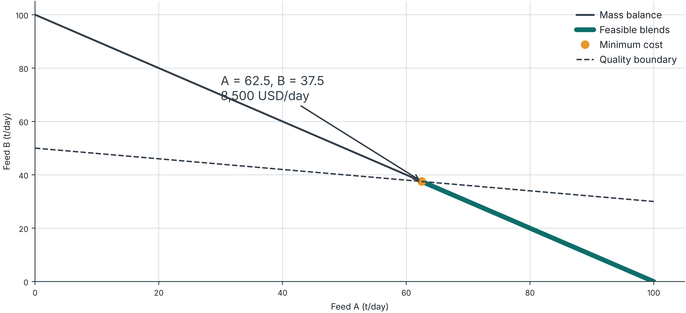

## Optimization formulation with LLM assistance

- 60-minute LLM formulation activity
- 120-minute examination preparation
- 2105623   5 October 2026

::: {.notes}
Timing: 0–1 minutes. Three-hour review. The synthetic examples target LP and MILP formulation. Confirm the actual exam coverage and permitted tools verbally. This deck does not set the examination AI policy.
:::

## Learning targets

- Translate a process description into variables, an objective, and constraints.
- Explain the units and physical meaning of every equation.
- Audit an LLM proposal with counterexamples and independent checks.
- Defend the model before interpreting its optimum.

::: {.notes}
Timing: 1–2 minutes. Ask students which of these they find hardest. Keep the discussion about modeling decisions rather than prompt tricks.
:::

## Three-hour session

| Minutes | Activity |
| --- | --- |
| 0–15 | Independent formulation of a blending LP |
| 15–40 | LLM draft, counterexamples, and Pyomo checks |
| 40–60 | MILP pair activity and discussion |
| 60–70 | Break |
| 70–120 | LP and MILP examination review |
| 120–160 | Individual mock examination |
| 160–180 | Solutions and final checklist |

::: {.notes}
Timing: 2–3 minutes. First60minutes are the LLM formulation activity. The remaining120minutes include a10-minute break,50-minute LP/MILP review,40-minute mock examination, and20-minute debrief.
:::

## Case A: the production assignment

- A chemical plant blends two liquid feeds, A and B, to make a solvent mixture for a customer.
- The customer requires exactly 100 metric tonnes of product per day. The plant must supply the full amount each day.
- The product may contain at most 5 wt% of an impurity. This means no more than 5 kg of impurity per 100 kg of product.
- As the process engineer, choose the daily amount of each feed to minimize the total daily feed purchase cost.

::: {.notes}
Timing: 3–4 minutes. Read the assignment before showing any equations. Synthetic classroom problem. One metric tonne is 1,000 kg. Students should distinguish a decision from a given requirement.
:::

## Case A: feed data and units

| Feed | Cost (USD/t) | Impurity (wt%) | Availability (t/day) |
| --- | --- | --- | --- |
| A | 100 | 2 | 100 |
| B | 60 | 10 | 80 |

**Prices apply to total feed mass, including impurity. Availability is an upper limit on daily purchases.**

::: {.notes}
Timing: 4–5 minutes. A contains 0.02 tonnes of impurity per tonne of feed. B contains 0.10. All prices and compositions are known constants for the planning day.
:::

## Case A: operating conditions

- The feeds mix completely. No reaction, evaporation, separation, or mass loss occurs. All feed mass becomes product.
- The plant consumes all purchased feed that day. It holds no inventory and allows no shortage, extra production, or disposal.
- Feed quantities are continuous. Either feed may be unused. The only feed limits are the stated daily availabilities.
- Mixing capacity is sufficient. Other operating costs are constant, and neither supplier charges a fixed fee in Case A.

::: {.notes}
Timing: 5–7 minutes. These are stated modeling assumptions, not information for the LLM to invent. Complete mixing and conservation of impurity justify a mass-weighted product composition.
:::

## Case A: independent formulation

- Write each decision variable and its unit.
- Write the cost objective and the total mass balance.
- Write a contaminant balance inequality without a variable denominator.
- State the variable bounds and classify the model.

::: {.notes}
Timing: 7–11 minutes. Four minutes of independent formulation. Use the complete assignment, data, and operating conditions on the preceding three slides. Do not advance to the solution until students commit to their model.
:::

## Case A: variables and objective

::: {.equation}
x_A, x_B = feed mass flow rates (t/day)
:::

::: {.equation}
minimize  z = 100 x_A + 60 x_B
:::

::: {.equation}
0 ≤ x_A ≤ 100     and     0 ≤ x_B ≤ 80
:::

**Objective units: (USD/t) × (t/day) = USD/day.**

::: {.notes}
Timing: 11–13 minutes. All model coefficients are constants. Flows are continuous nonnegative variables. Compare defining purchased feed versus consumed feed when there is no inventory.
:::

## Case A: balances and quality

::: {.equation}
x_A + x_B = 100
:::

::: {.equation}
0.02 x_A + 0.10 x_B ≤ 0.05 × 100
:::

**Both sides of the quality inequality have units of impurity t/day.**

::: {.notes}
Timing: 13–14 minutes. The right side equals 5 t impurity/day. If throughput were variable, the corresponding upper-specification relation would be 0.02xA+0.10xB <= 0.05(xA+xB), still linear. A minimum positive product quantity must come from demand or another requirement.
:::

## Case A: an analytic check

::: {.equation}
x_A = 100 − x_B
:::

::: {.equation}
2 + 0.08 x_B ≤ 5, so x_B ≤ 37.5
:::

::: {.equation}
z = 10,000 − 40 x_B
:::

**The cheapest feasible blend uses A = 62.5 and B = 37.5 t/day. Cost = 8,500 USD/day.**

::: {.notes}
Timing: 14–15 minutes. The negative cost slope means use as much cheap B as quality permits. Availability limits are slack. This independent derivation checks the numerical solver result.
:::

## LLM assistance in the modeling workflow

- Draft: extract data, decisions, and unresolved ambiguities.
- Review: link every equation to a sentence in the problem.
- Challenge: seek a counterexample and inspect units.
- Implement: translate the accepted equations into Pyomo.

::: {.notes}
Timing: 15–17 minutes. This is a proposed classroom workflow, not a guarantee of correctness. Research context: NL4Opt studies natural-language extraction and formulation, https://arxiv.org/abs/2303.08233. No benchmark performance claim is made here.
:::

## Prompt 1: formulation before code

```text
Act as an optimization modeling tutor.
List sets, parameters, variables, domains, and units.
Identify missing information. Do not invent data.
Write the objective and constraints.
Map each equation to a sentence in the problem.
Check units and classify the model.
Do not write code yet.
```

::: {.notes}
Timing: 17–22 minutes. Paste the complete Case A assignment, feed table, and operating conditions after this prompt. Ask students to compare outputs from available LLMs if time permits. Treat confidence and fluent explanations as separate from mathematical evidence. This prompt is a classroom template.
:::

## Ambiguity needs an explicit assumption

- “Meet demand” could mean exactly the demand or at least that amount.
- A stated capacity might apply per hour, per shift, or per day.
- “Use feed B” might mean purchasing, consuming, or activating a supplier.
- The modeler resolves these choices and records the assumption.

**When the problem leaves a material choice unclear, ask before inserting a number.**

::: {.notes}
Timing: 22–25 minutes. Return to Case A, which explicitly says exactly 100 t/day. Contrast with revenue-maximizing production where excess sales need a demand bound. LLM suggestions can reveal ambiguity, but the problem owner must resolve it.
:::

## Audit exercise: a flawed draft

::: {.equation}
minimize 100 x_A + 60 x_B
:::

::: {.equation}
x_A + x_B ≤ 100
:::

::: {.equation}
0.02 x_A + 0.10 x_B ≤ 0.05
:::

::: {.equation}
x_A ≥ 0, x_B ≥ 0
:::

**Find the missing or incorrect requirements. This is a deliberately constructed draft, not a recorded LLM response.**

::: {.notes}
Timing: 25–28 minutes. Students identify three issues: mass balance allows underproduction, quality RHS lacks total mass flow, and feed availability is absent. Zero production has cost zero and satisfies all these incorrect inequalities.
:::

## Counterexamples expose semantic errors

| Test | Flawed draft | Correct Case A |
| --- | --- | --- |
| A = 0, B = 0 | Allowed | Fails the 100 t/day requirement |
| A = 62.5, B = 37.5 | Rejected by wrong quality RHS | Feasible, impurity = 5 wt% |
| A = 20, B = 80 | Rejected | Rejected, impurity = 8.4 wt% |

**A model audit checks what the equations allow and exclude.**

::: {.notes}
Timing: 28–30 minutes. A single counterexample is enough to disprove equivalence between a proposed model and the verbal requirements. Agreement between two LLMs is not an independent numerical or physical check.
:::

## Prompt 2: adversarial model review

```text
Review this formulation without rewriting it first.
For each constraint, identify its physical meaning and units.
Find a point that the equations allow but the problem forbids.
Find a point that the problem allows but the equations exclude.
Check variable bounds and missing balances.
State what you could not verify.
```

::: {.notes}
Timing: 30–35 minutes. Provide both the original problem and the proposed formulation. Students should test a concrete point themselves. A second AI review is a suggestion generator, not proof.
:::

## Pyomo mirrors the accepted equations

```python
import pyomo.environ as p
m = p.ConcreteModel()
m.A = p.Var(bounds=(0, 100))
m.B = p.Var(bounds=(0, 80))
m.mass = p.Constraint(expr=m.A + m.B == 100)
m.quality = p.Constraint(
    expr=0.02*m.A + 0.10*m.B <= 5)
m.obj = p.Objective(expr=100*m.A + 60*m.B)
```

::: {.notes}
Timing: 35–38 minutes. These lines instantiate Case A. Read the equations and code together. The downloadable Python script supplies the solver and numerical checks. Official documentation: https://www.pyomo.org/documentation and https://pyomo.readthedocs.io/en/6.7.3/working_models.html.
:::

## Verification after solving

```python
solver = p.SolverFactory("appsi_highs")
result = solver.solve(m, load_solutions=False)
assert p.check_optimal_termination(result)
m.solutions.load_from(result)
a, b = p.value(m.A), p.value(m.B)
assert abs(a + b - 100) < 1e-6
assert 0.02*a + 0.10*b <= 5 + 1e-6
```

**Also check availability, domains, and the objective with an independent calculation.**

::: {.notes}
Timing: 38–40 minutes. Code uses the appsi_highs interface with an installed HiGHS solver. Termination handling is solver-interface-specific. Documentation: https://pyomo.readthedocs.io/en/6.8.2/api/pyomo.opt.results.solver.check_optimal_termination.html. The feasible model still needs a semantic audit.
:::

## Case B: the supplier contract

- The plant still makes exactly 100 t/day with at most 5 wt% impurity. Feed prices, compositions, and operating conditions remain as in Case A.
- Supplier B now offers an optional daily contract. Activating it costs 1,200 USD for that day, in addition to 60 USD per tonne of B.
- An active contract requires the plant to purchase and consume between 20 and 80 t/day of B. With no contract, B supply is zero.
- Supplier A remains available at 100 USD/t, up to 100 t/day, with no fixed charge or minimum purchase.

::: {.notes}
Timing: 40–41 minutes. The fixed fee occurs once per day if B is active, regardless of the delivered quantity. The minimum lot applies only to an active contract. Every delivered tonne enters the blend.
:::

## Case B: the engineering decision

- Decide whether to activate supplier B and how many tonnes per day to obtain from each supplier.
- Minimize daily feed purchases plus the daily activation fee. The product quantity and impurity specification must still hold.
- First describe what an inactive and an active contract permit. Then choose variable domains and write the MILP formulation.
- After solving, report the contract decision, both feed quantities, product impurity, and total daily cost. Compare with using only A.

::: {.notes}
Timing: 41–42 minutes. Keep the contract statement visible while introducing the binary variable. The later formulation slide provides the answer. A-only costs 10,000 USD/day. Active B with A=62.5 and B=37.5 costs 9,700 USD/day.
:::

## Activation and minimum-lot constraints

::: {.equation}
y_B ∈ {0, 1}
:::

::: {.equation}
20 y_B ≤ x_B ≤ 80 y_B
:::

::: {.equation}
minimize 100 x_A + 60 x_B + 1,200 y_B
:::

**Keep the mass balance, quality inequality, and feed bounds from Case A.**

::: {.notes}
Timing: 42–44 minutes. yB=0 forces B=0. yB=1 forces at least 20 t/day. 80 is a valid availability-based upper bound. The model is MILP because every expression is linear and yB is binary.
:::

## Pair exercise: logic and an AI audit

- Supplier B raises its minimum daily order from 20 to 40 t. The maximum remains 80 t/day and the fixed fee remains 1,200 USD/day.
- Keep all other Case B data, including exactly 100 t/day of product and at most 5 wt% impurity. Revise the formulation.
- Before solving, decide whether an active B contract can meet product quality. Ask an LLM to audit your logic and upper bound.
- Submit the revised constraints and a numerical test of an active contract. State the optimal purchasing plan and daily cost.

**10 minutes in pairs. Your explanation must stand on its own.**

::: {.notes}
Timing: 44–54 minutes. Ten minutes in pairs. Quality and mass balance imply B <= 37.5. Thus 40yB <= B <= 37.5yB forces yB=0. Test the smallest active delivery: A=60 and B=40 gives 5.2 t impurity in 100 t product, or 5.2 wt%, above the 5 wt% limit. Larger B only increases impurity. Optimal A=100, B=0, cost=10,000 USD/day. Students should check the LLM explanation against this calculation.
:::

## Common logical mistakes

| Claim | What the equation actually says |
| --- | --- |
| x_B ≤ M y_B means active implies flow | Active permits zero flow unless a lower bound applies |
| y_B ≤ y_A means A requires B | It means B requires A |
| x_B y_B is needed to charge activation | A fixed charge uses F y_B |
| An arbitrary large M is harmless | It can weaken the relaxation and numerical behavior |

::: {.notes}
Timing: 54–58 minutes. Ask students to read each implication with y=0 and y=1. A positive minimum lot models a stated requirement. It should not be invented merely to avoid strict inequalities.
:::

## Activity reflection

- What did the LLM help you express or notice?
- Which proposed equation needed correction?
- What numerical evidence supports your correction?

**Keep your original formulation, AI draft, and corrected version.**

::: {.notes}
Timing: 58–60 minutes. Suggested practice: Volume1 Problem2 for logic, Problem3 for inventory, Problem15 for reserve, Volume2 Problem3 for robust blending. The website uses precomputed exact cases, not a live solver. Existing lab data differ from the synthetic examples in this deck.
:::

## Break

- 10 minutes
- Next: examination preparation

::: {.notes}
Timing: 60–70 minutes. The LLM activity is complete. The remaining 120 minutes include this break and 110 minutes of examination preparation.
:::

## Diagnostic: five modeling decisions

- 1. Is production a parameter or a decision variable?
- 2. Does “at most 80 t/day” require ≤, =, or ≥?
- 3. What are the units of concentration × flow?
- 4. Does x ≤ My force production when y = 1?
- 5. What does an optimal solver result establish?

::: {.notes}
Timing: 70–76 minutes. Students answer independently for four minutes, then compare answers. This checks retention after the AI activity.
:::

## Diagnostic: reasoning

- Production is a decision when the planner can choose it.
- “At most” gives an upper bound. A flow cap has units of flow.
- Mass fraction × mass flow gives contaminant mass flow.
- x ≤ My forces x = 0 when y = 0, if x ≥ 0.
- Optimality concerns the encoded model under the solver’s criteria.

::: {.notes}
Timing: 76–80 minutes. : collect examples of a physically wrong model that still has an optimum. y=1 permits zero production unless another constraint prevents it. Avoid saying that a solver validates the verbal problem.
:::

## A formulation has a traceable structure

- Sets and indices define what the model distinguishes.
- Parameters contain supplied data with units.
- Decision variables describe controllable quantities and their domains.
- The objective measures the stated goal. Each constraint traces to a requirement.

::: {.notes}
Timing: 80–84 minutes. Ask students to label each line of their formulation as data, decision, objective, or requirement. Distinguish daily rates from amounts over a day.
:::

## Case A: the feasible blends

{height=480px}

::: {.notes}
Timing: 84–90 minutes. Python-generated figure using the lab palette. The thick teal segment satisfies mass balance, quality, and availability. The amber point is the minimum-cost endpoint. Everything below the quality line does not necessarily satisfy the mass balance.
:::

## Quality changes the cheapest recipe

| Maximum impurity | A (t/day) | B (t/day) | Cost (USD/day) |
| --- | --- | --- | --- |
| 4 wt% | 75 | 25 | 9,000 |
| 5 wt% | 62.5 | 37.5 | 8,500 |
| 6 wt% | 50 | 50 | 8,000 |

**Predict the direction before reading the numbers. Which constraint sets the recipe?**

::: {.notes}
Timing: 90–100 minutes. Loosening an upper quality limit expands the feasible set. Minimum cost cannot increase with the same objective. These three values apply to this toy model and this range. Do not extrapolate through an availability bottleneck.
:::

## A tighter upper bound improves the relaxation

::: {.equation}
Quality and mass balance imply x_B ≤ 37.5
:::

::: {.equation}
Therefore: 20 y_B ≤ x_B ≤ 37.5 y_B
:::

| Formulation | LP relaxation cost (USD/day) |
| --- | --- |
| Availability bound M = 80 | 9,062.50 |
| Quality bound M = 37.5 | 9,700.00 |
| Integer optimum | 9,700.00 |

::: {.notes}
Timing: 100–110 minutes. In the loose LP relaxation, xB=37.5 and yB=37.5/80=0.46875. With M=37.5, yB=1 at this solution. Tightening a valid bound preserves integer feasible solutions. A zero relaxation gap here is a property of this example, not a universal result.
:::

## The activation fee changes the preferred plan

| B activation fee | A (t/day) | B (t/day) | Total cost (USD/day) |
| --- | --- | --- | --- |
| 1,200 USD/day | 62.5 | 37.5 | 9,700 |
| 1,800 USD/day | 100 | 0 | 10,000 |

**Maximum variable-cost saving = 40 × 37.5 = 1,500 USD/day.**

::: {.notes}
Timing: 110–120 minutes. At a fee of exactly 1500, the all-A and mixed endpoints tie. If the minimum B lot becomes 40, quality rules out activating B. Both results follow analytically and agree with Pyomo.
:::

## Mock examination: production with inventory

- 40 minutes, including reading time.
- Write a complete formulation and justify the decisions.
- Use an independent attempt before consulting any tool.
- The instructor will specify permitted tools for this practice.

**The actual examination follows the course’s announced rules.**

::: {.notes}
Timing: 120–122 minutes. Forty-minute individual mock examination, including reading. State the actual permitted tools. Solutions follow the task slide and should remain off screen until minute160.
:::

## Mock case: two production periods

| Parameter | Period 1 | Period 2 |
| --- | --- | --- |
| Demand (t) | 40 | 60 |
| Production cost (USD/t) | 5 | 8 |
| Production capacity (t/period) | 80 | 80 |
| Setup cost (USD/period) | 100 | 100 |

**Initial and final inventory are zero. Carrying 1 t from period 1 to period 2 costs 1 USD. Meet every demand on time. No backlog or disposal.**

::: {.notes}
Timing: 122–125 minutes. Synthetic data. Continuous production and inventory, binary setup. No backlog, disposal, or minimum lot. Opening and closing inventory are zero. Holding cost applies only to the inventory carried between periods.
:::

## Mock case: tasks and marks

| Task | Marks |
| --- | --- |
| Variables, domains, and units | 3 |
| Objective with all cost terms | 4 |
| Period balances and boundary conditions | 4 |
| Production/setup linkage | 3 |
| Model class and assumptions | 2 |
| Optimal plan and capacity interpretation | 4 |

**Find the optimal plan. Then predict the effect of increasing period-1 capacity from 80 to 100 t.**

::: {.notes}
Timing: 125–160 minutes. Students have 35 minutes remaining after reading the case. The capacity variant changes only period1 capacity to100t. Keep period2 capacity80t. Solutions begin on the next slide, so do not advance early.
:::

## Mock solution: formulation

::: {.equation}
x_t ≥ 0, s_t ≥ 0, y_t ∈ {0,1},   t = 1,2
:::

::: {.equation}
minimize 5x₁ + 8x₂ + s₁ + 100(y₁ + y₂)
:::

::: {.equation}
s_(t−1) + x_t = d_t + s_t
:::

::: {.equation}
x_t ≤ 80 y_t,    s₀ = 0,    s₂ = 0
:::

**x and s are tonnes. Each y indicates whether the period incurs setup cost.**

::: {.notes}
Timing: 160–165 minutes. Bounds and two balances are essential. s0 is a fixed parameter or fixed variable. The term s2 adds no holding charge because it is fixed zero. y=1 with x=0 is allowed mathematically, but the positive setup charge eliminates such waste in an optimum.
:::

## Mock solution: the optimal plan

| Quantity | Period 1 | Period 2 |
| --- | --- | --- |
| Production (t) | 80 | 20 |
| Closing inventory (t) | 40 | 0 |
| Setup indicator | 1 | 1 |

**Production: 560 USD. Holding: 40 USD. Setups: 200 USD. Total: 800 USD.**

::: {.notes}
Timing: 165–170 minutes. Both setups are unavoidable because first-period capacity80 cannot supply total demand100. Making a tonne early saves8−5−1=2USD. Therefore produce80 in period1. Balances:80=40+40 and40+20=60. A just-in-time plan costs880USD.
:::

## Capacity can remove an entire setup

| Period-1 capacity | Production (t) | Setups | Total cost (USD) |
| --- | --- | --- | --- |
| 80 t | 80, 20 | Both periods | 800 |
| 100 t | 100, 0 | Period 1 only | 660 |

**The 140 USD saving combines cheaper early production with removal of period-2 setup.**

::: {.notes}
Timing: 170–175 minutes. Variant1: 20 extra early tonnes save20×(8−5−1)=40USD and avoiding the second setup saves100USD. Total140USD. This discrete change explains why a single LP shadow price cannot describe a capacity change that alters setup decisions. With original capacity80 and holding4USD/t, JIT production40,60 costs880USD.
:::

## A final model audit

- Every variable has a meaning, unit, and domain.
- Every required balance includes its boundary conditions.
- Every implication works in both binary states.
- Every big-M follows from a valid bound.
- One feasible point and one rejected point agree with the problem.
- The reported optimum passes physical and numerical checks.

::: {.notes}
Timing: 175–180 minutes. Students mark one item they missed in the diagnostic or mock exam. Have them write a specific corrective action rather than “be more careful.”
:::

## References and teaching materials

- Pyomo documentation: www.pyomo.org/documentation
- NL4Opt competition report: arxiv.org/abs/2303.08233
- Course books and Interactive Lab: www.skhgroup.net/teaching/2105623/
- The blending and mock-exam data in this deck are synthetic.

::: {.notes}
Timing: Reference minutes. Reference slide, outside the timed teaching sequence. Pyomo solve-status reference: https://pyomo.readthedocs.io/en/6.8.2/api/pyomo.opt.results.solver.check_optimal_termination.html. The prompts and flawed draft are original teaching examples, not quoted model outputs. All numerical answers come from the accompanying Pyomo script and independent algebra.
:::
