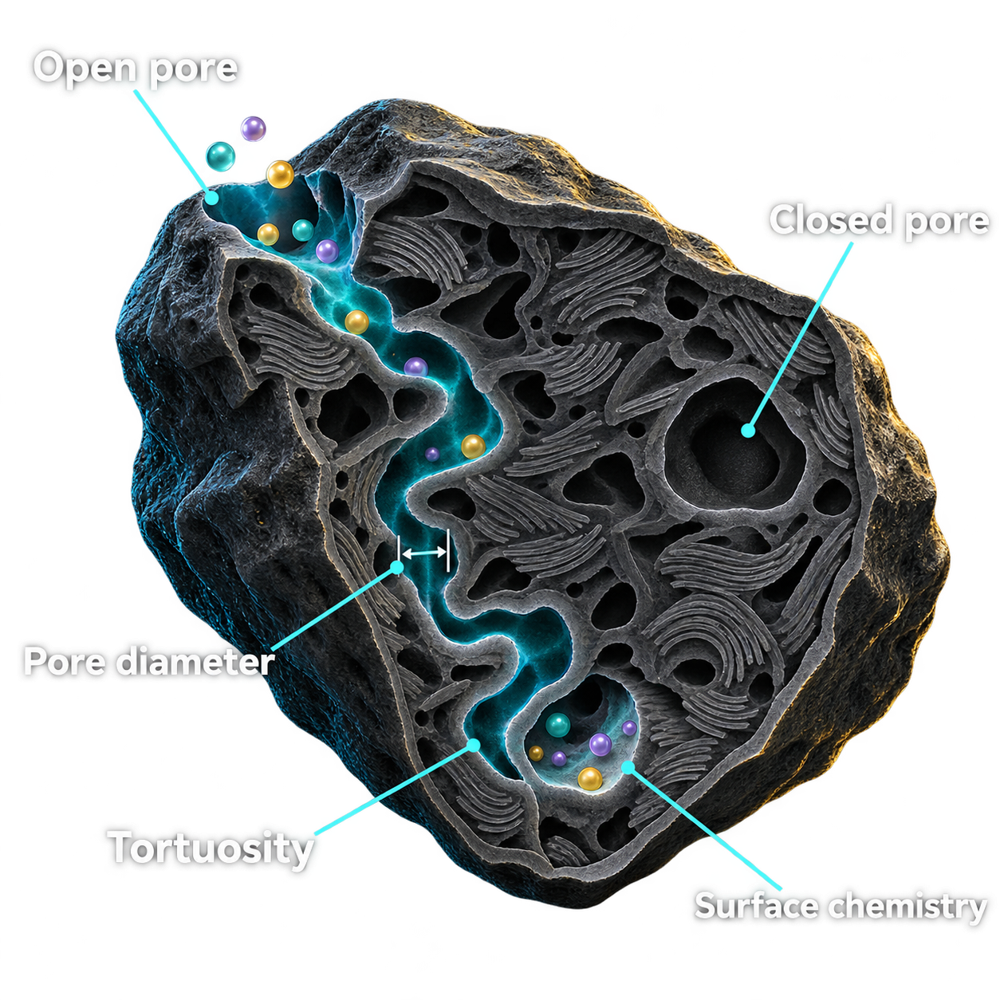
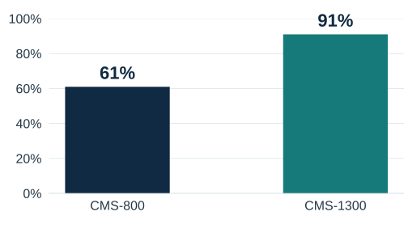
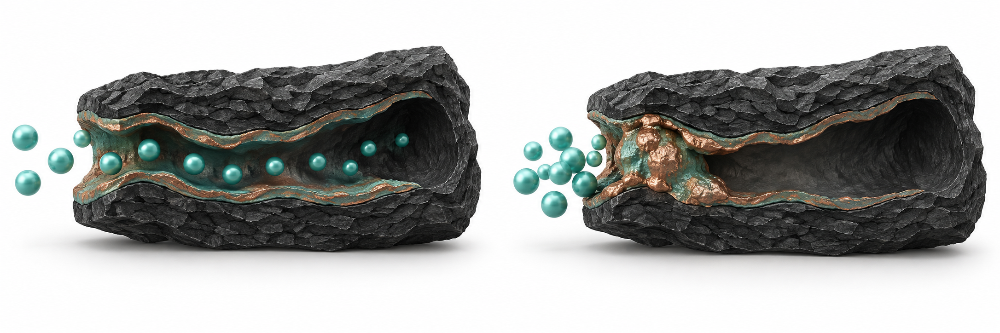
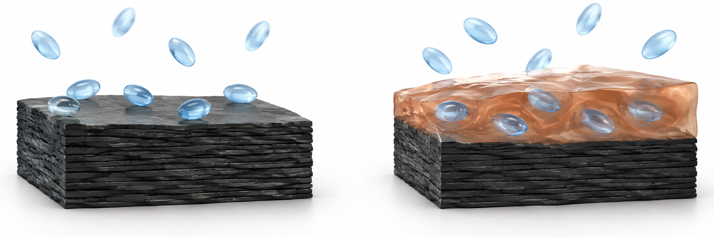
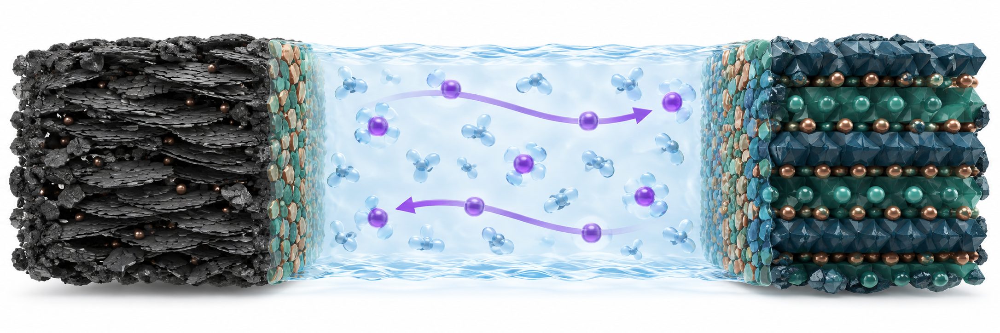
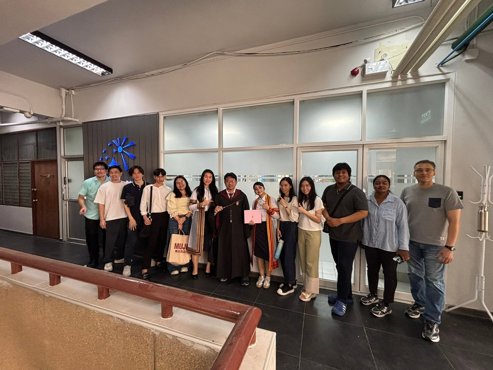

---
format:
  revealjs:
    width: 1280
    height: 720
    margin: 0
    center: false
    controls: true
    controls-layout: bottom-right
    progress: true
    slide-number: false
    transition: none
    background-transition: none
    auto-stretch: false
    embed-resources: true
    css: theme/acssi2026/styles.css
    title-slide: false
    navigation-mode: linear
    hash: true
lang: en-US
pagetitle: ACSSI 2026 — Beyond Ionic Conductivity
---

## Beyond Ionic Conductivity {#slide-01 data-background-color="#082F36" data-timing="30"}

```{=html}
<div class="slide-canvas">
<div class="figure-crop" style="left:0.34006376195532084px;top:0px;width:1279.3198724760894px;height:720px"></div>
<div class="tx" style="left:72px;top:48px;width:730px;height:36px;font-size:24px;font-weight:700;font-style:normal;color:#6EE1CE;text-align:left">ACSSI 2026</div>
<div class="tx" style="left:72px;top:162px;width:840px;height:205px;font-size:86px;font-weight:700;font-style:normal;color:#FFFFFF;text-align:left">Beyond Ionic<br>Conductivity</div>
<div class="tx" style="left:72px;top:392px;width:820px;height:105px;font-size:32px;font-weight:400;font-style:normal;color:#DAEBE8;text-align:left">Coordination-Transport-Interface Design Rules<br>for Durable Sodium Batteries</div>
<div class="tx" style="left:72px;top:550px;width:940px;height:44px;font-size:29px;font-weight:700;font-style:normal;color:#FFFFFF;text-align:left">Assoc. Prof. Soorathep Kheawhom, PhD, FRSC</div>
<div class="tx" style="left:72px;top:598px;width:980px;height:70px;font-size:25px;font-weight:400;font-style:normal;color:#D5E6E3;text-align:left">Department of Chemical Engineering, Faculty of Engineering<br>Chulalongkorn University</div>
<div class="tx" style="left:72px;top:679px;width:1066px;height:26px;font-size:16px;font-weight:400;font-style:normal;color:#B6CADA;text-align:left">September 14, 2026</div>
<div class="tx" style="left:1140px;top:679px;width:68px;height:25px;font-size:16px;font-weight:400;font-style:normal;color:#B6CADA;text-align:right">01 / 24</div>
</div>
```

::: {.notes}
SOURCES

Conference abstract 186; sources A, B, C
Weldegebrieal et al. J. Mater. Chem. A 2026, 14, 33996–34024. DOI: 10.1039/D6TA01969B.
Santoso et al. Materials Horizons 2026, 13, 5710–5718. DOI: 10.1039/D6MH00519E.
Wisan et al. Nanoscale Horizons 2026. DOI: 10.1039/D6NH00245E.
Decorative background: AI-generated conceptual material artwork. It is not experimental microscopy or a mechanistic model.
:::

## The durability question {#slide-02 data-background-color="#FFFFFF" data-timing="90"}

```{=html}
<div class="slide-canvas">
<div class="tx" style="left:72px;top:63px;width:1136px;height:104px;font-size:43px;font-weight:700;font-style:normal;color:#082F36;text-align:left">The durability question</div>
<div class="tx" style="left:72px;top:207px;width:1080px;height:160px;font-size:70px;font-weight:700;font-style:normal;color:#082F36;text-align:left">A battery must<br>keep working,</div>
<div class="tx" style="left:72px;top:380px;width:1120px;height:100px;font-size:70px;font-weight:700;font-style:normal;color:#147D80;text-align:left">cycle after cycle.</div>
<div class="tx" style="left:72px;top:540px;width:1136px;height:44px;font-size:29px;font-weight:700;color:#082F36;text-align:left">Three papers connect three scales</div><div class="tx" style="left:72px;top:593px;width:350px;height:48px;font-size:34px;font-weight:700;color:#147D80;text-align:left">Electrolytes</div><div class="tx" style="left:72px;top:683px;width:1066px;height:25px;font-size:16px;font-weight:400;color:#647B80;text-align:left">Synthesis of Weldegebrieal et al., Santoso et al., and Wisan et al. (2026)</div><div class="tx" style="left:1140px;top:679px;width:68px;height:25px;font-size:16px;font-weight:400;font-style:normal;color:#647B80;text-align:right">02 / 24</div>
<div class="tx" style="left:470px;top:593px;width:350px;height:48px;font-size:34px;font-weight:700;color:#147D80;text-align:left">Carbon pores</div><div class="tx" style="left:855px;top:593px;width:350px;height:48px;font-size:34px;font-weight:700;color:#147D80;text-align:left">Full cells</div><div class="tx" style="left:72px;top:642px;width:350px;height:28px;font-size:20px;font-weight:400;color:#647B80;text-align:left">J. Mater. Chem. A · Review</div><div class="tx" style="left:470px;top:642px;width:370px;height:28px;font-size:20px;font-weight:400;color:#647B80;text-align:left">Materials Horizons · Opinion</div><div class="tx" style="left:855px;top:642px;width:370px;height:28px;font-size:20px;font-weight:400;color:#647B80;text-align:left">Nanoscale Horizons · Focus</div></div>
```

::: {.notes}
SOURCES

A, abstract and Sections 2.2-2.4, PDF pp. 1, 6-8
Weldegebrieal et al. J. Mater. Chem. A 2026, 14, 33996–34024. DOI: 10.1039/D6TA01969B.
:::

## The CTI framework {#slide-03 data-background-color="#F6F5F0" data-timing="90"}

```{=html}
<div class="slide-canvas">
<div class="tx" style="left:72px;top:63px;width:1136px;height:104px;font-size:43px;font-weight:700;color:#082F36;text-align:left">The CTI framework</div>
<div class="figure-crop" style="left:140px;top:126px;width:1000px;height:425.5983350676379px"></div>
<div class="tx" style="left:211px;top:341px;width:120px;height:116px;font-size:92px;font-weight:700;color:#09475C;text-align:center">C</div>
<div class="tx" style="left:91px;top:524px;width:360px;height:47px;font-size:34px;font-weight:700;color:#082F36;text-align:center">Coordination</div>
<div class="tx" style="left:91px;top:575px;width:360px;height:65px;font-size:27px;font-weight:400;color:#243B42;text-align:center">What surrounds<br>sodium?</div>
<div class="tx" style="left:580px;top:213px;width:120px;height:116px;font-size:92px;font-weight:700;color:#6C4D0B;text-align:center">T</div>
<div class="tx" style="left:460px;top:399px;width:360px;height:47px;font-size:34px;font-weight:700;color:#082F36;text-align:center">Transport</div>
<div class="tx" style="left:460px;top:450px;width:360px;height:65px;font-size:27px;font-weight:400;color:#243B42;text-align:center">Can ion supply<br>meet demand?</div>
<div class="tx" style="left:950px;top:341px;width:120px;height:116px;font-size:92px;font-weight:700;color:#4A286E;text-align:center">I</div>
<div class="tx" style="left:830px;top:524px;width:360px;height:47px;font-size:34px;font-weight:700;color:#082F36;text-align:center">Interface</div>
<div class="tx" style="left:830px;top:575px;width:360px;height:65px;font-size:27px;font-weight:400;color:#243B42;text-align:center">Does the interface<br>keep working?</div>
<div class="tx" style="left:72px;top:642px;width:1136px;height:36px;font-size:27px;font-weight:700;color:#147D80;text-align:left">The limiting process can change as the cell ages.</div>
<div class="tx" style="left:72px;top:679px;width:1066px;height:26px;font-size:16px;font-weight:400;color:#647B80;text-align:left">CTI framework. Weldegebrieal et al. 2026. DOI: 10.1039/D6TA01969B</div>
<div class="tx" style="left:1140px;top:679px;width:68px;height:25px;font-size:16px;font-weight:400;color:#647B80;text-align:right">03 / 24</div>
</div>
```

::: {.notes}
SOURCES

A, Fig. 1 and Section 2, PDF pp. 4-8
Weldegebrieal et al. J. Mater. Chem. A 2026, 14, 33996–34024. DOI: 10.1039/D6TA01969B.
:::

## The local environment around sodium {#slide-04 data-background-color="#FFFFFF" data-timing="90"}

```{=html}
<div class="slide-canvas">
<div class="tx" style="left:72px;top:63px;width:1136px;height:104px;font-size:43px;font-weight:700;font-style:normal;color:#082F36;text-align:left">The local environment around sodium</div>
<div class="tx" style="left:72px;top:624px;width:1136px;height:48px;font-size:34px;font-weight:700;color:#147D80;text-align:left">Local neighbors can change the first reaction</div><div class="tx" style="left:290px;top:593px;width:740px;height:33px;font-size:23px;font-weight:400;color:#647B80;text-align:center">Na⁺: teal     Anion: gold     Solvent: pale blue</div><div class="tx" style="left:72px;top:683px;width:1066px;height:25px;font-size:16px;font-weight:400;color:#647B80;text-align:left">Conceptual illustration. Outcome depends on chemistry and surface. Sources: Weldegebrieal et al.; Wisan et al. (2026)</div><div class="tx" style="left:1140px;top:679px;width:68px;height:25px;font-size:16px;font-weight:400;font-style:normal;color:#647B80;text-align:right">04 / 24</div>
<div class="tx" style="left:72px;top:160px;width:372px;height:53px;font-size:38px;font-weight:700;color:#147D80;text-align:center">SSIP</div><div class="tx" style="left:72px;top:215px;width:372px;height:37px;font-size:26px;font-weight:400;color:#243B42;text-align:center">Solvent-separated pair</div><div class="tx" style="left:454px;top:160px;width:372px;height:53px;font-size:38px;font-weight:700;color:#147D80;text-align:center">CIP</div><div class="tx" style="left:454px;top:215px;width:372px;height:37px;font-size:26px;font-weight:400;color:#243B42;text-align:center">Contact ion pair</div><div class="tx" style="left:836px;top:160px;width:372px;height:53px;font-size:38px;font-weight:700;color:#147D80;text-align:center">AGG</div><div class="tx" style="left:836px;top:215px;width:372px;height:37px;font-size:26px;font-weight:400;color:#243B42;text-align:center">Associated ion cluster</div></div>
```

::: {.notes}
SOURCES

A, Section 2.1, PDF pp. 5-6; B, Section 2.2, PDF p. 4
Weldegebrieal et al. J. Mater. Chem. A 2026, 14, 33996–34024. DOI: 10.1039/D6TA01969B.
Santoso et al. Materials Horizons 2026, 13, 5710–5718. DOI: 10.1039/D6MH00519E.
Wisan et al. Nanoscale Horizons 2026. DOI: 10.1039/D6NH00245E.
New conceptual illustration generated with the built-in ImageGen tool for this presentation. It is a simplified schematic, not microscopy, simulation output, or measured molecular trajectories.
:::

## Ion supply under load {#slide-05 data-background-color="#FFFFFF" data-timing="75"}

```{=html}
<div class="slide-canvas">
<div class="tx" style="left:72px;top:63px;width:1136px;height:104px;font-size:43px;font-weight:700;font-style:normal;color:#082F36;text-align:left">Ion supply under load</div>
<div class="tx" style="left:72px;top:205px;width:740px;height:235px;font-size:55px;font-weight:700;font-style:normal;color:#082F36;text-align:left">Can ion supply<br>meet the<br>electrode’s demand?</div>
<div class="tx" style="left:855px;top:202px;width:353px;height:43px;font-size:31px;font-weight:700;font-style:normal;color:#147D80;text-align:left">Association</div>
<div class="tx" style="left:855px;top:252px;width:353px;height:86px;font-size:25px;font-weight:400;font-style:normal;color:#243B42;text-align:left">Useful chemistry can come<br>with higher viscosity.</div>
<div class="tx" style="left:855px;top:379px;width:353px;height:43px;font-size:31px;font-weight:700;font-style:normal;color:#147D80;text-align:left">Temperature</div>
<div class="tx" style="left:855px;top:429px;width:353px;height:85px;font-size:25px;font-weight:400;font-style:normal;color:#243B42;text-align:left">Mobility can change<br>strongly in polymers.</div>
<div class="tx" style="left:72px;top:564px;width:1136px;height:55px;font-size:33px;font-weight:700;font-style:normal;color:#147D80;text-align:left">Current density     Areal capacity     Temperature</div>
<div class="tx" style="left:72px;top:626px;width:1136px;height:40px;font-size:24px;font-weight:400;font-style:normal;color:#243B42;text-align:left">Verify local structure in LHCEs. Follow polarization under the stated conditions.</div>
<div class="tx" style="left:72px;top:679px;width:1066px;height:26px;font-size:16px;font-weight:400;font-style:normal;color:#647B80;text-align:left">Weldegebrieal et al. 2026. DOI: 10.1039/D6TA01969B</div>
<div class="tx" style="left:1140px;top:679px;width:68px;height:25px;font-size:16px;font-weight:400;font-style:normal;color:#647B80;text-align:right">05 / 24</div>
</div>
```

::: {.notes}
SOURCES

A, Sections 2.2 and 3, PDF pp. 6, 8-11
Weldegebrieal et al. J. Mater. Chem. A 2026, 14, 33996–34024. DOI: 10.1039/D6TA01969B.
:::

## Resistance through the life of a cell {#slide-06 data-background-color="#FFFFFF" data-timing="90"}

```{=html}
<div class="slide-canvas">
<div class="tx" style="left:72px;top:63px;width:1136px;height:104px;font-size:43px;font-weight:700;font-style:normal;color:#082F36;text-align:left">Resistance through the life of a cell</div>
<div class="tx" style="left:72px;top:180px;width:1136px;height:63px;font-size:43px;font-weight:700;font-style:normal;color:#147D80;text-align:left">Follow the same cell through time.</div>
<div class="tx" style="left:72px;top:296px;width:310px;height:74px;font-size:57px;font-weight:700;font-style:normal;color:#B2704F;text-align:left">01</div>
<div class="tx" style="left:72px;top:396px;width:340px;height:57px;font-size:34px;font-weight:700;font-style:normal;color:#243B42;text-align:left">Formation</div>
<div class="tx" style="left:72px;top:459px;width:340px;height:89px;font-size:29px;font-weight:400;font-style:normal;color:#243B42;text-align:left">Establish the<br>initial state</div>
<div class="tx" style="left:470px;top:296px;width:310px;height:74px;font-size:57px;font-weight:700;font-style:normal;color:#B2704F;text-align:left">02</div>
<div class="tx" style="left:470px;top:396px;width:340px;height:57px;font-size:34px;font-weight:700;font-style:normal;color:#243B42;text-align:left">Early cycling</div>
<div class="tx" style="left:470px;top:459px;width:340px;height:89px;font-size:29px;font-weight:400;font-style:normal;color:#243B42;text-align:left">Locate emerging<br>changes</div>
<div class="tx" style="left:868px;top:296px;width:310px;height:74px;font-size:57px;font-weight:700;font-style:normal;color:#B2704F;text-align:left">03</div>
<div class="tx" style="left:868px;top:396px;width:340px;height:57px;font-size:34px;font-weight:700;font-style:normal;color:#243B42;text-align:left">Later cycling</div>
<div class="tx" style="left:868px;top:459px;width:340px;height:89px;font-size:29px;font-weight:400;font-style:normal;color:#243B42;text-align:left">Test whether<br>function persists</div>
<div class="tx" style="left:72px;top:616px;width:1136px;height:52px;font-size:26px;font-weight:400;font-style:normal;color:#243B42;text-align:left">Separate resistive contributions. Match state of charge and temperature.</div>
<div class="tx" style="left:72px;top:679px;width:1066px;height:26px;font-size:16px;font-weight:400;font-style:normal;color:#647B80;text-align:left">Weldegebrieal et al. 2026. DOI: 10.1039/D6TA01969B</div>
<div class="tx" style="left:1140px;top:679px;width:68px;height:25px;font-size:16px;font-weight:400;font-style:normal;color:#647B80;text-align:right">06 / 24</div>
</div>
```

::: {.notes}
SOURCES

A, Sections 2.3-2.4 and 6.1, PDF pp. 6-8, 18-20
Weldegebrieal et al. J. Mater. Chem. A 2026, 14, 33996–34024. DOI: 10.1039/D6TA01969B.
:::

## Different electrolytes, different limitations {#slide-07 data-background-color="#F6F5F0" data-timing="75"}

```{=html}
<div class="slide-canvas">
<div class="tx" style="left:72px;top:63px;width:1136px;height:104px;font-size:43px;font-weight:700;font-style:normal;color:#082F36;text-align:left">Different electrolytes, different limitations</div>
<table class="native-table" style="left:72px;top:189px;width:1136px;height:355px;font-size:29px"><colgroup><col style="width:452px"><col style="width:684px"></colgroup><tbody><tr style="height:62px"><th style="font-weight:700">Electrolyte family</th><th style="font-weight:700">Where to look first</th></tr><tr style="height:73.25px"><td style="font-weight:700">Ionic liquids / HCE / LHCE</td><td style="font-weight:400">Association and usable ion supply</td></tr><tr style="height:73.25px"><td style="font-weight:700">Polymers</td><td style="font-weight:400">Temperature, mobility, and contact</td></tr><tr style="height:73.25px"><td style="font-weight:700">Oxides</td><td style="font-weight:400">Grain boundaries, wetting, and contact</td></tr><tr style="height:73.25px"><td style="font-weight:700">Sulfides</td><td style="font-weight:400">Reactivity and mechanical behavior</td></tr></tbody></table>
<div class="tx" style="left:72px;top:596px;width:1136px;height:62px;font-size:29px;font-weight:700;font-style:normal;color:#147D80;text-align:left">Measurements establish what limits the actual cell.</div>
<div class="tx" style="left:72px;top:679px;width:1066px;height:26px;font-size:16px;font-weight:400;font-style:normal;color:#647B80;text-align:left">Weldegebrieal et al., Fig. 3 and Table 2. DOI: 10.1039/D6TA01969B</div>
<div class="tx" style="left:1140px;top:679px;width:68px;height:25px;font-size:16px;font-weight:400;font-style:normal;color:#647B80;text-align:right">07 / 24</div>
</div>
```

::: {.notes}
SOURCES

A, Fig. 3, Table 2, Sections 3-4, PDF pp. 8-16
Weldegebrieal et al. J. Mater. Chem. A 2026, 14, 33996–34024. DOI: 10.1039/D6TA01969B.
:::

## Halides and hydroborates {#slide-08 data-background-color="#FFFFFF" data-timing="60"}

```{=html}
<div class="slide-canvas">
<div class="tx" style="left:72px;top:63px;width:1136px;height:104px;font-size:43px;font-weight:700;font-style:normal;color:#082F36;text-align:left">Halides and hydroborates</div>
<div class="tx" style="left:72px;top:210px;width:525px;height:80px;font-size:57px;font-weight:700;font-style:normal;color:#147D80;text-align:left">Halides</div>
<div class="tx" style="left:72px;top:320px;width:525px;height:40px;font-size:27px;font-weight:700;font-style:normal;color:#243B42;text-align:left">Sodium-metal side</div>
<div class="tx" style="left:72px;top:370px;width:525px;height:92px;font-size:30px;font-weight:400;font-style:normal;color:#243B42;text-align:left">Transport and compatibility<br>can limit operation.</div>
<div class="tx" style="left:72px;top:493px;width:525px;height:98px;font-size:30px;font-weight:400;font-style:normal;color:#243B42;text-align:left">Oxidative stability can support<br>cathode-side use.</div>
<div class="tx" style="left:680px;top:210px;width:528px;height:80px;font-size:57px;font-weight:700;font-style:normal;color:#147D80;text-align:left">Hydroborates</div>
<div class="tx" style="left:680px;top:320px;width:528px;height:40px;font-size:27px;font-weight:700;font-style:normal;color:#243B42;text-align:left">Sodium-metal side</div>
<div class="tx" style="left:680px;top:370px;width:528px;height:92px;font-size:30px;font-weight:400;font-style:normal;color:#243B42;text-align:left">Favorable passivation<br>in some systems.</div>
<div class="tx" style="left:680px;top:493px;width:528px;height:98px;font-size:30px;font-weight:400;font-style:normal;color:#243B42;text-align:left">Oxidative stability can limit<br>cathode-side use.</div>
<div class="tx" style="left:72px;top:620px;width:1136px;height:43px;font-size:30px;font-weight:700;font-style:normal;color:#082F36;text-align:left">Hybrid designs can give different regions different jobs.</div>
<div class="tx" style="left:72px;top:679px;width:1066px;height:26px;font-size:16px;font-weight:400;font-style:normal;color:#647B80;text-align:left">Weldegebrieal et al., Sections 4.4–4.7. DOI: 10.1039/D6TA01969B</div>
<div class="tx" style="left:1140px;top:679px;width:68px;height:25px;font-size:16px;font-weight:400;font-style:normal;color:#647B80;text-align:right">08 / 24</div>
</div>
```

::: {.notes}
SOURCES

A, Sections 4.4-4.7 and 5.3, PDF pp. 13-17
Weldegebrieal et al. J. Mater. Chem. A 2026, 14, 33996–34024. DOI: 10.1039/D6TA01969B.
:::

## Inside a hard-carbon pore {#slide-09 data-background-color="#082F36" data-timing="90"}

```{=html}
<div class="slide-canvas">
<div class="tx" style="left:72px;top:63px;width:1136px;height:104px;font-size:43px;font-weight:700;color:#FFFFFF;text-align:left">Inside a hard-carbon pore</div>
<div class="figure-crop" style="left:48px;top:140px;width:528px;height:528px"></div>
<div class="tx" style="left:612px;top:213px;width:596px;height:217px;font-size:52px;font-weight:700;color:#6EE1CE;text-align:left">The electrolyte<br>we mix is only<br>the beginning.</div>
<div class="tx" style="left:612px;top:476px;width:596px;height:111px;font-size:29px;font-weight:400;color:#FFFFFF;text-align:left">Pore entrances and surfaces can<br>reshape the local environment.</div>
<div class="tx" style="left:612px;top:605px;width:596px;height:35px;font-size:22px;font-weight:400;color:#B6CADA;text-align:left">Proposed conceptual framework</div>
<div class="tx" style="left:72px;top:679px;width:1066px;height:26px;font-size:16px;font-weight:400;color:#B6CADA;text-align:left">Concept based on Santoso et al., Fig. 1. DOI: 10.1039/D6MH00519E</div>
<div class="tx" style="left:1140px;top:679px;width:68px;height:25px;font-size:16px;font-weight:400;color:#B6CADA;text-align:right">09 / 24</div>
</div>
```

::: {.notes}
SOURCES

B, Fig. 1 and Sections 2-3, PDF pp. 3-6
Santoso et al. Materials Horizons 2026, 13, 5710–5718. DOI: 10.1039/D6MH00519E.

VISUAL
AI-generated conceptual illustration based on the pore-geometry concepts in Santoso et al., Fig. 1. This is not microscopy or an atomistic simulation. The colored spheres symbolize electrolyte components without specifying molecular structures. The isolated void illustrates a geometrically closed pore; experimental accessibility depends on the probe and electrolyte species.
:::

## One electrolyte, two carbon structures {#slide-10 data-background-color="#FFFFFF" data-timing="100"}

```{=html}
<div class="slide-canvas">
<div class="tx" style="left:72px;top:63px;width:1136px;height:104px;font-size:43px;font-weight:700;font-style:normal;color:#082F36;text-align:left">One electrolyte, two carbon structures</div>
<div class="tx" style="left:72px;top:172px;width:726px;height:48px;font-size:29px;font-weight:700;font-style:normal;color:#082F36;text-align:left">Initial Coulombic efficiency</div>

<div class="tx" style="left:838px;top:199px;width:370px;height:88px;font-size:37px;font-weight:700;font-style:normal;color:#147D80;text-align:left">Same electrolyte</div>
<div class="tx" style="left:838px;top:302px;width:370px;height:89px;font-size:29px;font-weight:400;font-style:normal;color:#243B42;text-align:left">1 M NaPF₆<br>EC:DEC (1:1)</div>
<div class="tx" style="left:838px;top:425px;width:370px;height:151px;font-size:24px;font-weight:400;font-style:normal;color:#243B42;text-align:left">Na-metal half cells<br>25 °C, 50 mA g⁻¹<br>~1 mg cm⁻², 40 µL<br>0.005–2.5 V</div>
<div class="tx" style="left:72px;top:615px;width:1136px;height:49px;font-size:34px;font-weight:700;font-style:normal;color:#147D80;text-align:left">30 percentage points in first-cycle efficiency</div>
<div class="tx" style="left:72px;top:679px;width:1066px;height:26px;font-size:16px;font-weight:400;font-style:normal;color:#647B80;text-align:left">Published half-cell data: Zhang et al., Nat. Commun. 2025, 16, 3634. DOI: 10.1038/s41467-025-59022-8</div>
<div class="tx" style="left:1140px;top:679px;width:68px;height:25px;font-size:16px;font-weight:400;font-style:normal;color:#647B80;text-align:right">10 / 24</div>
</div>
```

::: {.notes}
SOURCES

B, PDF p. 3, ref. 13; D, Fig. 4a and Methods
Santoso et al. Materials Horizons 2026, 13, 5710–5718. DOI: 10.1039/D6MH00519E.
Zhang et al. Nature Communications 2025, 16, 3634. DOI: 10.1038/s41467-025-59022-8.
Chart values reproduced from Zhang et al.: CMS-800 61%, CMS-1300 91%; this is a cited literature dataset, not our experiment. Na-metal half cells, 1 M NaPF6 in EC:DEC 1:1, 25 °C, 50 mA/g, about 1 mg/cm², 40 µL electrolyte, 0.005–2.5 V.
:::

## Interphase growth and pore access {#slide-11 data-background-color="#FFFFFF" data-timing="100"}

```{=html}
<div class="slide-canvas">
<div class="tx" style="left:72px;top:63px;width:1136px;height:104px;font-size:43px;font-weight:700;font-style:normal;color:#082F36;text-align:left">Interphase growth and pore access</div>
<div class="tx" style="left:72px;top:165px;width:550px;height:52px;font-size:36px;font-weight:700;color:#147D80;text-align:center">Access preserved</div><div class="tx" style="left:658px;top:165px;width:550px;height:52px;font-size:36px;font-weight:700;color:#A6603F;text-align:center">Access restricted</div><div class="tx" style="left:72px;top:604px;width:1136px;height:46px;font-size:33px;font-weight:700;color:#147D80;text-align:left">The interphase must preserve pore access</div><div class="tx" style="left:72px;top:648px;width:1136px;height:31px;font-size:23px;font-weight:400;color:#243B42;text-align:left">Possible outcomes. Neither follows universally from SSIP, CIP, or AGG.</div><div class="tx" style="left:72px;top:685px;width:1066px;height:25px;font-size:16px;font-weight:400;color:#647B80;text-align:left">Conceptual illustration based on Santoso et al., Fig. 3. DOI: 10.1039/D6MH00519E</div><div class="tx" style="left:1140px;top:679px;width:68px;height:25px;font-size:16px;font-weight:400;font-style:normal;color:#647B80;text-align:right">11 / 24</div>
</div>
```

::: {.notes}
SOURCES

B, Fig. 3, Table 1 and Section 3.2, PDF pp. 6-7
Santoso et al. Materials Horizons 2026, 13, 5710–5718. DOI: 10.1039/D6MH00519E.
The figure shows the last illustrative row of Fig. 3. It is a conceptual comparison, not measured cycling data. CIP and AGG outcomes remain system-dependent.
New conceptual illustration generated with the built-in ImageGen tool for this presentation. It is a simplified schematic, not microscopy, simulation output, or measured molecular trajectories.
:::

## Matched tests of carbon and electrolyte {#slide-12 data-background-color="#F6F5F0" data-timing="60"}

```{=html}
<div class="slide-canvas">
<div class="tx" style="left:72px;top:63px;width:1136px;height:104px;font-size:43px;font-weight:700;font-style:normal;color:#082F36;text-align:left">Matched tests of carbon and electrolyte</div>
<div class="tx" style="left:72px;top:216px;width:524px;height:66px;font-size:44px;font-weight:700;font-style:normal;color:#082F36;text-align:left">Same carbon</div>
<div class="tx" style="left:72px;top:299px;width:524px;height:94px;font-size:39px;font-weight:700;font-style:normal;color:#147D80;text-align:left">Different electrolyte</div>
<div class="tx" style="left:684px;top:216px;width:524px;height:66px;font-size:44px;font-weight:700;font-style:normal;color:#082F36;text-align:left">Same electrolyte</div>
<div class="tx" style="left:684px;top:299px;width:524px;height:94px;font-size:39px;font-weight:700;font-style:normal;color:#147D80;text-align:left">Controlled carbons</div>
<div class="tx" style="left:72px;top:473px;width:1136px;height:112px;font-size:42px;font-weight:700;font-style:normal;color:#082F36;text-align:left">Connect local chemistry with retained pore access.</div>
<div class="tx" style="left:72px;top:619px;width:1136px;height:47px;font-size:28px;font-weight:400;font-style:normal;color:#647B80;text-align:left">Complements insertion, adsorption, and pore filling.</div>
<div class="tx" style="left:72px;top:679px;width:1066px;height:26px;font-size:16px;font-weight:400;font-style:normal;color:#647B80;text-align:left">Proposed comparisons: Santoso et al. 2026. DOI: 10.1039/D6MH00519E</div>
<div class="tx" style="left:1140px;top:679px;width:68px;height:25px;font-size:16px;font-weight:400;font-style:normal;color:#647B80;text-align:right">12 / 24</div>
</div>
```

::: {.notes}
SOURCES

B, Sections 4-6, PDF pp. 7-9
Santoso et al. Materials Horizons 2026, 13, 5710–5718. DOI: 10.1039/D6MH00519E.
:::

## An interphase in motion {#slide-13 data-background-color="#FFFFFF" data-timing="100"}

```{=html}
<div class="slide-canvas">
<div class="tx" style="left:72px;top:63px;width:1136px;height:104px;font-size:43px;font-weight:700;font-style:normal;color:#082F36;text-align:left">An interphase in motion</div>
<div class="tx" style="left:72px;top:624px;width:1136px;height:48px;font-size:33px;font-weight:700;color:#147D80;text-align:left">Solvent can enter and change the interphase</div><div class="tx" style="left:72px;top:683px;width:1066px;height:25px;font-size:16px;font-weight:400;color:#647B80;text-align:left">Simplified conceptual illustration based on Wisan et al., Fig. 2. DOI: 10.1039/D6NH00245E</div><div class="tx" style="left:1140px;top:679px;width:68px;height:25px;font-size:16px;font-weight:400;font-style:normal;color:#647B80;text-align:right">13 / 24</div>
<div class="tx" style="left:72px;top:156px;width:550px;height:50px;font-size:38px;font-weight:700;color:#147D80;text-align:center">Adsorption</div><div class="tx" style="left:72px;top:210px;width:550px;height:42px;font-size:30px;font-weight:700;color:#082F36;text-align:center">AT a surface</div><div class="tx" style="left:658px;top:156px;width:550px;height:50px;font-size:38px;font-weight:700;color:#A6603F;text-align:center">Absorption</div><div class="tx" style="left:658px;top:210px;width:550px;height:42px;font-size:30px;font-weight:700;color:#082F36;text-align:center">INTO the interphase</div></div>
```

::: {.notes}
SOURCES

C, Fig. 2 and Sections 2.3-2.5, PDF pp. 4-7
Wisan et al. Nanoscale Horizons 2026. DOI: 10.1039/D6NH00245E.
New conceptual illustration generated with the built-in ImageGen tool for this presentation. It is a simplified schematic, not microscopy, simulation output, or measured molecular trajectories.
:::

## Two electrodes, one shared electrolyte {#slide-14 data-background-color="#FFFFFF" data-timing="110"}

```{=html}
<div class="slide-canvas">
<div class="tx" style="left:72px;top:63px;width:1136px;height:104px;font-size:43px;font-weight:700;font-style:normal;color:#082F36;text-align:left">Two electrodes, one shared electrolyte</div>
<div class="tx" style="left:72px;top:608px;width:1136px;height:46px;font-size:34px;font-weight:700;color:#147D80;text-align:left">Each electrode can affect the other</div><div class="tx" style="left:72px;top:685px;width:1066px;height:25px;font-size:16px;font-weight:400;color:#647B80;text-align:left">Conceptual illustration based on Wisan et al., Fig. 1b–c. DOI: 10.1039/D6NH00245E</div><div class="tx" style="left:1140px;top:679px;width:68px;height:25px;font-size:16px;font-weight:400;font-style:normal;color:#647B80;text-align:right">14 / 24</div>
<div class="tx" style="left:72px;top:168px;width:310px;height:48px;font-size:28px;font-weight:700;color:#082F36;text-align:center">Hard-carbon anode</div><div class="tx" style="left:429px;top:168px;width:423px;height:48px;font-size:30px;font-weight:700;color:#147D80;text-align:center">Shared electrolyte</div><div class="tx" style="left:932px;top:168px;width:276px;height:48px;font-size:28px;font-weight:700;color:#082F36;text-align:center">Cathode</div><div class="tx" style="left:72px;top:651px;width:1136px;height:31px;font-size:23px;font-weight:400;color:#243B42;text-align:left">Possible pathways require verification in sodium-ion cells.</div></div>
```

::: {.notes}
SOURCES

C, Fig. 1 and Sections 5.1-5.2, PDF pp. 5, 12-13
Wisan et al. Nanoscale Horizons 2026. DOI: 10.1039/D6NH00245E.
New conceptual illustration generated with the built-in ImageGen tool for this presentation. It is a simplified schematic, not microscopy, simulation output, or measured molecular trajectories.
:::

## The sodium budget {#slide-15 data-background-color="#082F36" data-timing="90"}

```{=html}
<div class="slide-canvas">
<div class="tx" style="left:72px;top:63px;width:1136px;height:104px;font-size:43px;font-weight:700;font-style:normal;color:#FFFFFF;text-align:left">The sodium budget</div>
<div class="tx" style="left:72px;top:222px;width:760px;height:220px;font-size:81px;font-weight:700;font-style:normal;color:#6EE1CE;text-align:left">A finite<br>sodium budget</div>
<div class="tx" style="left:895px;top:237px;width:313px;height:58px;font-size:31px;font-weight:700;font-style:normal;color:#FFFFFF;text-align:left">Initial losses</div>
<div class="tx" style="left:895px;top:301px;width:313px;height:105px;font-size:27px;font-weight:400;font-style:normal;color:#CCE1DD;text-align:left">Formation consumes<br>some sodium.</div>
<div class="tx" style="left:895px;top:434px;width:313px;height:82px;font-size:31px;font-weight:700;font-style:normal;color:#FFFFFF;text-align:left">Later side reactions</div>
<div class="tx" style="left:895px;top:510px;width:313px;height:105px;font-size:27px;font-weight:400;font-style:normal;color:#CCE1DD;text-align:left">Continued loss draws<br>from the same budget.</div>
<div class="tx" style="left:72px;top:623px;width:780px;height:67px;font-size:28px;font-weight:400;font-style:normal;color:#FFFFFF;text-align:left">Electrode balance and electrolyte amount define the test.</div>
<div class="tx" style="left:72px;top:679px;width:1066px;height:26px;font-size:16px;font-weight:400;font-style:normal;color:#B6CADA;text-align:left">Wisan et al., Sections 5.1–5.4. DOI: 10.1039/D6NH00245E</div>
<div class="tx" style="left:1140px;top:679px;width:68px;height:25px;font-size:16px;font-weight:400;font-style:normal;color:#B6CADA;text-align:right">15 / 24</div>
</div>
```

::: {.notes}
SOURCES

C, Sections 5.1-5.4, PDF pp. 12-14; A, Rule 6, PDF p. 8
Wisan et al. Nanoscale Horizons 2026. DOI: 10.1039/D6NH00245E.
Weldegebrieal et al. J. Mater. Chem. A 2026, 14, 33996–34024. DOI: 10.1039/D6TA01969B.
:::

## Formation and operating history {#slide-16 data-background-color="#F6F5F0" data-timing="60"}

```{=html}
<div class="slide-canvas">
<div class="tx" style="left:72px;top:63px;width:1136px;height:104px;font-size:43px;font-weight:700;font-style:normal;color:#082F36;text-align:left">Formation and operating history</div>
<div class="tx" style="left:72px;top:217px;width:300px;height:87px;font-size:68px;font-weight:700;font-style:normal;color:#B2704F;text-align:left">01</div>
<div class="tx" style="left:72px;top:343px;width:342px;height:60px;font-size:33px;font-weight:700;font-style:normal;color:#243B42;text-align:left">Formation</div>
<div class="tx" style="left:72px;top:420px;width:342px;height:108px;font-size:30px;font-weight:400;font-style:normal;color:#243B42;text-align:left">Control the<br>early history</div>
<div class="tx" style="left:469px;top:217px;width:300px;height:87px;font-size:68px;font-weight:700;font-style:normal;color:#B2704F;text-align:left">02</div>
<div class="tx" style="left:469px;top:343px;width:342px;height:60px;font-size:33px;font-weight:700;font-style:normal;color:#243B42;text-align:left">Operating stress</div>
<div class="tx" style="left:469px;top:420px;width:342px;height:108px;font-size:30px;font-weight:400;font-style:normal;color:#243B42;text-align:left">Specify voltage,<br>current, and time</div>
<div class="tx" style="left:866px;top:217px;width:300px;height:87px;font-size:68px;font-weight:700;font-style:normal;color:#B2704F;text-align:left">03</div>
<div class="tx" style="left:866px;top:343px;width:342px;height:60px;font-size:33px;font-weight:700;font-style:normal;color:#243B42;text-align:left">Diagnostics</div>
<div class="tx" style="left:866px;top:420px;width:342px;height:108px;font-size:30px;font-weight:400;font-style:normal;color:#243B42;text-align:left">Compare resistance<br>and losses</div>
<div class="tx" style="left:72px;top:608px;width:1136px;height:62px;font-size:29px;font-weight:700;font-style:normal;color:#147D80;text-align:left">A test should expose the failure we aim to prevent.</div>
<div class="tx" style="left:72px;top:679px;width:1066px;height:26px;font-size:16px;font-weight:400;font-style:normal;color:#647B80;text-align:left">Weldegebrieal et al. 2026 and Wisan et al. 2026</div>
<div class="tx" style="left:1140px;top:679px;width:68px;height:25px;font-size:16px;font-weight:400;font-style:normal;color:#647B80;text-align:right">16 / 24</div>
</div>
```

::: {.notes}
SOURCES

C, Sections 4.5 and 5, PDF pp. 12-15; A, Section 6.2, PDF pp. 20, 22
Wisan et al. Nanoscale Horizons 2026. DOI: 10.1039/D6NH00245E.
Weldegebrieal et al. J. Mater. Chem. A 2026, 14, 33996–34024. DOI: 10.1039/D6TA01969B.
:::

## Evidence for an interphase mechanism {#slide-17 data-background-color="#FFFFFF" data-timing="60"}

```{=html}
<div class="slide-canvas">
<div class="tx" style="left:72px;top:63px;width:1136px;height:104px;font-size:43px;font-weight:700;color:#082F36;text-align:left">Evidence for an interphase mechanism</div><div class="tx" style="left:72px;top:194px;width:75px;height:62px;font-size:47px;font-weight:700;font-style:normal;color:#147D80;text-align:left">1</div>
<div class="tx" style="left:181px;top:199px;width:350px;height:57px;font-size:34px;font-weight:700;font-style:normal;color:#243B42;text-align:left">Performance</div>
<div class="tx" style="left:566px;top:203px;width:642px;height:73px;font-size:27px;font-weight:400;font-style:normal;color:#243B42;text-align:left">Does the cell perform better?</div>
<div class="tx" style="left:72px;top:293px;width:75px;height:62px;font-size:47px;font-weight:700;font-style:normal;color:#147D80;text-align:left">2</div>
<div class="tx" style="left:181px;top:298px;width:350px;height:57px;font-size:34px;font-weight:700;font-style:normal;color:#243B42;text-align:left">Composition</div>
<div class="tx" style="left:566px;top:302px;width:642px;height:73px;font-size:27px;font-weight:400;font-style:normal;color:#243B42;text-align:left">Which products are present, and where?</div>
<div class="tx" style="left:72px;top:392px;width:75px;height:62px;font-size:47px;font-weight:700;font-style:normal;color:#147D80;text-align:left">3</div>
<div class="tx" style="left:181px;top:397px;width:350px;height:57px;font-size:34px;font-weight:700;font-style:normal;color:#243B42;text-align:left">Evolution</div>
<div class="tx" style="left:566px;top:401px;width:642px;height:73px;font-size:27px;font-weight:400;font-style:normal;color:#243B42;text-align:left">How does the interface change with time?</div>
<div class="tx" style="left:72px;top:491px;width:75px;height:62px;font-size:47px;font-weight:700;font-style:normal;color:#147D80;text-align:left">4</div>
<div class="tx" style="left:181px;top:496px;width:350px;height:57px;font-size:34px;font-weight:700;font-style:normal;color:#243B42;text-align:left">Cause</div>
<div class="tx" style="left:566px;top:500px;width:642px;height:73px;font-size:27px;font-weight:400;font-style:normal;color:#243B42;text-align:left">Does a targeted change test the explanation?</div>
<div class="tx" style="left:72px;top:625px;width:1136px;height:43px;font-size:29px;font-weight:700;font-style:normal;color:#147D80;text-align:left">A proposed guide to matching claims with evidence.</div>
<div class="tx" style="left:72px;top:679px;width:1066px;height:26px;font-size:16px;font-weight:400;font-style:normal;color:#647B80;text-align:left">Proposed evidence guide: Wisan et al., Section 5.4. DOI: 10.1039/D6NH00245E</div>
<div class="tx" style="left:1140px;top:679px;width:68px;height:25px;font-size:16px;font-weight:400;font-style:normal;color:#647B80;text-align:right">17 / 24</div>
</div>
```

::: {.notes}
SOURCES

C, Fig. 4 and Section 5.4, PDF pp. 13-14
Wisan et al. Nanoscale Horizons 2026. DOI: 10.1039/D6NH00245E.
:::

## Conditions that make results comparable {#slide-18 data-background-color="#F6F5F0" data-timing="45"}

```{=html}
<div class="slide-canvas">
<div class="tx" style="left:72px;top:63px;width:1136px;height:104px;font-size:43px;font-weight:700;font-style:normal;color:#082F36;text-align:left">Conditions that make results comparable</div>
<table class="native-table" style="left:72px;top:184px;width:1136px;height:365px;font-size:27px"><colgroup><col style="width:568px"><col style="width:568px"></colgroup><tbody><tr style="height:62px"><th style="font-weight:700">The operating cell</th><th style="font-weight:700">The measurement</th></tr><tr style="height:75.75px"><td style="font-weight:700">Current density and areal capacity</td><td style="font-weight:400">Impedance state of charge and temperature</td></tr><tr style="height:75.75px"><td style="font-weight:700">Temperature and sodium inventory</td><td style="font-weight:400">Formation and sample handling</td></tr><tr style="height:75.75px"><td style="font-weight:700">Electrolyte amount</td><td style="font-weight:400">Matched diagnostic protocol</td></tr><tr style="height:75.75px"><td style="font-weight:700">Solid cells: pressure and architecture</td><td style="font-weight:400">The same basis for comparison</td></tr></tbody></table>
<div class="tx" style="left:72px;top:611px;width:1136px;height:62px;font-size:29px;font-weight:700;font-style:normal;color:#147D80;text-align:left">Clear conditions make a comparison meaningful.</div>
<div class="tx" style="left:72px;top:679px;width:1066px;height:26px;font-size:16px;font-weight:400;font-style:normal;color:#647B80;text-align:left">Weldegebrieal et al., Tables 1 and 3. Wisan et al., Table 2</div>
<div class="tx" style="left:1140px;top:679px;width:68px;height:25px;font-size:16px;font-weight:400;font-style:normal;color:#647B80;text-align:right">18 / 24</div>
</div>
```

::: {.notes}
SOURCES

A, Tables 1 and 3, PDF pp. 8, 18; C, Table 2, PDF p. 15
Wisan et al. Nanoscale Horizons 2026. DOI: 10.1039/D6NH00245E.
Weldegebrieal et al. J. Mater. Chem. A 2026, 14, 33996–34024. DOI: 10.1039/D6TA01969B.
:::

## Design rules 1–3 {#slide-19 data-background-color="#FFFFFF" data-timing="60"}

```{=html}
<div class="slide-canvas">
<div class="tx" style="left:72px;top:63px;width:1136px;height:104px;font-size:43px;font-weight:700;font-style:normal;color:#082F36;text-align:left">Design rules 1–3</div>
<div class="tx" style="left:72px;top:211px;width:80px;height:73px;font-size:57px;font-weight:700;font-style:normal;color:#B2704F;text-align:left">01</div>
<div class="tx" style="left:193px;top:213px;width:1015px;height:54px;font-size:35px;font-weight:700;font-style:normal;color:#082F36;text-align:left">Connect coordination to interface behavior</div>
<div class="tx" style="left:193px;top:274px;width:1015px;height:66px;font-size:27px;font-weight:400;font-style:normal;color:#243B42;text-align:left">Check the chemistry and follow resistance during use.</div>
<div class="tx" style="left:72px;top:348px;width:80px;height:73px;font-size:57px;font-weight:700;font-style:normal;color:#B2704F;text-align:left">02</div>
<div class="tx" style="left:193px;top:350px;width:1015px;height:54px;font-size:35px;font-weight:700;font-style:normal;color:#082F36;text-align:left">Test transport at the required ion flux</div>
<div class="tx" style="left:193px;top:411px;width:1015px;height:66px;font-size:27px;font-weight:400;font-style:normal;color:#243B42;text-align:left">State current density, areal capacity, and temperature.</div>
<div class="tx" style="left:72px;top:485px;width:80px;height:73px;font-size:57px;font-weight:700;font-style:normal;color:#B2704F;text-align:left">03</div>
<div class="tx" style="left:193px;top:487px;width:1015px;height:54px;font-size:35px;font-weight:700;font-style:normal;color:#082F36;text-align:left">Separate resistance contributions</div>
<div class="tx" style="left:193px;top:548px;width:1015px;height:66px;font-size:27px;font-weight:400;font-style:normal;color:#243B42;text-align:left">Identify the process that limits the actual cell.</div>
<div class="tx" style="left:72px;top:679px;width:1066px;height:26px;font-size:16px;font-weight:400;font-style:normal;color:#647B80;text-align:left">Rules 1–3: Weldegebrieal et al., Section 2.4. DOI: 10.1039/D6TA01969B</div>
<div class="tx" style="left:1140px;top:679px;width:68px;height:25px;font-size:16px;font-weight:400;font-style:normal;color:#647B80;text-align:right">19 / 24</div>
</div>
```

::: {.notes}
SOURCES

A, Section 2.4, Rules 1-3, PDF p. 8
Weldegebrieal et al. J. Mater. Chem. A 2026, 14, 33996–34024. DOI: 10.1039/D6TA01969B.
:::

## Design rules 4–6 {#slide-20 data-background-color="#FFFFFF" data-timing="60"}

```{=html}
<div class="slide-canvas">
<div class="tx" style="left:72px;top:63px;width:1136px;height:104px;font-size:43px;font-weight:700;font-style:normal;color:#082F36;text-align:left">Design rules 4–6</div>
<div class="tx" style="left:72px;top:211px;width:80px;height:73px;font-size:57px;font-weight:700;font-style:normal;color:#B2704F;text-align:left">04</div>
<div class="tx" style="left:193px;top:213px;width:1015px;height:54px;font-size:35px;font-weight:700;font-style:normal;color:#082F36;text-align:left">Follow resistance over time</div>
<div class="tx" style="left:193px;top:274px;width:1015px;height:66px;font-size:27px;font-weight:400;font-style:normal;color:#243B42;text-align:left">Measure the change through formation and cycling.</div>
<div class="tx" style="left:72px;top:348px;width:80px;height:73px;font-size:57px;font-weight:700;font-style:normal;color:#B2704F;text-align:left">05</div>
<div class="tx" style="left:193px;top:350px;width:1015px;height:54px;font-size:35px;font-weight:700;font-style:normal;color:#082F36;text-align:left">Match the intervention to the failure</div>
<div class="tx" style="left:193px;top:411px;width:1015px;height:66px;font-size:27px;font-weight:400;font-style:normal;color:#243B42;text-align:left">Give each coating, additive, or interlayer a clear purpose.</div>
<div class="tx" style="left:72px;top:485px;width:80px;height:73px;font-size:57px;font-weight:700;font-style:normal;color:#B2704F;text-align:left">06</div>
<div class="tx" style="left:193px;top:487px;width:1015px;height:54px;font-size:35px;font-weight:700;font-style:normal;color:#082F36;text-align:left">Compare under shared conditions</div>
<div class="tx" style="left:193px;top:548px;width:1015px;height:66px;font-size:27px;font-weight:400;font-style:normal;color:#243B42;text-align:left">Make inventory, loading, pressure, and history explicit.</div>
<div class="tx" style="left:72px;top:679px;width:1066px;height:26px;font-size:16px;font-weight:400;font-style:normal;color:#647B80;text-align:left">Rules 4–6: Weldegebrieal et al., Section 2.4. DOI: 10.1039/D6TA01969B</div>
<div class="tx" style="left:1140px;top:679px;width:68px;height:25px;font-size:16px;font-weight:400;font-style:normal;color:#647B80;text-align:right">20 / 24</div>
</div>
```

::: {.notes}
SOURCES

A, Section 2.4, Rules 4-6, PDF p. 8
Weldegebrieal et al. J. Mater. Chem. A 2026, 14, 33996–34024. DOI: 10.1039/D6TA01969B.
:::

## When interface resistance grows {#slide-21 data-background-color="#FFFFFF" data-timing="125"}

```{=html}
<div class="slide-canvas">
<div class="tx" style="left:72px;top:63px;width:1136px;height:104px;font-size:43px;font-weight:700;color:#082F36;text-align:left">When interface resistance grows</div><div class="tx" style="left:72px;top:174px;width:1136px;height:48px;font-size:31px;font-weight:700;color:#147D80;text-align:left">A worked example: contact loss or chemical change?</div><table class="native-table" style="left:72px;top:261px;width:1136px;height:281px;font-size:28px"><colgroup><col style="width:383px"><col style="width:350px"><col style="width:403px"></colgroup><tbody><tr style="height:62px"><th style="font-weight:700">Test</th><th style="font-weight:700">Possible cause</th><th style="font-weight:700">Intervention to test</th></tr><tr style="height:109.5px"><td style="font-weight:700">Pressure response<br>and contact imaging</td><td style="font-weight:400">Contact loss</td><td style="font-weight:400">Compliant interface<br>or better contact</td></tr><tr style="height:109.5px"><td style="font-weight:700">Chemical change<br>and resistance evolution</td><td style="font-weight:400">Continued<br>decomposition</td><td style="font-weight:400">Chemical passivation</td></tr></tbody></table>
<div class="tx" style="left:72px;top:611px;width:1136px;height:48px;font-size:31px;font-weight:700;color:#147D80;text-align:left">Both processes can occur. Test the predicted response.</div><div class="tx" style="left:72px;top:679px;width:1066px;height:26px;font-size:16px;font-weight:400;font-style:normal;color:#647B80;text-align:left">Selected diagnosis route: Weldegebrieal et al., Fig. 4. DOI: 10.1039/D6TA01969B</div>
<div class="tx" style="left:1140px;top:679px;width:68px;height:25px;font-size:16px;font-weight:400;font-style:normal;color:#647B80;text-align:right">21 / 24</div>
</div>
```

::: {.notes}
SOURCES

A, Section 5.4 and Fig. 4, PDF pp. 17-19
Weldegebrieal et al. J. Mater. Chem. A 2026, 14, 33996–34024. DOI: 10.1039/D6TA01969B.
:::

## Experiments that test the framework {#slide-22 data-background-color="#F6F5F0" data-timing="50"}

```{=html}
<div class="slide-canvas">
<div class="tx" style="left:72px;top:63px;width:1136px;height:104px;font-size:43px;font-weight:700;font-style:normal;color:#082F36;text-align:left">Experiments that test the framework</div>
<div class="tx" style="left:72px;top:209px;width:382px;height:65px;font-size:37px;font-weight:700;font-style:normal;color:#147D80;text-align:left">Carbon pores</div>
<div class="tx" style="left:505px;top:215px;width:703px;height:82px;font-size:32px;font-weight:400;font-style:normal;color:#243B42;text-align:left">Does local chemistry preserve access?</div>
<div class="tx" style="left:72px;top:341px;width:382px;height:65px;font-size:37px;font-weight:700;font-style:normal;color:#147D80;text-align:left">Solid interfaces</div>
<div class="tx" style="left:505px;top:347px;width:703px;height:82px;font-size:32px;font-weight:400;font-style:normal;color:#243B42;text-align:left">Is the change physical or chemical?</div>
<div class="tx" style="left:72px;top:473px;width:382px;height:65px;font-size:37px;font-weight:700;font-style:normal;color:#147D80;text-align:left">Full cells</div>
<div class="tx" style="left:505px;top:479px;width:703px;height:82px;font-size:32px;font-weight:400;font-style:normal;color:#243B42;text-align:left">What happens under a limited inventory?</div>
<div class="tx" style="left:72px;top:638px;width:1136px;height:31px;font-size:24px;font-weight:400;font-style:normal;color:#647B80;text-align:left">Proposed tests with controls for alternative explanations</div>
<div class="tx" style="left:72px;top:679px;width:1066px;height:26px;font-size:16px;font-weight:400;font-style:normal;color:#647B80;text-align:left">Proposed experiments based on the three articles</div>
<div class="tx" style="left:1140px;top:679px;width:68px;height:25px;font-size:16px;font-weight:400;font-style:normal;color:#647B80;text-align:right">22 / 24</div>
</div>
```

::: {.notes}
SOURCES

B, Sections 4-6, PDF pp. 7-9; A, Section 7.3, PDF p. 24; C, Section 5.4, PDF p. 14
Weldegebrieal et al. J. Mater. Chem. A 2026, 14, 33996–34024. DOI: 10.1039/D6TA01969B.
Santoso et al. Materials Horizons 2026, 13, 5710–5718. DOI: 10.1039/D6MH00519E.
Wisan et al. Nanoscale Horizons 2026. DOI: 10.1039/D6NH00245E.
:::

## A working interface, cycle after cycle {#slide-23 data-background-color="#082F36" data-timing="60"}

```{=html}
<div class="slide-canvas">
<div class="figure-crop" style="left:0.34006376195532084px;top:0px;width:1279.3198724760894px;height:720px"></div>
<div class="tx" style="left:72px;top:172px;width:930px;height:180px;font-size:74px;font-weight:700;font-style:normal;color:#FFFFFF;text-align:left">Preserve a<br>working interface,</div>
<div class="tx" style="left:72px;top:379px;width:995px;height:103px;font-size:74px;font-weight:700;font-style:normal;color:#6EE1CE;text-align:left">cycle after cycle.</div>
<div class="tx" style="left:72px;top:571px;width:870px;height:55px;font-size:33px;font-weight:400;font-style:normal;color:#D1E4DF;text-align:left">Beyond Ionic Conductivity</div>
<div class="tx" style="left:72px;top:679px;width:1066px;height:26px;font-size:16px;font-weight:400;font-style:normal;color:#B6CADA;text-align:left">Synthesis of our recent Review, Opinion, and Focus articles</div>
<div class="tx" style="left:1140px;top:679px;width:68px;height:25px;font-size:16px;font-weight:400;font-style:normal;color:#B6CADA;text-align:right">23 / 24</div>
</div>
```

::: {.notes}
SOURCES

Synthesis of A-C; closing wording proposed for this talk
Weldegebrieal et al. J. Mater. Chem. A 2026, 14, 33996–34024. DOI: 10.1039/D6TA01969B.
Santoso et al. Materials Horizons 2026, 13, 5710–5718. DOI: 10.1039/D6MH00519E.
Wisan et al. Nanoscale Horizons 2026. DOI: 10.1039/D6NH00245E.
Decorative background: AI-generated conceptual material artwork. It is not experimental microscopy or a mechanistic model.
:::

## Acknowledgments {#slide-24 data-background-color="#F6F5F0" data-timing="30"}

```{=html}
<div class="slide-canvas">
<div class="tx" style="left:56px;top:48px;width:470px;height:94px;font-size:76px;font-weight:700;color:#082F36;text-align:left">Thank you</div>
<div class="tx" style="left:540px;top:79px;width:692px;height:52px;font-size:32px;font-weight:700;color:#147D80;text-align:left">The people behind the science.</div>
<div class="figure-crop" style="left:56px;top:170px;width:820px;height:438.23353293413174px"></div>
<div class="tx" style="left:920px;top:180px;width:312px;height:73px;font-size:27px;font-weight:700;color:#147D80;text-align:left">Our coauthors and<br>collaborators</div>
<div class="tx" style="left:920px;top:282px;width:312px;height:194px;font-size:23px;font-weight:700;color:#243B42;text-align:left">Phonnapha Tangthuam<br>Jeremy Putra Wirjo Santoso<br>Getu Kassegn Weldegebrieal<br>Thanawat Wisan</div>
<div class="tx" style="left:920px;top:524px;width:312px;height:78px;font-size:30px;font-weight:700;color:#147D80;text-align:left">I welcome<br>your questions.</div>
<div class="tx" style="left:56px;top:622px;width:1176px;height:30px;font-size:20px;font-weight:700;color:#147D80;text-align:left">Research support and Chulalongkorn University fellowships</div>
<div class="tx" style="left:56px;top:654px;width:1090px;height:47px;font-size:18px;font-weight:400;color:#243B42;text-align:left">TSRI Fund, Chulalongkorn University (IND_FF_69_151_2100_024)<br>NSRF via RCAD / PMU-B (B41G690088)</div>
<div class="tx" style="left:1140px;top:679px;width:92px;height:25px;font-size:16px;font-weight:400;color:#647B80;text-align:right">24 / 24</div>
</div>
```

::: {.notes}
SOURCES

Research support as acknowledged in the three articles.
Group photo supplied by the presenter: vipada-graduation-2025 (1).jpg.
:::

