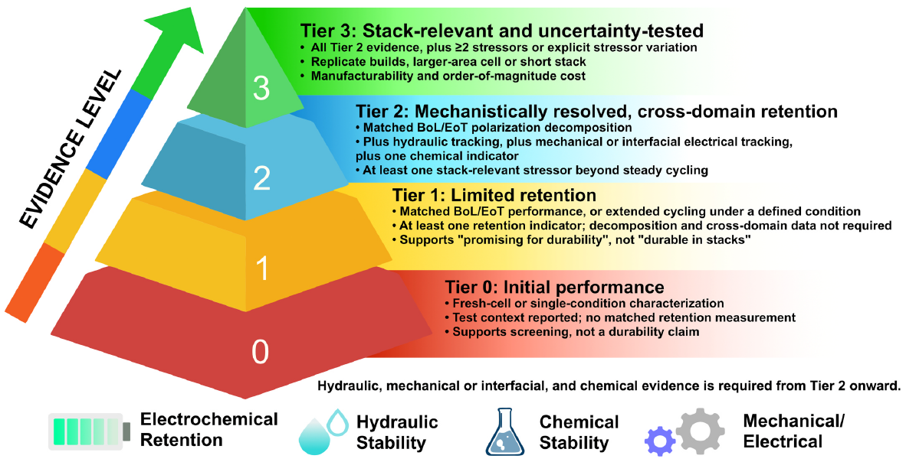
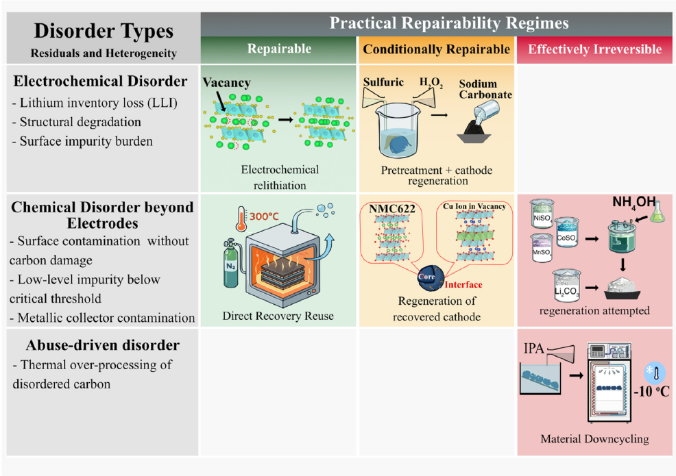

## The two numbers {.tint background-color="#F3F0EB"}

::: {.kicker .c-amber}
Why this session exists
:::

::: {.cards}
::: {.card .c-teal}
[Average]{.eyebrow}

[2.95×]{.big}

Citation multiplier of a review over an original research article, across all fields. Range 1.34× to 6.74× by discipline.
:::

::: {.card .c-rust}
[Reality]{.eyebrow}

[21%]{.big}

Share of 538 reviews published in one field that had passed ten citations two years later. The other 79% had ten citations or fewer at that point.
:::
:::

::: {.foot}
::: {.source}
Miranda & García-Carpintero, *J. Informetr.* **12**, 1015 (2018) · Ketcham & Crawford, *Lab. Invest.* **87**, 1174 (2007)
:::
:::


::: {.notes}
[01:00-03:00] สไลด์ 2

ก่อนเริ่ม ผมอยากชวนดูตัวเลขสองด้านของบทความรีวิวครับ
ด้านซ้ายคือ 2.95 เท่า เป็นค่าเฉลี่ยการอ้างอิงของ review เทียบกับ original article ในชุดข้อมูลที่งานอ้างอิงศึกษามา ตัวเลขนี้ช่วยอธิบายว่าทำไมหลายคนจึงสนใจเขียนรีวิว เพราะรีวิวที่มีประโยชน์อาจกลายเป็นจุดเริ่มต้นที่คนจำนวนมากใช้อ่านเข้าสู่สาขาหนึ่ง
แต่คำว่าค่าเฉลี่ยสำคัญมากครับ ตัวเลขนี้ไม่ได้รับประกันว่าเมื่อเราเปลี่ยนบทความหนึ่งให้เป็น review แล้ว citation จะเพิ่มขึ้นตามสัดส่วนนี้
[ชี้ตัวเลขด้านขวา แล้วเว้นจังหวะ]
อีกชุดข้อมูลหนึ่งศึกษารีวิว 538 ฉบับในหนึ่งสาขา หลังสองปี มีประมาณ 21 เปอร์เซ็นต์ที่ถูกอ้างอิงมากกว่าสิบครั้ง อีก 79 เปอร์เซ็นต์อยู่ที่สิบครั้งหรือน้อยกว่า เราจึงพูดไม่ได้ว่ากลุ่มหลังไม่มีคนอ่านหรือไม่มีคุณค่า และตัวเลขจากสองงานนี้ก็ไม่ได้ใช้ฐานข้อมูลเดียวกันครับ
สิ่งที่ผมอยากให้เห็นคือ ผลเฉลี่ยของบทความประเภทหนึ่งกับผลของบทความแต่ละฉบับเป็นคนละเรื่องกัน ดังนั้นคำถามที่ช่วยเราวางงานได้มากกว่าการถามว่ารีวิวได้ citation ดีไหม คือผู้อ่านต้องการคำตอบอะไร และเราจะให้คำตอบนั้นได้ดีกว่างานที่มีอยู่แล้วอย่างไร
ลองนึกถึงรีวิวหนึ่งฉบับที่ทุกท่านกลับไปเปิดบ่อย ๆ ครับ เรากลับไปเพราะมันรวมเปเปอร์ไว้เยอะ หรือเพราะมันช่วยให้เราเข้าใจและตัดสินใจอะไรบางอย่างได้ นั่นคือคุณค่าที่เราจะพยายามสร้างวันนี้ครับ
:::

## Five questions {.tint background-color="#F3F0EB"}

::: {.kicker .c-amber}
Today
:::

::: {.agenda}
- [20 min]{.chip .c-teal} What kinds of review exist, and which one is mine?
- [6 min]{.chip .c-teal} What does a review do to my academic profile?
- [16 min]{.chip .c-amber} What are research gaps, and what makes a review novel?
- [28 min]{.chip .c-teal} PRISMA → evidence matrix → synthesis → research gaps
- [18 min]{.chip .c-teal} What does the finished paper look like, down to the title?
:::

::: {.foot}
::: {.note}
92 minutes including the opening and two five-minute exercises; then 8 minutes for the proposal worksheet and 20 minutes for questions.
:::
:::


::: {.notes}
[03:00-04:00] สไลด์ 3

วันนี้เราจะเดินผ่านห้าคำถามตามลำดับครับ
หนึ่ง รีวิวมีหลายชนิด แล้วชนิดไหนเหมาะกับคำถามของเรา สอง งานรีวิวช่วยสร้างความเชี่ยวชาญและตัวตนทางวิชาการอย่างไร สาม เราจะตัดสินใจอย่างไรว่าหัวข้อนี้ควรเขียนต่อ
เมื่อผ่านสามคำถามนี้แล้ว เราจึงไปสู่ข้อสี่ คือกระบวนการทำงาน และข้อห้า คือโครงสร้างกับการเขียนครับ
ระหว่างทางจะมีกิจกรรมสั้นสองครั้ง ครั้งละห้านาที ขอให้เตรียมกระดาษหรือเปิดเอกสารประกอบไว้ เราจะลองเขียน research gap และ novelty แล้วกลับมาตรวจด้วย evidence matrix
เนื้อหาและกิจกรรมระหว่างเรื่องใช้ประมาณ 92 นาที จากนั้นมีเวลาแปดนาทีสำหรับ proposal และยี่สิบนาทีสำหรับถามตอบครับ
:::

## Part 1 · The genre map {.divider background-color="#0A4B49"}

::: {.lede}
Ten different things are called a review. This part ends with a three-question test that tells you which one is yours.
:::

::: {.notes}
[04:00-04:00] สไลด์ 4

เริ่มจากแผนที่ของประเภทรีวิวก่อนครับ เพราะคำว่า review คำเดียวอาจหมายถึงงานที่มีเป้าหมายและวิธีทำต่างกันมาก
:::

## "Review" is a journal label, not a method

::: {.kicker .c-amber}
Part 1
:::

::: {.cards}
::: {.card .c-slate}
[What the journal calls it]{.eyebrow}

Review · Critical Review · Tutorial Review · Minireview · Focus · Perspective · Survey · Roadmap · Opinion · Viewpoint

::: {.note}
Commercial format names. They set word counts and page limits. They tell you almost nothing about how to do the work.
:::
:::

::: {.card .c-teal}
[What you actually have to do]{.eyebrow}

Narrative · Systematic · Scoping · Mapping · Critical · Integrative · Meta-analysis · Umbrella · Rapid

::: {.note}
Methodological types. They determine your search protocol, your screening burden, and whether your claims are defensible.
:::
:::
:::

::: {.punch}
Choose the method first, then find a venue whose format fits it. Never the reverse.
:::


::: {.notes}
[04:00-06:00] สไลด์ 5

เมื่อเห็นชื่อประเภทบทความในเว็บไซต์วารสาร เราควรแยกสองเรื่องออกจากกันครับ
[ชี้สองคอลัมน์]
ด้านหนึ่งคือชื่อรูปแบบที่วารสารใช้ เช่น Review, Mini Review, Tutorial หรือ Critical Review ชื่อเหล่านี้ช่วยบอกความคาดหวังด้านขอบเขต ความยาว กลุ่มผู้อ่าน และลักษณะการนำเสนอ แต่รายละเอียดจริงขึ้นอยู่กับแต่ละวารสาร
อีกด้านหนึ่งคือวิธีที่เราสร้างข้อสรุป เราค้นเอกสารอย่างไร เลือกงานใดเข้ามา ประเมินข้อจำกัดอย่างไร และนำหลักฐานมาสังเคราะห์ด้วยวิธีไหน
สมมติวารสารเรียกต้นฉบับของเราว่า Critical Review ชื่อนี้ยังไม่ได้บอกผู้อ่านว่าเราค้นครอบคลุมเพียงใด หรือใช้เกณฑ์อะไรตัดสินว่าหลักฐานชิ้นหนึ่งน่าเชื่อถือกว่าชิ้นอื่น สิ่งเหล่านี้ต้องอธิบายจากวิธีทำจริงครับ
ในทางกลับกัน งานที่ใช้ narrative synthesis ก็สามารถมีเหตุผลที่หนักแน่นได้ หากคำถามชัด วิธีเลือกเอกสารเหมาะสม และข้อสรุปไม่เกินสิ่งที่หลักฐานรองรับ
เพราะฉะนั้น เวลาจะเริ่มงาน ผมอยากให้ถามก่อนว่าเราต้องการตอบอะไร และจะใช้หลักฐานตอบอย่างไร แล้วค่อยตรวจว่ารูปแบบบทความของวารสารใดรองรับงานนั้นได้ดีที่สุดครับ
:::

## What a review article actually is

::: {.kicker .c-amber}
Part 1
:::

::: {.lede}
If you have never written one, start by looking at the object, not at the definition.
:::

::: {.numbered .n3}
1. **New experiments are not required.** A review synthesises existing evidence; it can create a new coded dataset, an effect estimate, a framework or a justified research agenda.
2. **Figures communicate the synthesis.** Conceptual diagrams, evidence maps and quantitative plots can show relationships that individual studies do not make visible. Plan them early.
3. **The structure should reveal the contribution.** Organise sections around the review question and synthesis. Novelty lies in what readers can understand or conclude, beyond the closest reviews.
:::

::: {.foot}
::: {.note}
Anatomy of the object: Title → Abstract → Introduction and prior-review table → **your framework** → body organised by that framework → **challenges and outlook** → 100+ references. The two bold sections are what make it a review rather than a summary.
:::
:::


::: {.notes}
[06:00-08:30] สไลด์ 6

ลองมองรีวิวเป็นงานวิจัยชิ้นหนึ่งที่มีวัตถุดิบเป็นหลักฐานที่มีอยู่แล้วครับ
[ชี้ภาพโครงสร้างบทความจากบนลงล่าง]
บทนำทำหน้าที่ตั้งคำถามและบอกว่าเหตุใดคำถามนี้จึงสำคัญ เนื้อหาหลักนำหลักฐานหลายงานมาเทียบกัน ส่วนรูป ตาราง และข้อสรุปควรช่วยให้ผู้อ่านเห็นความสัมพันธ์ที่มองไม่ชัดเมื่ออ่านแต่ละเปเปอร์แยกกัน
รีวิวจึงไม่จำเป็นต้องมีการทดลองใหม่ทุกครั้ง แต่สามารถสร้างสิ่งใหม่จากข้อมูลเดิมได้ เช่น ชุดข้อมูลที่สกัดและลงรหัสอย่างเป็นระบบ การจัดกลุ่มตามเงื่อนไขทดสอบ ผลประมาณจากการสังเคราะห์ หรือกรอบคิดที่อธิบายความเชื่อมโยงระหว่างหลายกลไก
ตัวอย่างง่าย ๆ คือเราอ่านงานเกี่ยวกับอายุการใช้งานของขั้วไฟฟ้าหลายเรื่อง ถ้าเพียงรายงานว่างาน A ได้กี่รอบ งาน B ได้กี่รอบ ผู้อ่านยังต้องกลับไปคิดเองว่าตัวเลขเหล่านั้นเทียบกันได้ไหม แต่ถ้าเราจัดให้เห็นทั้งกระแส ปริมาณประจุ เกณฑ์การสิ้นสุดการทดสอบ และจำนวนซ้ำ ผู้อ่านจะเริ่มเห็นว่าความแตกต่างอาจมาจากเงื่อนไขใด
อย่างไรก็ตาม การตั้งชื่อกรอบคิดใหม่หรือวาดรูปใหม่เพียงอย่างเดียวยังไม่พอครับ เราต้องแสดงว่ากรอบนั้นช่วยอธิบายอะไรได้ และต่างจากกรอบที่รีวิวเดิมเสนออย่างไร
คำถามที่ใช้ตรวจทุกส่วนของต้นฉบับได้คือ หลังอ่านส่วนนี้แล้ว ผู้อ่านเข้าใจอะไรเพิ่มขึ้น และความเข้าใจนั้นตามกลับไปหาหลักฐานชิ้นไหนได้บ้างครับ
:::

## Three things that get taught wrong

::: {.kicker .c-amber}
Part 1
:::

::: {.cards .g3}
::: {.card .c-rust}
[Myth]{.eyebrow}

**"A systematic review is better than a critical review."**

Systematic describes how the evidence was found. It buys transparency and reproducibility. It does not buy insight.
:::

::: {.card .c-rust}
[Myth]{.eyebrow}

**"Meta-analysis is the highest level of review."**

It is a statistical step used inside a systematic review when outcomes are commensurable. Not a rung above anything.
:::

::: {.card .c-rust}
[Myth]{.eyebrow}

**"A critical review is just an unsystematic review."**

Its value is the reasoning: testing assumptions, locating contradictions, separating correlation from mechanism.
:::
:::

::: {.punch}
Being systematic tells you how reliably the literature was collected. Being critical tells you what new understanding was created from it.
:::


::: {.notes}
[08:30-10:30] สไลด์ 7

มีความเข้าใจสามเรื่องที่ผมอยากให้เราตรวจให้ชัดตั้งแต่ต้นครับ
เรื่องแรกคือการใช้คำว่า systematic เป็นคำรับประกันคุณภาพทั้งหมดของบทความ วิธีทำอย่างเป็นระบบช่วยให้การค้น การคัดเลือก และขั้นตอนที่เกี่ยวข้องตรวจสอบได้ แต่เรายังต้องดูคุณภาพของหลักฐาน วิธีสังเคราะห์ และความสมเหตุสมผลของข้อสรุปด้วย
เรื่องที่สองคือ meta-analysis ครับ ในการสนทนาบางบริบทเราอาจได้ยินคำนี้ใช้เรียกบทความทั้งฉบับ แต่สิ่งที่คำนี้ระบุโดยตรงคือวิธีสังเคราะห์ผลเชิงปริมาณ ไม่ใช่ว่าทุก systematic review ต้องมี meta-analysis หรือว่าเมื่อรวมตัวเลขแล้วรีวิวจะมีคุณค่ามากขึ้นโดยอัตโนมัติ
ก่อนรวม เราต้องถามว่าผลลัพธ์ นิยาม และเงื่อนไขของแต่ละงานเทียบกันได้พอหรือไม่ รวมแล้วได้คำตอบของคำถามใด
เรื่องที่สามคือ critical review คำว่า critical หมายถึงการพิจารณาและให้เหตุผลอย่างวิพากษ์ครับ เราต้องอธิบายทั้งหลักฐานที่สนับสนุนและที่ท้าทายข้อเสนอของเรา พร้อมแสดงข้อจำกัด ไม่ใช่เลือกมาเฉพาะงานที่ทำให้ข้อเสนอของเราดูถูกต้อง
ถ้าเก็บสามเรื่องนี้ไว้ เราจะเลิกตัดสินบทความจากชื่อประเภทอย่างเดียว แล้วหันไปดูว่ากระบวนการกับข้อสรุปทำงานร่วมกันได้ดีแค่ไหนครับ
:::

## SALSA: the four dials behind every review type

::: {.kicker .c-amber}
Part 1
:::

::: {.cards .g3}
::: {.card .c-teal}
[S]{.eyebrow}

<h3>Search</h3>

How much of the literature did you look for, and can someone repeat it?
:::

::: {.card .c-amber}
[A]{.eyebrow}

<h3>Appraisal</h3>

Did you judge the quality of what you found, or accept every paper equally?
:::

::: {.card .c-sky}
[S]{.eyebrow}

<h3>Synthesis</h3>

How did you bring the studies together: narrative, tabular, or statistical?
:::
:::

::: {.cards}
::: {.card .c-rust}
[A]{.eyebrow}

<h3>Analysis</h3>

What new understanding did you produce that no single paper contains? Make this step explicit: connect the synthesis to what readers can now understand or do.
:::
:::

::: {.foot}
::: {.source}
Grant & Booth, *Health Info. Libr. J.* **26**, 91 (2009); extended to 48 review types by Sutton et al., *ibid.* **36**, 202 (2019)
:::
:::


::: {.notes}
[10:30-12:00] สไลด์ 8

กรอบ SALSA ช่วยให้เรามองวิธีทำรีวิวเป็นสี่ส่วนครับ Search, Appraisal, Synthesis และ Analysis
Search คือเราจะหาหลักฐานจากที่ไหน ด้วยขอบเขตและวิธีใด คำอธิบายว่าค้นฐานข้อมูลอะไร ใช้คำค้นแบบไหน และค้นเมื่อไร ช่วยให้ผู้อ่านเข้าใจว่ากองเอกสารของเราเกิดขึ้นอย่างไร
Appraisal คือการประเมินจุดแข็งและข้อจำกัด งานสองเรื่องที่รายงานผลคล้ายกันอาจรองรับข้อสรุปได้ไม่เท่ากัน เช่น เรื่องหนึ่งมีการทดลองซ้ำและกลุ่มเปรียบเทียบที่เหมาะสม แต่อีกเรื่องรายงานผลเพียงชุดเดียว
Synthesis คือเราจะจัดหลักฐานเหล่านั้นให้อยู่ในรูปที่เปรียบเทียบและเชื่อมโยงกันได้อย่างไร อาจเป็นคำอธิบาย ตาราง หรือการสังเคราะห์เชิงปริมาณตามความเหมาะสม
Analysis คือเราตีความรูปแบบที่เห็นอย่างไร เหตุใดผลจึงสอดคล้องหรือแตกต่าง และยังมีความไม่แน่ใจอะไรเหลืออยู่
ทั้งสี่ส่วนทำงานร่วมกันครับ การค้นที่ดีทำให้เรามีฐานหลักฐานที่เหมาะสม ส่วนการสังเคราะห์และวิเคราะห์ช่วยให้เราเปลี่ยนฐานนั้นเป็นความเข้าใจที่ผู้อ่านนำไปใช้ได้
:::

## One topic, four completely different papers

::: {.kicker .c-amber}
Part 1
:::

::: {.lede}
Same literature, same author. The type is a decision about which question you are answering.
:::

::: {.cards}
::: {.card .c-slate}
[Narrative]{.eyebrow}

*"Artificial Interphases for Aqueous Zinc Anodes: Progress and Prospects"*

**Answers:** what has the field been doing?

::: {.note}
3–4 months · ~120 refs · one author
:::
:::

::: {.card .c-sky}
[Scoping]{.eyebrow}

*"Mapping the Evidence for Artificial Interphases on Zinc Anodes: What Is Measured, and What Is Not"*

**Answers:** what evidence exists, and where are the holes?

::: {.note}
5–6 months · documented search · two screeners
:::
:::
:::

::: {.cards}
::: {.card .c-amber}
[Critical]{.eyebrow}

*"Cycling Stability of Coated Zinc Anodes Is Set by Test Conditions, Not by Coating Chemistry"*

**Answers:** is the field's central claim actually supported?

::: {.note}
6–9 months · ~90 refs · a thesis and a tier scheme
:::
:::

::: {.card .c-rust}
[Systematic + meta]{.eyebrow}

*"Do Artificial Interphases Extend Zinc Anode Life? A Systematic Review and Conditional Meta-Analysis"*

**Answers:** how large is the effect, and under which conditions?

::: {.note}
9–12 months · protocol first · two or more people
:::
:::
:::

::: {.punch}
None of these is more advanced than the others. They answer different questions and they fail in different ways.
:::


::: {.notes}
[12:00-15:00] สไลด์ 9

ลองใช้หัวข้อเดียวกันเพื่อดูว่าคำถามเปลี่ยนชนิดของงานอย่างไรครับ สมมติเราสนใจ artificial interphase บน zinc metal anode และมีกองเปเปอร์เกี่ยวกับเรื่องนี้อยู่ชุดหนึ่ง
[ชี้ตัวอย่างทั้งสี่แบบตามลำดับ]
แบบแรก ถ้าเราถามว่าในช่วงที่ผ่านมา มีแนวทางเคลือบหรือปรับผิวอะไรบ้าง งานอาจออกมาเป็นภาพรวมของความก้าวหน้า จัดหมวดหมู่สิ่งที่มีและอธิบายแนวโน้มให้ผู้อ่านเข้าสู่เรื่องได้
แบบที่สอง ถ้าเราถามว่าสาขานี้ศึกษาวัสดุ เงื่อนไข หรือผลลัพธ์กลุ่มใดมากน้อยแค่ไหน เรากำลังต้องการแผนที่ของหลักฐาน การกำหนดเกณฑ์ค้นและลงรหัสให้ชัดจึงสำคัญมาก และคำถามลักษณะนี้อาจเหมาะกับ scoping review
แบบที่สาม ถ้าเรามีคำถามเฉพาะและผลที่แต่ละงานรายงานเทียบกันได้ เราอาจวาง systematic review และพิจารณาว่าควรสังเคราะห์เชิงปริมาณด้วยหรือไม่ แต่ต้องตรวจความเหมาะสมก่อนรวมตัวเลขครับ
แบบที่สี่ ถ้าเราต้องการตรวจข้อเสนอว่า อายุการใช้งานที่รายงานขึ้นอยู่กับเงื่อนไขทดสอบมากน้อยเพียงใดเมื่อเทียบกับเคมีของ coating งานจะต้องมุ่งเปรียบเทียบเงื่อนไข ตรวจคำอธิบายทางเลือก และให้เหตุผลรองรับข้อเสนอหลัก นี่คือลักษณะของงานที่ขับเคลื่อนด้วยข้อโต้แย้ง
ชื่อเรื่องตัวอย่างในสไลด์มีไว้ให้เห็นทิศทางของคำถามครับ ประโยคที่ฟังเหมือนข้อสรุปยังเป็นเพียง candidate thesis ในขั้นวางแผน เราจะใช้ชื่อนั้นเป็นข้อสรุปจริงได้ก็ต่อเมื่อการตรวจหลักฐานรองรับ
เวลาทำงานและจำนวนคนที่แสดงเป็นแนวช่วยวางแผน ไม่ใช่สูตรตายตัว งานที่ขอบเขตแคบแต่ต้องสกัดข้อมูลละเอียดอาจใช้เวลามากกว่างานภาพรวมที่ขอบเขตกว้างก็ได้
ลองเอาหัวข้อของทุกท่านมาแทนครับ ถ้าต้องเขียนคำถามให้ต่างกันสี่แบบ เราจะได้คำถามอะไรบ้าง การเริ่มจากคำถามจะช่วยให้เราเลือกรูปแบบได้มีเหตุผลขึ้นมากครับ
:::

## Five types built around evidence

::: {.kicker .c-amber}
Part 1
:::

::: {.numbered}
1. **Narrative** — *"I have read this field for years, and here is what I think matters."* Selection is less standardised; describe the basis and limits of the claims.
2. **Systematic** — *"I searched by a written protocol, and here is everything that met my criteria."* Six to twelve months, two people minimum.
3. **Scoping** — *"Here is the shape of the evidence, and here are the holes in it."* High search, low appraisal. A realistic first review.
4. **Mapping** — *"Here is a classification of the field, usually with a database others can search."* The output is the map itself.
5. **Meta-analysis**, a method and not a type — *"Inside a systematic review: I pooled the numbers into one effect size."* Only possible when outcomes are commensurable.
:::

::: {.punch}
Narrative versus systematic is not a ranking of quality. The method determines which claims the evidence can support.
:::


::: {.notes}
[15:00-16:30] สไลด์ 10

กลุ่มนี้ช่วยให้เห็นความคาดหวังด้านหลักฐานของรีวิวแต่ละแบบครับ ผมขอชี้ความต่างหลักสามจุด
จุดแรกคือ narrative กับ systematic เราต้องดูวิธีเลือกและสังเคราะห์เอกสารจริง มากกว่าตัดสินจากชื่ออย่างเดียว narrative review สามารถอธิบายข้อสรุปจากหลักฐานได้ แต่ควรระบุขอบเขตและข้อจำกัดของความครอบคลุมให้เหมาะกับข้ออ้างที่ทำ
จุดที่สองคือ scoping review ถ้าคำถามของเราต้องการรู้ว่า มีหลักฐานชนิดใด อยู่ในบริบทไหน หรือใช้แนวคิดและตัวชี้วัดอย่างไร การทำแผนที่อย่างมีวิธีการอาจเป็นคำตอบที่เหมาะ โดยยังไม่จำเป็นต้องบังคับให้ทุกงานตอบคำถามผลลัพธ์เดียวกัน
จุดที่สามคือ meta-analysis ในงานวัสดุและอุปกรณ์ เรามักเจอความต่างของรูปแบบเซลล์ loading กระแส และเกณฑ์วัดผล จึงต้องตัดสินใจก่อนว่าสิ่งที่กำลังจะรวมมีความหมายร่วมกันอย่างไร
การมีข้อมูลเป็นตัวเลขไม่ได้แปลว่าต้องรวมให้เป็นตัวเลขเดียวเสมอไปครับ บางครั้งการแยกให้เห็นว่าผลเปลี่ยนตามเงื่อนไขใด ตอบคำถามของเราได้ดีกว่า
ดังนั้นแต่ละแบบคือทางเลือกของวิธีตอบคำถาม และต้องประเมินจากความเหมาะสมของงานจริงครับ
:::

## Five types built around an argument

::: {.kicker .c-amber}
Part 1
:::

::: {.numbered}
1. **Critical** — *"The field believes X. I will show you why that is only partly right, and what to believe instead."* The argument is the work.
2. **State-of-the-art** — *"Here is what is actually known now, covering the last five to ten years completely."*
3. **Tutorial** — *"Here is how this method really works, explained for someone who has never used it."* Clarity outranks completeness.
4. **Perspective / Opinion** — *"Here is where I think this field should go next."* Little writing, but it trades on reputation. Almost always invited.
5. **Umbrella** — *"Six reviews on this topic disagree. Here is what they collectively show."*
:::

::: {.flag .c-amber}
Realistic first review, with a senior co-author: a scoping review, a critical review, or a tutorial review.
:::


::: {.notes}
[16:30-18:00] สไลด์ 11

อีกกลุ่มหนึ่งเน้นสิ่งที่ผู้เขียนต้องการอธิบาย เสนอ หรือสอนครับ
Critical review ต้องมีข้อเสนอหลักที่ผู้อ่านตรวจสอบเหตุผลได้ พร้อมพิจารณาคำอธิบายทางเลือก ส่วน state-of-the-art review ช่วยให้เห็นภาพของสิ่งที่รู้ในปัจจุบันและประเด็นที่กำลังเปลี่ยนแปลง
Tutorial review เหมาะเมื่อคุณค่าของงานอยู่ที่การอธิบายแนวคิดหรือวิธีการให้ผู้อ่านเรียนรู้และนำไปใช้ได้ การสอนให้เข้าใจลึกจึงเป็น contribution ที่สำคัญได้เช่นกันครับ
Perspective หรือ Opinion เปิดพื้นที่ให้เสนอทิศทางและมุมมอง แต่เงื่อนไขการรับต้นฉบับต่างกันตามวารสาร บางแห่งใช้การเชิญ จึงควรตรวจรูปแบบและแนวทางติดต่อก่อนลงทุนเขียนเต็มเรื่อง
ส่วน umbrella review ใช้รีวิวที่มีอยู่เป็นหน่วยหลักในการสังเคราะห์ แต่การพบว่าหัวข้อเรามีรีวิวหลายฉบับยังไม่พอที่จะตัดสินใจทำทันที ต้องดูว่าคำถามและรีวิวเหล่านั้นเหมาะกับการนำมาเปรียบเทียบอย่างไรด้วย
สำหรับงานแรก สิ่งที่ช่วยได้มากคือเลือกขอบเขตที่รับผิดชอบได้จริง และมีผู้ร่วมงานที่ช่วยตรวจวิธีทำกับการตีความครับ ความทะเยอทะยานควรอยู่ที่คำถามที่ชัดและเหตุผลที่ดีควบคู่กับทรัพยากรที่มี
:::

## Two axes, not a ladder

::: {.kicker .c-amber}
Part 1
:::

::: {.cards}
::: {.card .c-teal}
[Low systematic · high critical]{.eyebrow}

<h3>Critical review</h3>

Insight, no documented search
:::

::: {.card .c-amber}
[High systematic · high critical]{.eyebrow}

<h3>Systematic critical review</h3>

Documented search, then real synthesis. A useful combination when the question needs both transparent selection and critical interpretation.
:::
:::

::: {.cards}
::: {.card .c-slate}
[Low · low]{.eyebrow}

<h3>Narrative review</h3>

Expert commentary, no protocol
:::

::: {.card .c-slate}
[High systematic · low critical]{.eyebrow}

<h3>Descriptive systematic review</h3>

Rigorous search, thin synthesis
:::
:::

::: {.foot}
::: {.note}
**Where does meta-analysis go?** Nowhere on this map. It attaches to the right-hand column when the outcomes are commensurable. It sharpens a quantitative claim; it does not move a review upward. And the bottom right is not a failure: a scoping or mapping review belongs there by design.
:::
:::


::: {.notes}
[18:00-20:00] สไลด์ 12

ผมอยากให้ทุกท่านเก็บรูปสองแกนนี้ไว้เป็นวิธีตรวจงานของตัวเองครับ
[ชี้แกนทีละด้าน]
แกนหนึ่งถามว่าเรารวบรวมและเลือกหลักฐานอย่างไร คนอื่นตามรอยและประเมินความครอบคลุมได้แค่ไหน อีกแกนถามว่าเมื่อได้หลักฐานแล้ว เราสร้างความเข้าใจอะไรเพิ่มขึ้น
งานหนึ่งอาจบันทึกการค้นละเอียดมาก แต่เนื้อหาหลักยังเป็นการเรียงสรุปทีละเปเปอร์ อีกงานอาจเสนอแนวคิดที่น่าสนใจ แต่ผู้อ่านยังไม่รู้ว่าเลือกหลักฐานมาอย่างไร ทั้งสองแบบมีจุดที่พัฒนาต่อได้ต่างกันครับ
ชื่อประเภทที่วางในภาพเป็นตัวอย่างเพื่อช่วยคิด ไม่ได้ตัดสินว่างานทุกชิ้นที่มีชื่อนั้นต้องอยู่ในตำแหน่งเดียวกัน เราต้องพิจารณาต้นฉบับจริงเสมอ
เป้าหมายที่น่าสนใจคือทำให้วิธีรวบรวมหลักฐานตรวจสอบได้ แล้วใช้การสังเคราะห์และการวิเคราะห์อย่างวิพากษ์เพื่ออธิบายความหมายของหลักฐาน ไม่จำเป็นต้องเลือกระหว่างความโปร่งใสกับความเข้าใจใหม่ครับ
ขณะเดียวกัน เราต้องยึดคำถามของงานด้วย หากคำถามต้องการแผนที่ของสาขา scoping review ที่ทำอย่างเหมาะสมก็มีคุณค่าในตัวเอง ไม่ต้องเปลี่ยนไปทำการรวมผลเชิงปริมาณเพียงเพื่อให้ดูซับซ้อนขึ้น
เวลาตรวจต้นฉบับ ลองถามสองคำถามนี้แยกกันครับ เรารู้ได้อย่างไรว่าหลักฐานชุดนี้เหมาะกับคำถาม และการอ่านหลักฐานร่วมกันทำให้เราเข้าใจอะไรที่ยังไม่ชัดเมื่ออ่านแยกกัน
:::

## Do not import the clinical evidence hierarchy

::: {.kicker .c-amber}
Part 1
:::

::: {.cards}
::: {.card .c-sky}
[Clinical / medical]{.eyebrow}

- *"Does treatment A improve outcome B compared with C?"*
- Population and dose vary, inside a largely shared protocol
- The unit compared is a pre-defined clinical outcome
- Synthesis narrows the uncertainty around an effect
- **Pooling is often meaningful**
:::

::: {.card .c-amber}
[Materials / engineering]{.eyebrow}

- *"Why does this system behave this way, when does it work, and when does it fail?"*
- Loading, current density, cell format, electrolyte, cut-off criterion. Effectively everything varies
- The unit compared is a number whose test conditions differ study by study
- Synthesis produces a **mechanism** that explains why results diverge
- **Pooling is sometimes precise and physically meaningless**
:::
:::

::: {.punch}
The right review methodology is set by the scientific question, not by a hierarchy borrowed from another discipline.
:::


::: {.notes}
[20:00-22:00] สไลด์ 13

แนวทางจากงานสุขภาพช่วยให้วงการอื่นคิดเรื่องความโปร่งใสและความน่าเชื่อถือของการทบทวนหลักฐานได้มากครับ แต่เมื่อนำมาใช้ในวิศวกรรม เราต้องพิจารณาธรรมชาติของคำถามและข้อมูลด้วย
ลองดูตัวอย่างสมมตินี้ครับ เรามีงาน coating ของ zinc anode หนึ่งร้อยเรื่อง แล้วรวมผลออกมาเป็นตัวเลขว่า zinc ที่เคลือบมีอายุการใช้งานยาวกว่า 2.4 เท่า
[เว้นให้ผู้ฟังคิดประมาณห้าวินาที]
ก่อนตีความตัวเลข ผมอยากถามว่า แต่ละงานใช้ความหนาของ zinc เท่ากันไหม ใช้ electrolyte กระแส ปริมาณประจุ และเกณฑ์สิ้นสุดการทดสอบเหมือนกันหรือเปล่า หากต่างกัน ตัวเลขที่รวมได้กำลังตอบคำถามอะไรครับ
ข้อควรระวังจึงอยู่ที่ความหมายของการเปรียบเทียบ ไม่ใช่ว่าการวิเคราะห์เชิงปริมาณใช้กับวิศวกรรมไม่ได้ เราอาจต้องแบ่งกลุ่มตามเงื่อนไข ใช้วิธีปรับที่มีเหตุผลรองรับ หรือยอมรับว่าข้อมูลบางส่วนยังไม่ควรถูกรวม
อีกทางหนึ่งคือใช้หลักฐานชุดเดิมสร้างตารางให้เห็นความสัมพันธ์ระหว่าง zinc utilization, current density และ areal capacity แล้วตรวจว่าแนวโน้มอายุการใช้งานสัมพันธ์กับเงื่อนไขใดบ้าง นี่เป็นตัวอย่างของการสังเคราะห์ที่ช่วยตั้งคำถามได้ แม้ยังไม่มีค่าประมาณรวมเพียงค่าเดียว
ตัวเลข 2.4 เท่าและผลที่ยกมาทั้งหมดในตัวอย่างนี้เป็นข้อมูลสมมติสำหรับอธิบายวิธีคิดครับ ข้อสรุปจริงต้องกลับไปตรวจข้อมูลและวิธีวิเคราะห์ที่เหมาะสมกับคำถาม
:::

## So which one should you write?

::: {.kicker .c-amber}
Part 1
:::

::: {.steps}
::: {.step .c-teal}
[1]{.n}
[Can you state a claim about your field that an expert would argue with?]{.h}
[No, not yet → go to 2. This is the normal starting position, not a failure. Yes → go to 3.]{.d}
:::

::: {.step .c-sky}
[2]{.n}
[Is your goal to map what exists and find the gaps?]{.h}
[Yes → scoping or mapping review. The right first review: defensible, useful, and it tells you whether a critical review is possible later. No → narrative review, fine as a thesis chapter or grant background.]{.d}
:::

::: {.step .c-amber}
[3]{.n}
[Are the outcomes comparable enough to pool or normalise?]{.h}
[No → critical review. Add a documented search and it becomes a systematic critical review. Yes → systematic review, with a meta-analysis only if pooling survives scrutiny.]{.d}
:::
:::

::: {.punch}
Three questions, four honest answers. None of them is "write the most comprehensive review you can".
:::


::: {.notes}
[22:00-23:30] สไลด์ 14

ถ้ากลับไปที่หัวข้อของตัวเอง ผมเสนอให้เริ่มจากทางแยกในภาพนี้ครับ
[ชี้กิ่งแรกของแผนผัง]
ถ้าเรายังไม่รู้ว่าหลักฐานในสาขามีอะไรบ้าง หรือยังไม่ได้ข้อเสนอหลักที่ชัด การเริ่มสำรวจและทำแผนที่หลักฐานเป็นก้าวที่มีเหตุผล การยังไม่มี thesis ตั้งแต่วันแรกเป็นเรื่องปกติครับ แต่เราต้องมีคำถามนำและขอบเขตที่พอทำงานได้
ถ้ามีคำถามเฉพาะแล้ว ให้ถามต่อว่าผลลัพธ์และเงื่อนไขของแต่ละงานเปรียบเทียบกันได้อย่างไร หากจะรวมเชิงปริมาณต้องมีเหตุผลรองรับ และหากเราต้องการตรวจข้อเสนอหรืออธิบายกลไก ก็ต้องออกแบบการสังเคราะห์ให้เห็นทั้งหลักฐานสนับสนุนและข้อโต้แย้ง
แผนผังนี้เป็นตัวช่วยตั้งคำถามก่อนเลือกวิธี ไม่ใช่สูตรตัดสินชื่อรีวิวแบบอัตโนมัติครับ
ท้ายที่สุด ความครอบคลุมต้องรับใช้คำถาม เราต้องครอบคลุมเพียงพอให้ข้อสรุปน่าเชื่อถือ พร้อมกับอธิบายได้ว่าผู้อ่านจะได้ความเข้าใจอะไรเพิ่มขึ้น จากตรงนี้เราจะไปดูว่าการเลือกงานรีวิวเชื่อมกับตัวตนทางวิชาการของเราอย่างไรครับ
:::

## Part 2 · Your academic profile {.divider background-color="#0A4B49"}

::: {.lede}
The honest version: what it buys you, what it costs the field, and what it will not do for your promotion case.
:::

::: {.notes}
[23:30-23:30] สไลด์ 15

ต่อไปมาดูกันครับว่า รีวิวให้อะไรกับเส้นทางวิจัยของเรา และมีต้นทุนอะไรต่อผู้เขียนกับวงการบ้าง
:::

## Reviews are over-represented at the top

::: {.kicker .c-amber}
Part 2
:::

::: {.numbered .n3}
1. Among the top 0.05–0.1% most-cited papers, the review share rose from roughly **17% in 1990 to about 40% in 2010**.
2. Reviews count as citable items in the impact-factor denominator, exactly like research papers, so a review-heavy portfolio raises a journal's IF mechanically. Seven of the ten highest-IF journals in the 2025 JCR are review journals.
3. The multiplier is largest in fields where reviews are rarest. **In review-saturated fields the premium collapses.**
:::

::: {.punch}
The premium is real, and it is strategic: it is largest exactly where nobody has reviewed yet.
:::

::: {.foot}
::: {.source}
Miranda & García-Carpintero, *J. Informetr.* **12**, 1015 (2018); the 1990 share is reported there as 16–18% · 2025 Journal Citation Reports
:::
:::


::: {.notes}
[23:30-25:00] สไลด์ 16

ถ้ามองที่การอ้างอิง รีวิวมีข้อได้เปรียบที่เห็นได้จริงครับ งานศึกษาที่อ้างบนสไลด์ดูบทความในกลุ่มที่ถูกอ้างอิงสูงที่สุดประมาณศูนย์จุดศูนย์ห้าถึงศูนย์จุดหนึ่งเปอร์เซ็นต์ แล้วพบว่าสัดส่วนของรีวิวในกลุ่มนี้เพิ่มจากราวสิบเจ็ดเปอร์เซ็นต์ในปี 1990 เป็นประมาณสี่สิบเปอร์เซ็นต์ในปี 2010

ขอให้สังเกตตัวหารด้วยนะครับ นี่คือสัดส่วนรีวิวในกลุ่มบทความที่ถูกอ้างอิงสูงมาก ไม่ได้แปลว่ารีวิวสี่สิบเปอร์เซ็นต์จะประสบความสำเร็จ และไม่ได้ทำนายว่ารีวิวฉบับที่เรากำลังจะเขียนจะได้ citation เท่าไร

เหตุผลหนึ่งที่เข้าใจได้ง่ายคือ รีวิวช่วยให้ผู้อ่านเข้าถึงภาพรวมของสาขา เวลาจะปูพื้นในบทนำ เราอาจใช้รีวิวหนึ่งฉบับเป็นจุดเริ่มต้นแทนการพาผู้อ่านไล่งานหลายสิบชิ้น ความสะดวกนี้ทำให้รีวิวที่ดีมีโอกาสถูกใช้ซ้ำมาก

แต่โอกาสนั้นขึ้นกับบริบทด้วยครับ ถ้าหัวข้อหนึ่งมีรีวิวคล้ายกันอยู่มากแล้ว การเพิ่มอีกฉบับไม่ได้ทำให้เกิดคุณค่าเพิ่มโดยอัตโนมัติ เราจึงควรถามว่าผู้อ่านยังต้องการความเข้าใจอะไร มากกว่าถามเพียงว่ารีวิวได้ citation มากไหม

และเมื่อรีวิวกลายเป็นประตูที่คนใช้เข้าถึงทั้งสาขา ก็มีอีกด้านหนึ่งที่เราต้องมองครับ
:::

## The other side of the ledger

::: {.kicker .c-amber}
Part 2
:::

::: {.flag .c-rust}
**38%** — median reduction in future citations to a primary paper after a review covers it. About 70% of reviewed papers lose citations. Analysis of ~6 million articles, 1990–2016.
:::

::: {.numbered .n3}
1. **Your review absorbs credit that belonged to other people.** Cite the specific primary paper for a specific claim; cite the review only for context.
2. **Referees are increasingly hostile to reviews with no contribution.** Editors in energy and materials now publish editorials asking authors to stop writing unnecessary reviews.
3. **Volume has consequences.** Systematic reviews grew 2,728% between 1991 and 2014; roughly a third were judged redundant.
:::

::: {.foot}
::: {.source}
McMahan & McFarland, *Am. Sociol. Rev.* **86**, 341 (2021) · Ioannidis, *Milbank Q.* **94**, 485 (2016) · Kamat, Christopher & Jin, *ACS Energy Lett.* **10**, 5020 (2025)
:::
:::


::: {.notes}
[25:00-27:00] สไลด์ 17

อีกด้านคือ รีวิวสามารถเปลี่ยนเส้นทางที่ผู้อ่านกลับไปหางานต้นฉบับได้ครับ งานที่อ้างบนสไลด์วิเคราะห์บทความประมาณหกล้านฉบับ และรายงานว่าหลังบทความปฐมภูมิถูกนำไปกล่าวถึงในรีวิว การอ้างอิงในอนาคตของบทความเหล่านั้นมีค่ามัธยฐานลดลงประมาณสามสิบแปดเปอร์เซ็นต์ตามการวิเคราะห์ของงานนั้น

เราควรอ่านตัวเลขนี้ภายในขอบเขตของชุดข้อมูลและวิธีวิเคราะห์ ไม่ใช้ทำนายผลของบทความแต่ละฉบับ แต่ข้อคิดที่นำไปใช้ได้ทันทีคือ ถ้าผู้อ่านหยุดอยู่ที่รีวิว งานทดลองที่เป็นที่มาของข้อค้นพบอาจถูกมองเห็นน้อยลง

ดังนั้น เวลาเราเขียนข้ออ้างที่เฉพาะเจาะจง เช่น วัสดุชนิดหนึ่งให้ผลอย่างไรภายใต้เงื่อนไขใด ควรอ้างบทความปฐมภูมิที่รายงานผลนั้นโดยตรง ส่วนรีวิวเหมาะสำหรับการให้บริบท กรอบเปรียบเทียบ หรือข้อสังเคราะห์ที่ผู้เขียนรีวิวนั้นสร้างขึ้น

ตัวอย่างง่าย ๆ ครับ ประโยคว่า “สาขานี้มีแนวทางปรับปรุงอิเล็กโทรดอยู่หลายกลุ่ม” อาจอ้างรีวิวได้ แต่ถ้าบอกว่า “งานนี้ทดสอบหนึ่งพันรอบที่กระแสเท่านี้” เราควรกลับไปอ่านและอ้างงานที่ทำการทดสอบจริง เพื่อให้เครดิตและรักษารายละเอียดของเงื่อนไขให้ถูกต้อง

อีกประเด็นคือจำนวนรีวิวที่เพิ่มขึ้นไม่ได้หมายความว่าทุกฉบับเติมสิ่งที่วงการขาด บทบรรณาธิการใน ACS Energy Letters ปี 2025 ใช้ชื่อว่า “Should You Really be Writing A(nother) Review Manuscript?” ชื่อนี้ชวนให้หยุดถามว่า จำเป็นต้องมีรีวิวอีกฉบับเพราะอะไร

สำหรับเรา คำตอบจึงควรเริ่มจากประโยชน์ที่ผู้อ่านจะได้รับ และนำไปสู่คำถามต่อไปว่า นอกจาก citation แล้ว รีวิวที่ทำอย่างจริงจังให้อะไรกับผู้เขียนบ้าง
:::

## What a review genuinely buys you

::: {.kicker .c-amber}
Part 2
:::

::: {.numbered}
1. **Agenda setting.** You decide which papers become the canon of your subfield. The largest and least-discussed benefit.
2. **A research identity.** A review is where you name and defend the framework your group works under.
3. **Invitation flow.** Editors commission people who have already written well on the topic. The first review is what makes the second one an invitation.
4. **Reusable infrastructure.** Grant proposal backgrounds, a course module, and the fastest way to onboard a new student.
5. **Low-risk collaboration.** A multi-institution review often precedes a joint experimental project.
:::


::: {.notes}
[27:00-28:30] สไลด์ 18

สิ่งแรกที่รีวิวให้เราได้คือความชัดเจนว่า คำถามสำคัญของสาขาคืออะไรครับ ระหว่างที่อ่านและเปรียบเทียบงาน เราอาจพบว่าคนส่วนใหญ่กำลังรายงานตัวเลขชนิดเดียวกัน แต่ยังไม่มีวิธีตัดสินว่าตัวเลขเหล่านั้นตอบปัญหาที่เราสนใจจริงหรือไม่

เมื่อเราสร้างกรอบเปรียบเทียบที่มีเหตุผล กรอบนั้นอาจช่วยให้ทั้งผู้อ่านและทีมวิจัยของเราคิดเรื่องเดียวกันได้ชัดขึ้น ตัวอย่างที่จะดูช่วงท้ายคือการประเมินความทนทานของ carbon felt และมุมมองเรื่อง order retention ในการรีไซเคิลแบตเตอรี่ ทั้งสองกรณีเริ่มจากการตั้งคำถามใหม่กับหลักฐานที่มีอยู่แล้ว

สิ่งที่สองคือผลงานนี้ช่วยทำให้คนอื่นเห็นว่าเราทำงานกับคำถามใด และมีวิธีคิดอย่างไร การเขียนที่ชัดและรอบคอบอาจนำไปสู่โอกาสร่วมงานหรือการได้รับเชิญในอนาคต แต่สิ่งเหล่านี้เป็นโอกาสที่ตามมาจากคุณภาพ ไม่ใช่ผลที่รับประกันเพียงเพราะตีพิมพ์รีวิวหนึ่งฉบับ

สิ่งที่สามคือเราได้ฐานความรู้ที่นำกลับมาใช้ได้ ทั้งการสอนนักศึกษา การตั้งต้น proposal และการวางแผนโครงการทดลองร่วมกัน ประโยชน์ที่คงอยู่จึงอาจเป็นชุดคำถาม ตารางหลักฐาน และความเข้าใจร่วมของทีม

อย่างไรก็ตาม ประโยชน์เหล่านี้ไม่ได้ทำให้รีวิวทดแทนงานทุกอย่างในเส้นทางวิจัยได้ครับ
:::

## What a review will not do for you

::: {.kicker .c-amber}
Part 2
:::

::: {.cards .g3}
::: {.card .c-rust}
<h3>Not a substitute for primary research</h3>

A record heavy on reviews and thin on experimental papers reads as a group without a working laboratory.
:::

::: {.card .c-rust}
<h3>Not a substitute for expertise</h3>

Referees notice reviews assembled from abstracts, and abstract-only reading propagates other people's errors under your name.
:::

::: {.card .c-rust}
<h3>Not faster than a research paper</h3>

Six to twelve months, 100+ references, plus revision rounds.
:::
:::

::: {.flag .c-teal}
**The pattern that works for early-career authors:** junior first author, senior sponsor. A study of 1,102 reviews found junior researchers were the predominant authors and served mainly as first authors. You are senior enough to be first author. You are probably not senior enough to be sole author.
:::

::: {.foot}
::: {.source}
Chang & Wu, *Scientometrics* **130**, 4995 (2025) — carried out in library and information science, so indicative rather than proven for engineering
:::
:::


::: {.notes}
[28:30-29:30] สไลด์ 19

รีวิวทดแทนไม่ได้อย่างน้อยสามเรื่องครับ หนึ่ง งานสร้างหลักฐานใหม่เมื่อคำถามต้องการการทดลอง สอง ความเชี่ยวชาญ เพราะการอ่านเพียง abstract ยังไม่พอประเมินวิธีวิจัย และสาม เวลา รีวิวที่ทำอย่างรอบคอบอาจใช้หลายเดือนเช่นกัน

สำหรับนักวิจัยรุ่นใหม่ สิ่งสำคัญคือทีมมีความสามารถพอจะประเมินหลักฐานหรือไม่ การเป็นผู้เขียนหลักร่วมกับผู้มีประสบการณ์เป็นทางเลือกหนึ่งครับ

งานที่ศึกษารีวิวหนึ่งพันหนึ่งร้อยสองฉบับพบรูปแบบนี้ในสาขาบรรณารักษศาสตร์และสารสนเทศศาสตร์ จึงยังไม่ใช่ข้อพิสูจน์สำหรับวิศวกรรมทุกสาขา ส่วนการใช้รีวิวประกอบการประเมินตำแหน่ง ต้องดูเกณฑ์สถาบันตนเอง

เมื่อเห็นทั้งประโยชน์และต้นทุนแล้ว เราจะตัดสินอย่างไรว่าหัวข้อของเราควรเดินหน้าครับ
:::

## Part 3 · Go / No-Go {.divider background-color="#0A4B49"}

::: {.lede}
Five gates, the contribution ladder, and the question everyone asks: what am I contributing if I have no new data?
:::

::: {.notes}
[29:30-29:30] สไลด์ 20

ห้าด่านต่อไปนี้จะช่วยให้ตัดสินครับ ว่าควรเดินหน้า ปรับขอบเขต หรือรอให้คำถามกับหลักฐานพร้อมกว่านี้
:::

## Gate 1 and Gate 2: is the field ready, and is it taken?

::: {.kicker .c-amber}
Part 3
:::

::: {.cards}
::: {.card .c-teal}
[Gate 1 · Field maturity]{.eyebrow}

- **30+** relevant primary papers in the last 2–3 years means the topic is timely
- **15–20** within the last 5 years is the absolute minimum
- **< 50** significant papers overall and the topic is probably too immature
- **> 120** and your scope is too broad. Narrow it, or split the paper
:::

::: {.card .c-amber}
[Gate 2 · Review saturation]{.eyebrow}

The editorial rule at *Chemical Reviews*: the topic must not have been comprehensively reviewed in the past **3 to 4 years**. Every RSC proposal form asks you to justify why there is room for another.

**Run the review search before the primary search.** In Scopus: your terms `AND DOCTYPE(re) AND PUBYEAR > 2020`, then repeat with `DOCTYPE(ar)` for the last three years.
:::
:::

::: {.punch}
Those two counts give you Gate 1 and Gate 2 in fifteen minutes.
:::


::: {.notes}
[29:30-32:00] สไลด์ 21

สองด่านแรกถามคนละเรื่องครับ ด่านแรกถามว่ามีหลักฐานเพียงพอให้สังเคราะห์หรือยัง ด่านที่สองถามว่ามีใครสังเคราะห์คำถามเดียวกันไว้ดีแล้วหรือยัง

ตัวเลขจำนวนบทความในกรอบซ้ายช่วยให้เราเห็นขนาดงานอย่างคร่าว ๆ แต่ขอให้อ่านเป็นแนวทางวางแผน ไม่ใช่เกณฑ์ผ่านตกสากลครับ หลักฐานสิบห้าชิ้นที่ตรงคำถามอาจมีประโยชน์กว่าร้อยชิ้นที่ตอบคนละเรื่อง ความพร้อมของหัวข้อจึงต้องพิจารณาควบคู่กับความเกี่ยวข้อง คุณภาพ และชนิดของรีวิวที่จะทำ

วิธีเริ่มที่ทำได้ทันทีคือค้นสองรอบครับ รอบแรกค้นหารีวิวที่มีอยู่แล้ว ใช้คำสำคัญของหัวข้อแล้วกรองชนิดเอกสารเป็น review จากนั้นเปิดอ่านฉบับที่ใกล้คำถามของเราที่สุด โดยเฉพาะฉบับล่าสุด อย่าหยุดที่จำนวนผลลัพธ์ ให้ดูว่าเขาตั้งคำถามอะไร ครอบคลุมหลักฐานถึงเมื่อไร และได้ข้อสรุปอะไร

รอบที่สองจึงค้นบทความปฐมภูมิ ใช้คำสำคัญใกล้เคียงกันแล้วดูงานวิจัยที่อยู่ในขอบเขตของเรา รวมทั้งงานที่ออกหลังการค้นของรีวิวเดิม การสำรวจสองรอบนี้ช่วยคัดกรองเบื้องต้นได้เร็ว แต่การตัดสินว่าเรามีช่องให้ทำรีวิวจริงหรือไม่ ยังต้องอ่านเนื้อหาต่อครับ

สมมติว่าเราพบรีวิวครอบคลุมหัวข้อเดียวกันในปีที่แล้ว และพบงานปฐมภูมิใหม่อีกจำนวนหนึ่ง คำตอบไม่จำเป็นต้องเป็นการเขียนรีวิวครอบคลุมซ้ำ เราอาจพบคำถามเฉพาะที่รีวิวเดิมยังไม่ได้เปรียบเทียบ เช่น ผลที่รายงานเปลี่ยนตามเงื่อนไขทดสอบหรือไม่ หรือข้อสรุปเดิมยังอยู่หรือไม่เมื่อรวมหลักฐานใหม่

แต่ก็อย่าเลือกเฉพาะงานหลังปีตัดข้อมูลจนทิ้งหลักฐานสำคัญที่จำเป็นต่อคำถามนะครับ ขอบเขตต้องตามคำถาม ไม่ใช่ตามความสะดวกในการทำให้รายการอ้างอิงดูใหม่

สุดท้าย ตรวจข้อกำหนดของวารสารเป้าหมายด้วย เพราะบางวารสารกำหนดให้ชี้ชัดว่าเหตุใดจึงจำเป็นต้องมีรีวิวอีกฉบับ เมื่อเห็นทั้งฐานหลักฐานและรีวิวเดิมแล้ว จึงค่อยดูความพร้อมของทีมและข้อเสนอของเรา
:::

## Gates 3 to 5: standing, thesis, capacity

::: {.kicker .c-amber}
Part 3
:::

::: {.steps}
::: {.step .c-teal}
[3]{.n}
[Standing]{.h}
[Do you have primary research papers on this topic from the last three years? RSC and ACS proposal forms require them by DOI. If not, your route is a co-authored review with someone who has them.]{.d}
:::

::: {.step .c-amber}
[4]{.n}
[A thesis]{.h}
[Can you state, in one sentence, a claim an expert would argue with? "Advances in X" is not a thesis. "The reported cycle-life gains in X are an artefact of test protocol, not of materials chemistry" is a thesis.]{.d}
:::

::: {.step .c-teal}
[5]{.n}
[Capacity]{.h}
[Six to twelve months, a co-author, and a student who will not be derailed. A review is a project, not a gap-filler between experiments.]{.d}
:::
:::


::: {.notes}
[32:00-33:30] สไลด์ 22

อีกสามด่านคือความเชี่ยวชาญ ข้อเสนอหลัก และกำลังที่จะทำงานให้จบครับ

ด่านความเชี่ยวชาญไม่ได้แปลว่าต้องรอจนเป็นอาจารย์อาวุโส แต่เราต้องมีคนในทีมที่มองออกว่างานแต่ละชิ้นมีจุดแข็งและข้อจำกัดตรงไหน ถ้าเรายังมีประสบการณ์ในหัวข้อน้อย การร่วมเขียนกับผู้ที่ทำวิจัยด้านนี้โดยตรงช่วยให้การประเมินหลักฐานรอบคอบขึ้นได้

ด่านข้อเสนอหลักลองเทียบสองประโยคครับ “ความก้าวหน้าของวัสดุชนิดนี้” บอกเพียงหัวข้อ แต่ประโยคว่า “ความต่างของผลอายุการใช้งานที่รายงานอาจสัมพันธ์กับเงื่อนไขทดสอบ” เริ่มบอกแล้วว่าเราจะตรวจสอบความสัมพันธ์อะไร

คำว่า “อาจ” มีความหมายครับ ตอนเริ่มต้นนี่เป็นคำถามหรือข้อเสนอที่ต้องตรวจ ไม่ใช่ข้อสรุปที่เราตั้งธงไว้แล้วว่าจะต้องเป็นจริง สำหรับ critical review เราควรมีข้อเสนอที่ชัดพอให้ตรวจสอบและถกเถียงด้วยหลักฐานได้ ส่วนรีวิวชนิดอื่นต้องให้คำถามสอดคล้องกับวิธีของมัน

ด่านสุดท้ายคือกำลังคนและเวลา ใครจะค้น ใครจะตรวจข้อมูล ใครจะตัดสินเมื่อเห็นไม่ตรงกัน และมีเวลาสำหรับการแก้ไขหรือไม่ รีวิวเป็นโครงการวิจัยที่ต้องวางแผนครับ เมื่อทีมพร้อมแล้ว คำถามต่อไปคือเราอยากสร้าง contribution แบบไหน
:::

## The contribution ladder

::: {.kicker .c-amber}
Part 3
:::

::: {.lede}
A guide to contributions in a critical review. Useful evidence maps and classifications can also contribute.
:::

::: {.numbered}
1. **Collection** — *"What papers exist on this topic?"*
2. **Classification** — *"How can they be grouped?"*
3. **Comparison** — *"How do they differ from one another?"*
4. **Synthesis** — *"What does the evidence collectively say?"*
5. **Critique** — *"What is unreliable, inconsistent or missing?"*
6. **Reconciliation** — *"Why do these studies appear to disagree?"*
7. **Framework or mechanism** — *"Can one concept account for all of it?"*
8. **Design rules and hypotheses** — *"What should we build or test next?"*
:::

::: {.punch}
The contribution test: what does this review let readers understand or do? Match the contribution to the question, then compare it with prior syntheses.
:::


::: {.notes}
[33:30-36:00] สไลด์ 23

บันไดนี้ช่วยให้เรามองเห็นว่างานสังเคราะห์เพิ่มอะไรเข้าไปทีละขั้นครับ ขอให้ใช้เป็นแนวทางคิด โดยเฉพาะสำหรับ critical review ไม่ใช่ลำดับคุณค่าที่ใช้ตัดสินรีวิวทุกชนิด

ขั้นแรกคือรวบรวมว่าในหัวข้อนี้มีงานอะไรบ้าง จากนั้นจัดหมวดหมู่ และเริ่มเปรียบเทียบว่ากลุ่มต่าง ๆ เหมือนหรือต่างกันอย่างไร งานทั้งสามแบบนี้มีประโยชน์ได้ ถ้าคำถามคือการทำความเข้าใจขอบเขตของหลักฐานที่ยังไม่เคยถูกจัดไว้อย่างเป็นระบบ

แต่ถ้าเราจะเขียน critical review การรู้เพียงว่ามีงานอะไรบ้างมักยังไม่ตอบคำถามทั้งหมด เราต้องอ่านข้ามงานแล้วถามว่า เมื่อวางหลักฐานไว้ด้วยกัน เราลงข้อสรุปอะไรได้ ข้อสรุปนั้นแข็งแรงแค่ไหน และมีอะไรที่ยังอธิบายไม่ได้

ลองนึกถึงงานสองชิ้นที่ดูเหมือนขัดกันครับ ชิ้นหนึ่งรายงานผลดี อีกชิ้นไม่ได้ผลดีเท่ากัน ถ้าเราเพียงเขียนว่า “ผลการศึกษายังไม่สอดคล้องกัน” เราบอกสิ่งที่มองเห็นอยู่แล้ว แต่ถ้าเราแยกเงื่อนไขทดสอบ วิธีวัด และข้อจำกัดของแต่ละชิ้น อาจพบว่าทั้งสองงานไม่ได้ทดสอบสถานการณ์เดียวกันเลย

ในทางกลับกัน ถ้าเงื่อนไขใกล้เคียงกันจริง แต่ผลยังต่างกัน เราก็ต้องเก็บความไม่แน่ใจนั้นไว้ ไม่ฝืนสร้างคำอธิบายให้ทุกอย่างลงตัว การบอกอย่างมีหลักฐานว่าเหตุใดจึงยังสรุปไม่ได้ก็เป็น contribution ได้เช่นกัน

จากการเปรียบเทียบ เราอาจไปต่อถึงกรอบความคิด กฎการออกแบบ หรือสมมติฐานที่ทดสอบได้ แต่ไม่จำเป็นว่าทุกรีวิวต้องปีนถึงขั้นสูงสุดเสมอไป สิ่งที่เลือกทำต้องตรงกับคำถามและรองรับด้วยหลักฐาน

[เว้นจังหวะสั้น ๆ]

ลองใช้คำถามเดียวทดสอบงานของเราครับ “หลังอ่านรีวิวนี้ ผู้อ่านเข้าใจอะไรเพิ่ม หรือตัดสินใจอะไรได้ดีขึ้น เมื่อเทียบกับรีวิวที่ใกล้ที่สุด” จำนวนเอกสารอ้างอิงไม่ได้ตอบคำถามนี้แทนเรา คำตอบของคำถามนี้จะพาเราไปสู่คำว่า novelty ในสไลด์ถัดไป
:::

## What counts as novelty in a review?

::: {.kicker .c-amber}
Part 3
:::

::: {.lede}
Novelty is a useful advance in understanding, justified against prior reviews.
:::

::: {.cards .g3}
::: {.card .c-teal}
<h3>A taxonomy or framework</h3>

You justify categories or relationships that make the evidence easier to explain and use.
:::

::: {.card .c-teal}
<h3>An evidence standard</h3>

You justify appraisal criteria and show how evidence quality changes the conclusions.
:::

::: {.card .c-teal}
<h3>A reconciliation</h3>

You explain why two bodies of literature that disagree both appear to be right.
:::
:::

::: {.cards .g3}
::: {.card .c-teal}
<h3>A quantitative synthesis</h3>

You estimate an effect when outcomes and conditions support a valid comparison.
:::

::: {.card .c-amber}
<h3>A negative finding about the field</h3>

You show that a widely believed claim rests on very thin evidence.
:::

::: {.card .c-teal}
<h3>A justified research gap</h3>

You show what remains uncertain, why it matters and what evidence could resolve it.
:::
:::

::: {.foot}
::: {.note}
**What changed for the reader?** State the new understanding, show its evidence and compare it with the closest reviews. More papers or a newer cutoff alone are insufficient; an update can contribute if it changes conclusions or confidence.
:::
:::


::: {.notes}
[36:00-38:30] สไลด์ 24

Novelty ของ review paper คือความเข้าใจใหม่ที่มีประโยชน์และมีหลักฐานรองรับ เมื่อเทียบกับรีวิวเดิมครับ คำว่าใหม่จึงต้องมีทั้งสิ่งที่เพิ่ม และสิ่งที่ใช้เปรียบเทียบว่าเพิ่มจากอะไร

เราไม่จำเป็นต้องทำการทดลองใหม่เพื่อให้รีวิวมี novelty แต่ต้องทำงานทางความคิดกับหลักฐานเดิมอย่างชัดเจน รีวิวอาจสร้างชุดข้อมูลที่สกัดและจัดรหัสขึ้นใหม่ สร้างผลประมาณจากการสังเคราะห์ หรือเสนอกรอบที่ช่วยให้เห็นความสัมพันธ์ซึ่งการอ่านทีละบทความมองไม่ชัด

ลองดูตัวอย่างบนสไลด์ครับ แบบแรกคือ taxonomy หรือ framework ที่มีเหตุผลรองรับ ไม่ใช่ตั้งชื่อกลุ่มใหม่อย่างเดียว แต่ต้องทำให้ผู้อ่านเปรียบเทียบหรืออธิบายหลักฐานได้ดีขึ้น แบบที่สองคือเกณฑ์ประเมินหลักฐาน ซึ่งช่วยแยกว่าข้ออ้างใดได้รับการสนับสนุนมากน้อยเพียงใด

อีกแบบคือการอธิบายความขัดแย้ง เราอาจพบว่าผลที่ดูสวนทางกันเกิดภายใต้คนละเงื่อนไข แต่คำอธิบายนี้ต้องมีหลักฐานรองรับ ไม่ใช่เพียงเรื่องเล่าที่ฟังดูสมเหตุสมผล

ถ้าจะสังเคราะห์เชิงปริมาณ ต้องตรวจว่าผลลัพธ์ วิธีวัด และบริบทเปรียบเทียบกันได้จริงก่อนครับ การแปลงทุกอย่างให้เป็นหน่วยเดียวกันไม่ได้ลบความต่างของวิธีวิจัยทั้งหมด ถ้ายังเทียบไม่ได้ การระบุข้อจำกัดอย่างชัดเจนอาจถูกต้องกว่าการคำนวณตัวเลขรวม

รีวิวอาจมี novelty จากการแสดงว่าความเชื่อที่แพร่หลายตั้งอยู่บนหลักฐานบางกว่าที่คิด หรือจากการระบุ research gap ที่บอกได้ว่าอะไรยังไม่แน่ใจ เหตุใดจึงสำคัญ และหลักฐานแบบไหนจะช่วยตอบ

แล้วการอัปเดตรีวิวล่ะครับ มี novelty ได้ไหม มีได้ ถ้าหลักฐานใหม่ทำให้ข้อสรุป ความแม่นยำ หรือความมั่นใจเปลี่ยนไป สิ่งที่ต้องอธิบายจึงไม่ใช่เพียงว่าเพิ่มงานอีกกี่ชิ้น แต่คือผู้อ่านเข้าใจอะไรต่างจากเดิม

ทีนี้มีสามคำที่มักถูกใช้ปนกัน คือ research gap, review gap และ novelty เราจะแยกให้ชัดก่อนลงมือเขียนครับ
:::

## Research gap, review gap and novelty

::: {.kicker .c-amber}
Part 3 · Three different questions
:::

| Term | Meaning | Question to answer |
|:--|:--|:--|
| **Research gap** | An important question that available evidence cannot yet answer adequately. | What remains uncertain, and why does it matter? |
| **Review gap** | A question or perspective that prior reviews have not adequately synthesised. | What did previous syntheses leave unresolved? |
| **Review novelty** | New, useful and justified understanding relative to previous reviews. | What can readers now understand or conclude? |

::: {.cards}
::: {.card .c-teal}
[A defensible gap statement]{.eyebrow}

Within **[scope]**, evidence leaves **[question]** uncertain because **[reason]**. This matters for **[decision]** and calls for **[specific test]**.
:::
:::

::: {.foot}
::: {.source}
Teaching definitions informed by [AHRQ: Identifying Research Gaps](https://www.ncbi.nlm.nih.gov/books/NBK62472/?report=classic) and [Webster & Watson (2002)](https://misq.umn.edu/skin/frontend/default/misq/pdf/TheoryReview/GuestEd.pdf).
:::
:::

::: {.notes}
[38:30-40:30] สไลด์ 25

สามคำนี้เกี่ยวข้องกัน แต่ตอบคนละคำถามครับ

Research gap คือคำถามสำคัญที่หลักฐานปัจจุบันยังตอบได้ไม่เพียงพอ ภายในขอบเขตที่เรากำหนด อาจเป็นเพราะมีงานน้อย วิธีวิจัยยังมีข้อจำกัด ผลขัดกัน หรือหลักฐานที่มีใช้กับบริบทที่เราสนใจไม่ได้ ประเด็นคืออะไรยังไม่แน่ใจ และความไม่แน่ใจนั้นสำคัญต่อการตัดสินใจอะไร

Review gap คือคำถามหรือมุมมองที่รีวิวเดิมยังไม่ได้สังเคราะห์อย่างเพียงพอ งานปฐมภูมิอาจมีอยู่แล้ว แต่ยังไม่มีใครนำมาเปรียบเทียบเพื่อตอบคำถามนั้นอย่างชัดเจน

ส่วน novelty คือความเข้าใจที่รีวิวของเราเพิ่มขึ้นจากการสังเคราะห์ เมื่อเทียบกับรีวิวเดิม การประกาศว่ามีช่องว่างเพียงอย่างเดียวยังไม่ทำให้ contribution ชัด เราต้องแสดงเหตุผลและหลักฐานที่รองรับด้วย

ลองใช้ตัวอย่างสมมติเรื่องการเคลือบ zinc anode ครับ ถ้าเรายังไม่แน่ใจว่าประโยชน์ของการเคลือบคงอยู่เมื่อเปลี่ยนเงื่อนไขทดสอบหรือไม่ นี่อาจเป็น candidate research gap ถ้ารีวิวเดิมรวบรวมอายุการใช้งานโดยไม่ได้แยกเงื่อนไข นี่อาจเป็น candidate review gap และสิ่งที่รีวิวใหม่จะเพิ่มอาจเป็นกรอบเปรียบเทียบตามเงื่อนไข พร้อมข้อสรุปที่บอกขอบเขตความมั่นใจได้

ทั้งหมดนี้ยังเป็นตัวอย่างสมมติครับ ต้องกลับไปตรวจทั้งหลักฐานและรีวิวเดิมก่อนจะใช้เป็นข้ออ้างเกี่ยวกับสาขาจริง

แม่แบบด้านล่างช่วยให้เขียนได้ชัดขึ้นว่า “ภายในขอบเขตนี้ หลักฐานยังทำให้คำถามนี้ไม่แน่ใจ เพราะเหตุนี้ เรื่องนี้สำคัญต่อการตัดสินใจนี้ และควรหาหลักฐานแบบนี้เพิ่ม” ต่อไปลองเขียนด้วยหัวข้อของตัวเองครับ
:::

## Exercise 1 · Your gap and planned contribution {.dark background-color="#E29A2D"}

::: {.cards}
::: {.card}
[Research gap · 5 minutes total]{.eyebrow}

State what remains uncertain, why the evidence is inadequate and why the question matters.
:::

::: {.card}
[Review novelty]{.eyebrow}

State what your synthesis will add beyond the three closest reviews.
:::
:::

::: {.punch}
Treat both statements as provisional. Verify them against the evidence matrix and your prior-review comparison table.
:::


::: {.notes}
[40:30-45:30] สไลด์ 26

เราจะใช้เวลาห้านาทีครับ ขอให้เขียนสองบรรทัดลงบนกระดาษหรือหน้าบันทึก ยังไม่ต้องเขียนให้สวย ขอให้เห็นความคิดของเราชัดก่อน

บรรทัดแรกคือ research gap ว่า “เรายังไม่แน่ใจเรื่องอะไร เพราะหลักฐานมีข้อจำกัดอะไร และทำไมเรื่องนี้จึงสำคัญ” ถ้ายังไม่ได้ตรวจครบ ให้เขียนว่า candidate gap หรือช่องว่างที่ต้องตรวจสอบไว้ครับ

บรรทัดที่สองคือ novelty ที่คาดหวังว่า “รีวิวของเราจะช่วยให้ผู้อ่านเข้าใจอะไรเพิ่ม เมื่อเทียบกับรีวิวที่ใกล้ที่สุด” ถ้ายังไม่รู้ว่ารีวิวเดิมทำอะไรไว้ ให้จดเป็นสิ่งที่ต้องกลับไปตรวจ

ถ้ายังไม่มีหัวข้อ ใช้ตัวอย่าง zinc anode ได้ครับ ต่อจากนี้ให้เวลาสองนาทีเขียนเงียบ ๆ

[เว้นเวลาให้เขียนเงียบ 2 นาที]

ครบแล้วครับ ขออาสาสมัครหนึ่งหรือสองท่านอ่านสองบรรทัดให้ฟังสั้น ๆ เริ่มจากสิ่งที่ยังไม่แน่ใจ แล้วค่อยบอกว่ารีวิวจะเพิ่มอะไร

[ฟังคำตอบและสนทนาภายในเวลาที่เหลือ]

ขอบคุณครับ มีสองเรื่องที่อยากให้ช่วยกันตรวจต่อ เราต้องดูหลักฐานส่วนไหนจึงจะยืนยัน gap นี้ได้ และรีวิวเดิมสังเคราะห์ประเด็นเดียวกันไว้ถึงไหนแล้ว ถ้ายังตอบไม่ได้ เก็บเครื่องหมายคำถามไว้ก่อนได้ครับ

เก็บสองบรรทัดนี้ไว้ หลังจากเห็น evidence matrix เราจะกลับมาตรวจอีกครั้ง ตอนนี้ไปดูขั้นตอนที่จะทำให้ข้อเสนอเบื้องต้นกลายเป็นงานรีวิวที่ตรวจสอบได้ครับ
:::

## Part 4 · The process {.divider background-color="#0A4B49"}

::: {.lede}
Eight steps from idea to submission, and where AI tools legitimately fit into them.
:::

::: {.notes}
[45:30-45:30] สไลด์ 27

ต่อไปเป็นแปดขั้นตอนจากแนวคิดถึงต้นฉบับครับ เราจะเริ่มจากลำดับงาน และดูว่าขั้นไหนต้องใช้เวลาให้มากที่สุด
:::

## Eight steps, and where the time actually goes

::: {.kicker .c-amber}
Part 4
:::

::: {.numbered}
1. **Scope** — define the question with PCC: Population, Concept, Context. Write down what is excluded and which years you cover.
2. **Prior-review gap** — build the prior-review comparison table first.
3. **Proposal** — two to five pages to the editor before you write anything.
4. **Search** — multi-database, documented, validated against a seed set.
5. **Screen and extract** — two screeners, a written inclusion rule, one template.
6. **Appraise** — grade the evidence. This is where reviews win.
7. **Synthesise** — evidence matrix → concepts → candidate research gaps.
8. **Write** — figures first, then the prose around them.
:::

::: {.flag .c-rust}
Steps 2, 3 and 6 are the ones beginners skip, and they are the three that decide whether the review is publishable. Steps 1 to 3 take about a month and cost almost nothing.
:::


::: {.notes}
[45:30-47:00] สไลด์ 28

เมื่อได้คำถามและ contribution ที่คาดหวังแล้ว เราจะเปลี่ยนไอเดียนั้นเป็นโครงการรีวิวได้อย่างไรครับ สไลด์นี้คือเส้นทางแปดขั้นที่เราจะเดินไปด้วยกัน

ขั้นแรก กำหนดขอบเขตให้ชัดว่าเราศึกษาระบบไหน สนใจแนวคิดอะไร และอยู่ในบริบทใด รวมถึงอะไรที่เราไม่รวมเข้ามา ขั้นที่สอง ดูรีวิวเดิมก่อนว่าเขาตอบอะไรไปแล้ว และยังเหลือคำถามใดให้เราสังเคราะห์ ขั้นที่สาม เตรียม proposal ตามข้อกำหนดของวารสารเป้าหมาย

จากนั้นจึงค้นอย่างมีแผน คัดกรองด้วยเกณฑ์ที่เขียนไว้ และสกัดข้อมูลลงแบบฟอร์มเดียวกัน ขั้นที่หกคือ appraisal เราถามว่าหลักฐานแต่ละชิ้นรองรับข้ออ้างได้มากน้อยแค่ไหน ขั้นที่เจ็ดจึงนำข้อมูลมาเทียบข้ามงาน มองหารูปแบบ แล้วพัฒนาเป็นข้อสรุปและ candidate research gaps สุดท้ายค่อยเขียนต้นฉบับ โดยให้รูปและตารางช่วยกำหนดเรื่องที่จะเล่า

จุดที่อยากให้เห็นคือ การเขียน prose อยู่ท้ายกระบวนการครับ งานก่อนหน้านั้นทำให้เรารู้ว่าจะเขียนอะไร และมีหลักฐานพอจะเขียนหรือยัง วันนี้เราจะขยายเรื่องตารางเทียบรีวิวเดิม proposal และการประเมินหลักฐานเป็นพิเศษ เริ่มจากตารางที่ช่วยให้เห็นความใหม่ของเราก่อนครับ
:::

## Step 2 · The prior-review comparison table

::: {.kicker .c-amber}
Part 4
:::

::: {.lede}
Build this before you write anything else. It is the artefact that gets a proposal accepted.
:::

::: {.numbered .n4}
1. **Prior review** — author, year, journal. One row each.
2. **Window** — the years it covered.
3. **Organising logic** — materials-by-materials, application-driven, bibliometric, and so on.
4. **What it does not do** — the specific omission, not a vague complaint.
5. **What we add** — the column that matters.
:::

::: {.cards}
::: {.card .c-teal}
<h3>Three things this table does</h3>

It answers the mandatory question on every RSC and ACS proposal form. It becomes a real table in the published introduction, and readers cite tables like this. And it tells you honestly whether column 5 is empty.
:::

::: {.card .c-rust}
<h3>If column 5 is empty</h3>

Reconsider the question or scope. An update needs to explain how new evidence changes understanding, conclusions or confidence.
:::
:::


::: {.notes}
[47:00-48:30] สไลด์ 29

ตารางนี้ทำหน้าที่ตอบคำถามง่าย ๆ ครับ มีรีวิวเดิมอยู่แล้ว แล้วทำไมต้องมีของเราอีกฉบับ

วิธีทำคือหนึ่งแถวต่อรีวิวเดิมหนึ่งฉบับ คอลัมน์แรกใส่ผู้เขียน ปี และวารสาร คอลัมน์ที่สองบันทึกช่วงเวลาที่เขาครอบคลุม แต่ยังไม่หยุดแค่นั้นครับ คอลัมน์ที่สามต้องดูวิธีจัดเรื่องของเขา เช่น จัดตามชนิดวัสดุ ตามการใช้งาน หรือตามกลไก

คอลัมน์ที่สี่ถามว่าเขายังไม่ได้สังเคราะห์อะไรให้เรา ไม่ใช่เขียนว่ารีวิวนั้นไม่ดี แต่ระบุให้เฉพาะเจาะจง เช่น ยังไม่ได้เปรียบเทียบผลภายใต้เงื่อนไขทดสอบที่ต่างกัน ส่วนคอลัมน์ที่ห้าจึงเขียนว่าเราจะเพิ่มอะไร เช่น จัดหลักฐานตามเงื่อนไข แล้วแสดงว่าข้อสรุปใดใช้ได้ภายในขอบเขตไหน

สองคอลัมน์สุดท้ายต้องต่อกันครับ สิ่งที่รีวิวเดิมยังไม่ได้ทำ คือเหตุผลรองรับสิ่งที่เราจะทำเพิ่ม ถ้าคอลัมน์สุดท้ายมีเพียงคำว่าใหม่กว่า หรืออ้างอิงมากกว่า ให้กลับไปพิจารณาคำถามอีกครั้ง การอัปเดตมีคุณค่าได้ แต่ต้องอธิบายว่าหลักฐานใหม่เปลี่ยนความเข้าใจหรือความมั่นใจอย่างไร

เมื่อทำตารางนี้ได้ เราจะคุยกับอาจารย์ที่ปรึกษาและผู้ร่วมเขียนได้ชัดขึ้น และมีเหตุผลพร้อมสำหรับใส่ใน proposal ครับ
:::

## Step 3 · The proposal

::: {.kicker .c-amber}
Part 4
:::

::: {.flag .c-rust}
At *Chemical Reviews*, a manuscript sent without an invitation or an approved proposal is not reviewed. It is returned.
:::

::: {.cards}
::: {.card .c-teal}
[Chemical Reviews (ACS) · max 5 pages]{.eyebrow}

Title, authors and affiliations · a detailed topical outline of 2–3 pages · a list of previous reviews · five closely related papers by the authors · estimated reference and page count · tentative submission date · at least five suggested referees

::: {.note}
Decision usually within two months.
:::
:::

::: {.card .c-teal}
[RSC journals · under 2 pages]{.eyebrow}

Proposed title, authors, submission date · why the field matters now · comments on other reviews on a similar topic, justifying why there is room for another · section outline with ten or more core references with DOIs · a CV of three pages or less highlighting your last-three-years papers

::: {.note}
Acceptance of a proposal does not guarantee publication: full peer review still applies.
:::
:::
:::


::: {.notes}
[48:30-50:30] สไลด์ 30

สำหรับวารสารที่ใช้ระบบ proposal งานชิ้นแรกที่ส่งให้บรรณาธิการดูอาจเป็นเอกสารไม่กี่หน้าครับ เราจึงควรตรวจเส้นทางการส่งของวารสารก่อนเริ่มร่างต้นฉบับเต็ม

สไลด์นี้ยกตัวอย่างสองรูปแบบ Chemical Reviews ทางซ้ายให้พื้นที่สำหรับ proposal ไม่เกินห้าหน้า โดยต้องมีโครงเรื่องที่ละเอียด รีวิวเดิมที่เกี่ยวข้อง ผลงานของทีม และประมาณการขนาดกับกำหนดส่ง ส่วนแบบฟอร์ม RSC ทางขวาเน้น proposal ที่กระชับ อธิบายว่าทำไมหัวข้อนี้สำคัญในเวลานี้ และเมื่อมีรีวิวคล้ายกันอยู่แล้ว เหตุใดจึงยังมีพื้นที่ให้บทความนี้

รายละเอียดแต่ละวารสารต้องเปิดดูฉบับปัจจุบันอีกครั้งนะครับ แต่คำถามหลักที่เราต้องตอบมีร่วมกันอยู่สามข้อ ข้อแรก สาขาต้องการรีวิวนี้เพราะอะไร ข้อที่สอง รีวิวนี้จะเพิ่มความเข้าใจอะไร และข้อที่สาม ทีมมีความรู้และแผนงานพอจะทำให้สำเร็จหรือไม่

ลองเชื่อมกับสิ่งที่เราทำไปแล้วครับ research gap ช่วยตอบว่าคำถามนั้นสำคัญอย่างไร ตารางรีวิวเดิมช่วยแสดงว่าเราเพิ่มอะไร และ outline ช่วยให้บรรณาธิการเห็นว่าเราจะพาผู้อ่านจากหลักฐานไปสู่ข้อสรุปอย่างไร

proposal ที่ดีจึงไม่ใช่คำโฆษณาว่าหัวข้อกำลังเป็นกระแส แต่เป็นภาพย่อของเหตุผลและโครงสร้างบทความ และแม้ proposal จะได้รับการยอมรับ ก็ยังต้องผ่าน peer review ของต้นฉบับเต็มครับ ขั้นต่อไป เราต้องทำให้ฐานหลักฐานของแผนนั้นตรวจสอบได้ ด้วยการค้นที่บันทึกไว้อย่างชัดเจน
:::

## Step 4 · The search: reproducible, or it does not count

::: {.kicker .c-amber}
Part 4
:::

::: {.cards}
::: {.card .c-teal}
[Databases, in this order]{.eyebrow}

Scopus and Web of Science Core Collection as the two primary systems · Engineering Village (Compendex + Inspec) for the only real controlled vocabulary in engineering · **Google Scholar as a supplement only** — not reproducible, unsuitable as a principal search system

::: {.note}
Grey literature matters in engineering and is invisible to Scopus: standards (ASTM, IEC, IEEE), patents, national-laboratory reports, preprints.
:::
:::

::: {.card .c-amber}
[Record this, per database]{.eyebrow}

Platform and interface · the full search string verbatim · the date you ran it and the coverage years · every filter · number of records retrieved · who designed and who checked the string · forward and backward citation chasing as a separate arm · deduplication counts before and after

::: {.note}
Selected PRISMA-S reporting elements. Use the full checklist when preparing your supplement.
:::
:::
:::

::: {.punch}
Validate before you screen: pick 10 to 30 papers you already know must be included. If your string misses any of them, the string is not finished.
:::

::: {.foot}
::: {.source}
PRISMA 2020 and PRISMA-S: prisma-statement.org · Gusenbauer & Haddaway, *Res. Synth. Methods* **11**, 181 (2020)
:::
:::


::: {.notes}
[50:30-52:30] สไลด์ 31

การค้นที่ดีต้องทำให้ผู้อ่านตามรอยได้ครับ ว่าเราไปหาที่ไหน ใช้คำอะไร และค้นเมื่อไร เพราะถ้าไม่เห็นเส้นทางนี้ เขาจะประเมินความครอบคลุมของข้อสรุปเราได้ยาก

สำหรับงานวิศวกรรม เราอาจเริ่มจาก Scopus กับ Web of Science แล้วพิจารณา Engineering Village ตามคำถามที่ศึกษา ส่วน Google Scholar ใช้ช่วยตรวจเพิ่มเติมได้ แต่ไม่ควรพึ่งผลค้นจากที่เดียวแล้วอ้างว่าครอบคลุมทั้งหมด เอกสารบางชนิด เช่น มาตรฐาน สิทธิบัตร รายงานทางเทคนิค และ preprint ก็อาจต้องตามจากแหล่งเฉพาะอีกทางหนึ่ง

สิ่งที่ควรบันทึกแยกในแต่ละฐานคือชื่อระบบ คำค้นฉบับเต็ม วันที่ค้น ช่วงปี ตัวกรอง และจำนวนรายการที่ได้ ถ้ามีการตามรายการอ้างอิงย้อนหลังหรือตามงานที่มาอ้างต่อ ให้บันทึกวิธีนั้นด้วย รวมถึงวิธีและจำนวนรายการซ้ำที่ตัดออก

ก่อนเริ่มคัดกรอง ผมอยากให้ลองทำ seed set ครับ เลือกบทความที่เรารู้อยู่แล้วว่าสำคัญและควรอยู่ในขอบเขตมาประมาณสิบถึงสามสิบฉบับ แล้วตรวจว่าคำค้นของเราหาเจอหรือไม่ ถ้าพลาดบางฉบับ ให้ดูว่าตกคำพ้อง ชื่อเก่า หรือตัวสะกดอีกแบบหนึ่งไปหรือเปล่า

การพบ seed set ครบยังไม่รับประกันว่าเจอทุกงาน แต่ช่วยจับข้อบกพร่องของคำค้นก่อนเสียเวลาคัดกรองได้มาก รายการบนสไลด์เป็นเพียงบางส่วนของ PRISMA-S ครับ เมื่อเตรียมรายงานจริงให้ใช้ checklist ฉบับเต็ม และเมื่อค้นได้แล้ว เรายังต้องรายงานต่อว่าคัดอะไรเข้าและออก
:::

## PRISMA: reporting the selection process

::: {.kicker .c-amber}
Part 4 · Search and selection
:::

::: {.lede}
PRISMA 2020 combines a reporting checklist with a flow diagram.
:::

```{=html}
<div style="display:grid;grid-template-columns:62% 35%;gap:3%;align-items:start">
<svg viewBox="0 0 650 366" xmlns="http://www.w3.org/2000/svg" role="img" aria-label="Fictional PRISMA flow: 100 identified records, 20 duplicates removed, 80 screened, 50 excluded, 30 reports sought, 2 not retrieved, 28 assessed, 8 excluded, 20 reports of 18 studies included.">
<defs><marker id="prisma-arrow" markerWidth="7" markerHeight="7" refX="5" refY="3.5" orient="auto"><path d="M0,0 L7,3.5 L0,7 Z" fill="#66727C"/></marker></defs>
<g stroke="#66727C" stroke-width="1.5" marker-end="url(#prisma-arrow)"><path d="M150 49V65"/><path d="M150 111V127"/><path d="M150 173V189"/><path d="M150 251V269"/><path d="M294 27H324"/><path d="M294 89H324"/><path d="M294 151H324"/><path d="M294 220H324"/></g>
<g fill="#F3F0EB" stroke="#B9C1C6"><rect x="4" y="4" width="290" height="45" rx="7"/><rect x="4" y="66" width="290" height="45" rx="7"/><rect x="4" y="128" width="290" height="45" rx="7"/><rect x="4" y="190" width="290" height="61" rx="7"/></g>
<rect x="4" y="270" width="290" height="57" rx="7" fill="#E3F2EF" stroke="#0F6E6B"/>
<g fill="#FFF3E3" stroke="#DFC98F"><rect x="328" y="4" width="317" height="45" rx="7"/><rect x="328" y="66" width="317" height="45" rx="7"/><rect x="328" y="128" width="317" height="45" rx="7"/><rect x="328" y="190" width="317" height="78" rx="7"/></g>
<g fill="#333F4A" font-family="Source Sans 3,Arial,sans-serif" font-size="19" text-anchor="middle">
<text x="149" y="23">Records identified<tspan x="149" dy="20">n = 100</tspan></text>
<text x="149" y="85">Records screened<tspan x="149" dy="20">n = 80</tspan></text>
<text x="149" y="147">Reports sought for retrieval<tspan x="149" dy="20">n = 30</tspan></text>
<text x="149" y="215">Reports assessed for eligibility<tspan x="149" dy="22">n = 28</tspan></text>
<text x="149" y="294" fill="#0A4B49" font-weight="700">Included: 20 reports<tspan x="149" dy="23">covering 18 studies</tspan></text>
<text x="486" y="32">Duplicates removed: 20</text><text x="486" y="94">Records excluded: 50</text><text x="486" y="156">Reports not retrieved: 2</text>
<text x="486" y="213">Reports excluded: 8<tspan x="486" dy="22">Wrong question: 5</tspan><tspan x="486" dy="22">No primary evidence: 3</tspan></text>
<text x="325" y="351" font-size="17" fill="#BE654C">Fictional counts for teaching; use all applicable branches.</text>
</g></svg>
<div style="font-size:19px;line-height:1.45">
<p style="color:#0F6E6B;font-weight:700;margin:0 0 8px">Working records to keep</p>
<p style="margin:0 0 9px">Search strings, dates and counts</p><p style="margin:0 0 9px">Eligibility rules and screening decisions</p><p style="margin:0 0 9px">Full-text exclusion reasons</p><p style="margin:0 0 17px">Links between reports of one study</p>
<p style="color:#0F6E6B;font-weight:700;margin:0 0 8px">Choose the matching guidance</p>
<p style="margin:0">Systematic review: PRISMA 2020<br>Scoping review: PRISMA-ScR<br>Search reporting: PRISMA-S</p>
</div></div>
```

::: {.punch}
Reporting transparency does not certify study quality or supply the review's novelty.
:::

::: {.foot}
::: {.source}
[PRISMA 2020](https://journals.plos.org/plosmedicine/article?id=10.1371/journal.pmed.1003583) · [PRISMA-ScR](https://www.prisma-statement.org/scoping) · [PRISMA-S](https://www.prisma-statement.org/prisma-search)
:::
:::

::: {.notes}
[52:30-55:30] สไลด์ 32

ตรงนี้คือ PRISMA ครับ เป็นแนวทางสำหรับรายงาน systematic review ให้ผู้อ่านเห็นว่าเราทำอะไรไปบ้าง เราจึงต้องแยกแนวทางรายงานออกจากวิธีดำเนินการทบทวนครับ มีทั้ง checklist และ flow diagram รูปที่เห็นจึงเป็นส่วนหนึ่งของการรายงาน ไม่ใช่เครื่องหมายรับรองว่าวิธีวิจัยดีแล้ว และการมีรูปนี้เพียงอย่างเดียวก็ไม่ได้สร้าง novelty ให้บทความครับ

ก่อนดูตัวเลข ขอแยกสามคำที่มักทำให้สับสน Record คือรายการบรรณานุกรมที่ได้จากการค้น Report คือเอกสารที่รายงานงานวิจัย เช่น บทความหนึ่งฉบับ ส่วน study คือการศึกษาที่เกิดขึ้นจริง การศึกษาหนึ่งอาจมีรายงานหลายฉบับ เราจึงต้องเชื่อมเอกสารเหล่านั้นเข้าด้วยกันเพื่อไม่ให้นับหลักฐานซ้ำ

ทีนี้ลองไล่ตัวอย่างสมมติบนสไลด์ครับ เราค้นได้หนึ่งร้อย records ก่อนอื่นพบรายการซ้ำยี่สิบ จึงเหลือแปดสิบรายการสำหรับคัดกรองชื่อเรื่องและบทคัดย่อ ในขั้นนั้นคัดออกห้าสิบรายการ เหลือเอกสารที่ต้องตามฉบับเต็มสามสิบ reports

[ชี้สองกล่องกลาง] เราตามฉบับเต็มไม่ได้สองฉบับ จึงมีเอกสารที่ได้อ่านเพื่อประเมินเกณฑ์จริงยี่สิบแปดฉบับ สองฉบับที่หาไม่ได้ต้องอยู่ในช่อง not retrieved ครับ ไม่ใช่รวมกับงานที่เราอ่านแล้วตัดสินว่าผิดเกณฑ์

จากยี่สิบแปดฉบับ เราคัดออกอีกแปดฉบับ เพราะไม่ตรงคำถามห้าฉบับ และไม่มีหลักฐานปฐมภูมิอีกสามฉบับ เหตุผลรวมกันต้องได้แปดพอดี สุดท้ายจึงเหลือยี่สิบ reports ซึ่งรายงานมาจากสิบแปด studies นี่เป็นตัวอย่างว่าจำนวนเอกสารกับจำนวนการศึกษาไม่จำเป็นต้องเท่ากันครับ

ในงานจริง เราควรเก็บข้อมูลเหล่านี้ระหว่างทำ ไม่ใช่รอวาดรูปตอนเขียนเสร็จ เก็บคำค้นและวันที่ เกณฑ์รับเข้าและคัดออก ผลการตัดสิน และเหตุผลเมื่ออ่านฉบับเต็ม แล้วเลือกแบบแผนผังที่ตรงกับแหล่งค้นจริง

สำหรับ systematic review ใช้ PRISMA 2020 ส่วน scoping review มี PRISMA-ScR และการรายงานการค้นมี PRISMA-S ให้เลือกใช้ตามงานของเรา สิ่งที่ได้คือความโปร่งใสของกระบวนการครับ ส่วนความน่าเชื่อถือของหลักฐานและความใหม่จากการสังเคราะห์ เราต้องทำต่อในขั้นถัดไป
:::

## Step 5 · Screening and extraction

::: {.kicker .c-amber}
Part 4
:::

::: {.numbered}
1. **Rayyan** — free tier, fast blinded dual screening. Weaker deduplication than Covidence; opaque AI ranking.
2. **Covidence** — end-to-end: dedupe, screen, extract, PRISMA diagram. Paid; check for a university licence.
3. **ASReview** — free and open source; active learning ranks likely-relevant records first. Prioritisation is not exclusion, and you must justify when you stopped.
4. **Elicit and similar LLM tools** — a second extractor for factual fields. Accuracy collapses on interpretive fields.
5. **Connected Papers, ResearchRabbit, Litmaps** — orientation and checking that your string missed no cluster. Not reproducible, so not a search arm.
6. **Zotero / EndNote** — reference management and deduplication. No blinded dual screening, so not a screening system of record.
:::

::: {.flag .c-amber}
**Design the extraction template from your framework, not from the papers.** Decide what every included study must tell you before you open the first PDF.
:::


::: {.notes}
[55:30-57:00] สไลด์ 33

เมื่อมีรายการที่ค้นได้แล้ว เครื่องมือช่วยลดภาระงานได้ครับ แต่ก่อนเลือกโปรแกรม เราต้องกำหนดเกณฑ์คัดกรองและแบบฟอร์มสกัดข้อมูลก่อน

Rayyan กับ Covidence ช่วยจัดการการคัดกรอง ส่วน ASReview ช่วยเรียงลำดับรายการที่น่าจะเกี่ยวข้องให้เราอ่านก่อน การจัดอันดับไม่ได้แปลว่าอนุญาตให้ตัดรายการท้าย ๆ ทิ้งโดยไม่อธิบายเหตุผลนะครับ Elicit และเครื่องมือคล้ายกันช่วยกรอกข้อมูลเบื้องต้นได้ แต่ต้องตรวจกลับกับต้นฉบับ ส่วน Zotero หรือ EndNote เหมาะกับการจัดการเอกสารอ้างอิง

ประโยคที่สำคัญที่สุดอยู่ข้างล่างครับ ออกแบบแบบฟอร์มจากคำถามของรีวิว เช่น ถ้าเราสนใจความทนทานของแบตเตอรี่ ก็ต้องเก็บชนิดเซลล์ เงื่อนไขกระแส อุณหภูมิ จำนวนรอบ ผลลัพธ์ และจำนวนเซลล์ที่ทำซ้ำ ไม่ใช่เก็บเฉพาะตัวเลขที่แต่ละบทความเลือกนำเสนอเด่นที่สุด

ถ้าบทความไม่รายงานข้อมูลช่องหนึ่ง ให้บันทึกว่าไม่รายงาน แล้วประเมินว่าการขาดข้อมูลนั้นกระทบข้อสรุปแค่ไหน ไม่ถือเป็นศูนย์ และไม่คัดงานออกอัตโนมัติเพียงเพื่อให้ตารางเต็มครับ ต่อไปเราจะดูว่า AI เข้ามาช่วยในกระบวนการนี้ได้ตรงไหนบ้าง
:::

## AI tools: where they legitimately help

::: {.kicker .c-amber}
Part 4 · Step 5b
:::

::: {.numbered}
1. **Scoping and gaps** — Connected Papers, ResearchRabbit, Litmaps surface clusters your string missed. *Never report them as a search arm: not reproducible.*
2. **Search strings** — litsearchr, or an LLM for synonyms and legacy terms. *Never skip the seed-set recall check.*
3. **Screening** — ASReview, Rayyan ranking, an LLM pre-filter can rank records or act as a declared second screener. *Never the sole screener. Humans adjudicate every disagreement.*
4. **Data extraction** — Elicit, Covidence suggestions pre-fill factual fields. *Never interpretive fields: accuracy collapses there.*
5. **Claim checking** — Scite citation statements and retraction flags show whether a claim is contested. *Never accept it without reading the source.*
6. **Language** — any general LLM can improve the clarity of sentences you wrote. *Never generate synthesis prose or citations.*
:::

::: {.cards}
::: {.card .c-teal}
<h3>The three-line ethical test</h3>

**Provenance.** Can you point to the primary source for every claim, because you read it? **Accountability.** Would you defend every sentence in a referee report as your own? **Disclosure.** Are the tool, model version, date and stage written into the manuscript?
:::

::: {.card .c-rust}
<h3>Two hard prohibitions</h3>

Never paste a manuscript you are refereeing into a public AI tool: that is a confidentiality breach at every publisher. And never submit a citation you have not opened yourself.
:::
:::


::: {.notes}
[57:00-60:00] สไลด์ 34

ผมอยากให้มอง AI เป็นผู้ช่วยในขั้นตอนที่ตรวจย้อนกลับได้ครับ เราใช้ให้ช่วยหาคำ ช่วยจัดข้อมูล หรือช่วยปรับภาษาได้ แต่ต้องรู้ว่างานชิ้นไหนยังเป็นการตัดสินใจของผู้เขียน

เริ่มที่การสำรวจหัวข้อ เครื่องมือแผนที่การอ้างอิงอาจช่วยให้เห็นกลุ่มงานที่เรายังไม่รู้จัก เรานำสิ่งที่พบกลับมาปรับการค้นที่บันทึกได้ ไม่ใช้ภาพเครือข่ายเพียงภาพเดียวเป็นหลักฐานว่าค้นครบ หรือใช้ช่องว่างในภาพประกาศทันทีว่าเป็น research gap

ขั้นต่อมา ให้ AI ช่วยเสนอคำพ้องหรือชื่อเรียกเดิมเพื่อร่าง search string ได้ครับ แต่เรายังต้องทดสอบกับ seed set ด้วยตนเอง ในขั้นคัดกรอง เครื่องมือช่วยจัดอันดับเอกสารหรือช่วยเสนอผลคัดกรองเบื้องต้นได้ โดยต้องบอกว่าใช้ตรงไหน และให้มนุษย์ตรวจและตัดสินข้อที่ไม่ตรงกัน ไม่ปล่อยให้ AI เป็นผู้ตัดหลักฐานออกเพียงลำพัง

ส่วนการสกัดข้อมูล ขอให้แยกข้อเท็จจริงออกจากการตีความ ตัวอย่างเช่น ถามว่าบทความรายงานอุณหภูมิทดสอบเท่าไร เราตรวจคำตอบกับหน้าต้นทางและหน่วยได้ แต่ถ้าถามว่าหลักฐานชิ้นนี้พิสูจน์กลไกแล้วหรือยัง นั่นต้องอ่านวิธีทดลอง ผล และข้อจำกัดร่วมกัน ผู้เขียนต้องรับผิดชอบการตัดสินนั้น

เครื่องมืออย่าง Scite อาจช่วยชี้ว่ามีงานไหนสนับสนุนหรือโต้แย้งข้ออ้าง แต่ข้อความที่เครื่องมือแสดงยังต้องตามไปอ่าน ส่วนการปรับภาษา ให้เริ่มจากสิ่งที่เราคิดและตรวจหลักฐานแล้ว อย่าใช้ข้อความที่อ่านลื่นมาแทนการสังเคราะห์ที่เรายังไม่ได้ทำ และไม่รับรายการอ้างอิงมาใช้โดยไม่ได้เปิดอ่านจริง

ก่อนนำผลไปใส่ต้นฉบับ ลองถามตัวเองสามข้อครับ หนึ่ง ชี้แหล่งต้นทางของข้ออ้างได้ไหม สอง ถ้า reviewer ถาม เราอธิบายและรับผิดชอบข้อความนั้นได้ไหม สาม บันทึกชื่อเครื่องมือ รุ่น วันที่ และขั้นตอนที่ใช้ไว้สำหรับ disclosure หรือยัง

ถ้าเป็นต้นฉบับที่เราได้รับมาในฐานะ reviewer ต้องรักษาความลับของงานนั้นด้วยครับ ไม่อัปโหลดเข้าเครื่องมือ AI สาธารณะ ขอบเขตเหล่านี้ทำให้ AI ช่วยประหยัดงานได้ โดยเส้นทางจากเอกสารต้นฉบับไปสู่ข้อสรุปยังอยู่ในความรับผิดชอบของเรา
:::

## Step 6 · Appraisal turns a list into a review

::: {.kicker .c-amber}
Part 4
:::

::: {.lede}
Explicit appraisal makes strengths and limitations visible before synthesis.
:::

::: {.cards}
::: {.card .c-teal}
[A paper-specific durability rubric]{.eyebrow}

- **Tier 0** — initial performance with test context
- **Tier 1** — a retention indicator under defined conditions
- **Tier 2** — mechanistically resolved, cross-domain retention and a stack-relevant stressor
- **Tier 3** — Tier 2 plus stressor variation, replicate builds and scale-relevant evidence

::: {.note}
Summary of Sondit et al., Fig. 2 and Table 6. Use the complete rubric when grading. BoL/EoT = beginning/end of life; this proposed scale requires community calibration.
:::
:::

::: {.card .c-rust}
[Clinical appraisal logic, translated]{.eyebrow}

- **Risk of bias** — uncontrolled test conditions, author-run comparisons against untuned baselines
- **Indirectness** — coin cell versus pouch, lab coupon versus field component
- **Imprecision** — n = 1, no replicates, no error bars
- **Publication bias** — the record-efficiency ratchet: positive results may be easier to find and publish

::: {.note}
From the GRADE downgrade domains. Borrow the logic, drop the clinical vocabulary.
:::
:::
:::

::: {.punch}
Appraise what each study can support. Use transparent criteria suited to the review question and study design.
:::


::: {.notes}
[60:00-62:30] สไลด์ 35

เมื่อสกัดข้อมูลแล้ว เรายังไม่ควรให้น้ำหนักทุกงานเท่ากันครับ Appraisal คือการถามว่าการออกแบบและข้อมูลที่รายงานรองรับข้ออ้างชนิดใดได้บ้าง

ด้านซ้ายเป็นเกณฑ์ที่ทีมเสนอในบทความเรื่องความคงทนของ carbon felt ไม่ใช่บันไดสากลสำหรับงานวิจัยทุกชนิดนะครับ ถ้าจะนำไปใช้จริงต้องอ่าน Figure 2 และ Table 6 ให้ครบ

Tier ศูนย์ มีผลสมรรถนะเริ่มต้นและบริบทการทดสอบ แต่ยังไม่มีผลก่อนและหลังที่จับคู่กันสำหรับอ้างความคงทน Tier หนึ่ง เริ่มมีตัวชี้วัดว่าสมรรถนะยังคงอยู่ภายใต้เงื่อนไขที่กำหนด เช่น การวัดก่อนกับหลังที่เทียบกันได้ หรือการ cycling ต่อเนื่องตามเงื่อนไขที่ระบุ แต่ยังไม่จำเป็นต้องมีหลักฐานครบหลายด้าน

Tier สองจึงต้องไปไกลกว่านั้นครับ ต้องแยกองค์ประกอบของ polarization โดยวัดช่วงเริ่มและช่วงสิ้นสุดภายใต้เงื่อนไขที่ตรงกัน พร้อมติดตามด้านการไหล ด้านเชิงกลหรือการนำไฟฟ้าที่รอยต่อ และตัวชี้วัดทางเคมีอย่างน้อยหนึ่งอย่าง รวมทั้งมี stressor ที่เกี่ยวข้องกับการใช้งานใน stack มากกว่าการ cycling คงที่อย่างเดียว

Tier สามต้องมี Tier สองครบก่อน แล้วเพิ่ม stressor อย่างน้อยสองชนิดหรือทดสอบการเปลี่ยนระดับ stressor มีการสร้างชิ้นงานซ้ำ มีหลักฐานในเซลล์พื้นที่ใหญ่ขึ้นหรือ short stack และพิจารณาการผลิตกับต้นทุนด้วย เพราะฉะนั้น การมีจำนวนซ้ำมากอย่างเดียวไม่ได้ทำให้งานขึ้นเป็น Tier สามครับ

ด้านขวาคือคำถามทั่วไปที่ช่วยประเมินหลักฐาน เช่น การเปรียบเทียบมีอคติหรือไม่ บริบทที่ทดสอบตรงกับการใช้งานที่เราอ้างหรือไม่ มีความไม่แน่นอนมากแค่ไหน และเรามองเห็นแต่ผลบวกหรือเปล่า

สิ่งที่ต้องการจาก appraisal คือขอบเขตของข้อสรุปครับ เกณฑ์ชุดนี้ยังเป็นข้อเสนอที่ต้องสอบเทียบร่วมกันในชุมชน ไม่ใช่มาตรฐานที่ผ่านการตรวจสอบแล้วสำหรับทุกระบบ ต่อไปลองใช้ตารางเล็ก ๆ ดูว่าข้อมูลกับข้อจำกัดมาอยู่ด้วยกันได้อย่างไร
:::

## Evidence matrix: one row per study

::: {.kicker .c-amber}
Part 4 · Extraction and appraisal
:::

::: {.lede}
Fictional zinc-anode example. In a real matrix, link every entry to its DOI and source page.
:::

| Study | j / q | Cycle life under matched tests | Replication / limits |
|:--|:--|:--|:--|
| **A** | 1 / 1 | Coated > bare | n = 3, one laboratory |
| **B** | 1 / 1 | Coated > bare | n = 1 |
| **C** | 5 / 5 | Coated ≈ bare | n = 3, one laboratory |
| **D** | 5 / NR | Coated only | No matched control; n = NR |

::: {.note}
**j:** current density (mA cm⁻²) · **q:** areal capacity (mAh cm⁻²) · **n:** replicate cells · **NR:** not reported.

**Outcome:** cycling lifetime to a predefined failure criterion; higher is better. **≈** denotes descriptive similarity, not demonstrated statistical equivalence.
:::

::: {.punch}
Extraction records what each study reports. Appraisal explains what each result can support.
:::

::: {.foot}
::: {.source}
Synthetic teaching data, not published findings. A full extraction also records protocol, comparator, outcome units, uncertainty and appraisal rationale; link reports from the same study.
:::
:::

::: {.notes}
[62:30-65:30] สไลด์ 36

ตารางนี้ใช้ฝึกอ่านหลักฐานครับ A ถึง D เป็นการศึกษาสมมติทั้งหมด ไม่ใช่ผลจากบทความจริง

เริ่มอ่านจากซ้ายไปขวา หนึ่งแถวแทนหนึ่ง study เราบันทึกเงื่อนไข ผลลัพธ์ และข้อจำกัดไว้ด้วยกัน ในงานจริงต้องเพิ่มรหัสการศึกษา DOI และหน้าหรือตารางที่ข้อมูลมาจาก เพื่อให้ทุกช่องตามกลับไปตรวจได้ ถ้า study เดียวมีหลาย reports เราต้องเชื่อมไว้ไม่ให้นับซ้ำ

คอลัมน์ j คือความหนาแน่นกระแส หน่วยมิลลิแอมแปร์ต่อตารางเซนติเมตร ส่วน q คือความจุที่กำหนดต่อพื้นที่ หน่วยมิลลิแอมแปร์ชั่วโมงต่อตารางเซนติเมตร ดังนั้นหนึ่งต่อหนึ่งในตารางหมายถึงค่าของสองตัวแปรนี้ ไม่ใช่อัตราส่วนที่เราจะนำไปหารกันครับ

ผลลัพธ์ที่เราเทียบคืออายุการ cycling จนถึงเกณฑ์ล้มเหลวที่กำหนดไว้ล่วงหน้า ในตัวอย่างนี้ยิ่งสูงยิ่งดี ลองดู A ครับ ที่เงื่อนไขหนึ่งต่อหนึ่ง เซลล์ที่เคลือบให้ผลดีกว่าเซลล์ที่ไม่เคลือบ และมีเซลล์ทดสอบซ้ำสามเซลล์จากห้องปฏิบัติการเดียว B รายงานทิศทางเดียวกันที่เงื่อนไขเดียวกัน แต่มีเพียงหนึ่งเซลล์

C เปลี่ยนมาเป็นห้าต่อห้า และรายงานผลของเคลือบกับไม่เคลือบใกล้กัน มีเซลล์ซ้ำสามเซลล์เช่นกัน เครื่องหมายประมาณเท่ากันนี้หมายถึงใกล้กันเชิงพรรณนานะครับ ไม่ใช่ผลทดสอบทางสถิติที่ยืนยันว่าทั้งสองแบบเท่าเทียมกัน

ส่วน D รายงานความหนาแน่นกระแสห้า แต่ไม่รายงาน q และทดสอบเฉพาะแบบเคลือบ จึงไม่มีคู่เปรียบเทียบที่ตรงกัน อีกทั้งไม่รายงานจำนวนซ้ำด้วย NR ทุกตำแหน่งแปลว่า not reported ไม่ใช่ศูนย์ และไม่ใช่หลักฐานว่าเขาไม่เคยทำสิ่งนั้น

ลองสังเกตครับ ถ้าเราเก็บแต่คำว่าเคลือบแล้วดี เราจะมองไม่เห็นความต่างระหว่าง A กับ B และอาจใช้ D สนับสนุนข้อเปรียบเทียบที่มันตอบไม่ได้ การมี n เท่ากับสามก็ยังไม่รับรองคุณภาพทั้งหมด ต้องดูวิธีทดสอบและความไม่แน่นอนด้วย

ตารางย่อนี้ยังเอาไปคำนวณผลรวมเชิงสถิติไม่ได้ เพราะไม่มีข้อมูลเชิงปริมาณที่เทียบกันได้เพียงพอ หน้าที่ของมันในตอนนี้คือทำให้เห็นว่าข้ออ้างแต่ละข้อมีหลักฐานภายใต้เงื่อนไขใดรองรับอยู่ครับ
:::

## Step 7 · Synthesis across studies with a concept matrix

::: {.kicker .c-amber}
Part 4
:::

::: {.cards}
::: {.card .c-rust}
[A sequence of study summaries]{.eyebrow}

*"Zhang et al. reported X. Subsequently, Lee et al. found Y. In a related study, Kumar et al. observed Z…"*

One paragraph per paper. "Subsequently", "meanwhile", "in another study". The reader learns what happened, in what order, and nothing else.
:::

::: {.card .c-teal}
[A synthesis organised by concept]{.eyebrow}

*"Three mechanisms are invoked for the observed capacity fade. The first, supported by Tier 2 evidence in four independent studies, is… The second is asserted widely but rests on a single unreplicated measurement…"*

One paragraph per concept, several papers per paragraph, and a verdict at the end of each.
:::
:::

::: {.punch}
Organise concepts as rows and studies as columns. A sparse row may signal uncertainty. Recheck the search, coding and scope before claiming a gap or excluding a study.
:::


::: {.notes}
[65:30-67:00] สไลด์ 37

เมื่ออ่านทีละ study ได้แล้ว ขั้นต่อไปคืออ่านข้าม studies ครับ ตรงนี้เองที่การสรุปเริ่มกลายเป็นการสังเคราะห์

ฝั่งซ้ายเป็นรูปแบบที่เราคุ้นเคย จางรายงานอย่างหนึ่ง ต่อมาลีพบอีกอย่างหนึ่ง แล้วกุมารเสนออย่างที่สาม ผู้อ่านรู้ว่าใครทำอะไร แต่ยังต้องเชื่อมคำตอบเองว่าหลักฐานทั้งหมดบอกอะไรเรา

ฝั่งขวาเปลี่ยนหน่วยของการเล่าจากผู้เขียนเป็นแนวคิดครับ เช่น มีสามกลไกที่ใช้อธิบาย capacity fade แล้วค่อยถามว่ากลไกแต่ละแบบมีหลักฐานจากงานใดรองรับ มีข้อจำกัดอะไร และเราควรมั่นใจแค่ไหน ตัวอย่างย่อหน้าบนสไลด์เป็นตัวอย่างรูปแบบการเขียนนะครับ ไม่ใช่ผลจากตาราง A ถึง D

เครื่องมือช่วยคือ concept matrix ให้แนวคิดเป็นแถวและ study เป็นคอลัมน์ แล้วบันทึกว่าแต่ละงานช่วยตอบแนวคิดไหน งานหนึ่งอาจเกี่ยวข้องได้หลายแนวคิด

ถ้าแถวหนึ่งมีเพียงงานเดียว อย่ารีบลบทิ้ง มันอาจชี้ว่าหลักฐานยังบางหรือควรมีการทำซ้ำ ถ้าช่องว่าง ก็ต้องกลับไปตรวจการค้น การลงรหัส และสิ่งที่บทความรายงานก่อนครับ ช่องว่างทำให้เกิดคำถามได้ แต่ยังไม่ได้พิสูจน์ research gap ให้เราโดยอัตโนมัติ
:::

## Evidence patterns become research questions

::: {.kicker .c-amber}
Part 4 · From synthesis to research gaps
:::

| Evidence pattern | Candidate research gap | Evidence that would help |
|:--|:--|:--|
| A/B favour coating at 1 / 1. C finds descriptively similar cycle life at 5 / 5. | The coating benefit across test conditions remains uncertain. | Matched tests across conditions, with a common outcome and uncertainty. |
| Only C has a matched 5 / 5 comparison. D omits capacity and a control. | Replication and reporting are too limited for a confident claim at 5 / 5. | Independent replication of the matched 5 / 5 comparison, with complete reporting. |

::: {.cards}
::: {.card .c-teal}
[Potential novelty of the review]{.eyebrow}

A comparison framework that distinguishes coating effects from test conditions, then identifies which conclusions require further evidence—**if this advances understanding beyond prior reviews**.
:::
:::

::: {.punch}
Candidate gaps only. Cross-study differences do not prove causation. Check the wider search, coding, reporting and prior reviews before claiming a field-wide gap.
:::

::: {.foot}
::: {.source}
All claims above refer to the fictional A–D matrix. Gap reasoning informed by [AHRQ: Identifying Research Gaps](https://www.ncbi.nlm.nih.gov/books/NBK62472/?report=classic).
:::
:::

::: {.notes}
[67:00-70:00] สไลด์ 38

ทีนี้เราจะเปลี่ยนสิ่งที่เห็นในตารางให้เป็น research gap อย่างมีเหตุผลครับ ให้เดินสามขั้น คือบอก pattern ระบุความไม่แน่ใจ แล้วถามว่าหลักฐานแบบไหนจะช่วยตอบ

ขั้นแรก บอกเฉพาะสิ่งที่เห็นก่อน A กับ B พบว่าเคลือบดีกว่าที่เงื่อนไขหนึ่งต่อหนึ่ง ส่วน C พบผลใกล้กันที่ห้าต่อห้า นี่คือ pattern ที่เราเห็นจากข้อมูลสมมติครับ ยังไม่ใช่หลักฐานว่าความหนาแน่นกระแสเป็นสาเหตุ เพราะแต่ละ study อาจต่างกันอีกหลายเรื่องที่ตารางนี้ไม่ได้แสดง

ขั้นที่สอง แปลงเป็นคำถามที่ยังตอบไม่พอ เช่น ประโยชน์ของการเคลือบยังคงอยู่เมื่อเปลี่ยนเงื่อนไขทดสอบหรือไม่ เราจะเขียนเป็น candidate research gap ว่า หลักฐานในชุดนี้ยังไม่พอจะสรุปผลของการเคลือบข้ามเงื่อนไขได้อย่างมั่นใจ

ขั้นที่สาม เสนอหลักฐานที่ช่วยลดความไม่แน่ใจ ถ้าต้องการดูผลของเงื่อนไขจริง ๆ ก็ต้องออกแบบให้ coated กับ bare ทดสอบเทียบกันในแต่ละเงื่อนไข โดยควบคุมปัจจัยอื่น ใช้ผลลัพธ์และเกณฑ์สิ้นสุดที่เทียบกันได้ และรายงานความไม่แน่นอน

ลองอ่านแถวที่สองต่อครับ ที่ห้าต่อห้า มีเพียง C ที่มีคู่เปรียบเทียบ ส่วน D ขาดทั้ง q และ control ช่องว่างจึงไม่ใช่เพียงจำนวน papers น้อย แต่คือหลักฐานที่ตอบคำถามนั้นได้ยังจำกัด งานที่ช่วยได้จึงเป็นการทำซ้ำอย่างอิสระด้วยคู่เปรียบเทียบที่ตรงกันและรายงานข้อมูลให้ครบ

คำว่า candidate สำคัญนะครับ ข้อสรุปนี้ใช้กับตัวอย่างสมมติสี่งานเท่านั้น ก่อนจะอ้างเป็น gap ของทั้งสาขา เราต้องย้อนตรวจว่าค้นครอบคลุมหรือยัง ลงรหัสถูกหรือไม่ และมีรีวิวเดิมสังเคราะห์คำถามนี้ไว้แล้วหรือเปล่า

แล้ว novelty ของ review อยู่ตรงไหน อยู่ที่กรอบการเปรียบเทียบซึ่งทำให้ผู้อ่านเห็นว่าข้อสรุปใดใช้ได้ภายใต้เงื่อนไขไหน และข้อใดยังต้องการหลักฐานเพิ่ม โดยต้องแสดงว่าความเข้าใจนี้ต่างจากรีวิวเดิมอย่างไรครับ ไม่จำเป็นต้องทำการทดลองที่เสนอให้เสร็จใน review แต่ต้องให้เหตุผลได้ว่าเหตุใดการทดลองนั้นจึงเป็นขั้นต่อไปที่มีประโยชน์
:::

## Published case: carbon-felt durability {#published-case-carbon-felt}

::: {.kicker .c-amber}
Our published review · Journal of Power Sources
:::

:::: {.case-grid}
::: {.case-figure}
{fig-alt="Figure 2 of Sondit et al.: the proposed paper-specific Tier 0–3 durability rubric"}

**Representative audit, Table 8:** 22 studies

| Tier 0 | Tier 1 | Tier 2 | Tier 3 |
|---:|---:|---:|---:|
| **6** | **16** | **0** | **0** |
:::
::: {.case-reasoning}
**Review gap**

Earlier reviews did not integrate failure modes, diagnostics and cross-domain durability appraisal.

**Novelty**

A durability-first framework and a proposed evidence rubric, applied to published studies.

**Research gap**

No study in this audit met the complete Tier 2 criteria. Test retained function across domains under matched conditions.
:::
::::

::: {.foot}
::: {.source}
Sondit et al., *J. Power Sources* 694 (2026) 241310. Fig. 2 and Tables 1, 6–8. [DOI: 10.1016/j.jpowsour.2026.241310](https://doi.org/10.1016/j.jpowsour.2026.241310). This is a representative evidence audit, not a PRISMA example.
:::
:::

::: {.notes}
[70:00-72:00] สไลด์ 39

คราวนี้ดูตัวอย่างจริงจากทีมเราครับ เป็นบทความเรื่องความคงทนของ carbon felt ใน Journal of Power Sources ให้ตามสามคำทางขวา คือ review gap, novelty และ research gap

เราเทียบกับรีวิวเดิมใน Table 1 แล้วเห็นว่ายังขาดการเชื่อมกลไกความเสียหาย วิธีวินิจฉัย และการประเมินความคงทนหลายด้าน งานนี้จึงเสนอกรอบที่เริ่มจาก durability และเกณฑ์ Tier ศูนย์ถึงสามที่เราเพิ่งคุยกัน

จากนั้นนำเกณฑ์ไปตรวจบทความฉบับเต็มของ representative modification studies ยี่สิบสองงาน ผลใน Table 8 คือ Tier ศูนย์หกงาน Tier หนึ่งสิบหกงาน และไม่มีงานที่ผ่านเกณฑ์ Tier สองหรือสามครบชุดครับ

นี่เป็นการประเมินหลักฐานที่ตีพิมพ์แล้ว ไม่ใช่ยี่สิบสองการทดลองใหม่ และไม่ได้อ้างว่าครอบคลุมทุกงานในสาขา

research gap ที่พูดได้คือ ในชุดที่ตรวจ ยังไม่มีงานรายงานหลักฐานครบตาม Tier สอง ขั้นต่อไปจึงควรทดสอบ retained function ภายใต้เงื่อนไขที่จับคู่กัน ทั้ง electrochemical การไหล เชิงกลหรือการนำไฟฟ้าที่รอยต่อ และตัวชี้วัดทางเคมี

Tier ต่ำไม่ได้แปลว่าอิเล็กโทรดไม่ดีครับ แต่หลักฐานที่รายงานยังรองรับข้ออ้างได้ไม่ถึงระดับนั้น และไม่ได้หมายความว่าไม่มีใครเคยวัดตัวแปรเหล่านี้เลย novelty อยู่ที่การเชื่อมและประเมินหลักฐานด้วยกรอบที่ชัดเจน ซึ่งยังเป็นข้อเสนอเฉพาะงาน ไม่ใช่มาตรฐานที่ผ่าน external validation แล้ว เราเรียกตัวอย่างนี้ว่า representative evidence audit ไม่ใช่ตัวอย่าง PRISMA ครับ
:::

## Published case: order retention {#published-case-order-retention}

::: {.kicker .c-amber}
Our published critical review · Green Chemistry
:::

:::: {.case-grid .gc-case}
::: {.case-figure}
{fig-alt="Figure 4 of Eeamtak et al.: a 3 by 3 reversibility ledger with six populated cells and three research-gap cells"}
:::
::: {.case-reasoning}
**Review gap**

Recovery yield alone does not explain how much usable material structure survives recycling.

**Novelty**

Order retention links reset depth, repair windows and feedstock condition.

**Research gaps**

Three ledger cells lack reported examples. Proposed thresholds need chemistry-specific calibration and validation.

**Reading the matrix**

Empty cells indicate missing examples, rather than proof of impossible states.
:::
::::

::: {.foot}
::: {.source}
Eeamtak et al., *Green Chemistry* (2026). Fig. 4 and Table 3. [DOI: 10.1039/d6gc03171d](https://doi.org/10.1039/d6gc03171d). Table 3 contains 10 case/condition rows from 8 references. This is a framework and synthesis example, not a PRISMA example.
:::
:::

::: {.notes}
[72:00-74:00] สไลด์ 40

อีกตัวอย่างเป็น Critical Review ของทีมใน Green Chemistry ครับ คำถามคือ ถ้ากู้คืนโลหะได้มากใกล้กัน ทำไมวัสดุที่เหลือจึงมีคุณค่าสำหรับผลิตกลับต่างกัน

review gap คือ recovery yield อย่างเดียวยังไม่อธิบายว่าโครงสร้างที่ใช้งานได้เหลืออยู่เท่าไร เราจึงเสนอ order retention เชื่อมระดับการทำลายโครงสร้าง ช่วงที่วัสดุยังซ่อมได้ และสภาพ feedstock นี่คือความเข้าใจที่ review เพิ่มจากการรวบรวมเส้นทางรีไซเคิลครับ

รูปด้านซ้ายเป็น concept matrix สามคูณสาม แถวคือชนิดความเสื่อมสภาพ คอลัมน์คือความสามารถในการซ่อม มีหกช่องที่ยกตัวอย่างได้ และสามช่องที่บทความระบุว่ายังขาดตัวอย่างระดับ feedstock ที่ตีพิมพ์ ช่องว่างไม่ได้พิสูจน์ว่าสถานะนั้นเป็นไปไม่ได้นะครับ

Table 3 เชื่อมหลักฐานกับกรอบนี้ด้วยสิบแถวของกรณีหรือเงื่อนไขจากแปด references ไม่ใช่สิบการศึกษาอิสระ ตัวอย่างทองแดงรูปไอออนกับรูปโลหะช่วยให้เห็นว่าองค์ประกอบเดียวกัน แต่รูปทางเคมีต่างกัน อาจทำให้ความสามารถในการซ่อมต่างกันได้

research gap อีกข้อคือค่า thresholds ยังเป็น working hypotheses จากหลักฐานต่างเคมีและต่างวิธีวัด ต้องทดลองสอบเทียบให้เฉพาะ chemistry และตรวจสอบกับ route ที่จะใช้ก่อน

รีวิวนี้จึงสร้างความเข้าใจใหม่ด้วยการเชื่อมหลักฐาน และระบุสิ่งที่ยังไม่แน่ใจอย่างมีขอบเขตครับ เป็นตัวอย่าง framework และ synthesis โดยไม่ได้รายงานกระบวนการค้นและคัดกรองแบบ PRISMA
:::

## Part 5 · Structure and craft {.divider background-color="#0A4B49"}

::: {.lede}
What the finished paper looks like, how to title it, what to budget, and the seven ways it goes wrong.
:::

::: {.notes}
[74:00-74:00] สไลด์ 41

ตอนนี้เรามีคำถามของรีวิว มีหลักฐาน และเริ่มเห็นแล้วว่าจะเพิ่มความเข้าใจอะไรให้สาขา ขั้นต่อไปคือทำให้ทั้งหมดนี้กลายเป็นบทความที่ผู้อ่านตามความคิดของเราได้ครับ เราจะดูทั้งโครงสร้าง ชื่อเรื่อง และสิ่งที่ควรตรวจให้ครบก่อนส่ง
:::

## The anatomy of a review article

::: {.kicker .c-amber}
Part 5
:::

::: {.numbered}
1. **Title** — descriptive and specific. It should carry the framework, not just the topic.
2. **Abstract** — a miniature of the whole review, not an introduction to the topic. It must state the main conclusions.
3. **Introduction** — problem, research gap, prior-review gap and planned contribution. State the scope and the years covered, and place the prior-review table here.
4. **Framework** — your taxonomy, tier scheme or conceptual model, defined in its own numbered section before it is used. *Show how it supports your contribution.*
5. **Body** — organised by the framework, never by chronology or by author. One concept per section, a verdict at the end of each.
6. **Cross-cutting** — standards, datasets, scale-up, safety, cost, reproducibility.
7. **Challenges and outlook** — three to five named challenges, each with a specific actionable milestone. *Not "more research is needed".*
8. **Conclusion** — short. What the field should now believe that it did not believe before.
:::

::: {.flag .c-rust}
For a critical review, draft the synthesis framework and evidence-backed outlook early; adapt the structure to the review type.
:::


::: {.notes}
[74:00-76:30] สไลด์ 42

ลองมองบทความรีวิวทั้งฉบับเป็นเส้นทางหนึ่งเส้นนะครับ ชื่อเรื่องบอกว่าผู้อ่านจะได้เข้าใจเรื่องอะไร บทคัดย่อบอกทั้งคำถาม วิธีเข้าหาหลักฐาน และข้อสรุปสำคัญ ส่วนบทนำอธิบายว่าเหตุใดจึงต้องมีรีวิวฉบับนี้

ในบทนำ เราควรแยกให้เห็นปัญหาของสาขา research gap และสิ่งที่รีวิวเดิมยังไม่ได้สังเคราะห์ให้เพียงพอ จากนั้นจึงบอกว่าฉบับนี้จะทำอะไร ครอบคลุมอะไร และไม่ครอบคลุมอะไร ตารางเทียบรีวิวเดิมที่เราคุยกันเหมาะจะอยู่ตรงนี้ เพราะช่วยให้ผู้อ่านตรวจเหตุผลของเราได้ทันที

สองส่วนที่ผมอยากให้ใส่ใจเป็นพิเศษคือ framework กับ outlook ครับ ถ้าเราเสนอ taxonomy ระบบระดับหลักฐาน หรือแบบจำลองแนวคิด ควรนิยามให้ชัดก่อนนำไปใช้ อย่าให้ความหมายของแต่ละหมวดกระจายอยู่คนละส่วนจนผู้อ่านต้องประกอบเอง ตัวอย่างเช่น ถ้าเราจะจัดเนื้อหาตาม failure mode เราต้องบอกก่อนว่าแต่ละ mode หมายถึงอะไร และแยกกันด้วยเกณฑ์ไหน

จากนั้นเนื้อหาหลักจึงพาผู้อ่านเดินตามกรอบนั้น แต่ละส่วนควรจบด้วยสิ่งที่หลักฐานร่วมกันบอกเรา พร้อมขอบเขตความมั่นใจ ไม่ใช่จบเพียงว่าใครตีพิมพ์อะไรในปีไหน ส่วนประเด็นที่เชื่อมหลายหมวด เช่น มาตรฐาน ความปลอดภัย การขยายขนาด ต้นทุน หรือการทำซ้ำ อาจแยกมาสังเคราะห์ร่วมกันอีกช่วงหนึ่งได้

สำหรับ outlook ลองเลือกความท้าทายสำคัญสามถึงห้าข้อ แล้วเปลี่ยนแต่ละข้อให้เป็นงานที่ลงมือทำได้ ระบุว่าจะทดสอบอะไร วัดผลอย่างไร และผลแบบไหนจะช่วยตอบคำถามที่ยังค้างอยู่ ประโยคว่า “ต้องมีการวิจัยเพิ่มเติม” ยังไม่พอครับ ผู้อ่านควรเห็นว่าการวิจัยเพิ่มเติมนั้นต้องเพิ่มหลักฐานชนิดไหน

สุดท้ายกลับมาตรวจ abstract และ conclusion อีกครั้ง ทั้งสองส่วนต้องสะท้อนข้อสรุปจากการสังเคราะห์จริง contribution ที่เราเขียนไว้ในกิจกรรมแรกเป็นแผนตั้งต้น จึงปรับได้เมื่อเห็นหลักฐานมากขึ้น โครงสร้างบนหน้านี้เหมาะเป็นจุดเริ่มสำหรับ critical review แล้วค่อยปรับให้เข้ากับชนิดรีวิวและวารสารที่เลือกครับ
:::

## Four ways to organise the body

::: {.kicker .c-amber}
Part 5
:::

::: {.cards}
::: {.card .c-teal}
<h3>Function-centric</h3>

By what the work does: synthesis, characterisation, modelling, deployment. Good when methods differ more than materials do.
:::

::: {.card .c-sky}
<h3>System-oriented</h3>

By layer: electrode, electrolyte, interface, cell, pack, system. Good when the field has a natural physical hierarchy.
:::
:::

::: {.cards}
::: {.card .c-sage}
<h3>Application-driven</h3>

By end use: grid storage, transport, portable, off-grid. Good when the same technology faces very different requirements.
:::

::: {.card .c-amber}
<h3>Framework-based</h3>

You propose a conceptual framework and organise everything under it. Useful when a new framework explains patterns that existing reviews leave unresolved.
:::
:::

::: {.punch}
Coherence test: can readers see why each section exists and how it answers the review question? A study may inform several concepts; make the connections explicit.
:::


::: {.notes}
[76:30-78:00] สไลด์ 43

โครงสร้างเนื้อหามีได้หลายแบบครับ เลือกจากคำถามที่เราต้องการตอบ ไม่จำเป็นต้องใช้แบบเดียวกันทุกเรื่อง

แบบแรก จัดตามหน้าที่ของงาน เช่น การสังเคราะห์วัสดุ การวิเคราะห์ลักษณะ การจำลอง และการนำไปใช้งาน แบบนี้ช่วยเมื่อความแตกต่างสำคัญอยู่ที่วิธีทำงานมากกว่าชื่อวัสดุ

แบบที่สอง จัดตามระดับของระบบ เช่น อิเล็กโทรด อิเล็กโทรไลต์ รอยต่อ เซลล์ แพ็ก และระบบ เหมาะเมื่อเราต้องแสดงว่าปัญหาที่ระดับหนึ่งส่งผลต่ออีกระดับอย่างไร

แบบที่สาม จัดตามการใช้งาน เทคโนโลยีเดียวกันอาจต้องตอบข้อกำหนดต่างกันมากระหว่างระบบกักเก็บพลังงานในโครงข่าย การขนส่ง อุปกรณ์พกพา และพื้นที่นอกโครงข่าย การจัดแบบนี้ทำให้เราเปรียบเทียบภายใต้ความต้องการของผู้ใช้ได้ชัด

แบบที่สี่ จัดตาม framework ที่เราพัฒนาขึ้น เหมาะเมื่อกรอบนั้นช่วยอธิบายรูปแบบของหลักฐานที่รีวิวเดิมยังอธิบายได้ไม่เพียงพอ แต่การตั้งชื่อ framework อย่างเดียวไม่ได้ทำให้บทความมี novelty ครับ เราต้องแสดงด้วยว่ามันช่วยให้เข้าใจอะไรเพิ่มขึ้น

เกณฑ์ตรวจง่าย ๆ คือ ผู้อ่านมองออกไหมว่าทำไมต้องมีหัวข้อนี้ และมันช่วยตอบคำถามของรีวิวอย่างไร งานวิจัยชิ้นเดียวอาจเกี่ยวข้องกับหลายแนวคิดได้ หน้าที่ของเราคือเชื่อมให้เห็นโดยไม่เล่าซ้ำ ไม่ใช่ตัดงานนั้นออกเพื่อให้ตารางดูเป็นระเบียบครับ
:::

## The title is the first test of whether you have a thesis

::: {.kicker .c-amber}
Part 5
:::

::: {.lede}
Left: could sit on any review of the topic. Right: could only sit on yours.
:::

::: {.cards}
::: {.card .c-rust}
*"Recent Advances in Zinc-Ion Battery Cathodes"*
:::

::: {.card .c-teal}
*"Why Capacity Fade in Zinc-Ion Cathodes Is a Dissolution Problem, Not a Structural One"*
:::
:::

::: {.cards}
::: {.card .c-rust}
*"A Review of Machine Learning for Materials Discovery"*
:::

::: {.card .c-teal}
*"Machine Learning for Materials Discovery: Five Benchmarks That Do Not Test Generalisation"*
:::
:::

::: {.cards}
::: {.card .c-rust}
*"Progress and Perspectives on Solid Electrolytes"*
:::

::: {.card .c-teal}
*"Reported Critical Current Densities in Solid Electrolytes: A Tier-Based Reassessment"*
:::
:::

::: {.punch}
A title that would fit on any review of the topic is not a title yet. Put the claim, or the framework, into it.
:::


::: {.notes}
[78:00-79:30] สไลด์ 44

ชื่อเรื่องเป็นวิธีตรวจความชัดของความคิดได้เร็วมากครับ ลองดูฝั่งซ้าย ชื่ออย่าง Recent Advances in Zinc-Ion Battery Cathodes บอกหัวข้อและบอกว่าเป็นงานช่วงใหม่ แต่ยังไม่บอกว่าผู้อ่านจะได้ข้อสรุปอะไรจากเรา

ฝั่งขวาเริ่มเผยสิ่งที่ผู้เขียนต้องการเสนอ ตัวอย่างแรกชี้ไปที่คำอธิบายเรื่องการละลายกับการเปลี่ยนโครงสร้าง ตัวอย่าง machine learning ระบุว่าจะตรวจ benchmark ห้าตัวว่าทดสอบความสามารถในการนำไปใช้กับข้อมูลใหม่จริงหรือไม่ ส่วนตัวอย่าง solid electrolyte บอกว่าจะนำค่าที่รายงานไว้มาประเมินใหม่ด้วยระบบระดับหลักฐาน

ชื่อเหล่านี้เป็นตัวอย่างฝึกเขียนนะครับ ไม่ใช่ข้อสรุปทางวิทยาศาสตร์ที่เรารับรองในห้องนี้ โดยเฉพาะชื่อที่ฟันธงเชิงกลไก จะใช้ได้ก็ต่อเมื่อการสังเคราะห์มีหลักฐานรองรับจริง

สิ่งที่อยากให้ลองคือเขียนชื่อเรื่องหลังจากเห็นข้อสรุปและกรอบของบทความชัดแล้ว จากนั้นวางชื่อเรื่องไว้ข้างประโยคสรุปใน abstract แล้วถามว่าทั้งสองส่วนกำลังสัญญาเรื่องเดียวกันหรือไม่ ถ้าชื่อสัญญามากกว่าหลักฐานที่มี ให้ปรับชื่อให้พอดี

ไม่จำเป็นว่าทุกรีวิวต้องใช้ชื่อที่โต้แย้งแรง ๆ ครับ ชื่อที่ระบุคำถาม ขอบเขต หรือ framework ได้เฉพาะเจาะจงก็ทำหน้าที่ได้ และก่อนส่งให้ตรวจแนวทางการตั้งชื่อของวารสารเป้าหมายฉบับปัจจุบันด้วย
:::

## Budgets, and the three tables that get you cited

::: {.kicker .c-amber}
Part 5
:::

::: {.cards}
::: {.card .c-teal}
[Rules of thumb]{.eyebrow}

- **~25** references per 1,000 words
- **max 7** display items in a *Nature Reviews*-style Review
- **100–120** references for a comprehensive engineering survey
- **3–5** named challenges in the outlook
- **1** framework, defined once, used everywhere

::: {.note}
Exceeding a journal's stated limits is a desk-rejection trigger, not a negotiating position.
:::
:::

::: {.card .c-amber}
[The three tables]{.eyebrow}

**The prior-review table** — what existed, what it missed, what you add. Editors read it first.

**The evidence table** — every included study, its conditions and its tier. The artefact other authors reuse, and reuse is citation.

**The gap table** — what is not known, why, and what experiment would settle it.
:::
:::


::: {.notes}
[79:30-81:30] สไลด์ 45

ก่อนเริ่มเขียนยาว ๆ ควรวางงบทั้งจำนวนคำ ตาราง รูป และเวลาที่ต้องใช้ครับ ตัวเลขฝั่งซ้ายเป็นกรอบตั้งต้นสำหรับวางแผน เช่น อ้างอิงประมาณยี่สิบห้ารายการต่อหนึ่งพันคำ หรือประมาณหนึ่งร้อยถึงหนึ่งร้อยยี่สิบรายการสำหรับ survey ทางวิศวกรรมที่ครอบคลุม แต่ไม่ใช่โควตาที่เราต้องเติมให้ครบ และไม่ใช่กฎที่ใช้ได้กับรีวิวทุกประเภท

เช่นเดียวกับตัวอย่างเพดานเจ็ด display items ในรูปแบบ Nature Reviews อย่านำไปใช้เป็นข้อกำหนดของทุกวารสารครับ ต้องเปิดคำแนะนำสำหรับผู้เขียนของวารสารและชนิดบทความที่เราจะส่ง แล้ววางโครงให้ตรงข้อจำกัดจริงตั้งแต่ต้น

ในทางปฏิบัติ ผมอยากให้เริ่มจากตารางสามชนิดทางขวา ตารางแรกคือ prior-review table บอกว่ารีวิวเดิมทำอะไรแล้ว ยังทิ้งคำถามใดไว้ และฉบับเราจะเพิ่มอะไร ตารางนี้ช่วยตรวจเหตุผลว่าทำไมจึงควรเขียน

ตารางที่สองคือ evidence table บันทึกแต่ละ study พร้อมเงื่อนไข ผลลัพธ์ และข้อจำกัดของหลักฐาน ถ้าใช้ระบบระดับหลักฐาน ก็ต้องมีเกณฑ์ที่ชัดและมีเหตุผลประกอบการจัดระดับ ตารางนี้ทำให้ผู้อื่นตรวจเส้นทางจากงานต้นฉบับไปสู่ข้อสรุปของเราได้

ตารางที่สามคือ gap table เชื่อมสิ่งที่ยังไม่แน่ใจ เข้ากับเหตุผลที่หลักฐานยังไม่พอ และงานที่จะช่วยตอบคำถามนั้น ลองดูว่าตารางทั้งสามต่อกันเป็นเรื่องเดียวหรือไม่ ตั้งแต่รีวิวเดิม ผ่านหลักฐานที่เราสังเคราะห์ ไปจนถึงสิ่งที่ควรทำต่อ

ตารางที่มีประโยชน์เปิดโอกาสให้คนอื่นนำไปใช้ต่อ แต่ไม่ได้รับประกันจำนวน citation ครับ เช่นเดียวกับรูปแนวคิด เราควรวางเวลาไว้สำหรับทำให้ถูกต้องและอ่านรู้เรื่อง กรอบหลักควรนิยามให้ชัดครั้งเดียว แล้วใช้ความหมายเดียวกันตลอดทั้งบทความ
:::

## Seven ways reviews get rejected

::: {.kicker .c-amber}
Part 5
:::

::: {.numbered}
1. **The laundry list** — one paragraph per paper, joined by "subsequently" and "meanwhile".
2. **No thesis** — the reader finishes and cannot say what the authors think.
3. **Undefined scope** — no statement of what is included, excluded, or what years are covered.
4. **Cherry-picked evidence** — no selection criteria, so the reader cannot tell what was left out.
5. **Self-citation bloat** — the authors' own work singled out for emphasis. Referees always notice.
6. **Stale coverage** — the most recent references are two years old, or a newer review already exists.
7. **Generic outlook** — *"Further research is needed."* This sentence has never helped anyone.
:::

::: {.punch}
Every one of these is visible in the first two pages. That is where desk rejections happen.
:::


::: {.notes}
[81:30-83:00] สไลด์ 46

รายการนี้ใช้ตรวจร่างก่อนส่งได้ครับ ข้อแรก เนื้อหายังเป็นหนึ่งย่อหน้าต่อหนึ่งเปเปอร์หรือเปล่า ถ้าใช่ ลองกลับไปอ่านข้ามแถวใน concept matrix แล้วจัดตามคำถามหรือแนวคิด

ข้อสอง อ่านจบแล้วยังบอกไม่ได้ว่าผู้เขียนสรุปอะไร เราต้องทำให้ contribution ชัดขึ้น ข้อสาม ขอบเขตไม่ชัดว่าเลือกอะไร ตัดอะไร และครอบคลุมช่วงไหน ข้อสี่ เกณฑ์คัดเลือกไม่โปร่งใส จนผู้อ่านตรวจไม่ได้ว่าเราให้น้ำหนักเฉพาะหลักฐานที่เข้ากับความคิดตัวเองหรือไม่

ข้อห้า ให้งานของตัวเองเด่นเกินสัดส่วน งานของเราต้องผ่านเกณฑ์ความเกี่ยวข้องและการประเมินหลักฐานแบบเดียวกับงานของคนอื่น ข้อหก ไม่ได้ตรวจว่างานสำคัญหรือรีวิวใหม่ที่เกี่ยวข้องออกมาแล้วหรือยัง ก่อนส่งจึงควรกลับไปทบทวนการค้นและตารางเทียบรีวิวเดิม

ข้อสุดท้ายคือ outlook ที่กว้างเกินไป ถ้าเขียนว่า “ต้องมีการวิจัยเพิ่มเติม” ให้ถามต่อทันทีว่าเรื่องไหน ใช้วิธีอะไร วัดอะไร และผลแบบไหนจะช่วยเปลี่ยนข้อสรุป

ทั้งหมดนี้เชื่อมกับเครื่องมือที่เราใช้วันนี้ครับ เกณฑ์คัดเลือกช่วยให้ขอบเขตตรวจสอบได้ evidence matrix ช่วยให้เห็นข้อจำกัด และการสังเคราะห์ช่วยเปลี่ยนรายการอ้างอิงให้เป็นคำตอบของรีวิว
:::

## Exercise 2 · Evidence, gap and contribution {.dark background-color="#E29A2D"}

::: {.cards}
::: {.card}
[Task 1 · 5 minutes total]{.eyebrow}

Name one evidence pattern and classify the uncertainty: missing, weak, conflicting or hard to transfer.
:::

::: {.card}
[Task 2]{.eyebrow}

Write the research gap, the next useful study and the new understanding your review could add.
:::
:::

::: {.punch}
Use Worksheet C in the handout supplement. Mark candidate claims that still need a wider search or comparison with prior reviews.
:::


::: {.notes}
[83:00-88:00] สไลด์ 47

ต่อไปเป็นกิจกรรมห้านาทีครับ เปิด Worksheet C แล้วใช้หัวข้อของตัวเอง หรือใช้ตัวอย่างในสไลด์หากยังไม่มีชุดหลักฐาน

เริ่มจากรูปแบบของหลักฐานหนึ่งข้อ แล้วระบุว่ายังไม่แน่ใจเพราะหลักฐานขาด อ่อน ขัดกัน หรือยังนำไปใช้ต่างบริบทไม่ได้ จากนั้นเขียน research gap งานที่จะช่วยตอบ และความเข้าใจใหม่ที่รีวิวของเราจะเพิ่ม ส่วนไหนยังต้องค้นหรือตรวจรีวิวเดิม ให้ทำเครื่องหมายไว้ครับ

[ให้เขียนเงียบสองนาทีเต็ม]

ขอหนึ่งหรือสองท่านแบ่งปันสั้น ๆ ครับ หลักฐานบอกอะไร และยังตอบอะไรไม่ได้

[ฟังคำตอบ แล้วถามต่อให้เหมาะกับคำตอบ]

ช่องไหนใน evidence matrix รองรับ gap นี้ครับ แล้วสิ่งที่รีวิวของเราจะเพิ่ม ต่างจากรีวิวเดิมอย่างไร

[ใช้ช่วงอภิปรายและปิดกิจกรรมให้จบภายในห้านาทีรวม]

สิ่งที่เขียนตอนนี้ยังแก้ได้เมื่อเราตรวจหลักฐานครบขึ้นนะครับ และรีวิวไม่จำเป็นต้องทำการทดลองที่เสนอให้เสร็จ หน้าที่ของรีวิวคือสังเคราะห์สิ่งที่มี แล้วให้เหตุผลชัดว่าหลักฐานแบบไหนจะช่วยตอบคำถามที่ยังค้างอยู่
:::

## Generative AI: what you must disclose in 2026

::: {.kicker .c-amber}
Part 5
:::

::: {.cards}
::: {.card .c-teal}
[Universal across ACS, RSC, Elsevier, Springer Nature, Wiley, IEEE, ICMJE and COPE]{.eyebrow}

- AI cannot be an author
- Authors remain fully accountable for every sentence and every citation
- Referees must not upload manuscripts to public AI tools
- Grammar and spell checking normally needs no declaration

::: {.note}
Where the declaration goes — Elsevier: immediately before the reference list. ACS and IEEE: the Acknowledgement. Springer Nature: Introduction or Acknowledgements. ICMJE: also in the cover letter.
:::
:::

::: {.card .c-rust}
[Specific to review articles]{.eyebrow}

ACS states that editors may reject or require revision where AI use appears excessive, and names generated literature reviews explicitly. Publishers now diverge on whether AI-assisted literature reviews are permitted at all.

The three highest-risk uses are AI-written synthesis prose, AI-suggested citations, and AI-only screening with no human verification.

::: {.note}
Disclose the tool, the model and version, the date, and the exact stage. Then state that every citation was verified against the primary source. Because you did verify them.
:::
:::
:::


::: {.notes}
[88:00-90:00] สไลด์ 48

ก่อนปิดเรื่อง ขอคุยเรื่องการใช้ AI ให้ตรงกับงานรีวิวครับ ความรับผิดชอบต่อข้อความ ข้อมูล และรายการอ้างอิงยังอยู่ที่ผู้เขียน AI ไม่ได้มาเป็นผู้รับผิดชอบแทนเรา

เครื่องมืออาจช่วยงานบางขั้น เช่น ช่วยคิดคำค้น จัดรูปแบบข้อมูล หรือปรับภาษา แต่ก่อนเลือกใช้ ต้องดูด้วยว่าวารสารเป้าหมายอนุญาตการใช้งานนั้นอย่างไร และเราจะตรวจสอบผลลัพธ์ได้อย่างไร

จุดที่ต้องระวังเป็นพิเศษคือการให้ AI เขียนข้อสังเคราะห์ แนะนำรายการอ้างอิง หรือคัดกรองงานโดยไม่มีมนุษย์ตรวจ เพราะข้อความที่อ่านลื่นอาจอ้างผิดชิ้น ตีความเกินผล หรือทำให้งานที่ควรรวมหลุดออกไปได้ การมีชื่อบทความและ DOI ที่ดูสมจริงยังไม่พอ ต้องเปิดต้นฉบับและตรวจว่ารองรับประโยคที่เราเขียนจริงหรือไม่

ถ้าใช้ AI ช่วย extraction ผมอยากให้ทุกค่าหรือข้ออ้างย้อนกลับไปที่หน้า ตาราง หรือรูปต้นทางได้ และให้มนุษย์ตรวจส่วนที่มีผลต่อข้อสรุป เช่น outcome เงื่อนไขการทดสอบ และเหตุผลที่คัดงานออก

เรื่องการเปิดเผยการใช้งาน ให้บันทึกเครื่องมือ รุ่นหรือเวอร์ชัน ช่วงเวลาที่ใช้ และใช้ในขั้นตอนไหนไว้ตั้งแต่ทำงาน แล้วตรวจข้อกำหนดล่าสุดของวารสารว่าต้องรายงานรายละเอียดใดและวางไว้ที่ไหน รวมถึงข้อยกเว้นสำหรับการตรวจภาษา อย่าใช้ตำแหน่งคำประกาศหรือข้ออนุญาตของสำนักพิมพ์หนึ่งไปแทนอีกแห่งโดยอัตโนมัติ

ถ้าอยู่ในบทบาท reviewer ต้องเคารพความลับของต้นฉบับด้วย อย่านำต้นฉบับที่รับมาประเมินไปใส่เครื่องมือ AI สาธารณะ หลักคิดเดียวกันตลอดครับ ใช้เครื่องมือในขอบเขตที่ได้รับอนุญาต และตรวจหลักฐานก่อนรับข้อความนั้นมาเป็นคำกล่าวของเรา
:::

## &nbsp; {.dark .mid background-color="#1C242B"}

:::: {.vcenter}
::: {.statement}
If you remember three things
:::

::: {.numbered-stack}
1. **A useful review answers a clear question.** Its novelty is the justified understanding it adds beyond prior reviews.
2. **Research gaps need evidence.** Use the matrix to state what remains uncertain, why it matters and what test would help.
3. **Make the path to your conclusion traceable.** Report the search and selection, appraise the evidence and explain your synthesis.
:::

::: {.note}
Use Worksheet A (prior reviews) and Worksheet C (evidence to gaps) to complete the one-page proposal in Worksheet B this week.
:::
::::


::: {.notes}
[90:00-92:00] สไลด์ 49

ก่อนลงมือกรอก proposal ผมขอทิ้งไว้สามเรื่องครับ

เรื่องแรก รีวิวที่มีประโยชน์ตอบคำถามที่ชัดเจน เราไม่ได้เริ่มจากว่าจะรวบรวมกี่เปเปอร์ แต่เริ่มจากว่าผู้อ่านกำลังต้องการคำตอบอะไร และเมื่ออ่านฉบับของเราแล้ว เขาจะเข้าใจเพิ่มจากรีวิวเดิมตรงไหน นั่นคือ novelty ที่เราต้องแสดงด้วยการสังเคราะห์

เรื่องที่สอง research gap ต้องมีหลักฐานรองรับ ถ้าเราบอกว่ายังไม่รู้ ต้องระบุได้ว่าไม่รู้เรื่องอะไร ภายใต้ขอบเขตไหน และเพราะอะไร บางครั้งมีงานน้อย บางครั้งมีงานมากแต่เงื่อนไขเทียบกันไม่ได้ หรือวัดผลไม่ตรงกับคำถาม การเห็นช่องว่างในตารางเป็นจุดเริ่มให้ตรวจต่อ ยังไม่ใช่ข้อสรุปของทั้งสาขา

เรื่องที่สาม ทำให้ผู้อ่านตามเส้นทางจากการค้นไปถึงข้อสรุปได้ เราคัดหลักฐานอย่างไร แต่ละงานรองรับอะไร และเรานำมาสังเคราะห์ร่วมกันอย่างไร PRISMA ช่วยด้านการรายงานตามชนิดรีวิว evidence matrix ช่วยตรวจที่มาของข้ออ้าง ส่วนข้อสรุปใหม่ต้องเกิดจากการคิดและสังเคราะห์บนหลักฐานนั้น

ลองเชื่อมแบบฟอร์มที่มีอยู่ตอนนี้ครับ Worksheet A ช่วยเทียบรีวิวเดิม Worksheet C ช่วยต่อหลักฐานไปสู่ gap และ contribution ส่วน Worksheet B จะรวมการตัดสินใจเหล่านี้เป็น proposal หนึ่งหน้า

เป้าหมายหลังจากวันนี้ไม่ใช่รีบเขียนต้นฉบับให้ยาวที่สุด แต่คือทำ proposal หนึ่งหน้านี้ให้ชัดภายในสัปดาห์นี้ เมื่อเราตอบได้ว่าเขียนเพื่ออะไร ต่างจากงานเดิมอย่างไร และจะใช้หลักฐานแบบไหน การลงมือเขียนส่วนที่เหลือจะมีทิศทางมากขึ้นครับ
:::

## Questions {.tint background-color="#F3F0EB"}

::: {.kicker .c-amber}
Sources and further reading
:::

::: {.numbered .reading-map}
1. **Typology** — Grant & Booth, *Health Info. Libr. J.* **26**, 91 (2009) · Sutton, Clowes, Preston & Booth, *ibid.* **36**, 202 (2019)
2. **Reporting standards** — PRISMA 2020, PRISMA-ScR and PRISMA-S: prisma-statement.org · JBI Manual: synthesismanual.jbi.global · ROSES: roses-reporting.com
3. **Engineering method** — Kitchenham & Charters, EBSE-2007-01 · Petersen, Vakkalanka & Kuzniarz, *Inf. Softw. Technol.* **64**, 1 (2015) · Niyato et al., arXiv:2509.25828 (2025)
4. **Searching** — Gusenbauer & Haddaway, *Res. Synth. Methods* **11**, 181 (2020) · Gusenbauer & Gauster, *Technol. Forecast. Soc. Change* **212**, 123833 (2025)
5. **Appraisal** — GRADE Handbook: gradepro.org/handbook · Shea et al. (AMSTAR 2), *BMJ* **358**, j4008 (2017)
6. **Craft** — Pautasso, *PLoS Comput. Biol.* **9**, e1003149 (2013) · Webster & Watson, *MIS Quarterly* **26**, xiii (2002) · *Nat. Rev. Bioeng.* **2**, 907 (2024)
7. **Research gaps** — [AHRQ framework](https://www.ncbi.nlm.nih.gov/books/NBK62472/?report=classic): insufficient, biased, inconsistent or inapplicable evidence.
8. **The debate** — Miranda & García-Carpintero (2018) · McMahan & McFarland (2021) · Ioannidis (2016) · Kamat, Christopher & Jin (2025)
:::

```{=html}
<div class="reading-legend" aria-label="Colour legend: choose the reading group for your next task">
  <p class="legend-heading">Where each colour takes you</p>
  <div class="legend-grid">
    <div class="legend-item"><span class="legend-key">1</span><span>Choose a review type</span></div>
    <div class="legend-item"><span class="legend-key">2</span><span>Report methods &amp; decisions</span></div>
    <div class="legend-item"><span class="legend-key">3</span><span>Design an engineering review</span></div>
    <div class="legend-item"><span class="legend-key">4</span><span>Find &amp; document evidence</span></div>
    <div class="legend-item"><span class="legend-key">5</span><span>Assess evidence &amp; limitations</span></div>
    <div class="legend-item"><span class="legend-key">6</span><span>Build argument &amp; novelty</span></div>
    <div class="legend-item"><span class="legend-key">7</span><span>Justify research gaps</span></div>
    <div class="legend-item"><span class="legend-key">8</span><span>Weigh review value &amp; risks</span></div>
  </div>
</div>
```

::: {.foot}
::: {.note}
**[Participant handout + supplement](Beyond_the_Summary_Handout_Updated.pdf):** A · prior reviews; C · evidence to gaps; B · one-page proposal.

soorathep.k@chula.ac.th · Energy Storage Innovation Laboratory, Chulalongkorn University
:::
:::


::: {.notes}
[92:00-120:00] สไลด์ 50

[นาที 92:00-100:00: Worksheet B รวมแปดนาที คำอธิบายแผนอ่านประมาณหนึ่งนาทีต่อไปนี้อยู่ภายในช่วงนี้ ไม่เพิ่มเวลา หากเริ่ม 11.00 น. ช่วงนี้คือ 12.32-12.40 น.]

ตอนนี้เริ่มช่วงกรอก proposal แปดนาทีครับ เปิด Worksheet B ไว้ได้เลย ระหว่างนึกคำถามของตัวเอง ผมขอชี้แหล่งอ่านต่อบนหน้านี้สั้น ๆ

สีทั้งแปดกลุ่มเป็นแผนที่เลือกอ่านตามงานที่เราจะทำครับ หมายเลขหนึ่งช่วยเลือกชนิดรีวิว สองช่วยรายงานวิธีและการตัดสินใจ สามเป็นแนวทางสำหรับรีวิวทางวิศวกรรม สี่ช่วยเรื่องค้นและบันทึกหลักฐาน และห้าช่วยประเมินหลักฐานกับข้อจำกัด

สองกลุ่มที่อยากให้แยกกันชัดคือหมายเลขเจ็ดกับหกครับ เจ็ดช่วยให้เหตุผลว่า research gap อยู่ตรงไหนและเกิดจากหลักฐานไม่เพียงพออย่างไร ส่วนหกช่วยเรื่องการสังเคราะห์ การสร้างข้อเสนอ และการเขียนให้เห็น novelty ของรีวิว การระบุ gap จึงยังต้องต่ออีกขั้นว่ารีวิวของเราจะทำให้เข้าใจอะไรเพิ่มขึ้น ส่วนหมายเลขแปดใช้พิจารณาคุณค่าและผลกระทบของการเขียนรีวิว ไม่ต้องอ่านทุกกลุ่มรวดเดียว เลือกกลุ่มที่ตรงกับคำถามที่ติดอยู่ก่อนครับ

กลับมาที่ Worksheet B ใช้คำตอบจาก A และ C เติมคำถาม ขอบเขต research gap สิ่งที่ต่างจากรีวิวเดิม และแนวทางสังเคราะห์ ข้อไหนยังไม่รู้ ให้เขียนว่ายังต้องตรวจอะไร แทนการเติมคำตอบที่ยังไม่มีหลักฐาน เรามีเวลาช่วงนี้ถึง 12.40 น. ครับ

[ปล่อยให้กรอกต่อจนครบช่วงแปดนาที ไม่พูดแทรกโดยไม่จำเป็น]

ตอนนี้เข้าสู่ช่วงถามตอบยี่สิบนาทีสุดท้ายครับ เริ่มจากจุดที่ติดใน proposal ของท่านก็ได้ ทั้งการเลือกขอบเขต การหา gap หรือการอธิบาย contribution ขอให้เล่าคำถามของรีวิวกับปัญหาที่พบสั้น ๆ เพื่อให้เราใช้เวลากับคำถามได้หลายท่านครับ

[นาที 100:00-120:00: ถามตอบ รวมการปิดงาน หากเริ่ม 11.00 น. คือ 12.40-13.00 น.]

ขอบคุณทุกท่านครับ ขอให้เอาคำถามที่ชัดขึ้นกับ proposal หนึ่งหน้านี้กลับไปตรวจหลักฐานและคุยกับทีมต่อ สิ่งที่ยังตอบไม่ได้วันนี้คือรายการงานที่เรารู้แล้วว่าต้องกลับไปทำให้ชัดก่อนเริ่มต้นฉบับครับ

[คำตอบสำรอง - ใช้เฉพาะเมื่อมีคำถาม ไม่ต้องพูดทั้งหมด]

ถาม: PRISMA เป็น novelty ของรีวิวหรือไม่
ตอบ: PRISMA เป็นแนวทางรายงานครับ การรายงานอย่างครบถ้วนช่วยให้ตรวจสอบกระบวนการได้ แต่ novelty ต้องบอกเพิ่มเติมว่าการสังเคราะห์ครั้งนี้ทำให้ผู้อ่านเข้าใจอะไรใหม่เมื่อเทียบกับรีวิวเดิม

ถาม: ช่องว่างใน evidence matrix คือ research gap เลยหรือไม่
ตอบ: ยังต้องตรวจต่อครับ ช่องนั้นอาจว่างเพราะค้นไม่ครบ ลงรหัสไม่ตรง งานต้นฉบับไม่รายงาน หรือคำถามนั้นอยู่นอกขอบเขต ต้องแยกสาเหตุและอธิบายความสำคัญก่อนเรียกว่าเป็น gap

ถาม: หมายเลขเจ็ดเรื่อง research gaps ต่างจากหมายเลขหกเรื่อง novelty อย่างไร
ตอบ: หมายเลขเจ็ดช่วยให้เหตุผลว่าอะไรยังไม่รู้และทำไมหลักฐานยังตอบไม่ได้ ส่วนหมายเลขหกช่วยแปลงการสังเคราะห์ให้เป็นความเข้าใจหรือข้อเสนอที่มีประโยชน์ครับ รีวิวหนึ่งฉบับอาจมี contribution จากการระบุ gap ได้ แต่ต้องแสดงเหตุผลและความแตกต่างจากสิ่งที่รีวิวเดิมบอกไว้แล้ว

ถาม: ต้องทำการทดลองเพื่อปิด gap จึงจะเขียน review paper ได้หรือไม่
ตอบ: ไม่จำเป็นครับ รีวิวสามารถสังเคราะห์หลักฐานเดิม ระบุขอบเขตความรู้ และเสนอการทดสอบที่จะช่วยลดความไม่แน่ใจได้ สิ่งสำคัญคือต้องไม่เขียนเหมือนข้อเสนอที่ยังไม่ได้ทดสอบเป็นผลที่พิสูจน์แล้ว

ถาม: รีวิวที่เพิ่มเฉพาะงานใหม่มี novelty ได้หรือไม่
ตอบ: ได้ครับ ถ้าหลักฐานที่เพิ่มเปลี่ยนข้อสรุป ความแม่นยำ หรือระดับความมั่นใจอย่างมีประโยชน์ต่อคำถาม แต่ปีที่ใหม่ขึ้นหรือจำนวนอ้างอิงที่มากขึ้นเพียงอย่างเดียวยังไม่อธิบาย contribution

ถาม: ต้องมีงานกี่ชิ้นจึงจะพอ
ตอบ: ไม่มีจำนวนเดียวที่ใช้ได้กับทุกชนิดรีวิวครับ ให้ดูคำถาม ขอบเขต ความเพียงพอของหลักฐาน และชนิดบทความที่วารสารรับ ถ้ามีหลักฐานน้อย ก็ต้องแสดงขอบเขตนั้นอย่างตรงไปตรงมา ไม่เพิ่มงานที่ไม่เกี่ยวข้องเพื่อให้ครบจำนวน

ถาม: ถ้าใช้ AI เฉพาะแก้ภาษา ต้องเปิดเผยหรือไม่
ตอบ: ให้ตรวจข้อกำหนดฉบับปัจจุบันของวารสารเป้าหมายครับ ข้อยกเว้นและตำแหน่งคำประกาศอาจต่างกัน เราควรเก็บบันทึกไว้ว่าใช้เครื่องมือใดทำอะไร เพื่อรายงานได้ตรงกับการใช้งานจริง
:::
